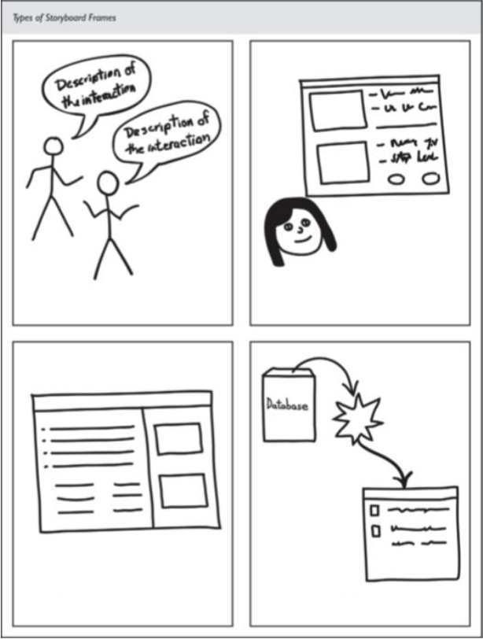

# [Day ONE]{.r-fit-text}

# [How to Start?]{.r-fit-text}

# [Read the syllabus?]{.r-fit-text}

(eventually we'll hafta, but it's a boring way to start)

# [Go around the room saying our names?]{.r-fit-text}

(eventually we'll hafta, but better if we're energized)

# [Get the juices flowing!]{.r-fit-text}

# [WHY?]{.r-fit-text}

---

I think it's better to start with an exercise that reminds us of what we do, no matter how proficient we are at it.

I need to know something about you and this is a very revealing exercise.

# [EDIPT]{.r-fit-text}

::: {.notes}
What the heck does that mean? (Empathize, Define, Ideate, Prototype, Test)
:::

---

- Empathize
- Define
- Ideate
- Prototype
- Test

::: {.notes}
That's one view of the design thinking process. I'd like you to engage in that process today.
:::

# [‹watch video›]{.r-fit-text}

# [Now do what they did!]{.r-fit-text}

# [Materials]{.r-fit-text}

- three pages
- some index cards (about 6)
- some colored sharpies (at least 3)
- a pen or pencil

# [Protocol]{.r-fit-text}

- Empathize (interview)
- Define (list of needs)
- Ideate (storyboard sheet)
- Prototype (cards)

# [‹interview›]{.r-fit-text}

- break into pairs so everyone gets a chance to be interviewer and interviewee
- interview is about supporting *the other person's* new year's resolutions
- if you're a trio go 2-on-1 or 1-on-2 either way

# [‹make a list of needs›]{.r-fit-text}

- analyze the interview
- be sure to think about what they meant, not just what they said
- think about how you could have gotten more from the interview

# [‹storyboard›]{.r-fit-text}

- draw four panels of cartoons on the ideate page
- show a successful interaction with an app
- don't worry about the app details
- concentrate on the user experience &mdash; what did the user feel?

##

# [‹prototype›]{.r-fit-text}

- now use the index cards
- draw a few main app screens
- focus on making it easy for the user
- think about the circumstances of use

## test
- we're skipping the test phase due to time constraints
- but keep your cards so you can test later
- it's never too early to test
- but testing is not the focus of this course (although we will test our prototypes)

## our focus: prototype
{fig-alt="iterative cycle: design, prototype, evaluate"}

# [what did we learn?]{.r-fit-text}

- give me your insights about each phase and write them down so we can refer to them
- phases were
  - empathize (interview)
  - define (list)
  - ideate (storyboard)
  - prototype (cards)

::: {.notes}

I casually mention on this slide that you should write something in your sketchbook! If you don't keep a sketchbook, consider these questions: Are you a designer? Do you aspire to be a designer? I refer you to @Pink2005, which is a book asking people to learn from designers. One of the recommendations in the book is to keep a sketchbook. In the sketchbook, you write and sketch but you don't paste in elements like printouts of digitally created art. Instead, you develop your eye-hand coordination by doing manual sketching and writing. At least two fifths of a typical designer's time is spent at the whiteboard, so this activity can support a lot of your work.

:::



