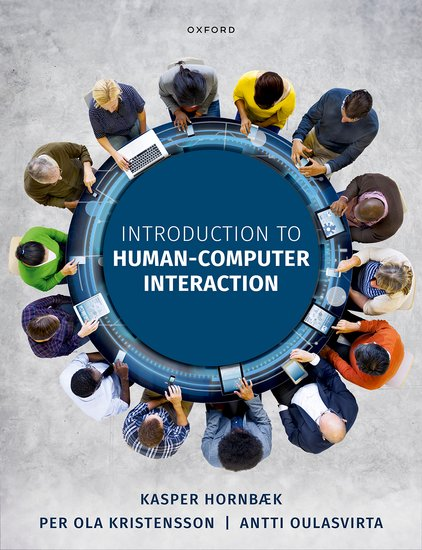

# [Week ONE]{.r-fit-text}

# Intros
- Valle: ux research director at indeed and mom.
- Mick: associate professor of instruction and dad. 
- You: say what job description you'll be seeking after you graduate, and say something interesting about yourself as we go around the room.

# Today 
- Design Thinking Exercise (already done)
- Syllabus
- Canvas
- Mick's website
- Overview of our textbook, @Hornbaek2025

##

# 〈Pause to look at these items〉


