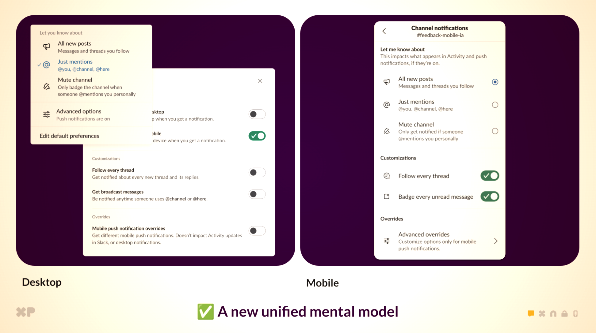

# [Week TWO]{.r-fit-text}

Part II of @Hornbaek2025

*Perception · Motor Control · Cognition*

# Intro

You can't design for people you don't understand. It's tempting to start from how you **want** people to act, but people bring their existing perception, motor habits, and mental models to everything they touch, and those systems don't renegotiate on your schedule.

This week's question: *what does the human processing pipeline (seeing, moving, thinking) let designers predict before anything ships?*

# Case Study: Healthcare.gov

# What went wrong with the Healthcare.gov rollout?

Aside from the obvious (not anticipating the volume)

- They required users to **create an account before browsing any plans**, so the registration system bottlenecked under the load of curious browsers who had no way to evaluate the product first
- They underestimated the proportion of users who were **"uncommitted shoppers"** wanting to compare options before investing effort — a basic mismatch between system functionality and how people actually behave when shopping for insurance
- The designers' model was *citizens completing enrollment*; the users' model was *shopping site* — and the user's model always shows up first

::: {.notes}
https://medium.com/remembering-health-care-before-the-aca/the-promise-failure-and-potential-of-healthcare-gov-e28a649d1ea3

https://medium.com/@bishr_tabbaa/small-is-beautiful-the-launch-failure-of-healthcare-gov-5e60f20eb967
:::

<!-- ~4 min -->

# Perception

## Gestalt: seeing is grouping
Users automatically organize visual information into meaningful **"wholes"**. 

- **Proximity** — elements close together read as a group
- **Similarity** — elements that look alike read as related
- **Common area** — elements inside a boundary belong together
- **Continuation** — elements connected by a line or flow read as a sequence
- The layout makes claims about what belongs together *whether the designer intended those claims or not*

## 

::: {.callout-tip title="In the wild"}
🎤
:::

::: {.notes}
What kind of perception fail is this? 
Every element here has the same visual weight. There is no grouping signal. Users navigate this by reading, not by perceiving structure.
:::

## Saliency vs. Clutter
Users automatically prioritize visually distinctive elements, so designers can leverage this to guide users toward what matters most.

- **Saliency** — visual uniqueness prompting something to be noticed; users prioritize distinctive elements automatically
- **Clutter** — when everything competes for notice, nothing gets noticed
- Saliency has a **budget**: roughly one "loudest thing" per screen 
- The 2-second test: if *you* can't identify the most salient element in under 2 seconds, users can't either 

## 

::: {.callout-tip title="In the wild"}

:::

::: {.notes}
What kind of perception fail is this? 
No proximity grouping. No consistent similarity signal. Figure and ground compete. A user looking for specific information has no perceptual path to follow — they have to read everything
:::

## Affordance
The visual properties of an interface element should intuitively signal how it can be interacted with.

- **Affordance** — a property that invites interaction; a relationship between a thing and a person 
- **Perceived affordance** — whether the user understands that invitation exists
- When the two don't match, users either **click what isn't clickable or miss what is**
- The interface goal: users never have to guess whether something is clickable, draggable, or purely decorative

## Affordance
::: {.callout-warning title="Not so fast..."}
- **Don Norman** now argues the field misuses the term, and prefers **signifiers**: the perceivable cues that *communicate* an affordance (revised *Design of Everyday Things*, 2013)
- The affordance is the possibility of action; the signifier is what tells you it's there
:::

## [Concept check]{.r-fit-text}

::: {.callout-note title="Pause and think"}
Open any app on your phone. In 2 seconds: What's the most salient element? Is it the most *important* one? Now find one grouping the layout implies that the designer probably didn't intend.
:::

<!-- ~13 min -->

# Motor Control

## Fitts' Law
The farther away and the smaller the target, the longer it takes to hit.

- One of the few genuine *laws* in HCI: a mathematical model that still predicts pointing on devices Fitts never imagined
- Screen **edges and corners** are effectively infinite targets 
- Design rule: make important things **big and close**, and dangerous things **small and far**

::: {.callout-warning title="Not so fast..."}
Fitts modeled a stylus on a desk. **Bi, Li & Zhai (2013)** showed finger touch breaks the model at small sizes; finger imprecision adds an error floor Fitts' Law doesn't predict. Don't assume desktop pointing math transfers cleanly to thumbs on glass.
:::

##

::: {.callout-tip title="In the wild"}

:::

## Hick-Hyman Law
More choices means slower decisions, but the relationship is **logarithmic, not linear**.

- Doubling the options doesn't double decision time, but it does increase it
- The real cost of extra choices: **hesitation, abandonment, decision fatigue**
- Reducing options is about surfacing the *right* options, not minimalism for its own sake

::: {.callout-warning title="Not so fast..."}
- Hick-Hyman holds for choices among **known, equally likely options** — a familiar menu, a keypad
- It does *not* cleanly model decisions requiring reading, comparison, or judgment (**NN/g** flags this as one of the most-misapplied laws in UX); visual search of an *unfamiliar* menu scales roughly linearly, not logarithmically
:::

## [Concept check]{.r-fit-text}

::: {.callout-note title="Pause and think"}
Think about an app you use on your phone one-handed. Where do you make the most errors? What do you avoid doing entirely because it's too error-prone? Did the designers account for how you're actually holding the device?
:::

<!-- ~19 min -->

# Cognition

## Mental Models
Users show up with an existing theory of how a system should work.

- **Mental model** — the user's internal theory of how a system works, built from prior experience with other tools
- **System model** — how the system actually works
- Users act on *their* theory, not yours, until the design gives them a strong enough reason to update it 
- The gap between the two models is where **errors, confusion, and frustration live**

##

::: {.callout-tip title="In the wild"}

:::

::: {.notes}
https://slack.engineering/how-slack-rebuilt-notifications/
What kind of cognition fail is this? 
- "Four conflicting mental models: Desktop and mobile each had their own preference systems, with different options and behaviors. A “nothing” setting on mobile meant something entirely different from “Off” on desktop. Users couldn’t predict what would happen when they changed a setting."
:::

## Cognitive Load
Every design imposes a mental cost; when that cost exceeds working memory, users **give up or make mistakes**.

- **Task effort** — mental energy demanded by the task itself (complexity, novelty). Harder tasks require more task effort
- **State effort** — mental energy required to maintain performance despite your current condition (fatigue, stress, sleep loss, illness). A degraded state costs more to produce the *same* output
- Designers budget for task effort and implicitly assume users arrive fresh, but the same flow is not "simple" at 2 a.m., in a hospital waiting room, or mid-crisis

##

::: {.callout-tip title="In the wild"}
🎤 *Products used almost exclusively by people in a degraded state: insurance claims after an accident, airline rebooking during a cancellation, password reset (you're already failing). These should be our simplest interfaces, and are frequently the worst.*
:::

## Memory
Because working memory is small, fragile, and constantly interrupted, good designs minimize what users have to hold in their heads by keeping relevant information visible, persistent, and where users expect to find it.

- **Working memory** — what the user is actively holding right now: small, fragile, constantly interrupted
- **Long-term memory** — what users bring from prior experience: powerful but slow to update
- Good designs minimize what users hold in their heads: keep relevant information **visible, persistent, and where users expect it**
- **Recognition beats recall** — it's easier to recognize an option than to remember it exists

##

::: {.callout-tip title="In the wild"}
🎤 *Any flow that shows information on one screen and demands it on the next: verification codes memorized while app-switching, error messages that vanish before you can act, wizards that hide your earlier answers.*
:::

## Decision Making
Users rarely evaluate all available options before choosing, which means that defaults, framing, and the order choices are presented in shape outcomes just as much as the choices themselves.

- Users **satisfice** rather than optimize: pick the first option that clears the bar, then stop looking
- **Defaults** matter enormously: most users never change them
- **Framing effects**: how a choice is presented changes what people choose, independent of the options themselves
- Combine satisficing + defaults + ordering, and the designer makes most of the user's decisions *before the user arrives*

##

::: {.callout-tip title="In the wild"}

:::

## [Concept check]{.r-fit-text}

::: {.callout-note title="Pause and think"}
A cookie banner: bright "Accept all" button, grey "Manage preferences" link, pre-expanded benefits copy. Name every concept from today's lecture it exploits (there are at least four).
:::

<!-- ~30 min -->

# Discussions

## What if the non-ideal user were the default?

The chapters describe perception, motor control, and cognition as they work in healthy, rested young adults. Real users are tired, stressed, multitasking, aging, disabled, or under load from the rest of their lives.

*Microsoft's Inclusive Design toolkit argues disability is contextual — a parent holding a baby has one working arm. If state effort means the "same" task costs a degraded user more, is the standard-user assumption underneath every law in this lecture a simplification or a defect?*

## Which of these concepts survive AI agents?

All three chapters assume the user does the perceiving, moving, and thinking. AI agents now do some of this on the user's behalf.

*Fitts' Law is meaningless to an agent calling an API — but the human still verifies what the agent did. Which concepts become obsolete, which migrate to the verification step, and which take on entirely new meaning?*

## Why do some interaction paradigms win and others die?

Perception relies on expectations, motor control on learned patterns, cognition on mental models — all three slow to change. New technologies (VR, voice, AI agents, BCIs) ask users to update all three at once.

*Touchscreens succeeded; 3D TV and Google Glass struggled. Is it the technology, or how much relearning it demands — and can this framework predict whether conversational AI sticks?*

## Is "designing for human limitations" different from exploiting them?

Saliency directs attention — to what? Fitts' Law makes targets easier to hit — including ones you didn't mean to. Defaults reduce decision load — and shape outcomes.

*You just watched the cookie-consent slide use today's vocabulary as an attack toolkit. Propose a test that separates help from exploitation — then decide who gets to administer it.*

# Activities

## Activity 1: Reverse-Engineer Material Design (~35 min)

**Task** — In groups of 3–4, pick two components from Google's Material Design 3 spec (m3.material.io): one obvious (buttons, dialogs), one less so (chips, bottom sheets). Identify which perception and motor-control principles from today the spec is silently enforcing.

**Produce** — A two-column table: *spec rule* (48dp minimum touch target, elevation levels, 8dp spacing grid) → *the human mechanism it serves* (Fitts' Law, common-area grouping, signifiers, saliency budget). Minimum 6 rows, plus one spec rule you think is wrong or overcautious — with your argument.

**Time** — 25 min group work · 10 min share-out

**Debrief** — What did Material get right that flat design got wrong? What does the spec still leave to designer judgment?

## Activity 2: AI Interface Audit (~40 min)

**Task** — In groups of 3–4, pick one AI tool you actually use (ChatGPT, Claude, Copilot, Gemini). Walk one real task through it and audit the *interface* — not the model — against today's concepts: What's salient? What signifies what the tool can do? What must the user hold in working memory? What's the default, and who does it serve?

**Produce** — An annotated screenshot (or quick sketch) marking 5+ findings, each labeled with the concept it violates or exploits — plus the single worst finding rewritten as a design recommendation.

**Time** — 25 min audit · 10 min design discussion · 5 min share-out

**Debrief** — What did every group find regardless of tool? Is that convergence a paradigm problem rather than a product problem?


