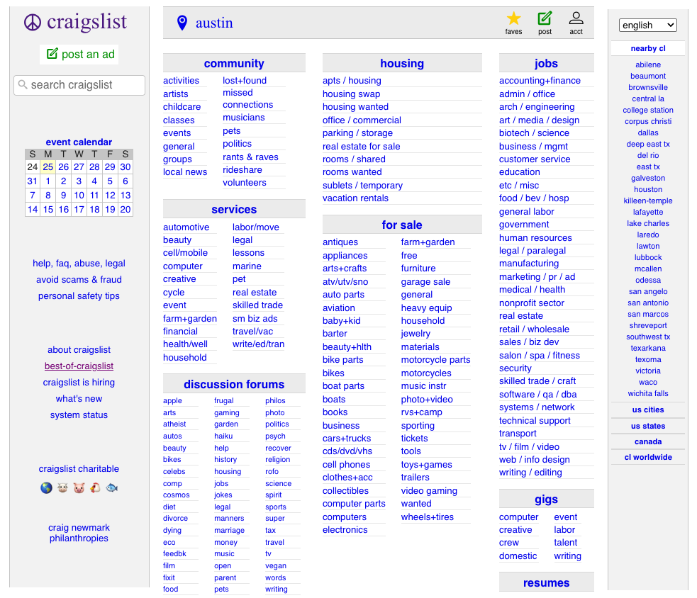

# [Week TWO]{.r-fit-text}

Part II of @Hornbaek2025

# Intro
You can't design for people you don't understand. It's tempting to think that if you're designing something new, or trying to shift a habit, you can start from how you *want* people to act. But people bring their existing perception, memory, attention, and mental models to everything they touch. So, you meet them where you know they are.

## Have you ever used something and thought: 

*"Did anyone actually try this before they shipped it?"*

::: {.callout-tip title="Prompt"}
Think of a specific example: a moment, an interface, a product (doesn't have to be a computer)
:::

# Indeed Example

# Perception
Understanding how users see, hear, and process sensory information lets designers present information in ways that align with human limits and capabilities.

- Gestalt laws
- Saliency vs. clutter
- Affordance

## Gestalt
Users automatically group and organize information into meaningful "wholes".

- Proximity: elements close together read as a group
- Similarity: elements that look alike read as related
- Common area: elements inside a boundary belong together
- Continuation: elements connected by a line or flow read as a sequence

::: {.notes}
These are a few common principles especially relevant in HCI. 
:::

## Gestalt 

::: {.callout-tip title="Prompt"}
Can you think of some Gestalt problems in a design?
:::

## Gestalt 
Most layout problems aren't spacing problems or color problems; they're Gestalt problems where the visual structure is communicating something the designer didn't intend.

## Saliency vs. Clutter
Users automatically prioritize visually distinctive elements, so designers can leverage this to guide users toward what matters most.

- Saliency: visual uniqueness prompting something to be noticed
- Clutter: when everything competes for notice, nothing gets noticed

## Saliency vs. Clutter

::: {.callout-tip title="Prompt"}
Can you think of some saliency or clutter problems in a design?
:::

## Saliency vs. Clutter
If you can't identify the most salient element on a screen in less than 2 seconds, users probably can't either. That's a design problem, not a user problem.

## Affordance
The visual properties of an interface element should intuitively signal how it can be interacted with, so users never have to guess whether something is clickable, draggable, or purely decorative.

- Affordance: something that invites interaction
- Perceived affordance: whether the user understands that invitation

## Affordance 

::: {.callout-tip title="Prompt"}
Can you think of some affordance problems in a design?
:::

## Affordance
When affordance and perceived affordance don't match, users either click what isn't clickable or miss what is.

## Some perception fails

::: {.notes}
What kind of perception fail is this? 
No proximity grouping. No consistent similarity signal. Figure and ground compete. A user looking for specific information has no perceptual path to follow — they have to read everything
:::

## Some perception fails

::: {.notes}
What kind of perception fail is this? 
Every element here has the same visual weight. There is no grouping signal. Users navigate this by reading, not by perceiving structure.
:::

# Motor Control
Understanding how users initiate, aim, and execute physical actions lets designers build interfaces that work with the body's natural mechanics rather than fighting them.

- Fitts' Law
- Hick-Hyman Law 

## Fitts' Law
The farther away and the smaller the target, the longer it takes to hit.

## Hick-Hyman Law
More choices means slower decisions, but the relationship is logarithmic, not linear.

## Motor control problems
::: {.callout-tip title="Prompt"}
Think about an app or tool you use on your phone with one hand. 
:::

- Where do you make the most errors?
- Is there anything you avoid doing because it's too hard or error-prone?
- Did the designers account for how you actually holding the device?

# Cognition
Understanding how users think, make decisions, and remember lets designers build interfaces that reduce  load and match the way people actually construct meaning from the world.

- Mental models
- Cognitive load
- Attention

::: {.notes}
These are a few of the more salient aspects of cognition that pop up in HCI regularly.
:::

## Mental Models
Users have a theory of how something works (or should work) and they behave based on their theory.

- Mental model: a user's internal understanding of how a system works
- System model: how the system actually works
- The gap between them is where errors, confusion, and frustration live

::: {.notes}
This means it's important to design a system that matches the model they already have, or at least doesn't violate it catastrophically.
:::

## Cognitive Load
The amount of mental effort a task requires

- Intrinsic load: complexity inherent to the task itself
- Extraneous load: complexity added by poor design
- Good design minimizes extraneous load so users can spend their budget on the task

## Memory
Users shouldn't have to remember things your interface could just show them.

- Working memory: what the user is actively holding in mind right now — small and fragile
- Long-term memory: what users bring from prior experience — powerful but slow to update
- Recognition beats recall: it's easier to recognize an option than to remember it exists

## Decision Making
Users make decisions quickly, under uncertainty, with incomplete information — and so do designers.

- Users don't optimize. They "satisfice": they pick the first option that seems good enough
- Defaults matter enormously: most users never change them
- Framing effects: how a choice is presented changes what people choose, independent of the options themselves



