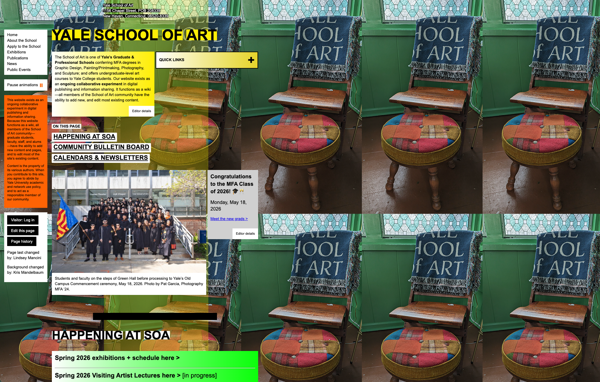

# [Week TWO]{.r-fit-text}

Part II of @Hornbaek2025

*Perception · Motor Control · Cognition*

# Intro

You can't design for people you don't understand. It's tempting to start from how you **want** people to act, but people bring their existing perception, motor habits, and mental models to everything they touch, and those systems don't renegotiate on your schedule.

This week's question: *what does the human processing pipeline (seeing, moving, thinking) let designers predict before anything ships?*

# Case Study: Healthcare.gov

# What went wrong with the Healthcare.gov rollout?

Aside from the obvious (not anticipating the volume)

- They required users to **create an account before browsing any plans**, so the registration system bottlenecked under the load of curious browsers who had no way to evaluate the product first
- They underestimated the proportion of users who were **"uncommitted shoppers"** wanting to compare options before investing effort: a basic mismatch between system functionality and how people actually behave when shopping for insurance
- The designers' model was *citizens completing enrollment*; the users' model was *shopping site*. The user's model always shows up first.

::: {.notes}
https://medium.com/remembering-health-care-before-the-aca/the-promise-failure-and-potential-of-healthcare-gov-e28a649d1ea3

https://medium.com/@bishr_tabbaa/small-is-beautiful-the-launch-failure-of-healthcare-gov-5e60f20eb967
:::

# Perception

## Perception is not a camera

- **The naive view:** the eye is a camera, the display is the photo, perception is passive playback.
- **The chapter's view:** perception actively *constructs* a percept from three ingredients.
- **Sensory information:** the raw transduction of light, sound, and contact into neural events.
- **Expectation:** priors from years of experience that fill in the blanks the senses leave.
- **Attention:** the strategic choice of what slice of the scene to process right now.
- **Consequence:** the same pixels produce different experiences in different users. Design does not fully determine what people see.

## The three ingredients of a percept

::: {.callout-note}
**Perception** is the ability to collect and organize information about the environment through physiological sensory systems. In HCI it is understood through three interacting components:

- **sensory information** (what the senses transduce)
- **expectation** (priors from prior experience)
- **attention** (the strategic sampling of the scene)
:::

## Why a constructed percept changes your design

- **A UI communicates only through perception:** it is the entire channel from machine to user. Get it wrong and nothing else matters.
- **Experts see differently from novices:** experienced users lean on **long-term memory** and expectation; novices are driven by raw visual features. Your design meets both.
- **Prior products train your users:** people arrive expecting the back button top-left, the primary action bottom-right. Fighting those priors costs you.
- **Perception is active:** users move, explore, and re-strategize. **Norman's** perceived affordance lives here: the question is not "does it afford clicking" but "does the user *perceive* that clicking here is useful?"
- **Design rule:** design for the percept users will construct, not the pixels you shipped.

## Visual saliency

::: {.callout-note}
**Visual saliency** is the probability that a graphical element attracts visual attention during the first few seconds of viewing a display. It depends on the element's visual features relative to the rest of the display, on user expectations, and on the user's attentional strategy.
:::

## Spending your saliency budget

- **Uniqueness wins attention:** an element pops out when it is unique in a **visual primitive**: color, size, shape, orientation, or motion.
- **Feature search vs conjunctive search:** if the target is unique in one feature, users find it in under 100 ms, peripherally. If it needs a *combination* of features, they must fixate item by item, which is slow (**Treisman & Gelade**).
- **Clutter is saliency's evil twin (Rosenholtz):** clutter is the state where everything tries to be salient, so nothing is. Congest every feature and you destroy the ability to guide the eye.
- **The Post-it test:** if you cannot pick a color, size, or shape that would make a new note stand out on the screen, the screen is cluttered.
- **Design rule:** spend your saliency budget. Make the one thing that matters unique; make everything else recede.

## Grouping: the Gestalt principles

- **Proximity:** elements close together read as a group.
- **Common area:** elements inside the same enclosed region read as a group.
- **Similarity:** elements alike in color, size, or orientation read as a group.
- **Continuation:** elements along a continuous flow read as a group.
- **Payoff (Brumby & Zhuang):** visual grouping speeds menu search, but only with a few larger groups. Many tiny groups dilute the effect.

## The hard limits of the visual system

::: {.callout-note}
**Ware's windows of visibility** name the physiological limits every display fights:

- **Spectrum and color:** we see roughly 380 to 780 nm, through just three cone types (trichromacy)
- **Field of view:** about 190 degrees horizontal, 125 vertical
- **Contrast:** the contrast sensitivity function sets which differences we can even detect
- **Foveal vs peripheral:** sharp vision covers only about 2 degrees, a thumbnail at arm's length; everything else drops off fast
:::

## Design for color vision deficiency

- **It is common:** red-green deficiency hits about **8% of men** of European descent (4 to 6.5% of Chinese and Japanese men), versus 0.4% of women.
- **What breaks:** affected users can't reliably separate **green from red**, or blue from yellow, and there is no cure.
- **The fix is design, not treatment:** never encode meaning in **color alone**; add shape, text, or position as a redundant channel.
- **Periphery compounds it:** peripheral vision keeps color and shape but loses detail, so a tiny colored status dot in a corner is easy to miss.
- **Design rule:** if stripping all color would make the screen unusable, you leaned on color too hard.

##

::: {.callout-tip title="In the wild"}

:::

::: {.notes}
What kind of perception fail is this?
No proximity grouping. No consistent similarity signal. Figure and ground compete. A user looking for specific information has no perceptual path to follow, so they have to read everything
:::

##

::: {.callout-warning title="Are the Gestalt 'laws' really laws?"}
- **Wertheimer** and the Gestalt school presented grouping as fixed perceptual laws.
- The chapter itself pushes back: they behave more like **heuristics** than physical laws, and they ignore that perception is active and task-dependent. **Kieras & Hornof's** active-vision work shows people organize the same display differently depending on the goal.
- Current consensus: grouping principles are robust *tendencies*, not guarantees.
- Design takeaway: use Gestalt to make your intended structure the *easy* reading, then test it; do not assume users must see what you grouped.
:::

## [Concept check]{.r-fit-text}

::: {.callout-note title="Pause and think"}
Open any app on your phone. In 2 seconds: What's the most salient element? Is it the most *important* one? Now find one grouping the layout implies that the designer probably didn't intend.
:::

# Motor Control

## The trade-off underneath every click

- **Aimed movement:** any movement whose success is defined by hitting an external target: a button, a link, a key.
- **Speed-accuracy trade-off:** the motor system cannot be both maximally fast and maximally accurate. Push speed, lose precision; demand precision, lose speed.
- **You can balance the two, but you cannot beat both at once.** This tension is the engine of everything in this video.

## Fitts' Law

::: {.callout-note}
**Fitts' Law** predicts the average time to acquire a target as a linear function of task difficulty:

$$MT = a + b \cdot ID, \qquad ID = \log_2\left(\frac{D}{W} + 1\right)$$

where **D** is the distance to the target, **W** is its width, **ID** is the index of difficulty (in bits), and **a**, **b** are empirically fitted constants. It is not a natural law; it is a statistical regularity **Fitts** discovered through experiment.
:::

## What Fitts buys you on the design floor

- **Big and close is fast; small and far is slow.** The whole law collapses to this, but now it is quantitative and testable.
- **Screen edges are infinitely deep targets:** you cannot overshoot them, so their effective width is huge. This is why the Mac menu bar and corner hot-spots work.
- **Design the target to the hand:** enlarge primary actions, move them near the cursor's likely start, and interfaces get measurably faster.
- **It powers real systems:** key-target resizing in phone keyboards, and the layout-optimization algorithms that have challenged QWERTY are Fitts' Law applied.
- **Throughput lets you compare devices:** you can rank a stylus vs a mouse across the *whole* difficulty range, not at one lucky data point.
- **Design rule:** every millisecond you save on a frequent target multiplies across millions of clicks.

##

::: {.callout-tip title="In the wild"}

:::

## Hick-Hyman Law

- More choices means slower decisions, but the relationship is **logarithmic, not linear**.
- Doubling the options doesn't double decision time, but it does increase it
- The real cost of extra choices: **hesitation, abandonment, decision fatigue**
- Reducing options is about surfacing the *right* options, not minimalism for its own sake

##

::: {.callout-warning title="Not so fast..."}
- Hick-Hyman holds for choices among **known, equally likely options**: a familiar menu, a keypad
- It does *not* cleanly model decisions that need reading, comparison, or judgment; searching an *unfamiliar*, randomly ordered menu scales roughly **linearly**, not logarithmically. Hick's Law is widely misapplied in UX, and **NN/g** recommends pairing it with grouping, chunking, and progressive disclosure rather than just cutting options
:::

## Steering law: pointing's cousin

::: {.callout-note}
**Steering law (Accot & Zhai)** predicts the time to move a cursor through a **tunnel** constraint:

$$T = a + b \int_C \frac{ds}{W(s)}$$

The narrower the tunnel W(s), the slower you must go. Difficulty grows with the *length* of the path, not the log of it like Fitts.
:::

- **Where it bites:** cascading submenus (steer along without slipping out), sliders, drag-along-a-path, drawing.
- **Design rule:** widen the tunnel. Forgiving submenu hitboxes and "sticky" paths cut steering time directly.

## [Concept check]{.r-fit-text}

::: {.callout-note title="Pause and think"}
Think about an app you use on your phone one-handed. Where do you make the most errors? What do you avoid doing entirely because it's too error-prone? Did the designers account for how you're actually holding the device?
:::

# Cognition

## Why memory is a design problem

- Memory is **not** a hard disk. It is not veridical storage and retrieval; it is reconstruction, biased toward what is useful now.
- Several distinct memory systems run at once: working memory, and long-term memory split into declarative (facts, events) and non-declarative (skills, priming, conditioning).
- Design implication we are building toward: **don't make users remember.**

## Working memory

::: {.callout-note}
**Working memory (WM)** is the temporary maintenance and manipulation of the representations needed for the action at hand. It is set apart from long-term memory by being sharply limited in both capacity and time: items fade quickly unless actively rehearsed.
:::

## Designing around a tiny scratchpad

- **The number is small:** once thought to be **Miller's** 7 ± 2, now estimated at roughly 3 to 5 items in young adults (**Cowan**). Design for the low end.
- **Rehearsal is the cost:** holding items active is effortful and taxing, which is exactly why users feel drained by clunky flows.
- **Interruptions are expensive:** the more disruptive the interruption, the more it destroys whatever WM was holding. Every task switch costs a few hundred milliseconds and risks dropped state.
- **The single takeaway for design:** avoid relying on working memory. Put the code on the same screen as the field; carry state forward; never make people hold a value across steps.

## Recall vs recognition

::: {.callout-note}
- **Recall** is retrieving a memory trace by self-generated cues, with nothing shown (**free recall**), or aided by an external cue (**cued recall**).
- **Recognition** is the extreme, easy case of cued recall: the whole item is presented and the user only has to confirm they have seen it before.
:::

## Why recognition wins

- **Recognition is cheap; recall is expensive.** People recognize hundreds of faces and icons effortlessly but struggle to recall the same items cold.
- **This is why the GUI beat the command line:** menus and icons let users *recognize* the option; command languages force effortful *free recall*.
- **Knowledge-in-the-world beats knowledge-in-the-head:** show the options instead of demanding memorized commands, and you offload cognition onto the display.
- **But externalizing has a cost:** lean on the world too hard (passwords on sticky notes) and knowledge-in-the-head atrophies.
- **Encoding-retrieval symmetry:** people retrieve better when the retrieval context matches encoding; change the login screen's look and the password gets harder to summon.
- **Design rule:** let users choose from what is shown, not summon from memory.

## Some memory fails

::: {.callout-warning title="Is it seven, or four, or three?"}
- Generations of design guidance repeated **Miller's** "magical number 7 ± 2" as a hard limit on how many items a menu or nav bar may hold.
- **Cowan** and others argue the real ceiling is closer to 3 to 5, and that WM is not a set of "slots" at all but activation in an associative network that fades.
- Current consensus: the exact number depends on chunking, content, and rehearsal; treat any fixed magic number with suspicion.
- Design takeaway: do not defend "seven items per menu" as law. Chunk aggressively, keep the working set tiny, and never make users hold values in their heads.
:::

## [Concept check]{.r-fit-text}

::: {.callout-note title="Pause and think"}
A signup flow emails a verification code, then opens a new tab with the code field, hiding the email. Which memory system is being overloaded, and what is the one-line fix that turns a recall task into a recognition task?
:::

## Practice makes it automatic

::: {.callout-note}
The **power law of practice** ($RT = aP^{-b} + c$): performance improves with practice but with **diminishing returns**. Big early gains, then a long slow plateau.
:::

- **Skill stages:** **novice** (slow, erratic), **intermediate** (good enough, self-taught, often stuck), **expert** (thousands of hours of deliberate practice).
- **Automaticity cuts both ways:** an automatic skill is fast and effortless, but also **ballistic**, it fires on cue and resists change.
- **The design trap:** experts run on muscle memory, so a redesign that helps novices can wreck power users who have stopped looking.
- **Design rule:** don't move the furniture on expert users without warning; their skill is stored in the old layout.

## Multitasking is a resource conflict

::: {.callout-note}
Multitasking is a **resource-sharing problem** across attention, the motor system, and working memory. **Wickens' Multiple Resource Theory (MRT)** models it as a cube with three axes:

- **Modality:** visual vs auditory
- **Code:** spatial vs verbal
- **Stage:** perception, cognition, or responding
:::

- **The rule:** two tasks that land in the **same slot** compete and degrade each other; tasks on different slots share more gracefully.
- Wickens calls MRT a **rough but useful** heuristic, not a precise model.

## What MRT means for design

- **Classic conflict:** a phone game and a chat feed both want **vision** and the **hand**, so they can't truly run at once; attention just interleaves.
- **Every switch costs:** you lose a few hundred milliseconds per task switch, and uncertainty about the ignored task piles up the longer you look away.
- **People switch at natural breakpoints:** users postpone interruptions to subtask boundaries, so let them finish a chunk before interrupting.
- **Offload to a free channel:** an **auditory** alert frees the eyes, which is why a notification sound beats a silent visual badge when hands and eyes are busy.
- **Safety-critical version:** driving guidelines cap glances away from the road at about **2 seconds**, exactly the MRT logic.

## Users cannot see inside the machine

- A computer is a non-transparent system. Cognition's job in interaction is to reason about a box you cannot see into.
- Two tools people use: a **mental model** to simulate what the system will do, and fast **heuristics** to decide when reasoning is too costly.
- Agents and generative UIs are the most opaque systems users have ever faced.

## Mental models

::: {.callout-note}
A **mental model** is a memory-based representation of an interactive system, used for reasoning, inference, and prediction. It represents the system and how the user's inputs change its state, letting the user simulate outcomes for parts of the system they cannot directly observe.
:::

## When the user's model clashes with the system

- **Models are fragmentary, not complete:** untrained users rarely hold a coherent model. Knowledge is patchy: a few remembered episodes, some isolated facts.
- **Good explanations build better models (Mayer & Gallini):** in a classic pump study, showing parts and steps together beat either alone for both recall and problem-solving.
- **Users would rather try than reason:** effortful simulation is avoided; people poke at the interface and watch what happens.
- **Failure is a model clash:** most "user error" is the designer's model and the user's model disagreeing, exactly the Healthcare.gov problem.
- **AI raises the stakes:** with an AI agent acting on your behalf, the user's model of "what will it do" is thin and often wrong. 
- **Design rule:** expose a conceptual model users can build; make state and consequences visible, especially for AI.

## System 1, System 2, and heuristics

::: {.callout-note}
**Kahneman's** two systems: **System 1** is fast, intuitive, associative, and effortless; **System 2** is slow, deliberate, and effortful, monitoring System 1 and intervening when intuition is not enough. A **heuristic** is a System 1 rule of thumb that reaches a quick solution and, in doing so, introduces predictable **biases**.
:::

## The levers behind every choice

- **Anchoring:** choices center on a known reference; users reach for the app they already know.
- **Availability:** whatever comes to mind fastest gets picked; PowerPoint gets used because it is top-of-mind, not because it is best.
- **Status quo and defaults:** people stick with the prevailing option, so **whoever sets the default holds real power.**
- **Prospect theory (Kahneman & Tversky):** choices are judged against a reference point, and losses hurt more than equivalent gains: loss aversion. Framing a change as a loss vs a gain flips behavior.
- **The ethical edge:** the same levers power **dark patterns**: pre-ticked boxes, loss-framed "you'll miss out" nags, decoy pricing.
- **Design rule:** you cannot switch these biases off; you can only decide whether to exploit or respect them.

##

::: {.callout-tip title="In the wild"}

:::

## Decision Making Fails

::: {.callout-warning title="How solid is the System 1 story?"}
- **Kahneman** popularized System 1 / System 2 and a long list of priming and heuristic effects as robust findings.
- The **replication crisis** hit this literature hard: several classic social-priming results failed to replicate, and Kahneman himself publicly walked back parts of the priming chapter. **Prospect theory** and loss aversion, by contrast, have held up well across bargaining, consumer choice, and voting.
- Current consensus: the broad dual-process framing and loss aversion are useful; specific priming effects should be cited cautiously.
- Design takeaway: lean on well-replicated levers (defaults, loss framing, recognition) and treat one-off priming tricks as unproven.
:::

## [Concept check]{.r-fit-text}

::: {.callout-note title="Pause and think"}
An AI assistant silently changes a document's formatting when you accept a suggestion. Users are angry even though the edit was "correct." Using mental models and legibility, explain the anger, then name one design change that repairs the user's model.
:::

## Agenda 

|Block | Min |
|-------|-----|
| Welcome + attendance | 5 |
| Project Milestone 1 | 5 |
| **Discussion 1:** How far do general models get us? | 30 |
| **Activity 1:** Saliency + Fitts audit | 35 |
| **BREAK** | 15 |
| **Discussion 2:** Designing around limits vs exploiting them | 30 |
| **Activity 2:** AI mental-model audit | 40 |
| **Discussion 3:** AI agents and wrap | 20 |

---

## Individual Project Milestone 1 

**The assignment.** Each student picks one **broken experience inside an app they actually use** and will redesign it across the semester. It is a **slice of the app, not the whole app**: an onboarding flow, a checkout, a search-and-filter, a settings or notification setup, a password reset, etc. 

Milestone 1 is just two things: **pick the flow, and define the problem.** 

Due by midnight next Thursday, Sep 10.

## Details for M1

- **Why a slice, not an app.** Depth over breadth. You'll iterate on this same flow all semester, so a bounded target lets you go deep instead of redrawing everything shallowly.
- **What "broken" means.** A real friction, something that made *you* or someone you watched stumble, abandon, or swear at the screen. 
- **Framing is the deliverable for M1.** By the end you should be able to complete one sentence: *"For [user] trying to [goal], [flow] breaks because [problem]."* That means naming the user, their goal, where it breaks, and a shred of evidence (your own run-through plus a couple of observations). Resist jumping to the fix.
- **Use this week's vocabulary to diagnose the break.** Is it a **perception** failure (nothing salient, clutter, color-only signal), a **motor** failure (targets too small or far, a steering-tunnel menu), or a **cognition** failure (working-memory overload, forcing recall instead of recognition, a mental-model clash)? Or...is it something else entirely?
- **Common pitfalls to avoid:** picking a whole app; picking something only cosmetic; jumping to a solution before framing; choosing a flow you can't actually use or observe.

## Discussion setup

We're going to follow a 1-2-4 structure, which means:

- **4 minutes:** Everyone considers the discussion question individually (1)
- **8 minutes:** Break into pairs and discuss the question (2)
- **8 minutes:** Group up into 2 pairs or 4 people and discuss the question together (4)
- **10 minutes:** Debrief / share out with the class.

---

## Discussion 1: How far do general models get us? 

**Is a "general understanding of people" actually possible, or a comforting fiction?**

The book argues theories of perception, memory, and motor control generalize across users and contexts; critics say every situation is too particular.

*Lincoln and Guba argued generalization smuggles in determinism and reductionism. Landauer said we should "get real" and just test with users. If general theory is weak, why teach Fitts and Cowan at all? If it is strong, why does user research still exist? Argue where the line sits.*

---

## Activity 1: Saliency and Fitts audit of a live interface

**Task:** In groups of 3 to 4, pick one real screen (a checkout, a booking flow, a settings page) and audit it against the Perception and Motor Control material.

**Produce:** One shared slide per group (google slides, powerpoint, figma). Drop in a screenshot, number the important parts, and for each numbered part write: (a) what you think the designers wanted you to notice first, (b) what your eye actually noticed first, and (c) whether it's easy or hard to tap, and why (too small? too far from your thumb? jammed in a corner?). Add one part you think is just badly designed, with your reason.

**Time:** 25 min group work · 10 min share-out

**Debrief:** Where did saliency and Fitts *agree* that an element was mis-designed, and where did they conflict?

---

# [BREAK 15 min]{.r-fit-text}

---

## Discussion 2: Designing around limits vs exploiting them

**When is it fair to design *for* people's biases rather than against them?**

Defaults, loss framing, and recognition-over-recall all steer behavior whether or not the user notices.

*The same cognitive levers that make an interface effortless are the ones that power dark patterns. Where is the line between a helpful default and manipulation, and who gets to draw it? This is the central ethics-of-captology debate.*

---

## Activity 2: AI mental-model audit 

**Task:** In groups of 3 to 4, take an AI feature you all use (autocomplete, a chat assistant, an agentic "do it for me" button). Before you click, say out loud what you *think* it's going to do (your mental model). Then actually use it and watch what it really does (the system model).

**Produce:** One shared slide or two-column table per group: "What we expected it to do" vs. "What it actually did." List at least 6. For every surprise, write one small change that would've made it clearer, so people aren't caught off guard. Then finish with a position: point to one sneaky nudge the app uses to get you to do what it wants (a pre-checked box, a "you'll miss out" warning), and say whether that's fair.

**Time:** 28 min group work · 12 min share-out

**Debrief:** Which mismatch would cause the most damage if the assistant acted autonomously, and why?

---

## Discussion 3: AI agents as users

**Who is "the user" when an AI agent acts on your behalf?**

When an agent books, buys, or writes for you, the perceiving-deciding human is partly out of the loop.

*Every model in this deck assumes a human perceiving a display and choosing an action. An agent breaks that: perception, memory, and decision-making are split between person and machine. Does Fitts' Law even apply when nobody points? Whose mental model matters when the human never sees the interface? Push on what "human-centered" means here.*

# Additional Discussions & Activities

## Recognition beats recall for humans. Does that still hold when the interface writes itself?

We tell designers to show options so users can recognize, not recall. Generative UIs assemble a fresh, unfamiliar layout every time.

*If the interface is different on every visit, users cannot build the long-term memory that makes recognition and expectation work; every screen is a novice screen. Is a personalized, ever-changing UI a gift or a tax on cognition? When does adaptivity help, and when does consistency win?*

## Where does saliency stop being a budget and start being coercion?

The same red-and-large treatment that guides a novice to the primary action is what an infinite-scroll app spends to keep you there. When is spending your saliency budget *for* the user, and when is it spending it *on* them? Is there a perceptual equivalent of a dark pattern, and could a color-blind or low-vision user even see it coming?

## Activity 3: Greyscale & memory-load teardown (~30 min) 

**Task:** In groups of 3–4, take one real multi-step flow (a checkout, a 2-factor login, a form wizard). Do two passes. 
Pass 1 (perception): screenshot it, then convert to greyscale (phone accessibility setting or a filter) and mark every place where meaning was carried by color alone. 
Pass 2 (memory): mark every place the flow forces the user to hold a value in working memory across a screen or step. 

**Produce:** An annotated flow with (a) at least 3 color-only failures and a redundant-encoding fix for each, and (b) at least 2 working-memory loads with a "carry-state-forward" redesign for each. End by naming which single change would help the most users and estimating who it excludes today. 

**Time:** 20 min group · 10 min share-out

**Debrief:** Which was more common in your flow — color-only signals or memory loads — and which is cheaper to fix?


