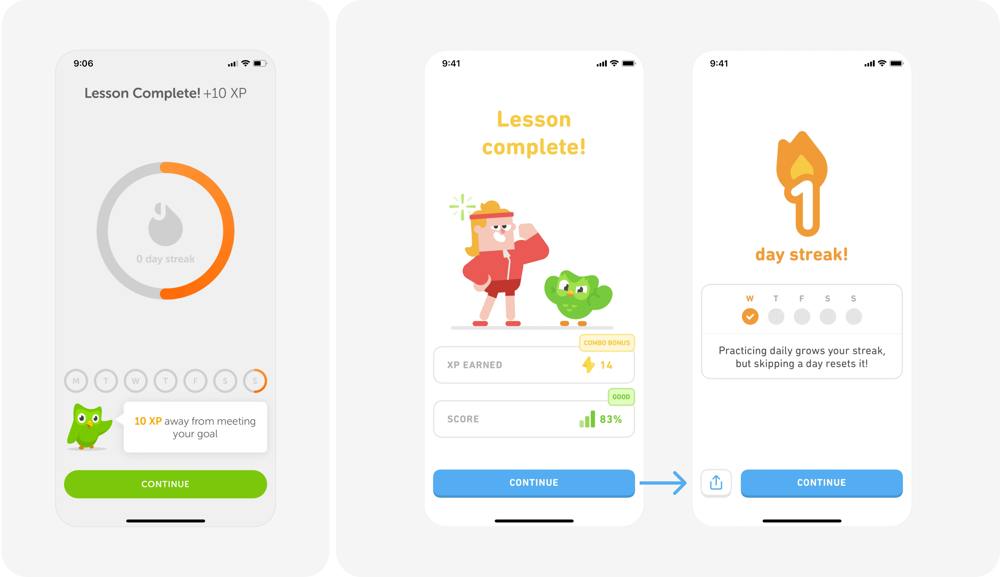
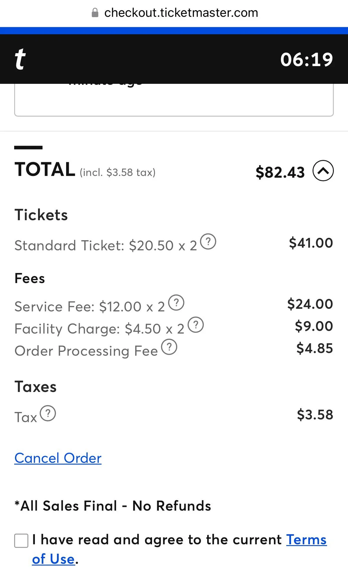
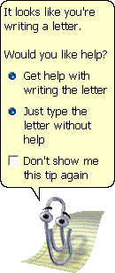

# [Week THREE]{.r-fit-text}

Part II of @Hornbaek2025

*Needs · Experience · Collaboration · Communication*

# Intro

Last week we discussed people's mechanics: perception, motor control, cognition. But people also have **needs** they're trying to satisfy, **experiences** they're actively constructing, **collaborators** they're constantly coordinating with, and **communication channels** that reshape every interaction they have.

This week we'll shift the question from *how do people process information* to *why do systems fail even when they're technically correct*?

# Case Study: Google+

# Why did Google+ fail?

A lot of reasons for its failure have to do with not taking the time to understand the needs and experiences of people.

- They tied employee bonuses to the success of Google+, so that extrinsic rewards shifted attention to scoring points and undermined the intrinsic motivation to build something genuinely good.
- They conflated their engineers' workflows with their target end-users' by assuming organizing information would have mass appeal.
- All of their target users' relationships were already on Facebook. Getting people to switch required convincing their entire network to move simultaneously.
- They were matching Facebook on pragmatic features while Facebook was satisfying hedonic needs like relatedness, identity, stimulation.

# Needs and motivations

Self-determination theory, intrinsic vs. extrinsic motivation, behavior change, and dark patterns.

## Self-determination theory

- **Basic psychological need:** a biologically rooted driver shared by all humans across cultures, not a learned want
- **Autonomy:** acting willingly, in line with one's self, not because an external force is pushing
- **Competence:** feeling effective, mastering things, controlling the outcomes of your actions
- **Relatedness:** a sense of reciprocal belonging with other people
- **Deci & Ryan:** optimal functioning needs all three satisfied, not just one

::: {.callout-note}
Self-determination theory holds that three basic psychological needs - autonomy, competence, and relatedness - underlie human motivation, and that activities satisfying them produce intrinsic motivation and well-being.
:::

## Designing for the three needs

- **Autonomy shows up as** meaningful options, customization, and the freedom to say no: whoever controls the defaults controls a lot
- **Competence shows up as** clear feedback, visible progress, and difficulty that scales with skill
- **Relatedness shows up as** presence, shared activity, and knowing another person is there
- **Hassenzahl** widened this to six needs for HCI: relatedness, meaning, stimulation, competence, popularity, security
- The design rule: name the need a feature serves *before* you build it; a feature that serves no need buys you no intrinsic motivation

##

::: {.callout-tip title="In the wild"}
🎤 *Does Duolingo build the underlying habit, or does it become the goal itself?*

:::

## [Concept check]{.r-fit-text}

::: {.callout-note title="Pause and think"}
A fitness app adds a public leaderboard. Which of the three SDT needs might it feed, and which might it starve? For whom would the leaderboard help, and for whom would it kill the motivation to open the app at all?
:::

## Intrinsic and extrinsic motivation

- **Intrinsic motivation:** the activity is its own reward, integrated into your sense of self
- **Extrinsic motivation:** the behavior is instrumental, aimed at an outcome outside the act (avoiding punishment, earning a badge, a deadline)
- **Internalization continuum:** external regulation, then introjected (guilt, shame), then identified (I value this), then integrated (it is part of me)
- **Amotivation:** the absence of any drive to act
- **Quasi-need:** an urge that feels like a need but is learned, like the pull to check a loot box or a feed

## When rewards backfire

- **The overjustification effect:** pay people for something they already enjoyed, and their intrinsic interest can drop once the reward stops
- The behavior becomes controlled by the reward, which thins out autonomy
- Design move: use extrinsic rewards to *start* a behavior, then help it internalize; unexpected positive feedback that signals competence tends to help, controlling rewards tend to hurt

##

::: {.callout-warning title="Is the undermining effect even real?"}
- **Deci, Koestner & Ryan** meta-analyzed 128 studies: tangible, expected rewards reliably undermine intrinsic motivation
- **Cameron & Pierce** countered with their own meta-analysis: the effect is narrow and often disappears, and verbal praise can *raise* intrinsic motivation
- Current read: it is conditional, the reward's meaning matters more than its presence; controlling rewards hurt, informational ones help
- Design takeaway: do not cite "rewards always kill motivation" as a law; ask whether *this* reward reads as control or as competence feedback
:::

## [Concept check]{.r-fit-text}

::: {.callout-note title="Pause and think"}
A language app currently gives XP for every lesson. A designer proposes cash rewards for hitting a weekly goal. Using the internalization continuum, predict what happens to a learner who was studying "because I want to travel." What would you propose instead?
:::

## Behavior change models

- **The fundamental problem:** people commit to goals (exercise, quit smoking, save money) and then fail to follow through
- **Transtheoretical model:** change moves through precontemplation, contemplation, preparation, action, maintenance
- **Fogg's model:** behavior happens only when motivation, ability, and a trigger arrive at the same moment
- **Nudging (Thaler & Sunstein):** small changes to the choice architecture shift behavior without banning options or changing incentives
- **Goal setting:** concrete, specific goals beat vague intentions

::: {.callout-note}
Behavior change technology uses models of motivation to help people move toward a chosen behavior, whether by staging that change (transtheoretical model), aligning motivation, ability, and triggers (Fogg), or reshaping choices (nudging).
:::

## What behavior change looks like when it works

- **UbiFit Garden** grew flowers and butterflies on a phone's wallpaper as you exercised: ambient, glanceable, tied to the contemplation-to-action stages
- The lesson: match the intervention to the *stage*; someone in precontemplation needs information and social proof, not a harder goal
- **Nudging is everywhere:** the pre-checked box, the default privacy setting, the suggested tip amount
- The honest question for any nudge: whose behavior is it changing, and toward whose goal?

## [Concept check]{.r-fit-text}

::: {.callout-note title="Pause and think"}
Pick the transtheoretical stage a person is in: "I know I should walk more but I am not going to start now." What single piece of information should the app show, and what should it absolutely not do?
:::

## Dark patterns

- **Dark pattern:** an interface element that benefits the service by coercing, steering, or deceiving users into decisions they did not intend and that can harm them
- By definition, not in the user's interest
- Examples: roach-motel cancellation flows, confirmshaming ("No thanks, I like paying full price"), disguised ads, sneaking items into a cart
- **The tools are the same:** everything we just learned about motivation and nudging can be turned against the user
- The SDT connection: dark patterns don't just deceive; they attack **autonomy** directly, which is why they damage long-term trust even when they lift short-term conversion

##

::: {.callout-tip title="In the wild"}

:::

## The ethics live on a knife edge

- **Gamification cuts both ways:** points and badges can support competence, or, per SDT, cognitive evaluation can turn a reward into a controlling, amotivating experience
- **Transparency is the pivot (Caraban et al):** a nudge the user can see and understand is far less ethically fraught than a hidden one
- Design takeaway: if the mechanisc only work when the user does not notice it, that is your ethics alarm

## 

::: {.callout-warning title="Not so fast..."}
- **Fogg** and early persuasive-design work intended influence to be benign and explicitly non-deceptive
- **Gray and colleagues** and **Mathur and colleagues** documented how the same playbook scales into dark patterns at industrial scale
- Current read: persuasive design and dark patterns are the same techniques pointed at different goals; intent and transparency, not mechanism, mark the line
- Design takeaway: judge a persuasive feature by who benefits and whether the user can see it working, not by whether it is "just a nudge"
:::

## [Concept check]{.r-fit-text}

::: {.callout-note title="Pause and think"}
A cancellation flow adds three "Are you sure?" screens, each offering a discount. Is this a helpful nudge or a dark pattern? Name the test you used to decide.
:::

# Experience

Experiencing vs. experiences, the peak-end rule, and the pragmatic-hedonic split.

## Experiencing vs. experiences

- **Experiencing:** the ongoing, moment-to-moment evaluative feeling while you use something (good, bad, right now)
- **Experience:** the aggregated account you construct and tell yourself and others afterward
- The two are only loosely linked: experience is *inferred*, not recorded
- **Peak-end rule:** we anchor our memory of an episode to its most intense moment and its ending
- **Duration neglect:** how long the good or bad part lasted barely registers

::: {.callout-note}
An experience is not a recording of moment-to-moment experiencing; it is an inferred, reconstructed account shaped by peaks, endings, mood, and context, which is why remembered experience and lived experience routinely diverge.
:::

## Designing the memory, not just the moment

- Because decisions to return, recommend, or renew ride on the *remembered* experience, the peak and the end deserve disproportionate design attention
- **Norman's riddle:** people will return to an experience they remember fondly even if the lived moments were rough, because the emotional sting fades faster than the story
- Practical moves: end flows on a high note, soften the worst moment, do not assume a faster task is a better-remembered one

## [Concept check]{.r-fit-text}

::: {.callout-note title="Pause and think"}
A tax-filing app has a tedious 20-minute middle but ends with a cheerful "You are done, refund on the way!" animation. Using peak-end and duration neglect, predict how users will rate it versus a faster app that ends on a blank screen.
:::

## How experiences form over time

- **Experiences are built, not captured:** McCarthy and Wright mapped the threads that assemble them, and they run in rough order
- **Anticipation:** the expectations you bring before you ever touch the system
- **Connecting and interpreting:** the raw first response, then making sense of it
- **Reflecting:** judging the experience as a whole and figuring out why it felt that way
- **Appropriating and recounting:** making it your own, then retelling it to yourself and others
- The design point: experience starts before use and continues long after, so the story people tell later is part of the product

##

::: {.callout-note}
McCarthy and Wright describe experience as a temporal process with six threads: anticipating, connecting, interpreting, reflecting, appropriating, and recounting. Attention to experience therefore has to cover moments that do not include the actual use of a system.
:::

## [Concept check]{.r-fit-text}

::: {.callout-note title="Pause and think"}
Think about the last app you were excited to download. Which of the six threads was doing the most work before you opened it, and which one decides whether you recommend it to a friend?
:::

## Pragmatic and hedonic quality

- **Pragmatic quality:** how well the system helps you get the goal done, simple, practical, clear
- **Hedonic quality:** what the system does for the self beyond the task
- **Stimulation:** novelty, curiosity, new capabilities
- **Identification:** how the product lets you express who you are to others
- **Evocation:** how it calls up memories and past relationships

::: {.callout-note}
**Hassenzahl**'s model separates pragmatic attributes (achieving goals) from hedonic attributes (stimulation, identification, evocation); overall appeal is inferred from the combination, and the designer's intended character may not be the character the user perceives.
:::

## What is beautiful is judged usable

- **Tractinsky's ATM study:** more attractive interfaces were rated as more usable, even when actual usability did not change
- The aesthetic-usability effect: first impressions of beauty color the whole judgment, a halo
- Consequence: aesthetics is not decoration, it is an input to how usable your product feels
- But hold the causal claim loosely: it is a correlation, and beauty does not literally make a bad flow work

##

::: {.callout-warning title="Not so fast..."}
- **Tractinsky and colleagues** titled it "what is beautiful is usable," and the aesthetic-usability effect is real and replicated
- **Diefenbach and colleagues** found pragmatic and hedonic ratings correlate at about r = 0.62 across AttrakDiff studies, so our instruments may not cleanly separate the two
- Current read: aesthetics genuinely shifts perceived usability, but "beautiful" and "usable" are measured too fuzzily to treat as independent dials
- Design takeaway: use beauty to earn goodwill and patience, do not use it to excuse a broken task flow
:::

## [Concept check]{.r-fit-text}

::: {.callout-note title="Pause and think"}
Two note apps do the same thing. One is plainer but a half-second faster per action; the other is gorgeous. Which will users call "easier to use," and what does that tell you about where to spend your next sprint?
:::

# Collaboration

Articulation work and the social-technical gap, then common ground and theory of mind.

## Two axes: time and space

- The classic way to sort any collaborative tool: **when** people work together, and **where** they are
- **Synchronous vs. asynchronous:** same time, like a video call, or not, like email, where you never know when it is read
- **Co-located vs. remote:** same place, like a shared tabletop display, or apart, like a shared doc
- **Four cells:** co-located synchronous (tabletop), co-located asynchronous (a public message board), remote synchronous (videoconferencing), remote asynchronous (email)
- Why it matters: time and space drive how people coordinate, so moving a tool to a different cell changes the whole interaction

::: {.callout-note}
The two-axis model classifies collaborative systems along synchronous versus asynchronous and co-located versus remote, giving four quadrants that each call for different kinds of technological support.
:::

## [Concept check]{.r-fit-text}

::: {.callout-note title="Pause and think"}
Your team moves its daily standup from an in-person huddle (co-located, synchronous) to an async thread (remote, asynchronous). What do you gain, and what breaks that you now have to design around?
:::

## Articulation work

- **Articulation work:** the extra communicative effort of coordinating *how* a group works, on top of the work itself
- Deciding who does what, in what order, when, and by which channel
- **Ackerman's social-technical gap:** human activity is flexible, nuanced, and contextual, while software is rigid, scripted, and rule-bound
- The gap is the divide between what we know we must support socially and what we can support technically
- **Outeraction (Nardi et al):** the "you there?" pings that set up conditions for real exchange are not overhead, they are the glue

::: {.callout-note}
Articulation work is the coordinating activity, extraneous to the task itself, that a group must do to make cooperative work possible; the social-technical gap is the persistent distance between that flexible social reality and what rigid systems can support.
:::

## Why collaborative systems fail

- **Grudin's disparity between work and benefit:** the person who does the extra work is often not the person who reaps the reward, so no one keeps the shared calendar up to date
- **Critical mass and the prisoner's dilemma:** groupware only pays off if enough people use it, but individual incentives push the other way
- **Disruption of social processes:** a system that logs everyone's stance can be politically toxic; an empty calendar slot does not mean you are free
- **Exception handling:** real work runs on improvisation the system never modeled

##

::: {.callout-tip title="In the wild"}

:::

::: {.notes}
source: https://pmc.ncbi.nlm.nih.gov/articles/PMC9759969/
:::

## [Concept check]{.r-fit-text}

::: {.callout-note title="Pause and think"}
Your team adopts a tool where engineers must tag every task so managers get nice dashboards. Which of Grudin's failure modes is this, and what would make the engineers actually do it?
:::

## Common ground and grounding

- **Common ground:** the shared beliefs and knowledge collaborators build so they can act together
- **Grounding:** the active work of updating each other's knowledge, through words or through the body
- **Embodied grounding:** pointing, gaze, a cursor flicked over the thing you mean
- **Intersubjectivity:** the mutual understanding that makes "let's go to the usual place, 👍" enough
- **The least-effort trade-off:** be very clear up front, or be sloppy and stay ready to repair; conversational agents have to pick a side

::: {.callout-note}
Common ground is the shared understanding collaborators must establish to act together; grounding is the ongoing process of building and repairing it, and intersubjectivity is the mutual, reciprocal knowledge it produces.
:::

## When your collaborator is an AI

- **Theory of mind:** attributing beliefs and intentions to a partner so you can predict what they will do
- Humans use it constantly; today's systems largely cannot, so they fall back on "Are you sure?" confirmations
- **The AI twist:** an agent acting on your behalf has to ground with *you* and with the *other* humans, without a real model of what anyone believes
- When a system looks human, people over-attribute a theory of mind it does not have, and collaboration breaks in surprising places
- **Plant, do not resolve:** next week's user research exists partly because we cannot just ask a system, or a user, what they believe and get the truth

##

::: {.callout-warning title="Do large language models have a theory of mind?"}
- **Kosinski** reported that large language models pass classic false-belief (Sally-Anne) tasks, suggesting an emergent theory of mind
- **Ullman** showed trivial rewordings break that performance, arguing it is pattern-matching, not belief attribution
- Current read: apparent theory of mind in these systems is brittle and context-dependent, not the robust human capacity
- Design takeaway: do not design collaboration that assumes the agent truly models the user's beliefs; keep grounding and confirmation explicit
:::

## [Concept check]{.r-fit-text}

::: {.callout-note title="Pause and think"}
An AI scheduling agent emails your colleagues to book a meeting "on your behalf." Where does common ground have to be established, and what happens the first time the agent misreads what everyone already assumed?
:::

# Communication

Reduced cues and how relationships form online, then computers as social actors.

## Reduced cues

- **The core shift:** computer-mediated communication strips out cues we lean on face to face, tone, gaze, pauses, body language
- **"Fine."** from a friend: sincere, or annoyed? Face to face you would know; over text you infer
- **Cues-filtered-out hypothesis:** without nonverbal cues, warmth and involvement drop, and people fall back on the words alone
- **Media richness theory:** channels differ in cue systems, feedback speed, natural expression, and audience specificity; match richness to how ambiguous the situation is
- **Social information processing (Walther):** people still build real relationships in lean channels, they just adapt and it takes longer

::: {.callout-note}
Computer-mediated communication removes many nonverbal cues; the cues-filtered-out hypothesis predicts weaker social connection, while social information processing theory holds that people compensate through the medium and form full relationships more slowly.
:::

## How people fight back against thin channels

- **Compensation is the story:** emoji, emoticons, punctuation ("??", ALL CAPS), and read receipts evolved to carry the missing tone
- **Social information processing predicts** relationships form just as deep online, only slower, because nonverbal meaning has to be spelled out
- **IRL:** the "Fine." problem is why "Fine 🙂" and "Fine." now feel like different messages
- Design implication: give people cheap ways to add stance and repair, do not assume text is emotionally neutral

##

::: {.callout-warning title="Not so fast..."}
- Early **cues-filtered-out** experiments concluded lean media are colder and inherently worse for relating
- **Walther's** social information processing work showed online relationships reach face-to-face levels of intimacy given enough time
- Current read: the core finding survives (changing the cues changes the interaction), but "lean media are worse" was overstated; people adapt
- Design takeaway: do not assume more cues is always better; ask what the relationship needs and give tools to compensate
:::

## [Concept check]{.r-fit-text}

::: {.callout-note title="Pause and think"}
A new work-chat tool strips all reactions and emoji "to keep things professional." Using social information processing, predict what users will do within a week, and what the tool loses.
:::

## The structure of conversation

- **Conversation analysis** studies how people keep talk orderly: it is the toolkit behind the AI activity
- **Turn-taking:** conversations run as turns, and each turn signals when someone else can jump in
- **Adjacency pairs:** a first part sets up a required second, question then answer, "bye" then "goodbye"; drop the second and the speaker repairs
- **Repair:** the moves we make to fix a misunderstanding, often flagged first ("wait, sorry") before the correction lands
- Why it matters: agents handle speech well but stumble on turn-taking and repair, which is exactly where conversations with them break

::: {.callout-note}
Conversation analysis examines how order is achieved in talk through turn-taking, interactional sequences such as adjacency pairs, and repair, the mechanisms people use to correct misunderstandings.
:::

## [Concept check]{.r-fit-text}

::: {.callout-note title="Pause and think"}
You ask a voice assistant a question and it answers a slightly different one. Which repair moves are available to you, and which can the assistant actually recognize? What does that predict for the rest of the conversation?
:::

## Computers as social actors

- **CASA (Nass et al):** people apply human social rules to computers automatically, even knowing better
- In Nass's study, users were *politer* rating a computer on the same computer than on paper, as if not to hurt its feelings
- **Anthropomorphic systems** deliberately give software human looks and manners, from Clippy to voice agents
- Give a system a "personality" and people respond as they would to a person with that personality

::: {.callout-note}
The computers-as-social-actors framework holds that people automatically, often unconsciously, apply social norms and expectations from human interaction to computers, especially when the system presents human-like cues.
:::

## The anthropomorphism trap

- **Nowak & Biocca's surprise:** the *most* human-like avatar did not produce the most social presence; a near-cartoon face did, because a photoreal face raised expectations the agent could not meet
- More human-looking sets a higher bar for behaving human, and the fall is harder when it fails
- **The critique of anthropomorphism:** copying the human form can limit innovation (the first cars had reins before someone invented the steering wheel), can dampen users' sense of control and responsibility, and can blur what machines can actually do
- **The AI angle:** today's chatbots feel human enough to trigger CASA at full strength, so the expectation gap and the accountability blur are live design problems, not thought experiments

##

::: {.callout-tip title="In the wild"}

:::

## [Concept check]{.r-fit-text}

::: {.callout-note title="Pause and think"}
A support chatbot is given a name, a face, and chatty small talk. By CASA and the Nowak & Biocca result, when does that help, and when does the human framing make its failures worse than a plain text box would?
:::

# Discussions

## When does designing for behavior change become manipulation?

Everything that makes a nudge effective also makes a dark pattern effective; the mechanism is identical.

*Persuasive design promised to help people reach goals they already hold. The same toolkit now powers confirmshaming, streak anxiety, and roach-motel cancellations. If intent and transparency are the only real lines, they are lines drawn by the very people who profit from crossing them. Where do you actually stand when you are the one shipping the feature?*

## Can experience be designed, or is "user experience design" a category error?

Experience is inferred by each user from mood, memory, and context, so the designer never touches it directly.

*One camp says experiences are individual and idiosyncratic, so claiming to design them is hubris; the peak-end rule is the most we can exploit. The other says we intentionally craft experiences all the time, in film, dining, and games, so why should software be exempt. Your answer changes what you promise a client and what you measure.*

## When an AI agent acts on your behalf, who is "the user"?

An agent that books, buys, and messages for you has to hold common ground with you and with the humans it contacts, while modeling neither well.

*Classic HCI put one person in front of one system. An autonomous agent splits "the user" into the principal it serves and the people it acts upon, and it lacks a genuine theory of mind for either. If the agent misreads shared context, who is accountable, and whose needs win when they conflict?*

## Collaborative systems keep failing for the same reasons. Is this inevitable?

Grudin's 1994 list still explains most enterprise software failures today. Why haven't we solved these problems after 30 years of better tools?

*Slack, Teams, Notion, Figma — we have vastly better collaborative technologies today than 30 years ago. Yet the failures Grudin described still recur. Is this a design problem, an organizational problem, or something structural about how humans cooperate?*

## Should communication systems make AI partners more human-like, or deliberately less?

CASA says people will treat a chatbot socially no matter what; anthropomorphism decides whether that helps or backfires.

*Human framing boosts warmth and trust until the moment the system fails, when Nowak & Biocca's expectation gap turns a small error into a betrayal, and the anthropomorphism critique warns it blurs accountability and dampens the user's sense of control. Do we lean into the human illusion for engagement, or hold it back for honesty? What do we owe users who cannot help but anthropomorphize?*

# Activities

## Activity 1: Motivation and dark-pattern teardown (~35 min)

**Task:** In groups of 3 to 4, pick one app everyone uses and reverse-engineer its motivational design across two full user flows (onboarding and a retention or cancellation flow).

**Produce:** A table with at least 8 rows, each row a feature mapped to the SDT need it serves (autonomy, competence, relatedness) or the retention goal it serves, marked as supportive, borderline, or dark pattern, with a one-line transparency test for each. Include one feature your group thinks is wrongly designed, with the redesign you would ship and your argument for it.

**Time:** 25 min group work · 10 min share-out

**Debrief:** Across groups, which single mechanic drew the most disagreement about "nudge vs. dark pattern," and what decided it?

## Activity 2: AI conversation-partner audit (~40 min)

**Task:** In groups of 3 to 4, run three short conversations with a current AI chatbot, deliberately provoking a misunderstanding in each, and analyze the interaction with this week's vocabulary.

**Produce:** An annotated transcript with at least 6 marked moments covering turn-taking, grounding and repair (does the agent notice a breakdown and how does it recover), and CASA or anthropomorphism effects (where did human framing raise or fail expectations). End with one position: state whether this agent should be *more* or *less* human-like, with the specific evidence from your transcript that decides it.

**Time:** 28 min group work · 12 min share-out

**Debrief:** Which was worse for the interaction, the agent's missing theory of mind or its over-human self-presentation, and how could design fix the one your group picked?


