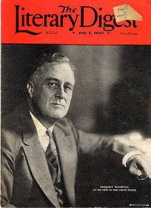

# [Week FOUR]{.r-fit-text}

Part III of @Hornbaek2025

*Interviews · Field Research · Surveys*

# Intro

For three weeks we've been building a general model of the human, which is powerful and a good starting point, but it's not specific to *your* users.

This week's question: *you are not your user, so how do you find out who is, and what they do?*

# Case Study: Uber

# What did Uber miss?

Uber got off to a rocky start with women. Because the all-male cofounders designed for themselves.

- They designed for convenience instead of safety. Uber assumed riders primarily valued speed, price, and ease of use over safety.
- They didn't deeply understand women's lived experiences. Women often approach transportation differently than men because of the risk of harassment or assault.
- They optimized for business metrics instead of trust, which is essential in a marketplace.

# You are not the user

This is the founding commitment of user research. Three reasons it's hard, and each one previews a method this week.

- **The say-do gap:** what people say they do and what they actually do diverge. Self-reported internet use correlates weakly with logged behavior (**Scharkow**).
- **Tacit knowledge:** much of what drives behavior cannot be put into words. Ask someone how they ride a bike.
- **The future is unimaginable:** no user of a batch system could have specified a GUI. People are poor predictors of their own future use.

::: {.callout-note}
User research is the set of empirical methods for obtaining, analyzing, and representing knowledge about users, their activities, their contexts, and the systems they already use, in order to inform design.
:::

# Who is the user, then?

If you are not the user, your first job is to say who is. That is a three-step commitment, before any method.

- **Target audience:** the profiles of who the product is for, built from behavioral, technological, and demographic criteria.
- **Other stakeholders:** people affected by the system without using it, like the parents of a child playing a mobile game.
- **Sampling:** picking specific participants who represent that audience, balancing representativeness, variety, and cost.

##

::: {.callout-note}
Identifying the user is a three-step commitment: specify the target audience, map the other stakeholders, then sample representatively. A failure at any step injects bias that is hard to detect and often only surfaces at deployment.
:::

## The stakeholders you forgot

The people who wreck your design are often the ones who never made it onto your participant list.

- **Stakeholder analysis** rank groups by power, legitimacy, and urgency so you don't just serve the loudest.
- **Latent and dormant stakeholders:** some are affected only indirectly, or stay silent until a crisis, like legal experts after an accident.
- **Managers sample badly:** they attend to the stakeholders who matter to them, not the ones who are most urgent.
- **Uber again:** women riders were core to the audience but treated as an edge case, and safety was an urgent concern the all-male team never sampled for.

## [Concept check]{.r-fit-text}

::: {.callout-note title="Pause and think"}
You are designing a homework app for a school. Name three stakeholders who are not the students, and for one of them, argue why they might be more urgent than the students themselves.
:::

# No method is free

Every method trades off three things you cannot maximize at once (**McGrath**).

- **Realism:** how close to the naturally occurring situation. Field research wins here.
- **Precision:** how much control and detail. Lab and structured methods win here.
- **Generalizability:** how well it extends to other people and settings. Surveys win here.

##

::: {.callout-note}
Because every method is biased in its own way, the fix is **triangulation:** combine methods with different weaknesses so they cover for each other. Hold this throughline: interviews, field research, and surveys each buy one corner of the triangle and pay for the others.
:::

# Judging the work: is it valid?

Choosing a method is only half the job. The other half is judging whether a study was done well. The textbook names four quality dimensions.

- **Validity:** whether the conclusions you draw are actually justified.
- **Reliability:** whether the method gives consistent results if you run it again.
- **Transparency:** whether your design, data, and analysis are open and inspectable.
- **Ethics:** whether collecting and reporting the data treats participants and society responsibly.

##

::: {.callout-note}
Validity asks a different question than reliability: not "would I get the same answer again?" but "is this answer about the thing I think it is about?" A study can be perfectly reliable and completely invalid.
:::

## Reliable is not the same as valid

Reliability is a tight cluster of darts. Validity is whether they landed on the right board at all. You can measure the wrong thing very consistently.

- **Four flavors of validity:** internal (did your change cause the effect), construct (are you measuring what you claim), statistical conclusion (are the numbers trustworthy), external (does it generalize).
- **The trap:** a survey scale with a high Cronbach's alpha is reliable, but if it is really measuring "wanting to please the researcher," it is invalid.
- **Look ahead:** we meet the reliable-but-not-true version of this head-on in the surveys chapter.

## [Concept check]{.r-fit-text}

::: {.callout-note title="Pause and think"}
A team measures "user delight" with five questions and gets a very high Cronbach's alpha, so they call the scale trustworthy. Which quality dimension have they shown, and which have they not? What would you check next?
:::

# Interviews

## The neutral interview

- **Interview:** a planned, systematic conversation to elicit a user's first-person view of a chosen theme, distinct from everyday talk by its preparation, focus, and recording.
- **Open-ended (responsive):** questions adapt to answers; **structured:** fixed script, closer to a survey; **micro-phenomenological:** tiny content-free questions unfolding one lived experience.
- **Question types:** main questions (tour, grounded, comparison), probes ("go on..."), and follow-ups that clarify, get concrete, and surface variation.
- **Listen, do not talk:** the interviewer spends more time listening than in any normal conversation.

##

::: {.callout-note}
A leading question is one that implies a "right" answer and injects the interviewer's prejudice into the interviewee's response, for example "Don't you think autocorrect should be on by default?"
:::

## Staying neutral is harder than it sounds

The rule is easy to state but brutal in practice, especially when you built the thing you are asking about.

- **Kill the bias in wording:** "How much did you like it?" becomes "Tell me about your experience using it."
- **Handle "why?" with care:** it pushes people to rationalize and can make them defensive; use it sparingly.
- **Do not ask people to forecast:** "Is handwriting recognition useful?" invites speculation. Ask "How are you using it right now?"
- **The hardest case is your own project:** if you are personally invested, be honest about whether you can even be neutral on the subject.

## 

::: {.callout-tip title="In the wild"}

:::

::: {.notes}
https://www.simplypsychology.org/loftus-palmer.html
https://unsplash.com/photos/a-car-that-has-crashed-into-another-car-XcjVef6uvYA
:::

## [Concept check]{.r-fit-text}

::: {.callout-note title="Pause and think"}
Rewrite this into a neutral, single-topic question you could actually ask a user: "Don't you find the new onboarding both faster and clearer than the old one?" Name every flaw you removed.
:::

## Contextual inquiry

- **Contextual inquiry (Holtzblatt & Beyer):** watch users do a real activity in its setting and talk to them about it as they go, blending observation and interview.
- **Master and apprentice:** the user does the work and the talking; you are the nosy apprentice trying to learn the craft.
- **Concreteness over abstraction:** when they say "I usually do it this way," you say "show me the last time you did it."
- **Four principles:** context, partnership, interpretation, focus.

::: {.callout-note}
Contextual inquiry trades generalizability and precise task timing for realism and a full understanding of a few users' activity in situ.
:::

## Why watching beats only asking

Contextual inquiry exists because asking alone hits the say-do gap and the tacit-knowledge wall. Being present lets the artifacts, the room, and the interruptions jog what a bare interview would miss.

- **Tacit knowledge gets acted out:** people who cannot describe how they use autocorrect will show you if you watch.
- **Context supplies the cues:** the devices, layout, and colleagues that a retrospective interview strips away.

##

::: {.callout-warning title="Do interviews tell you what users do?"}
- **Rubin & Rubin, Holtzblatt & Beyer:** interviews give privileged access to how users think and what things mean to them.
- **Scharkow; and observed-vs-reported studies:** self-reports of behavior diverge from logs and direct observation. In one handwashing study, far more people say they wash than are observed doing it.
- Current read: interviews are strong evidence of *meaning and experience*, weak evidence of *behavior and frequency*.
- Design takeaway: do not cite interview self-report as behavioral fact; triangulate it with observation or logs.
:::

## [Concept check]{.r-fit-text}

::: {.callout-note title="Pause and think"}
Your team wants to know how often people actually use a rarely-touched "export" feature and how they feel about it. Which part should you get from an interview, and which part should you refuse to trust from the interview? Why?
:::

## Turning talk into insight

Collecting the interview is only half of it. Then you have to make sense of it, from the participant's perspective, not by jumping to a design.

- **Coding:** tagging parts of a transcript with labels that capture what matters, either bottom-up from the data or top-down from theory.
- **Expand, then condense:** first open up the possible meanings of what was said, then reduce them to patterns.
- **Affinity diagramming (the KJ method, Kawakita):** cluster individual notes by similarity until themes emerge from the bottom up.
- **Thematic analysis (Braun & Clarke):** a systematic six-step way to build and name themes from codes.

::: {.callout-note}
Analysis is where interview data becomes findings. The aim is to make sense of the participants' world in their own terms; any clever design idea is secondary.
:::

## From sticky notes to themes

- **Affinity diagramming in practice:** write notes, cluster them, "walk the wall" merging and splitting, then document it, usually as a group.
- **Braun & Clarke's six steps:** familiarize, generate codes, search for themes, review them, define and name them, write up.
- **Themes are built, not found:** you construct them against your research question; they do not just fall out of the data.
- **Analyze as a team:** multiple readers on the same transcript raise reliability by diluting one person's idiosyncratic reading.

## [Concept check]{.r-fit-text}

::: {.callout-note title="Pause and think"}
You have 30 transcripts and 400 sticky notes on the wall. In your own words, what is the difference between a code and a theme, and why can't you just count which words came up most often?
:::

# Field research

## Observation in the field

- **Field research:** collecting data on users in their real-world context, with as little disturbance from your presence as possible.
- **Etic (outsider) view:** count and time events from outside, for example how long people linger at an interactive shop window.
- **Emic (insider) view:** immerse to describe the activity from the members' own perspective.
- **Focus first (Spradley):** you cannot just "go and watch." Pick dimensions to attend to: space, actors, activities, objects, acts, events, time, goals, feelings.

##

::: {.callout-note}
Reactivity is the change in people's behavior caused by the observer's presence. Imagine your employer hired someone to sit and watch you work.
:::

## What presence gives you and costs you

Field research buys realism: it captures collaboration, workarounds, and the gap between the official procedure and how work actually gets done. The cost is reactivity and effort.

- **It surfaces non-obvious problems:** power structures, weather, interruptions, the mundane frictions no lab reveals.
- **It exposes discrepancy problems:** where managers' picture of a system does not match the ground truth, and new work quietly lands on end-users.
- **Capture is a craft:** field notes, a field diary, or structured notes; then thick description and a coding manual so two raters agree (inter-rater reliability).

## [Concept check]{.r-fit-text}

::: {.callout-note title="Pause and think"}
You have two hours to observe a busy call center. Would you go etic or emic, and name the one thing your choice will systematically cause you to miss?
:::

## Ethnography

- **Ethnography:** an emic method from anthropology; long immersion to describe an activity from the members' point of view.
- **Members' point of view:** describe the meaning of the activity as experienced, in the members' own terms, not your imported vocabulary.
- **Descriptive, not prescriptive; holistic:** include whatever the members consider relevant, not a pre-fixed list of variables.
- **Rapid ethnography:** immerse only as long as you must; several observers, preselected informants, logs to fill gaps.

::: {.callout-note}
The classic ethnographic example: to a newcomer a print room is undifferentiated noise; to experienced operators the machine sounds decompose into a rich resource for monitoring each other's work (**Button & Sharrock**).
:::

## From rich description to a design decision

Here is the catch the chapter is honest about. Realism makes field data vivid and contingent, which is exactly what makes it hard to turn into a general design implication.

- **The "So what?" problem:** every observation is tied to unique circumstances; summarizing into "takeaway bullets" can blunt the very richness that gave it value.
- **Its real payoff is strategic:** finding non-obvious problems, building models of practice, and giving stakeholders a story they can act on.
- **Reframe the question:** not "should we do field research?" but "can we succeed without it?"

##

::: {.callout-warning title="Does watching users actually inform design?"}
- **MacKay; discrepancy-problem studies:** field research can catch failures that no other method would have surfaced.
- **Norman:** human-centered design taken too literally yields incoherent, disjointed systems, and users adapt to systems anyway.
- **Dourish:** demanding "implications for design" from every field study is the wrong test; some studies exist to help us understand people.
- Design takeaway: treat field research as sensitizing and strategic, not as a spec generator; pair it with other methods before you commit.
:::

## [Concept check]{.r-fit-text}

::: {.callout-note title="Pause and think"}
You run a two-hour observation of nurses using a medication cart and it is spotless, no errors, everyone by the book. Name two reasons this "clean" session might be misleading, using terms from this section.
:::

# Surveys

## Sampling for generalizability

- **Survey:** a structured questionnaire everyone answers the same way, usually without you present; its distinctive strength is generalizability at scale.
- **The sampling chain:** population, then sampling frame (who you can reach), then sample (who you invite), then respondents (who actually answer). Every step can leak bias.
- **Randomization vs stratification:** sample at random, or set quotas so key groups are represented equally.
- **Convenience and snowball sampling:** cheap and common in HCI, but they break the "every member equally likely" assumption.

##

::: {.callout-note}
Self-selection bias is the distortion introduced when the people who choose to respond differ systematically from those who do not, over-representing whoever had a reason to answer.
:::

## Why a big N can still lie

Generalizability is the selling point, and it is exactly where surveys quietly fail. Scale multiplies a biased question or a skewed frame; it does not fix them.

- **Response rate is not the real worry:** the worry is how non-respondents differ from respondents (**Oppenheim**). A 10% response rate can be fine or fatal depending on that gap.
- **Sample size buys precision, not validity:** more people narrows your margin of error, not your bias.
- **The mean HCI survey has around 371 respondents:** published studies run from 6 to 50,000, so "how many" is the wrong first question. "Who, and asked what?" comes first.

##

::: {.callout-tip title="In the wild"}

:::

::: {.notes}
https://mathcenter.oxford.emory.edu/site/math117/historicalBlunders/
:::

## [Concept check]{.r-fit-text}

::: {.callout-note title="Pause and think"}
You need results that generalize to all users of your app, but you can only recruit from your existing mailing list. Name the population, the sampling frame, and the single biggest threat to generalizing from what you collect.
:::

## Writing a question that measures what you think

- **One question at a time:** "How satisfied are you with the system and its support?" is double-barreled; split it.
- **Neutral, not leading:** "Do you agree that the site is usable?" becomes "Do you agree or disagree that the site is usable?" or better, a rating scale.
- **Specific:** "the most" (most times? longest?), "computer" (which one?), and "last week" all mean different things to different people.
- **Prefer validated instruments:** NASA-TLX, SUS-style usability items, the Technology Acceptance Model scales, rather than rolling your own.

::: {.callout-note}
Response biases distort answers systematically: acquiescence (agreeing regardless), social desirability (looking good), response-order and neutral-item effects, and demand bias (answering to fit the study's apparent purpose).
:::

## Reliability is not truth

A validated scale measures a construct with several items and checks that they move together. Useful, but easy to over-trust.

- **Cronbach's alpha:** internal consistency from 0 to 1; a rough floor of 0.7 for a scale. Custom HCI questionnaires often miss it while validated ones clear it.
- **Consistency is not correctness:** a high alpha means your items agree with each other, not that they measure the right thing.
- **De-situatedness:** the respondent is answering far in time and place from the moment you care about; diaries and experience sampling pull the question back toward the event.

##

::: {.callout-warning title="Does a validated, high-response survey give you the truth?"}
- **Ernala et al.:** asked 50,000 people about time on Facebook ten different ways; the "same" quantity shifted with the wording.
- **Scharkow:** self-reported use tracks logged behavior only weakly.
- **Oppenheim:** a good response rate does not rescue a biased frame; a biased frame with a great rate is still biased.
- Design takeaway: use surveys to estimate distributions and attitudes at scale, triangulate anything behavioral against logs or observation, and pilot every question.
:::

## [Concept check]{.r-fit-text}

::: {.callout-note title="Pause and think"}
A Product Manager shows you a survey: 12,000 respondents, 92% "agree the new feature is useful," recruited via a banner inside the feature. Give two reasons that 92% might be worthless, naming the specific bias each time.
:::

# Discussions

## If you are not the user, can you ever escape your own perspective?

User research assumes empirical data beats the designer's intuition, yet the chapter admits empathy tends to fail and Norman warns that following users too closely breeds feature creep.

*Is rigorous user research a genuine correction to designer bias, or does it just launder the same biases through a method? Where is the line between listening to users and letting the loudest signal design your product?*

## When, if ever, is covert observation justified?

Field research is strongest when people do not modify their behavior for the observer, but reactivity is reduced most by watching people who did not fully consent.

*Weigh the realism you gain against the autonomy you take. Would you run a covert study of a vulnerable group if it were the only way to surface a real harm? What would make it defensible, or never defensible?*

## Are LLM-simulated "synthetic users" user research or a category error (or something else)?

Teams increasingly prompt a model to role-play respondents or interviewees instead of recruiting people, arguing it is faster and cheaper at scale.

*A synthetic user has no tacit knowledge, no say-do gap, and no future it cannot imagine, because it has no behavior at all. Does simulating users reintroduce the exact "you are not the user" problem the field exists to solve, or is there a defensible use? Name where you would and would not trust it.*

# Activities

## Activity 1: Question teardown and rebuild (~35 min)

**Task:** In groups of 3 to 4, take the provided set of eight flawed interview and survey questions (leading, double-barreled, vague, future-hypothetical, socially loaded) and diagnose then repair each one.

**Produce:** A table with at least eight rows: original question, the specific flaw named, and a neutral rewrite. Plus one forced position: pick one question the chapter's rules would flag that you think is actually fine as written, and argue why.

**Time:** 25 min group work · 10 min share-out

**Debrief:** Which flaw was hardest to fix without introducing a new one?

## Activity 2: Watch, don't ask: a 12-minute contextual inquiry (~35 min) 

**Task:** In pairs, one person performs a real, mundane task on their own phone (find and mute a specific notification; add an event to their calendar; split a bill in a payments app) while narrating nothing unprompted. The partner is the "apprentice": observe, take timestamped notes, and use only concreteness probes ("show me the last time you actually did that," "wait, why that tap?"). Swap. Then, from your notes, do 5 minutes of open coding on the observed behavior. 

**Produce:** For each observation, one code (bottom-up) and one say-do gap you saw — something the user did that they would probably not have reported in an interview. Then name one code that is at risk of being your interpretation rather than their behavior. 

**Time:** ~24 min paired work (12 observe + swap, ~5 code) · ~11 min share-out

**Debrief:** What did watching surface that asking would have missed — and where did you contaminate the data by being the apprentice?

## Activity 3: Method-match for an AI feature (~40 min)

**Task:** In groups of 3 to 4, choose a real AI feature (a coding assistant, an AI chat agent, an AI photo editor). Write three research questions about its real use, then assign each to a method (interview, contextual inquiry, field observation, survey) and justify the choice with McGrath's realism, precision, and generalizability.

**Produce:** a one-paragraph research-plan memo written to a skeptical PM — "here are our three questions, the method we'd use for each, and the one place the say-do gap will bite us.". Forced position: name one question where you would trust an LLM-simulated "synthetic user" and one where you absolutely would not, with your reasoning.

**Time:** 28 min group work · 12 min share-out

**Debrief:** Where did two groups pick opposite methods for the same question, and who was right?


