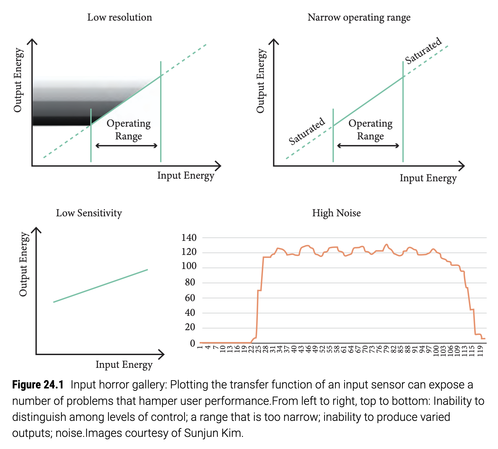
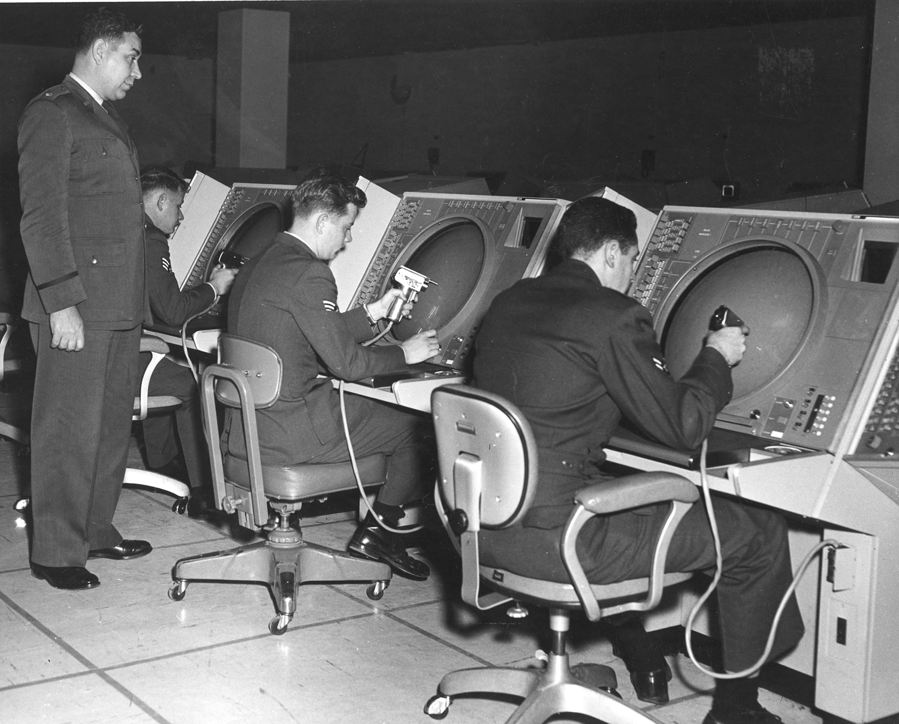
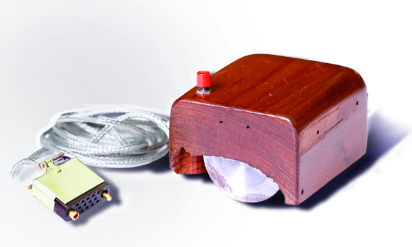
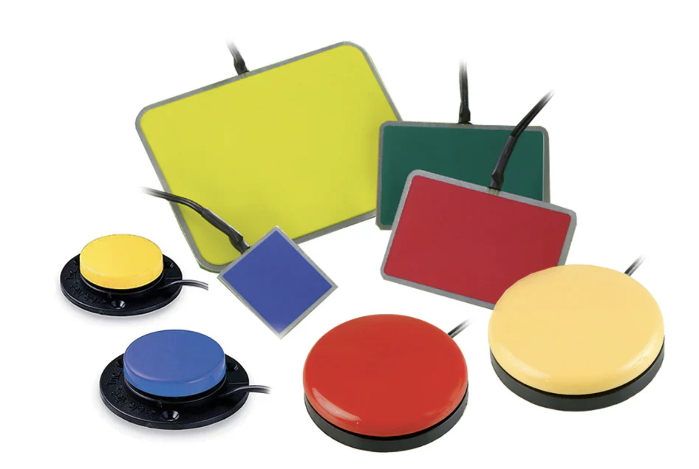
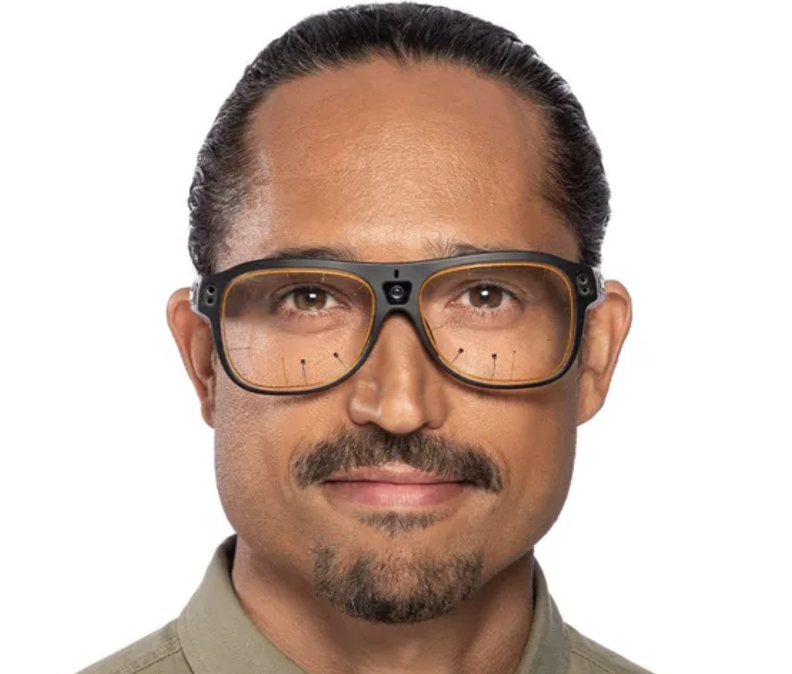
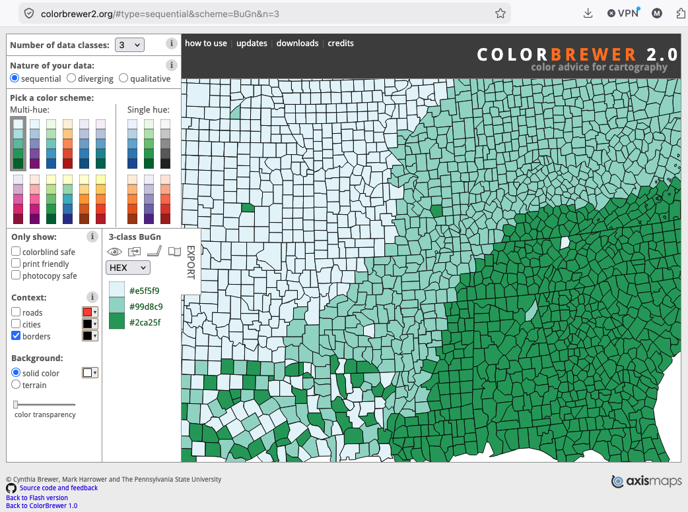
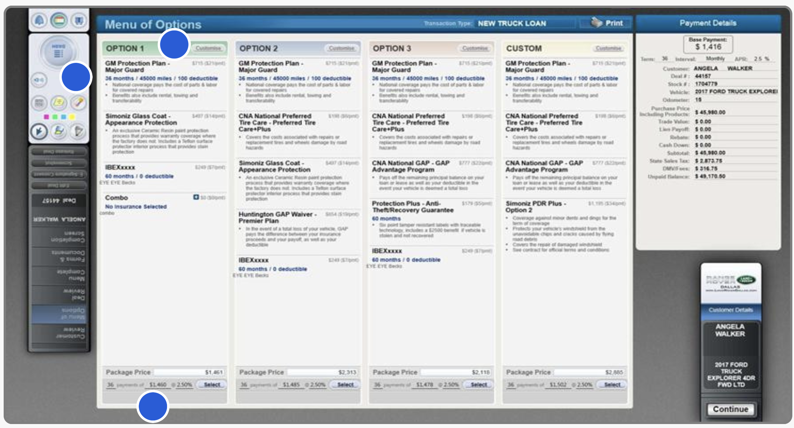
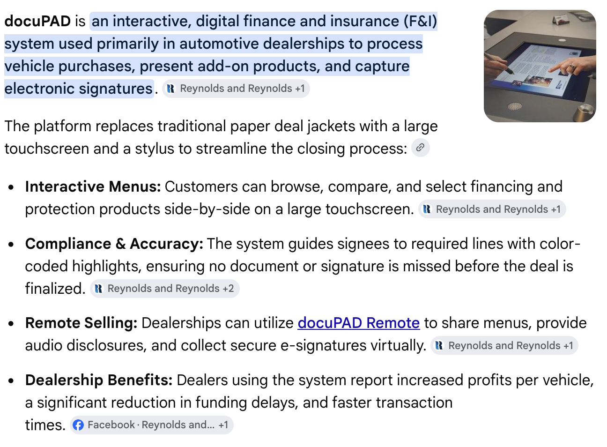
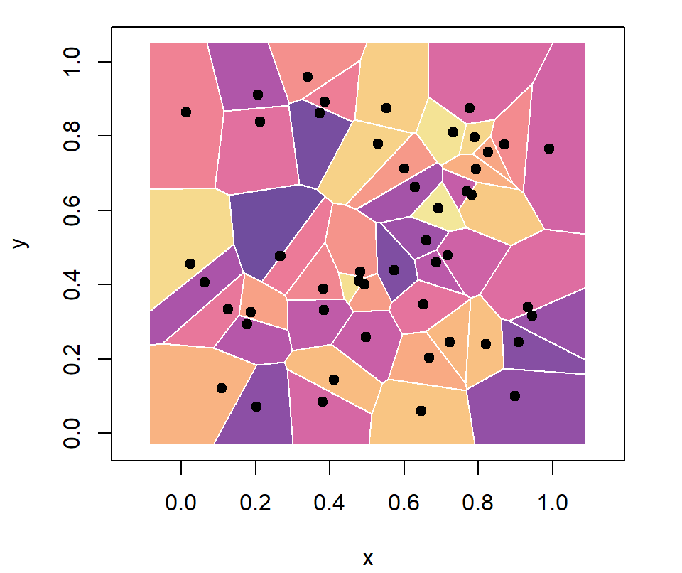
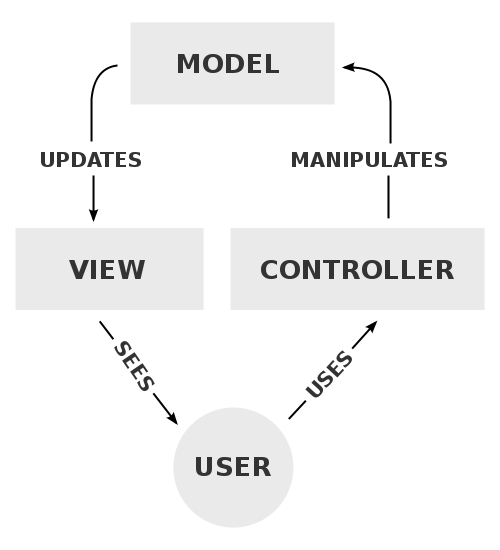

# [Week SEVEN]{.r-fit-text}

Part V of @Hornbaek2025

# Intro
User interfaces are the only part that real people interact with in real settings doing real "tasks". Therefore, the study of user interfaces has contributions from computer science, electrical engineering, design, and psychology.

## Ways of seeing interfaces
- Englebart: specified augmenting human intellect
- Shneiderman: identified direct manipulation
- Weiser: stipulated that the interface should *disappear*
- ... many others ...

## Elements
The DIRA model specifies four elements of an interface

- Devices, such as mice, keyboards, touchscreens, eye trackers
- Interaction Techniques, mapping input to solutions for interaction problems
- Representations, how things appear
- Assemblies, organizations of representations

## Interaction Styles
These are combinations of the elements specified in the DIRA model

## Command-Line
- Our textbook is a bit out-of-date on this
- It says that the command line is entering text and obtaining responses only in text, without interaction capabilities
- The next frame shows a contemporary command-line interface
- There are two "window-panes"
- The left pane shows the user highlighting response text, which is a directory that can be opened by clicking
- The right pane shows a graphical image, the cover of our textbook

## Kitty: a terminal emulator

## Forms
- Groups of widgets such as checkboxes or radio buttons for user input
- Advantages: structured, easily understood
- Disadvantages: restrictive (double-edged sword)

## Menus
- Grouped series of options
- Obeys Hick's law, that the time to choose is proportional to the log of the number of choices plus one, all multiplied by an empirically found constant
- Can be cumbersome
- Grouping often accomplished by card sort
- Part of the WIMP paradigm (Windows, Icons, Menus, and Pointers) that dominate desktop computing

## GUIs (graphical user interfaces)
- Enable direct manipulation of onscreen objects
- Example: dragging a picture of a file to a trash can
- Hallmarks are low floor and low ceiling of performance

## Reality-based interaction
- Mobile devices such as smartphones and smartwatches
- Mixed reality (used to be called augmented reality)

## Design objectives
Design objectives come from three sources

- Understanding of people
- Theories of interaction
- Attributes and structural qualities of the user interface

## Example objective: Supporting novice, intermediate, and expert performance
- For novices, the system should be easy to learn
- For intermediate users, the system should be easy to become proficient
- For expert users, the system should support optimal performance

##

::: {.callout-note title="Aside: the performance floor and the performance ceiling"}
- The floor is entry level and can be high (bad) or low (good)
- The ceiling is what is attainable and can be high (good) or low (bad)
- It's difficult to have both a low floor and a high ceiling, which is the most desirable state
- The supports that give you a low floor get in the way of expert users
- Possible remedy: *training wheels* that are removed in a dynamic interface
:::

## Example objectives: Usability and Accessibility
- Usability concerns whether users achieve goals with efficiency, effectiveness, and satisfaction, so usability can be an objective
- Accessibility achieves equivalent usability between user groups (is this a controversial definition?)

## Example objective: structure and attributes of the interface
Key attributes include

- Explorability
- Discoverability
- Consistency

##

::: {.callout-note title="Aside: Trade-offs between objectives"}
Common trade-offs include

- Speed vs accuracy
- Recognition vs recall
- Familiarity vs novelty
- Those who work vs those who reap benefits
:::

## Design space analysis
The *design space* is everything that matters in a design---analyzing it occurs at different unit levels

- Morphological analysis considers technical variables constituting an interface
- Joint system analysis considers the parameters of the joint human-computer experience
- Questions, options, and criteria (QOC) method considers questions mapped to design options and objectives

## Summary of Ch 23
- User interfaces are what the user comes into contact with when using an interactive system.
- User interfaces comprise input devices, interaction techniques, representations, and assemblies.
- There are five main styles of interaction: command line, form, menu, GUI, and reality-based user interfaces.
- The design of user interfaces involves balancing trade-offs between relevant criteria.

# Input devices (Ch 24)
- Differ from interaction techniques (how?)
- Success of an input device depends on correctly translating what the user does into some sort of computation

::: {.notes}
Input devices sense user movements and states while interaction techniques help a user accomplish fundamental operations using input devices and displays, according to p 405. But isn't "displays" too limited here? What other signals are used by interaction techniques?
:::

## Example: Fitts's law in menu bars
- Fitts's law predicts the time it takes to point at something based on the something's size and distance, formalized as
- $$T=a+b \log_2\left(\frac{2D}{W}\right)$$
- where $a$ and $b$ are empirically discovered constants, $D$ is distance, and $W$ is width (size)
- If a menu bar is at the top of the display, an item on it has effectively infinite size (width) because, no matter how hard you drive the input device (e.g., mouse or trackpad), it is stopped by the display edge

## Sensing
- All input devices depending on sensing something in the real world and translating that something into some sort of computable signal
- More specifically, translating some sort of energy into an electrical signal
- Principles for sensing can be mechanical, electrical, sonic, optical, radiation, magnetic, gravitational, or chemical
- Example: capacitive touch compared to resistive touch, where capacitive allows multi-touch and greater precision than resistive, its predecessor

## Sensing hardware
- Every devices that senses has to have at least a sensor (duh), a microcontroller, and some kind of rig to keep them together
- The sensor is governed by a transfer function
- The next frame shows four examples of problematic transfer functions: low resolution, narrow operating range, low sensitivity, and noise

##

## Mitigating sensor problems
- Noise can be mitigated with filtering and typical filtering categories include
- Frequency-based filters, for example a low-pass filter gets rid of low frequency signals
- Moving average filters, using
  $$\overline{X}=\frac{1}{n} \sum_{i=1}^n X_i$$
- and assuming noise has mean zero, averages the filtered value, $X$, over a few samples, $i$, from some time labeled $1$ to the $n$th sample from the current time (I think the book gives a wrong formula)
- Drawback is that sampling must be high-frequency to avoid lagginess

## More on mitigating sensor problems
- Exponential smoothing (also called first-order smoothing) weights recent samples more heavily than old ones
  $$\overline{X}_i=\alpha X_i + (1-\alpha)\overline{X}_{i-1}$$
- $\alpha$ is a smoothing factor between $0$ and $1$
- A large $\alpha$ keeps the filtered value close to the latest reading (responsive but jittery)
- A small $\alpha$ gives more lag but less jitter
- Double exponential smoothing applies the trick twice to handle quadratic trends

## Speed-dependent filtering
- The trade-off between lag and jitter is uncomfortable---we want responsiveness *and* accuracy
- Speed-dependent filtering changes $\alpha$ on the fly based on the estimated velocity of movement
- Especially useful for continuous sensing, such as a mouse

## The €1 filter
- @Casiez2012 found an elegant solution named, adorably, the €1 (one Euro) filter
- Idea: shrink $\alpha$ as the cursor moves faster
  $$\alpha=\frac{1}{1+\frac{\tau}{T_e}}$$
- Move quickly and the cursor stays responsive; move slowly and accuracy stays high
- The book goes into a bit more detail

::: {.notes}
The €1 filter is genuinely worth showing students because it is short enough to implement in an afternoon and is used widely in gesture and touch systems.
:::

## Engineering challenges in sensing
Three recurring issues summarize the whole sensing pipeline

- What can be sensed?
- What is the resolution?
- What is the accuracy?

## Issue 1: What can be sensed?
- The sensing *modality* is the input stream considered: speech, hand movement, pen movement, handwriting, gaze, and so on
- Input can be *multimodal*, combining several streams
- *Sensing validity* asks whether the device works across the messy variety of real settings
- *Sensing interaction potential* captures expressiveness: which interaction types are supported, and at what fidelity

## Issue 2: Resolution
- *Temporal resolution* is how finely the device measures time (how many samples per unit time)
- *Spatial resolution* is how finely it measures space (e.g., a hand tracker good to 5 mm)

## Issue 3: Accuracy
- Accuracy reflects whether the device correctly senses what the user did
- Modeled differently per device---an eyebrow switch is a binary classifier scored on true positives and true negatives
- But accuracy is a composite measure, so on its own it tells us little about *design*

## Keypads and keyboards
- Both let the user enter letters, symbols, numbers, and commands
- Construction depends on the use case (e.g., a cheap flat-panel membrane)

## Keypads
- A set of buttons in a matrix layout
- Common layout is the alphanumeric telephone keypad (ISO/IEC 9995-8:1994)
- Found in microwaves, calculators, ATMs, healthcare and manufacturing machines
- Good for lots of numeric entry, a little alphanumeric entry
- Dominated mobile phones before capacitive touchscreens arrived

## Keyboards
- Like a keypad, but contains all letter keys A--Z plus many ancillary characters and functions
- Most use the QWERTY layout, named for the first six keys of the top row

## Pointing devices
- Keyboards enter text; pointing devices select *locations* on a display
- Used for selecting, manipulating objects, or drawing
- Two classes
  - Directly controlled devices
  - Indirectly controlled devices

## Direct vs indirect
- A **direct** device is pointed straight at the display, specifying an *absolute* location (top-left corner $\to$ pixel $(1,1)$)
- An **indirect** device is manipulated separately, moving the cursor *relatively*
- Indirect movement is modulated by the control/display ratio (see Ch 26)

## Direct control: light pen
- One of the earliest direct devices
- A light-sensitive rod used with a CRT display
- The CRT paints pixels in a raster scan; combining the pen's light sensor with the scan's timing reveals the tip's location
- Famously used to select links in an early hypertext system

## SAGE: the most expensive US gov't project of the 1950s

## Direct control: resistive touchscreen
- Two flexible sheets separated by an insulator (e.g., an air gap)
- Pressing them together at a point completes horizontal and vertical traces, locating the touch
- Popular in early PDAs, Tablet PCs, and touchscreen phones
- Cheap, work with a gloved finger or any implement, and can give high resolution with a pen

## Direct control: capacitive touchscreen
- Now ubiquitous; popularized by the 2007 iPhone
- Rely on capacitive coupling between fingertip and display to sense absolute position
- Support multi-touch, enabling techniques like pinch-to-zoom
- Trade-off vs resistive: faster response but lower precision (and resistive can look worse due to its dual membrane)

##

::: {.callout-note title="Aside: sensing plants and light"}
- Botanicus Interactus excites a living plant with signals from 0.1 to 3 MHz and infers touch location from how frequencies are affected
- Frustrated total internal reflection (FTIR) traps infrared light in an acrylic pane; a touching finger scatters light to a camera behind it, giving cheap multi-touch
- Moral: once you understand sensing principles, almost anything can become an input surface
:::

## Indirect control: mouse
- Move the mouse on a table and the cursor mirrors the motion
- Evolution of the mechanism: two wheels $\to$ rolling ball $\to$ optical sensors (no moving parts)
- Usually carries buttons and a scroll wheel to provide extra information

## The first mouse

## Indirect control: touchpad
- Move a fingertip on a surface (resistive or capacitive) to drive the cursor
- Can be augmented with tactile feedback and click mechanisms
- Unlike a mouse, it can work in *both* relative and absolute coordinates
- The everyday laptop replacement for a mouse

##

::: {.callout-note title="Aside: touch for several people at once"}
- DiamondTouch projected an image onto a table and placed antennas beneath an insulating layer
- Antennas detect *when* (not where) a region is touched
- Users were told apart by instrumenting their chairs---each person completes a unique circuit
- This let the table attribute every touch to the right person
:::

## Uncertain control
- Direct and indirect devices infer intentions with high certainty
- *Uncertain control* devices must be designed to be robust when the user's intentions are genuinely ambiguous

## Switches
- The humble push button: binary on/off, perhaps the most ubiquitous input device
- Pressing forces two contacts together, creating a low-impedance path for current
- *Switch bouncing*: contacts chatter before settling, risking false extra triggers
- Fixed with *debouncing*, in hardware or software
- Eyebrow switches let some nonspeaking users with motor disabilities communicate---but they are noisy and error-prone, and interfaces must be designed accordingly

## A classroom switch kit retails for £2,400

## Accelerometers and gyroscopes
- An **accelerometer** measures the rate of change of velocity
  - At rest it still reads Earth's gravity as an offset
  - Used to detect portrait/landscape orientation, to tilt-control games, and (with ML) to count steps
- A **gyroscope** measures orientation and angular velocity
  - Usually built as micro-electro-mechanical systems (MEMS)
  - Combine the two for robust 3D gesture recognition and to track a VR headset

## Brain--computer interface (BCI)
- Lets the user communicate *without actuating any muscles*
- Translates the brain's electrical activity into computer signals; a main use is controlling prosthetic limbs
- Noninvasive EEG uses scalp electrodes: practical but low SNR, so quite limited in HCI
- Invasive brain implants achieve much higher SNR and have helped restore vision and movement---at serious cost to the user

## Electromyography (EMG)
- More reliable than BCI
- Senses the electrical activity of the user's *muscles*
- HCI uses *surface* EMG (no needles)
- Signal processing and machine learning turn the signal into gesture recognition and even fatigue estimates

## Eye tracking
- Estimates the user's gaze on a display; all methods require calibration
- Infrared reflection produces *Purkinje images* used to infer gaze (the high-accuracy commercial approach)
- A regular camera with computer vision is cheaper but sensitive to head movement
- Electrooculography (EOG) places electrodes around the eye and measures the retina's resting potential
- Sensored contact lenses are highly accurate but invasive

## Eye tracking: saccades and fixations
- A **saccade** is a preplanned ballistic jump of the eye, 150--250 ms to plan and execute
- A **fixation** is the relatively still period after a saccade, typically 200--300 ms
- A sequence of them forms a *scanpath*, recorded at roughly 30--60 Hz
- The eye--mind hypothesis: what people look at is what they are thinking about---so gaze can proxy for attention (given a suitable task)
- Used in market research, usability testing, and eye-typing (Ch 26)

## A $20,000 pair of Tobii eye tracking glasses

## Hand and finger tracking
- Estimates the location of hands and fingers in 3D space
- Optical markers on the hands, tracked by high-resolution cameras, give high-accuracy, low-latency data---the research workhorse (e.g., studying mid-air 10-finger typing)
- Depth cameras on a headset plus computer vision infer a hand *skeleton*, the norm in modern VR/AR

## Microphone input and speech recognition
- A microphone is a transducer converting acoustic waves to electrical signals
- A *microphone array* localizes sound, enabling location-directed feedback
- Fun aside: the 1986 Famicom *Legend of Zelda* used the controller's microphone---shout and certain big-eared enemies vanish---long before speech recognition was feasible
- Speech recognition turns utterances into hypotheses of what was said: isolated words or continuous phrases, used for voice control and dictation

##

::: {.callout-note title="Aside: contemporary speech recognition"}
- Whisper has been a popular AI speech to text solution recently
- Dozens of vibe-coded GUI wrappers around Whisper can be found on GitHub
- But ... iOS 27's built in speech recog engine beats Whisper on most benchmarks
:::

## Expanding the limits of sensing
- Early input was switch-based: a mechanical switch is highly certain, rarely triggered by accident
- Then devices sensed *movement*---the mouse and joystick---needing more complex pipelines for noise and uncertainty
- Wearables push further: iSkin is a thin, transparent, flexible, biocompatible tattoo combining capacitive and resistive sensing, working even when stretched or bent

## Beyond movement
- Some research aims to sense entirely new things: temperature, mental workload, even boredom
- Why bother?
  - *Adaptation*: simplify the interface when the user's workload is high
  - *Non-command interfaces*: infer intent so precisely that the user need not issue explicit commands (recall Norman's seven-stage model, Ch 18)
- The catch: are the inferences *accurate*? It works in controlled settings, but robust sensing in the wild remains hard

## Summary of Ch 24
- Input devices let users provide information to a system, involving input computation, representation, and implementation
- They divide roughly into key-based devices, direct and indirect pointing devices, and uncertain-control devices
- Each offers different opportunities and challenges---no device is best for every interaction context

# Displays (Ch 25)
- A pure display is an output device: it transfers information from the system to the user
- Covers visual screens, haptic (feel) devices, audio---anything rendering information in a modality humans perceive
- Defining objective: transform digital information into analog information that people can accurately perceive
- It must match the human perceptual system---no point rendering sound we cannot hear or detail finer than the eye can resolve

## Displays are not just screens
- Squeezeback: pneumatic compression around the arm sends distinguishable notifications
- Large displays help intelligence analysts think about and make sense of data
- SensaBubble shoots scented bubbles you can project information onto until they burst
- The tongue-display unit (1969): a $12\times12$ electrode array renders visual information on the tongue, which is packed with receptors

##

::: {.callout-note title="Aside: A contemporary tongue display artifact"}
{width="50%"}
:::

## Why displaying a battery level is surprisingly hard
- A rainbow color scale is a poor choice---colors have no natural ordering
- Different hues (red, yellow, blue) do not convey quantity
- Color *value* (intensity) is better in principle, but halving the RGB value is not perceived as half
- The lesson: even a trivial-seeming display decision is complex (tools like ColorBrewer help)

##

::: {.callout-note title="Aside: The ColorBrewer web interface"}
{width="40%"}
:::

## Encoding and rendering
- **Encoding** turns digital information into something a display can show
  - Trivial for the letter "v"; hard when crossing modalities (e.g., a haptic version of an icon---a *tacton*)
- **Rendering** turns the encoded information into something people perceive
  - The hardware matters: early VR refresh rates were so low the lag caused motion sickness

## Types of value
Encoding starts by asking what *type* of value we are showing

- Nominal (categorical): no inherent order---names, zip codes, eye colors
- Ordered: education levels, satisfaction ratings
- Quantitative: numeric and subject to arithmetic---temperature, pulse, rainfall
- The type dictates the encoding: hue is fine for cities, terrible for quantities

## Visual encoding: marks and channels
- **Visual marks** are geometric primitives: points, lines, areas
- **Visual channels** are properties of a mark: position, color, shape, size, orientation, texture, motion
- Color itself has three dimensions
  - Hue (what we usually call "color")
  - Value (lightness or darkness---the intensity)
  - Saturation (depth of color; equal R, G, and B is white)

## Which channels work for which variables
- Nominal: hue, shape, and motion work well
- Ordered: value and saturation, plus area and volume
- Quantitative: position, length, and orientation are highly effective
- This is why scatter plots and bar charts are easy to read accurately

##

::: {.callout-note title="Aside: which visual channel works best?"}
- Cleveland and McGill [@Cleveland1984] asked not what looks nice but how *accurately* people read graphs
- They compared judging values encoded as angles versus positions
- Angle encoding produced markedly more errors
- This is the empirical reason many people consider pie charts problematic
:::

## Simple displays: LEDs and segments
- An LED is a semiconductor that emits light (photons) when current flows; the energy released sets the color
- Arrange red, green, and blue LED triads and each triad becomes one pixel
- An **n-segment display** lights segments to form characters
  - Seven-segment: $2^7=128$ possible states (many not useful characters)
  - Fourteen-segment: $2^{14}=16{,}384$ states, and better letters
- Cheap and common in microwaves, calculators, alarm clocks, and car stereos

## Dot matrix displays
- Higher resolution than segment displays
- A flip-disc display flips discs (light front, dark back) to form dot patterns
- Common in large outdoor signs and public transportation

## Visual displays: the CRT
- The traditional technology (until the early 2000s) is the cathode-ray tube
- Three electron guns (R, G, B) scan phosphor dots in a raster pattern, line by line
- The **refresh rate** is how often the screen updates; higher reduces perceived flicker
  - 50 Hz (PAL) vs 60 Hz (NTSC)---historically aligned to the local AC power frequency
- Blanking intervals (hblank, vblank) mattered for early games; today *double buffering* avoids screen tearing

## Visual displays: flat panels
- Since the early 2000s, flat panels have phased out CRTs
- Common technologies: LCD, LED-backlit LCD, plasma, OLED, and quantum-dot LED

## Head-mounted displays
- A wearable display placing the user somewhere on the reality--virtuality continuum
- One extreme: the real environment only; the other: full virtual immersion
- **VR** must fill the field of view at high resolution and refresh rate, tracking the head with low latency
  - The mismatch with reality plus headset fatigue causes *simulator sickness*
- Good for simulation (surgery, defense, manufacturing), abstract visualization, and portable virtual offices

## Augmented reality headsets
- Overlay virtual objects on the real world through *registration*
- **Video passthrough**: a front camera feeds displays near the eyes; cheaper but lower fidelity and harder to register
- **Optical see-through** (e.g., HoloLens): view the real world through glass with virtual objects added
  - Little fidelity is lost, but color is poor (rainbow bands) and the field of view is narrow

## Audio
- Sound is acoustic waves; humans perceive roughly 16 Hz--16 kHz (varies with age)
- Analog: sound is a varying voltage; digital: a series of bits; converters move between them
- A speaker is a transducer converting the electrical signal into sound pressure

## Spatial sound
- We locate sound partly via the *interaural time difference*---it reaches each ear at a slightly different time
- Mono: the same signal to all speakers, so no localization
- Stereo: different signals reproduce localization
- **Spatial sound** creates a spatial listening experience; **sonification** casts data into sound

## Auditory icons and earcons
- **Auditory icons** map an event to a naturally related sound (a bell for a reminder)
- **Earcons** do not resemble their event, so their meaning must be *learned*
- Brewster's guidelines [@Brewster1995]: use musical timbres, make rhythms as different as possible, take great care with intensity (the main cause of annoyance), and leave a 0.1 s gap between serial earcons

## Speech
- Synthesized speech opened the door to conversational interfaces: assistants, announcements, screen readers
- Long held back by recognition accuracy---punctuation ("Stop it!"), proper names, and correcting misheard words
- Recent text-to-speech and language-model advances now make speech a viable way to command agents

## Haptics
- Haptic technology lets users feel touch and forces on the body
- A traditional application is telerobotics: improving the operator's sense of a remote robot's reactions

## Haptics: vibration and force feedback
- **Vibration** comes from an unbalanced mass on a motor shaft---the rumble in game controllers and phones
- **Force feedback** generates a perceived force by actuation (e.g., an exoskeleton glove)
- Massie's three criteria [@Massie1994]
  - Free space must feel free (low inertia, no unbalanced weight)
  - Solid objects must feel stiff (~20 N/cm reads as immovable)
  - Virtual constraints must not saturate easily (support up to ~40 N of finger force)

##

::: {.callout-note title="Aside: haptics for vision impairments"}
- FingerSight is a finger-worn ring with a camera and four tactors
- It maps the distance of an object to the frequency of tactile stimulation
- Users needed very little training to reach for objects in their *peripersonal space*
- Placement matters: mechanoreceptors are denser on some body parts than others
:::

## Haptic textures
- Fingertips are dense with mechanoreceptors sensing both *where* and *what*
- Much information can be conveyed with temporal cues alone
- A high-quality actuator matrix can mimic slopes, bumps, and "sandy" textures, adjusting to finger velocity

## Emerging displays
- Sutherland's 1965 "ultimate display" [@Sutherland1965]: a room where the computer controls matter itself---a chair you could sit in, a bullet that would be fatal, the Wonderland Alice walked into
- **Shape-changing displays** actuate pixels physically
  - inFORM: a $30\times30$ grid of motorized pins users can touch, push, and explore---buttons, handles, dynamic widgets
- **Digital fabrication** (e.g., the FreeD milling tool) treats making physical objects as a form of output

##

::: {.callout-note title="Aside: A display used to scam"}

:::

##

::: {.callout-note title="Aside: Gemini's take on docuPAD"}
{width="60%"}
:::

## Summary of Ch 25
- Displays turn digital information into physical phenomena users can perceive accurately
- The key consideration is matching the display to human perception---a poor match means information is perceived wrongly or not at all
- Displays are not limited to the visual presentation of information
- Emerging displays combine display and sensing

# Interaction techniques (Ch 26)
- We use them constantly: pointing, scrolling, menus, text entry, panning, zooming, hotkeys
- Definition: a computation that *couples input and output* to support an elementary interactive task
- Coupling is what distinguishes an interaction technique from an input device or an input method
- One technique rarely makes a whole interface (except simple mobile games)

## The elementary tasks
Interaction techniques help users

- Move the cursor or active area (pointing)
- Select or manipulate objects (including menus)
- Enter numbers and text (text entry)
- Change what part of an information space they see (camera control / navigation)

##

::: {.callout-note title="Aside: the end of misclicks?"}
- Bubble Cursor grows the cursor's selection area to always capture the nearest target
- It builds a Voronoi diagram over the targets, so every pixel maps to exactly one target
- Selection time dropped from 1.25 s (point cursor) to 0.9 s
- But the benefit vanishes as targets get denser---an empirical study reveals the technique's operating range
- {width="40%"}
:::

## Why we need interaction techniques
- **Improve** performance for a user group or context (gestures beat tapping, but must be learned)
- **Enable** interaction that would otherwise be hard or impossible
  - Gaze-based interaction for users with severe motor disabilities
  - Dwell-based selection: fixate long enough to select---but beware the *Midas effect* of selecting by accident

## Design objectives and trade-offs
Common objectives: performance, experience, learnability, mobility, ergonomics, accessibility

- Techniques usually expose a trade-off
- Hotkeys versus pointing is the classic: faster once learned, but learning even ten shortcuts takes real practice

##

::: {.callout-note title="Aside: getting people to actually use hotkeys"}
- Grossman et al. [@Grossman2007] compared nine ways to promote hotkeys, combining three principles: cost, feedback, and memory
- Surprises: *audio feedback* and *disabled menu items* were most effective, more than doubling hotkey use
- *Visual feedback*, to the authors' surprise, did not help---users could not split attention to notice the cues
:::

## Pointing techniques
- Map input-device changes to cursor movement or to the presentation of targets
- 1D pointing appears in scrolling; 3D in AR/VR
- Two classes
  - **Input** transfer functions map the input signal to cursor motion (e.g., C/D gain)
  - **Display** transfer functions change how targets are presented (e.g., Bubble Cursor)
- Fitts's law tells us that shrinking distance $D$ or growing width $W$ cuts movement time

## Control-to-display (gain) functions
- A gain function maps control-space movement (touchpad) to display-space movement (cursor)
  $$v_{out}=f_{CD}(v_{in})\times v_{in}$$
- A fixed gain forces a compromise: low gain cannot reach distant targets without clutching; high gain cannot hit a single pixel
- So most gain functions are **speed-dependent**---up to 24% faster than a constant gain
- @Casiez2011 reverse-engineered the gain curves in shipping operating systems and found large, surprising differences

## Selection and manipulation
- Simple selection is usually a click or tap---but the target may be small, occluded by the finger, or hard to hold still
- Techniques that help
  - *Shifting*: offset the target so the finger does not hide it
  - *Sticky icons*: lower the gain over an icon so it is easier to stop on
  - *Crossing*: cross the target instead of clicking
  - *Dwell*: hover to select
  - *Pressure widgets*: select by how hard you press

## Menu selection
- A menu organizes items for exploration and selection, often hierarchically and by semantics
- Larger menus use transient visualization---appear on demand, dismiss when the cursor leaves
- **Pie menus** lay commands out as circular sectors; select by sliding toward one
  - Easy for novices, but a low performance ceiling (visually guided closed-loop motion)

## Marking menus
- A refinement of the pie menu that gives a *seamless novice-to-expert transition*
- After a brief timeout the pie appears (novice); a quick gesture before the timeout skips it (expert)
- The key idea: the trajectory is *identical* either way, so the user unconsciously learns the motor pattern
- Limits: few items per level, and deep selections need lots of screen real estate

##

::: {.callout-note title="Aside: modeling menu performance"}
- The search--decide--point model predicts menu selection time as a sum of three subtasks
- With practice, performance shifts from serial visual *search* (linear) to *decision* among items (logarithmic, via Hick--Hyman), plus *pointing* time (Fitts's law)
- The model correctly predicted that a frequency-based *split menu* is the fastest
:::

## Text entry
- One of the most common computing tasks, yet hard on small mobile keyboards
- Some reliable findings: young adults type ~36 wpm on phones (vs ~52 on physical keyboards); two thumbs beat one finger; errors are costly; walking hurts performance
- Research focuses on four themes: correcting/completing phrases, alternative units of entry, multimodal entry, and editing

## Text entry techniques
- **Decoding** with machine learning infers the intended message from noisy touchpoints (autocorrect, word completion)
- **Beyond characters**: gesture typing (SHARK)---sweep a shape through a word's letters without lifting the finger
- **Other modalities**: speech, though recognition errors cascade (Parakeet lets you fix words by touch)
- **Editing**: fighting the "fat finger" problem with techniques like Drag-n-Drop and Magic Key
- The core tension is the *facilitation--correction cost trade-off*

## Camera control
- Often there is more to see than fits on the display (a large map, a 3D world)
- Camera control changes what the display shows---the term comes from computer graphics
- It is really a pointing task, so throughput applies

## Panning and zooming
- **Panning** moves the viewpoint across the space
- **Zooming** changes magnification; *semantic zooming* changes representation with scale (a city as a dot, then as an outline)
- Doing both at once is *integral* and more effective when the task needs it
- OrtoZoom and speed-dependent automatic zooming (SDAZ) are elegant integrated designs
- Watch out for *desert fog*: zoomed in so far there are no navigational cues left

## 3D navigation
- Harder than 2D for two reasons
  - Three degrees of freedom (pitch, yaw, roll) are hard to control with a 2D device like a mouse
  - Users must also build an understanding of the space as they move, and the technique shapes that understanding
- Covering large distances is cumbersome, just like panning

## Control and learnability
- Surprisingly, advanced interaction techniques are rare in everyday use---adoption is hard
- Two key challenges: *control* and *learning*

## Control: the internal model
- A naive control model: pick a feedforward signal proportional to the gap between cursor and target
- But this is *wrong*---motor control is nonlinear and dynamic
- The real story: the motor system learns an *internal model* that predicts the consequences of actions
- Prediction error shrinks with practice but never reaches zero---which is why a new technique needs lots of repetition

## Learning and the performance dip
- Performance follows the power law of learning
- Switching to a new technique causes an immediate *performance dip*
- Rationally, users resist: the dip is certain and immediate; the payoff is uncertain and delayed
- Design implication: do not just chase ultimate performance---*incentivize* users to start and persist, and minimize the dip

## Summary of Ch 26
- An interaction technique couples input and output to improve or enable an elementary task
- Many are about a desirable trade-off between learnability and performance (hotkeys vs menus)
- Switching techniques has a learning cost users may refuse to pay
- Users do not learn the algorithm---they learn to *predict the consequences* of their actions
- Design should incentivize starting and persisting, not just ultimate performance

# Commands and navigation (Ch 27)
- The words attached to tools and systems matter---@Chapanis1965 flagged this over 50 years ago
- A wrong word sends a user to the wrong option; poor organization sends them to the wrong place
- Two styles of interface here
  - **Commands**: the user issues instructions (central concern: *naming*)
  - **Navigation**: the user explores to discover commands and information (central concern: *organization*)

## Naming objects and actions
- The **vocabulary problem** [@Furnas1987]: ask two people to name a command and they agree with probability less than $0.2$
- So no single command name works well for many users
- Useful concepts
  - *Information scent*: how well a word suggests what it leads to
  - *Articulatory distance*: the gap between the name and the user's intention
- Specific, discriminative names beat frequent generic words ("insert" over "add"); meaningful names beat symbols

## Techniques for finding names
- Use the words users already employ---"speak the users' language"
- **Elicitation studies**: show users a command to perform, ask what they would call it, and take the most common name
- Aimed squarely at solving the vocabulary problem

::: {.notes}
Myers and Stylos [@Myers2016] extended this to APIs, treating the programmer as an end-user---consistent argument ordering and well-chosen class names are naming problems too.
:::

## Command-line interfaces
- Text-based; the user types commands (the history traces back to the telegraph)
- Structure: `prompt command parameter1 … parametern`
- Even a simple game parser (King's Quest, `>take candle`) raises design issues
  - Availability, naming, learning, recall, syntax, and transparency
- Real shells add built-in commands, OS tools, and external applications---consistency gets harder at every layer

## Organizing information
- Called information design or information architecture
- **Ordering** a list: the strongest guideline is to *group items that belong together*
  - Reordering by selection frequency performs poorly; *positionally constant* placement works best
  - Alphabetical is easy but rarely optimal

## Hierarchies and hypertext
- When there are too many items, use a hierarchy; put associated items together and the most informative items on top
- **Broad beats deep** in most cases: easier visual comparison, fewer choice points, higher-scent labels
- Design the *information scent* of each entry point so users can dismiss a wrong branch fast
- **Hypertext**: text linked by hyperlinks, forming directed graphs; navigation aids include maps, bookmarks, and breadcrumbs

##

::: {.callout-note title="Aside: the breadth--depth trade-off"}
- Miller [@Miller1981] had participants navigate 64-item menus arranged four ways: $2^6$, $4^3$, $8^2$, or $64^1$
- Result: a U-shaped curve---the middle organizations (four or eight choices) were optimal
- Both extremes are bad: one long list of 64, or six deep levels of two
:::

## Card sorting
- The main technique for discovering an organization that matches users
- Put each information item on a card; ask ~20--30 users to group and name them
- A card $\times$ card co-occurrence matrix feeds cluster analysis or k-means to derive groupings
- *Closed* card sorting (placing items into existing categories) validates the result

## Menu user interfaces
- A middle ground between command lines (efficient, hard to learn) and pure direct manipulation (easy, lower ceiling)
- An interactive menu makes options available by *recognition, not recall*
- First appeared in 1968 (AMBIT/G); popularized by the Xerox Star (1981) and Macintosh (1984)
- Hierarchical linear pull-down menus dominate; keyboard shortcuts optionally boost performance

## Menu techniques and shortcuts
- To issue a command: trigger the menu, find the item, navigate to it, select it
- Techniques split into *navigation* (explore panels) and *selection* (highlight and pick)
- **Keyboard shortcuts** let experts invoke a command directly with no navigation
  - Cost: they must be consciously learned, and are easily forgotten if used rarely

## Notational systems
- A notational system composes graphical elements by rules---a *visual grammar*
- Both commands and navigation structures can be analyzed this way
- The **cognitive dimensions of notation** give designers a vocabulary to critique such systems
- Notation use activities include incrementation, transcription, modification, exploratory design, searching, and exploratory understanding

## Cognitive dimensions of notation
A design vocabulary for discussing a notation's qualities

- Viscosity (resistance to change), visibility, premature commitment
- Hidden dependencies, role-expressiveness, error-proneness
- Abstraction, secondary notation, closeness of mapping
- Consistency, diffuseness, hard mental operations
- Provisionality, progressive evaluation

## Recognition versus recall
- **Recognition** ("knowledge in the world"): pick a relevant item from a set (what menus do)
- **Recall** ("knowledge in the head"): produce a name spontaneously (what web search does)
- Recognition is easier; recall scales and costs no display space but needs practice
- @Sparrow2011 found that believing information had been saved made people remember it worse
- Neither commands nor navigation is universally better---it depends on users, tasks, and context

## Summary of Ch 27
- Naming objects and actions is a critical activity, complicated by the vocabulary problem
- Recall of command names is helped by familiar terminology and carefully designed hierarchies

# Graphical user interfaces (Ch 28)
- GUIs dominate workstations, laptops, and touch devices
- Highlights of decades of research
  - GUIs let us refer to objects by *location* rather than name
  - Metaphors (the desktop, the trash can) aid learning
  - GUIs can beat command lines---one study saw 18--88% less task time
- They grew out of command-line interfaces to enable the *direct manipulation* paradigm

## A brief history
- **Sketchpad** (1960s): light-pen drawing, manipulable graphical objects, proto-object-orientation
- PLATO and HES explored graphics-with-text and light-pen hypertext
- Alan Kay's **Dynabook** (1972) [@Kay1972]: essentially predicted the laptop/tablet plus a modern GUI
- **Xerox Alto** (1973): the first computer built for a GUI, with WYSIWYG word processing
- Refined into the Xerox Star, Apple Lisa, the IBM PC, and Windows---by the mid-1980s the GUI was the de facto standard

## Design objective: visibility
- Goals and the steps to reach them should be visible
- **WYSIWYG**: the document shows the effect of formatting choices directly
- **Visibility of commands**: toolbars and menus expose options; tooltips explain them
- **Visibility of status**: an availability indicator, or a padlock for a verified certificate
- **Visibility of dependencies**: a spreadsheet color-codes the cells a formula refers to

## More design objectives
- **Consistency**: similar representations across the UI---but Grudin [@Grudin1989] warns it is not always the right goal; sometimes task needs win
- **Minimizing errors**: errors are partly unavoidable (neuromuscular noise), so
  - *Preempt* errors with clear, consistent structure
  - *Reverse* outcomes with undo/redo (a simple linear undo is just a command stack)
  - *Explain and confirm* irreversible actions with a dialog
- **Accessibility**: GUIs should work for all users

## Common GUI guidelines
- Task support and simplicity ("keep it simple")
- Responsiveness (widgets in tens of milliseconds, views within a second)
- Consistency, recoverability, assistance
- Scaffolding (help novices, then help them improve)
- Ability-based design

## The principle of direct manipulation
Shneiderman's three properties [@Shneiderman1983]

- Visibility of the objects and actions of interest
- Rapid, reversible, incremental actions
- Physical actions on objects instead of typed commands
- The canonical example: drag a file's icon to the trash can

## What makes interaction "direct"?
- @Hutchins1985: $\text{directness} = \text{distance} + \text{engagement}$
- **Distance**: the mental effort to translate goals into actions and evaluate results (Norman's gulfs of execution and evaluation)
- **Engagement**: feeling like an agent acting directly in a *model world*, not shouting commands to an intermediary in another room
- Benefits: recognition over recall, concrete metaphors, and pointing over typing

## Limits of direct manipulation
- Not a panacea---a poorly designed GUI makes visual search the bottleneck, and pointing can be slower than typing
- @Frohlich1993: the empirical evidence is mixed; design and task together decide whether low distance pays off
- Hard cases: referring to previous actions, repetitive actions (scripting wins), and concurrent actions (only one pointer)

## Anatomy of a GUI
- **Windows**: rectangular panels managed by the window manager (redraw, focus, minimize/maximize/close, drag/resize)
- **Panels**: containers holding a background and UI elements
- **Menus**: pull-down on the desktop, horizontal buttons on touch
- **Icons**: can be selected, clicked, act as targets (drag to trash), and reveal information (a full vs empty trash can)

## Designing a GUI: an easy/hard activity
- It *looks* easy---anyone can download an SDK and draw a GUI
- Making one actually usable is hard, and needs a systematic, user-centered process
- GUI design is based on user research, is iterative (hundreds of sketches to high-fidelity prototypes), and is evaluated with dedicated methods (guidelines early; usability testing, A/B, and field studies later)
- Building the software still has real cost, and design continues after release

## Visual organization
- **Visual hierarchy**: use cues (proximity, common region, color) to group elements and signal reading order---the Gestalt laws help
- **Grid lines** are the most important organizing principle; *grid alignment* correlates with perceived complexity (fewer grid lines look simpler)
- **Visual guidance**: match visual flow to the task flow; avoid *perceptual clutter*; use negative (white) space to guide attention

##

::: {.callout-note title="Aside: influential perceptual principles"}
{width="75%"}
:::

## Icons and metaphors
- An icon may be overloaded: object, action, target, and status all at once (the trash can again)
- Icons must be understandable---via a familiar metaphor, or via brand for application icons
- **Metaphors** design a GUI around users' prior knowledge (desktop, typewriter, chalkboard, ledger sheet)
- But the mapping is never one-to-one---*metaphor mismatches* arise (an electronic form validates input; a paper one cannot), and metaphors combine into *composite* metaphors

## Why do we still have GUIs?
- Everything else about computers improved enormously---why not the interface?
- The GUI is a fundamentally great idea: space structures information, and direct manipulation makes trial-and-error safe
- GUIs are increasingly *mixed* with search, speech, and command lines
- The alternatives are still wanting---intelligent agents ("a really bad personal assistant") and BCIs remain limited

## Summary of Ch 28
- The GUI was invented more than 40 years ago and is still the main interaction style
- Direct manipulation is its key principle
- GUIs exploit visual hierarchy, grid lines, undo, and other design principles

# Reality-based interaction (Ch 29)
- Interfaces have stayed remarkably constant since the 1980s GUI---still keyboards, mice, and WIMP
- The desktop paradigm assumes a stationary user, one user at a time, indirect input, and no special role for the surroundings
- **Reality-based interaction** [@Jacob2008] states positive aims via four human capabilities to exploit
  - Naive physics, body awareness and skills, environment awareness and skills, and social awareness and skills

## Four interfaces that break desktop assumptions
- **Mobile** breaks "the user is stationary"
- **Multimodal** breaks "one input modality, one output modality"
- **Ubiquitous computing** breaks "users must command computers"
- **Mixed reality and tangible** break "virtual and physical reality are separate"

##

::: {.callout-note title="Aside: an early vision of ubiquitous computing"}
- @Weiser1991 imagined computing at three scales---*tabs, pads, boards*---matching the surfaces already in a room
- ParcTab: a palm-sized device used as a remote pointer, for voting, and for context-aware paging
- ParcPad: a "scrap computer" to be grabbed when needed
- LiveBoard: a large pen-input surface for informal, multi-user meetings
:::

## Mobile user interfaces
- HCI research anticipated smartphones by ~two decades---Norman foresaw the small form factor in 1983 [@Norman1983]
- The radical feature is *size*, and it affects almost everything
- Size drives the trade-off between workspace and menu space---every pixel of menu is a pixel less for content
- The capacitive touchscreen (patented 1969) and Kay's Dynabook concept set the stage

## Characteristics of the mobile UI
- Size dictates input and output: touch, speech, buttons, plus sensors (GPS, accelerometer, gyroscope, microphone, light)
- Uses the familiar GUI but with fewer items and strong visual hierarchy
- The small viewport forces specific techniques: scrolling, pagination, hamburger menus; hover-overs and spreadsheets are rare
- "Mobile first": design that works while mobile also works on the desktop

## Small-screen interaction
- The viewport is smaller than the content---panning and zooming are essential
- Fingers occlude the display: which pixel did you mean?
- @Holz2010 found users aim using the finger's *perceived* outline and nail, from an imagined top-down view---a systematic bias software can correct
- Techniques: touch offset, caret offset, the magnifying glass
- Small screens raise real accessibility issues for aging users and those with impairments

## Mobility
- A pocket computer enables use in physical transition---but degrades the user's capacity to interact
- *Locomotion* demands visual attention; *navigation* demands localizing and route choice
- Environmental noise (a rattling metro, blinking lights) and *multitasking* compete for limited resources
- "Interaction in 4-second bursts": glances ranged from ~4 s on a busy street to ~10 s seated

## Habit formation and addiction
- Mobile devices offer instant gratification at low cost, so it is *rational* to pick one up right now
- But use has diminishing returns---the immediate reward is what drives addiction
- Compulsive use is shaped by psychological traits (anxiety, materialism, need for touch)
- Field studies (not lab studies) exposed multitasking and constant availability as defining mobile phenomena

## Ubiquitous computing
- Weiser's "third wave" [@Weiser1991]: after mainframes and personal computers comes *calm technology* that recedes into the background
- Two ideas: computing should scale to *many interconnected devices and users*, and technology should become cognitively unobtrusive
- Four differences from the desktop
  - Input and output embedded in the environment
  - Context awareness
  - Partially *implicit* interaction
  - New substrates: objects, homes, classrooms, the world

## Embedded I/O and context awareness
- Embedded input: ActiveBadge broadcast an infrared ID every 15 s to locate its wearer
- Embedded output as *ambient media*: Dangling String whirls with network traffic; AmbientRoom renders web hits as raindrops
- A system is *context-aware* if it uses context to provide relevant information or services
- Context spans human factors (state, social setting, task) and physical environment (location, infrastructure, conditions); much of it requires *activity recognition*

## Natural and implicit interaction
- Ubicomp aims for interaction that is *natural in its context*---gesture, movement, speech
- Interaction becomes *implicit*: sensed input instead of explicit commands
- The catch: do users feel like the agents, and do they even realize an interaction happened? (think of automatic lights switching off while you are still there)
- Bellotti's questions [@Bellotti2002]: how do I address the system, know it is attending, know it did the right thing, and avoid mistakes?

## Is implicit interaction realistic?
- Weiser's tabs, pads, and boards are already real; the stronger vision---implicit interaction---is not
- Inferring intent from sensor data is very hard, and failures cost the user effort or privacy
- Sensing can also be turned to commercial or adversarial monitoring
- Hence the focus on *intelligibility, controllability, and personalizability*---but no general solution yet

## Tangible user interfaces
- A reaction against the single mouse, single user, and purely digital content of the GUI
- The ambition: make input *and* output physical---the Bricks system used physical "bricks" as handles for virtual objects
- Durrell Bishop's marble answering machine represented each voice message as a physical marble
- Changes most interface components: physical objects as devices, projectors and tabletops as output, even actuated real-world objects

## Elements and models of tangible UIs
- Interaction techniques aim to *mimic* physical interaction (rotate a head model to rotate a brain scan)
- Objects can be generic *containers* or specific *tokens*; the substrate is the physical world itself
- The **MCRpd** model (versus the GUI's model-view-controller)
  - The *view* becomes *representation* (physical or digital)
  - Control is always fully physical
  - Physical representations both reflect the model and act as controls

##

::: {.callout-note title="The MVC paradigm"}
{width="40%"}
:::

## Pros and cons of tangible UIs
- Pros
  - Leverage hand and body skills; support parallel and multi-user work (space-multiplexing)
  - Specific objects make actions discoverable, lessening the gulf of execution
  - Integrated control and representation give direct feedback with few mapping issues
- Cons
  - Tied to physical objects (one instance, can be lost, cause clutter)
  - Poor at abstraction, low expressivity and scalability, and hard to keep virtual and physical models aligned

## Mixed reality
- Mixes virtual and real content into an interactive, authentic-feeling experience
- Two defining aspects: a programmatic association between virtual content and the real world, and an interactive display of it
- Sutherland and Sproull's 1968 *Sword of Damocles* [@Sutherland1968]---the first HMD---tracked head position and updated the view: "think of it as a window into a virtual world"
- The key insight: rapid response to head motion matters more than stereoscopy (the kinetic depth effect)

## The reality--virtuality continuum
- @Milgram1994: virtual and real form a *graded* relationship, not all-or-none
- Real environment → augmented reality → augmented virtuality → virtual environment
- They defined six interface classes (a monitor "window on the world", immersive video, optical see-through, video see-through, and so on)
- The continuum overemphasizes vision---MR can also be auditory or haptic; *substitutional reality* replaces a real object with a virtual one

## Virtual reality
- An interactive environment that responds to the user's actions; a *reality* is a space that binds content together
- The term is credited to Jaron Lanier; Heilig's *Sensorama* [@Heilig1962] was an early multimodal simulator
- A VR system blocks out the real world, continuously updates graphics, tracks position and orientation, models the virtual--real relationship, synthesizes sound and haptics, and offers input devices and substitute interaction techniques

## VR: reaching, presence, and sickness
- Objects can be out of reach---**Go-Go** grows the virtual arm nonlinearly past a threshold $D$
  $$R_v=\begin{cases}R_r & \text{if } R_r<D\\ R_r+k(R_r-D)^2 & \text{otherwise}\end{cases}$$
- **Presence**: the feeling of "being there"---construe the space from cues, then suspend disbelief
  - Self-reports are biased, so pair them with behavioral or physiological measures (leaning back at a virtual cliff)
- **Simulator sickness**: nausea from a mismatch between expected and felt sensations

## Augmented reality
- Adds virtual content to the real world (or vice versa), requiring position tracking and *registration* in real-world coordinates
- Presented via HMDs, projection mapping, handhelds, even contact lenses
- Creating the sensation of *touching* a virtual object is an open problem---gloves are unhygienic and restricting; air- or sound-based stimulation is too weak

## Pros and cons of mixed reality
- The optimistic case: MR revolutionizes access to information, augments people (see through objects, cross distances), enables education/medicine/science, and changes perceptions
- But fundamental limits remain
  - Motion tracking forces a choice between a heavily instrumented environment and inaccuracy
  - Any spatial or temporal offset degrades experience and feeds simulator sickness
  - Users fatigue quickly when holding their arms up

## Should we imitate reality or go beyond it?
- @Hollan1992 questioned the "belief in the efficacy of imitating face-to-face communication"
- Their analogy: a *crutch* makes the best of a bad situation; a *shoe*---especially a running shoe---enhances our natural condition
- So interfaces can *enhance, compensate, and augment*, not just mimic
- @Willett2022 borrowed "superpowers" from science fiction; @Won2015 let people control a third arm in VR within five minutes
- Mimicking reality is a great starting point but a limiting general strategy

## Summary of Ch 29
- In reality-based interaction, users' surroundings contribute explicitly or implicitly---mimicking reality helps but has limits
- Mobile: surroundings cause noise and encourage multitasking, limiting attention to the device
- Ubicomp: sensor data infers the user's context or goal to embed computers in everyday situations
- Tangible: computation is tied to physical manipulation of objects
- Mixed reality: virtual content becomes associated with physical reality, or vice versa

# Activities

## Activity 1: One task, four interaction styles (~35 min)

**Task:** In groups of 3 to 4, take one ordinary task (rename a batch of files, book a room, set a recurring reminder) and realize it in four of the five interaction styles: command line, form, menu, GUI, reality-based. Then analyze the design space with QOC — write the questions the design must answer, the options each style takes, and the criteria that decide between them.

**Produce:** Four thumbnail sketches plus a QOC table with at least four questions. Mark, for each style, where it sits for a novice, an intermediate, and an expert — and name one style that is best for exactly one of those three and bad for the other two.

**Time:** 25 min group work · 10 min share-out

**Debrief:** Which style won for your task, and did it win on the criteria or on your familiarity with it?

## Activity 2: Move it off the screen (~35 min)

**Task:** In groups of 3 to 4, take one piece of status information a product currently shows on screen (battery level, sync state, an unread count, upload progress) and redisplay it three ways: as a minimal visual display (an LED or a single segment), as audio (an auditory icon or an earcon), and as haptics. First classify what type of value it actually is — nominal, ordinal, or quantitative — because that decides which channels can carry it.

**Produce:** A three-row spec table giving, per modality, the mark or channel used, what resolution it can carry, and what it loses. Include the one case your encoding cannot express at all, and say what the interface should fall back to.

**Time:** 25 min group work · 10 min share-out

**Debrief:** Battery level looks trivial and isn't. Where did your encoding force you to decide something the on-screen version had been quietly hiding?

## Activity 3: Crutch or running shoe: audit an AI interface's directness (~40 min)

**Task:** In groups of 3 to 4, take an AI feature that has replaced direct manipulation with a prompt box (AI photo editing, an AI slide or document generator, an agentic coding tool) and audit it against Shneiderman's three properties of direct manipulation and Hutchins's account of directness as distance plus engagement.

**Produce:** An annotated flow with at least five findings, each naming whether the AI widened or narrowed the gulf of execution and the gulf of evaluation. Include one task the prompt box does better than any direct-manipulation version could, and one where it is strictly worse. End with a position: is this interface a crutch — making the best of our inability to specify what we want — or a running shoe that augments beyond what pointing could do? Use Hollan's distinction and defend your answer with a specific interaction from your audit.

**Time:** 28 min group work · 12 min share-out

**Debrief:** Direct manipulation struggles with referring to past actions, repetition, and concurrency. Did the AI interface fix those three, or trade them for new problems?



