# [Week EIGHT]{.r-fit-text}

Part VI of @Hornbaek2025

# Intro
Everything you interact with was *designed*. Someone decided which functions to include, what the icons look like, and how the pieces fit together. When something "just works" we forget that a great many decisions went into making it that way---and when it is cumbersome, we feel every one of them.

## Why design matters
- Design affects how we perceive, experience, remember, decide, and form habits
- Small improvements accumulate into large effects across millions of uses
- Design is a central driver of innovation and business---much of today's revenue comes from products and services that did not exist five years ago
- Design is more than making things look nice; it pursues exploratory, critical, and artistic goals

## Part VI at a glance
This part covers four chapters

- Introduction to design (Ch 30): what design *is*
- Design cognition (Ch 31): how designers *think*
- Design practice (Ch 32): how designers actually *work*
- Design processes (Ch 33): how design is *organized*

# Introduction to design (Ch 30)
- Design is not the privilege of professional designers
- @Hornbaek2025 quotes Herbert Simon: "Everyone designs who devises courses of action aimed at changing existing situations into preferred ones"
- The challenge here is to use our knowledge of people (Part II), needs (Part III), and interfaces (Parts IV--V) to design *new* interactive systems

::: {.notes}
The chapter opens by asking you to grab your smartphone and unlock it. Every graphic, function, widget, and icon on that screen is the outcome of a series of design decisions. The point is to make the invisible visible.
:::

## Four views of design
Design means at least four different things

- **Design as product**: the artifact or plan that results---the *ultimate particular*
- **Design as process**: the activity of designing, a form of problem-solving
- **Research through design**: the generation of new knowledge, not just artifacts
- **Design as change**: design's transformative, even political, potential

## Design as product
- The outcome is an *ultimate particular*: a concept, plan, or artifact that realizes an idea in a testable form
- Sketches and wireframes count---they materialize the designer's imagination so it can be assessed
- Gaver: ultimate particulars are about *possible worlds*
- Natural sciences ask how things *are*; design asks how things *ought to be*

## Design as change
- Design is not only about objects you can hold---it can shake the world and get people to think and act in new, better ways
- @Buchanan1992 saw design as a means of *changing* culture and human experience
- Instead of merely fixing problems (*solutionism*), design can create *transformative possibilities*
- Example: the Nintendo Wii transformed a video console into a device for physical activity
- The catch: this makes designers' thinking *political*---they must take a stance on what is desirable

##

::: {.callout-note title="Aside: research through design"}
- *Curious Cycles* is a research-through-design project on the experience of menstruation
- It used a *design probe*: a kit sent into the wild for participants to engage with, without the researcher present
- Probes purposefully exploit ambiguity---participants interpret their own experiences
- An unexpected finding: participants shared materials with each other, improving self-knowledge
:::

## Interaction design
- HCI's slice of the design world is *interaction design*, defined by two characteristics
  - a focus on interactive technology
  - human-centeredness
- Designing a secure payment *protocol* is not HCI; designing the *interface* for those payments is
- The point of a design is realized only in the *context* where it is used

## The designer's fundamental uncertainty
- Simon distinguished the *inner environment* (how the artifact behaves) from the *outer environment* (where it is used)
- We can only design the inner environment---and hope it interacts well with the outer one
- So a design is, in a sense, a *hypothesis* about that interplay
- No matter how well the artifact is controlled, its potential is uncertain until it meets real use---only evaluation and deployment reduce that uncertainty

##

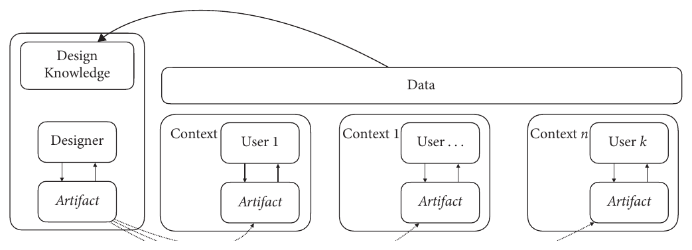{width="92%"}

## Four rationales for design in HCI
- **Improving**: design can improve usability, accessibility, and experience
- **Creating**: design can open entirely new opportunities for using computers
- **Informing**: by showing alternatives to the status quo, design informs decisions and creates the need for change
- **Producing knowledge**: design does not just apply HCI knowledge, it evolves it

::: {.notes}
Colloquially, interaction design is about *knowing what to design*, while engineering (Part VII) is more about *knowing how to design*. The next part flips to design engineering.
:::

## User-centered design
- *Human-centeredness*: the primary aim of design is to improve human conduct
- *User-centeredness*: "The needs of the users should dominate the design of the interface"
- Distilled into a handful of principles

## Principles of user-centered design
- **User focus**: serve users' goals, tasks, and needs; avoid jargon
- **User involvement**: engage representative users throughout
- **Iterative and incremental development**: you cannot know the specifics up front
- **Prototyping**: evaluate ideas before converging
- **Evaluation in context**: test with real users in real settings
- **Holistic design**: everything from ads to manuals affects use
- **Process customization**: avoid rigidity; keep reflecting

## Generating creative ideas
- Design is hard because *creative ideas* are hard---novelty alone is not enough, an idea must also meet objectives
- The design space is enormous: choosing which of $n$ functions to include gives $2^n-1$ options
- For just 50 functions, that is over $1.1\times10^{15}$ possibilities---before you even organize them into a menu ($50! \approx 10^{64}$ arrangements)
- Design tasks are also often *poorly defined*: "design a better version" invites the questions *better for whom* and *in what sense*

## Boden's three types of creativity
- **Combinatorial**: a novel combination within a known conceptual space (the Dvorak keyboard optimized letter placement)
- **Exploratory**: a new conceptual approach revealing previously unthinkable ideas (ubiquitous computing)
- **Transformative**: replacing a conceptual space entirely (the desktop metaphor)

## Design thinking
- A popular, *emancipatory* idea: creativity is not the gift of a "design hero"---it is something *anyone* can develop
- Offers methods for *divergent* thinking (chart the options) and *convergent* thinking (narrow to the best)
- Emphasizes two activities: *knowing what to design* and *knowing how to design it*
- Knowing *what* to design is arguably the harder and more important part

##

::: {.callout-note title="Aside: the double diamond"}
The Design Council's model has two diamonds

- First diamond---**Discover** then **Define**: understand and frame the problem
- Second diamond---**Develop** then **Deliver**: build and refine the answer
- Each diamond opens with divergence and closes with convergence
- Four principles: put people first, communicate visually, collaborate, and iterate
:::

##

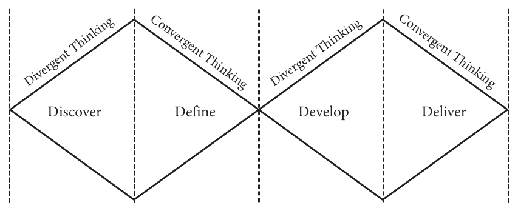{width="85%"}

## Practicing design
- Creativity rarely happens spontaneously---it follows from deliberate technique and practice
- **Design techniques**: defined ways of performing design tasks
- **Design practices**: how designers *actually* think and work, reflecting a designer's maturity

## The reflective practitioner
- @Schon1983 argued that professional designers develop distinctive ways of knowing through practice---they *reflect* on their creations
- Real design problems lack the tidy goals of engineering; design is *messy*
- Buchanan: designers *contextualize* their work through *placements*---cycles that let them make sense of what a design is *for*
- These meta-cognitive skills are the product of training, not talent or DNA

## Wicked problems
- A *wicked problem* is hopelessly constrained or underdefined
- "Innovate something for an automobile company"---how would you even begin?
- Wicked problems have no stopping rule and no clear goal
- Some even have *indeterminacy*: no definitive boundaries at all
- Reflection and contextual placement let a designer iteratively crack them

## Practices of participation
- **Participatory design**: stakeholders help *generate* ideas, not just get studied---born in 1970s Scandinavia to democratize the workplace
- The researcher's role shifts from *translator* to *facilitator*
- **Co-design**: the whole process is rethought as a *collective* effort; authorship is shared with user communities
- **Action research**: to change the world, the designer must *become part of it*---and accept public accountability

::: {.notes}
Action research is summarized into five principles: a researcher--client agreement, a cyclical process model, a central role for theory, change through action, and learning through reflection. Critical design is the related idea that design can expose hidden agendas.
:::

## What should be designed?
- The key question in human-centered design is not what *can* be designed but what *should* be
- *Value-sensitive design*: build designs rooted in principles users find important
- A startling implication: the designer must be ready to *not* design when the data suggest negative outcomes for users
- Human-centricity is empirical---it is grounded in user research from early stages to evaluation

##

::: {.callout-note title="Aside: value-sensitive design of AI"}
- Intelligent systems are often built *algorithm-first*: grab a dataset, train a model, report accuracy
- But an algorithm deciding insurance policies, tumors, or job resumes lives inside a *system*
- Zhu et al. applied value-sensitive design to Wikipedia edit-war communities in five steps: understand the people, create prototypes, elaborate methods for working with users, learn from deployment, and assess outcomes
- The lesson: situate an algorithm as part of a system, not merely in relation to data
:::

## Summary of Ch 30
- Design reaches beyond the user interface to graphics, concepts, and services
- Design is about *changing* users' practices and experiences---natural sciences seek knowledge but do not aim to change the world
- Designers' work is organized into processes involving techniques and practices
- Design is the *nexus* of human-centered design where user research, evaluation, and engineering meet

# Design cognition (Ch 31)
- Try it: spend ten minutes sketching alternative designs for a remote control. How many are genuinely *different* from the original? Did you get stuck?
- *Design cognition* studies designers' thinking when creating ideas and solving problems
- It focuses on the factors, challenges (fixation, bias), and practices that shape this ability

::: {.notes}
Crilly found that professional designers can recognize when they fixate. Kittur et al. explored finding analogies through crowdsourcing and AI. Lockton et al. built a card deck for ideating metaphors---"How could waves be a metaphor for urban change?"
:::

## Four cognitive processes in design
Good designers move between four distinct processes

- **Divergent thinking**: identify distant, novel solutions (find *more solutions*)
- **Convergent thinking**: refine iteratively toward a *better solution*
- **Reconceptualizing problems**: rethink goals and constraints to get a *better problem*
- **Reorganizing the design situation**: externalize thinking to set up *better conditions*

##

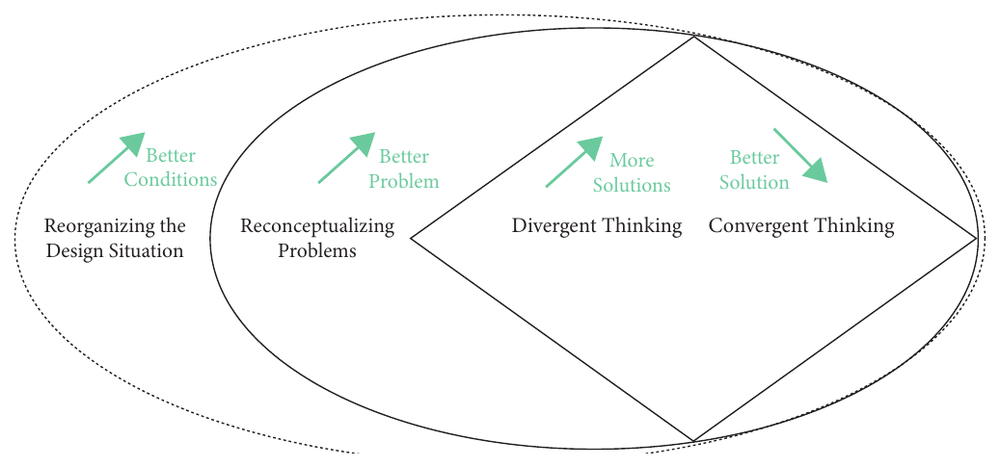{width="90%"}

## Problems and solutions, together
- Designers rarely "just solve a problem"---they *alternate* between defining problems and generating solutions
- They "crack the problem" until problem and solution *converge*---the moment of making sense
- The recurring dilemma is *exploration versus exploitation*: when to stop diverging and start drilling down
- Shift too early and you miss superior solutions; shift too late and you cannot finish

## The paradox of expertise
- *Iteration* is the most pervasive facet of design thinking
- Being an expert does *not* mean generating more ideas---experts often generate *fewer*
- But their ideas tend to be *better*, because they spend effort redefining the problem first
- They are also better at strategizing *when* to explore and when to exploit

## Cognitive heuristics and biases
- A *cognitive heuristic* is a rule of thumb for a quick solution---handy, but it hides other options
- The *availability heuristic*: ideas that come to mind easily get undue weight
- This produces *bias*: undue attention to a small slice of the design space

## A menagerie of biases
- **Anchoring**: centering the design around a known reference solution
- **Decoying**: a reference point warps how we see an alternative behind it
- **Status quo bias**: undue weight to a prevailing or popular design
- **Bandwagon bias**: following peers' solution paths
- All of them help us produce ideas quickly---and all limit creativity

## Design fixation
- *Fixation* is being mentally locked into a particular solution, unable to generate alternatives
- Stronger and more constraining than bias---an *inability to release* an idea
- Even expert designers, taught about fixation, still exhibit it in studies (though they notice it more)
- Breaking fixation: actively create *new reference points*---collect examples, seek metaphors and analogies, incubate ideas, draw from art and nature

## Generating solutions
A *well-defined design task* has four constituents

- **Design decisions**: the open decisions toward a design
- **Design space**: all designs still under consideration
- **Objectives**: properties an acceptable design must have (ease of use, cost)
- **Constraints**: hard limitations (all commands must fit in the menu)

## Why design is not just optimization
- *Optimization* is an idealized account of problem-solving---define everything precisely, then search systematically (Ch 39)
- But design is rarely like this
- The designer must overcome bias, fixation, *and* the exploration--exploitation dilemma
- Quantity drives quality: generate up to 100 low-fidelity candidates per hour, suspend criticism, then select, reflect, and refine

##

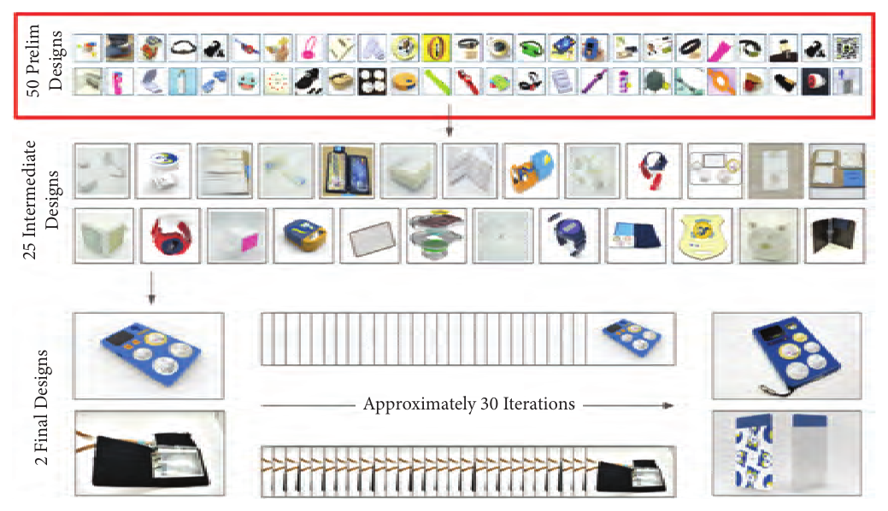{width="82%"}

## Ideation methods
- The eight most common: brainstorming, function/morphological analysis, scenarios, conceptual maps, checklists, analogies, metaphors, storyboards
- All follow *expansion* (generate) then *selection* (distill)
- Divided by three considerations
  - how far associations are sought (further = more novel, less often valuable)
  - how other people are involved (more people $\neq$ more good ideas)
  - which representations are used (visuospatial sketching vs verbal brainstorming)

##

::: {.callout-note title="Aside: how to run a brainstorm"}
@Kelley2001  make recommendations, popular in HCI

- Sharpen the focus (better too clear than too vague)
- Playful rules; number your ideas (aim for 100 per hour)
- "Build and jump" on each other's ideas
- The space remembers---use tables, walls, whiteboards
- Stretch your mental muscle; get physical
- Brainstorm-killers: letting the most senior person speak first, insisting on experience, not being playful
:::

## Sketching
- Sketching has assumed a *special* role in interaction design---quick, disposable, low-fidelity
- It is not merely drawing an idea already in your head---it is a *creative act* that produces new ideas
- It supports *both* divergent and convergent thinking
- Greenberg and Buxton warned that usability evaluation can *fixate* designers prematurely; sketching alleviates this
- Drawing a sketch forces key decisions, reducing the degrees of freedom for the rest

##

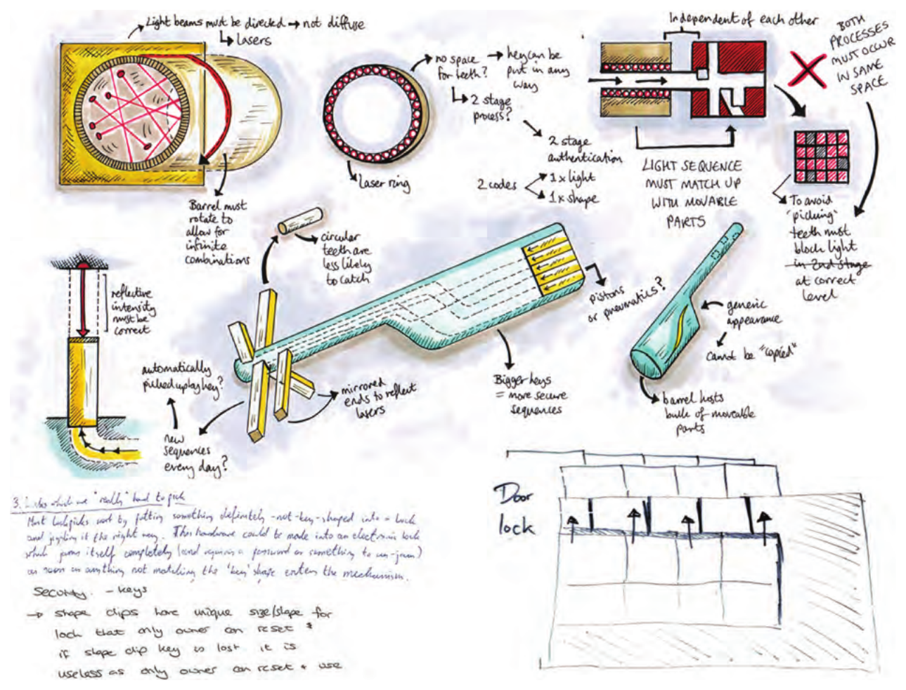{width="82%"}

## Divergent and convergent sketching
Moggridge and Buxton's alternation

1. **Divergent**: generate as many ideas as you can; suspend criticism
2. **Selection**: pick a handful, ensuring they differ
3. **Convergent**: create higher-fidelity versions
4. **Divergent** again: try still-newer sketches
5. **Selection**, then **convergent** again
6. Repeat until 2--3 designs you are happy with

- Experts sketch *more*, produce more ideas per unit time, and impose a tree-like structure on the space

## Reconceptualizing problems
- Design briefs are often *ambiguous*: "innovate a new style for a web page"---what is "new"?
- An *ill-defined problem* has no clear objectives or too many mutually dependent constraints
- A *wicked problem* is the extreme case
- Remedy: *goal refinement*---designers rarely treat the brief as a given

## Techniques for reconceptualization
- **Metaphor**: understand the unfamiliar via the familiar (the desktop maps a physical desk to a file system)
- **Analogy**: conceptual transfer (Weiser's "woodwork of everyday life" for ubicomp)
- **Conceptual blending**: combine known concepts (desktop *plus* window metaphor)
- **Reframings**: mindsets that let you see a problem anew
- **Concept maps**: graphical tools that organize a domain's knowledge

##

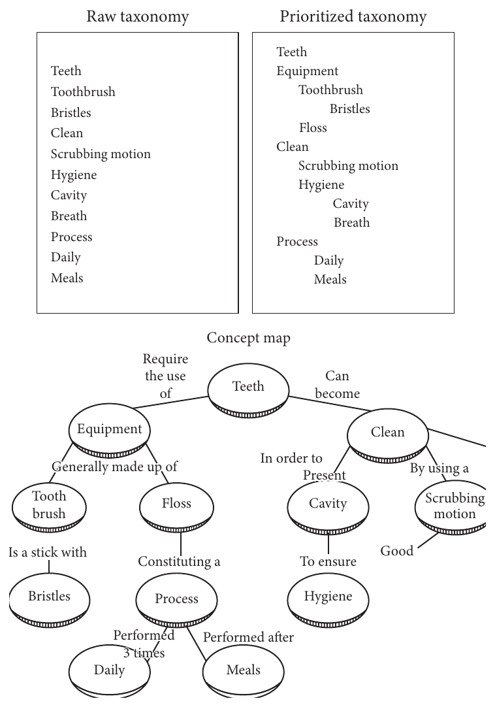{width="42%"}

##

::: {.callout-note title="Aside: reframing rowdy pub-goers"}
Dorst's *frame generation* example

1. **Problem**: pub-goers disturb the city at 2 a.m.
2. **Paradox**: more law enforcement makes it worse
3. **Themes**: young people go out to have fun and relax
4. **Frame generation**: treat it like planning a *music festival*---help, don't control
5. **Solution creation**: better transit, signage, restrooms, places to "sleep it off"
6. **Pattern retention**: rebrand and sustain the new concept
:::

## Co-evolving problems and solutions
- Designers consider problem and solution *simultaneously*
- They start with a *default solution idea*---a naive or obvious design---to gain a first foothold
- Any partial solution is assessed against this default and can be rejected
- The *co-evolution model* [@Dorst2001]: like evolution in nature, creative bursts come from moments when the default is *challenged*

##

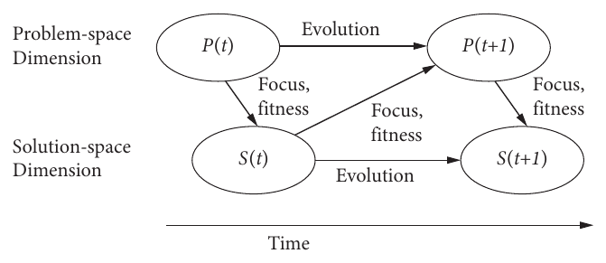{width="42%"}

##

::: {.callout-note title="Aside: a wastebasket for trains"}
- Dorst and Cross asked experienced designers to design a newspaper wastebasket for Dutch trains
- One designer, in the 26th minute, decided to do away with bins altogether---put a hole in the floor
- He realized trains already have such a system (the toilets), was "genuinely shocked" it opened onto the rails, and adopted a *new goal*
- Rather than incrementally improving, designers *changed the problem definition*
:::

##

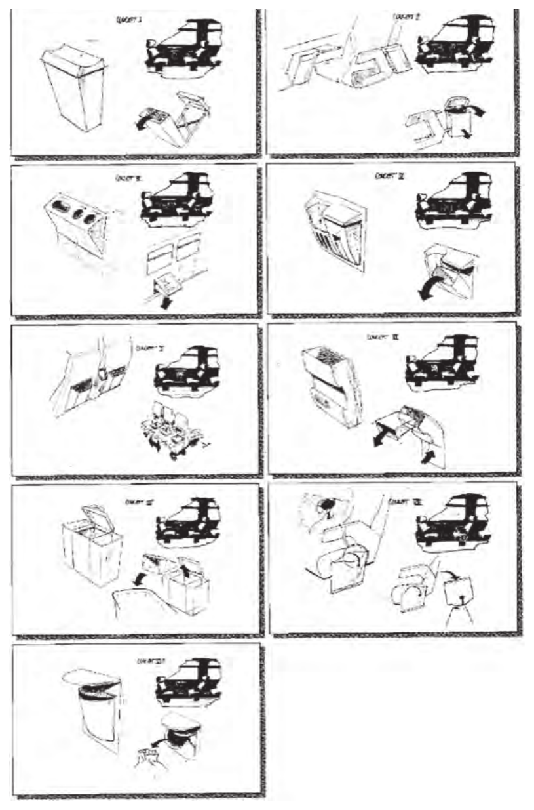{width="40%"}

## Does design happen in the mind?
- The *romantic* (hero designer) view: creativity is innate and uncontrollable
- The *non-romantic* view: creativity is a *skill* that can be fostered
- The field has moved beyond "the seat of creativity is the designer's mind"
- *Distributed cognition* (Ch 5): thinking relies on interactions with the material and social environment
- Tie a designer to a chair and demand a solution, and you will get a poor one---they need the right *conditions* for thinking

## Summary of Ch 31
- Problem-solving is central to understanding design work
- Bias and fixation limit exploration and reduce the quality of outcomes
- Problems must be well-defined; *goal refinement* gets them there
- Creativity can be facilitated through the systematic use of creative methods

# Design practice (Ch 32)
- Do professional designers actually use all these methods, or are they academic pastimes?
- *Design practice* is how design is *actually* done, versus how it is *prescribed*
- Practice includes methods, tools, styles, materials, habits, beliefs, and craft
- Design-as-practice *describes* what designers do; design-as-process *prescribes* how it should be done

::: {.notes}
Because much of a designer's knowledge is tacit, researchers studying practice must triangulate across interviews, ethnography, and contextual inquiry. Another motivation: to improve design we must understand it---dispelling naive ideas like "AI can automate design."
:::

## Why practices exist
Practices help designers manage *complexity*. Six common causes

1. Designers need to renew themselves to stay creative
2. Design has multiple objectives and constraints (form *and* function)
3. Design choices are made under uncertainty (the "fuzzy front end")
4. Design is affected by many contextual factors
5. Projects involve many stakeholders, materials, and documents
6. Design is a multidisciplinary, collaborative effort

##

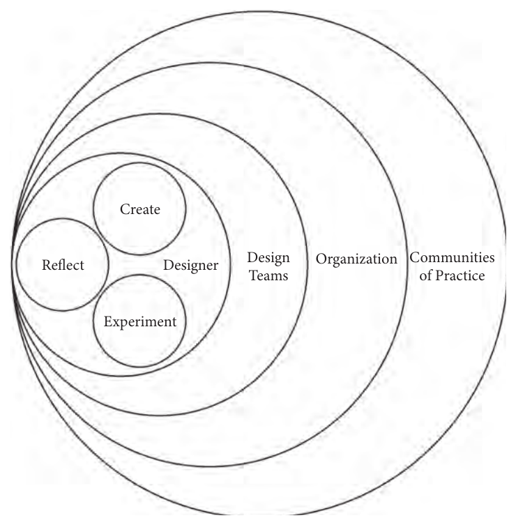{width="52%"}

##

::: {.callout-note title="Aside: being user-centered is harder than it sounds"}
Wilson and colleagues studied a UK department building a customer-query app. To ensure user involvement the team had to

- Convince not just managers but *all* stakeholders, on their own terms
- Define "representative user"---the most representative are *not* those who know the old system best
- Nominate a *champion* of user involvement
- Keep users engaged, informed, and educated
- Manage expectations: users are *not* treated as designers
:::

## Experimentation and prototyping
- Design is partly a *craft*---designers tinker with digital tools, pen and paper, and materials
- To *prototype* is to build a model that can be assessed; *proto* implies incompleteness
- Two purposes
  - studying the *feasibility* of an idea by creating it
  - *presenting* an idea concretely so others can experience and test it
- A prototype needs *no code*---early on, code may be unwise

## Fidelity levels
- **Low-fidelity**: paper prototypes or rapid-prototyping tools
- **Medium-fidelity**: adds type, color, position
- **High-fidelity**: high-effort simulacra covering key details in prime scenarios
- Higher fidelity is more expensive and harder to throw away---so test cheaply *first*
- Prototyping is not limited to software: 3D printing, conductive ink, metalworking, textiles

##

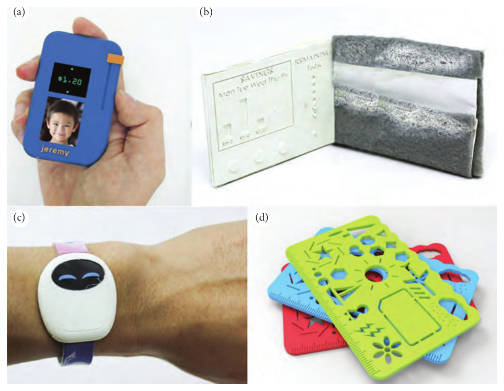{width="66%"}

##

::: {.callout-note title="Aside: designing for a dollar a day"}
- Prototypes at HCI conferences can carry price tags in the tens of thousands---mostly accessible to the advantaged
- @Kyng1988 asked how to make prototyping available to "resource-weak" communities like shipyard workers
- His toolkit: *True Stories* (narratives of how a system succeeded or failed elsewhere), *Future Workshops* (analysis, goals, actions), and *mock-up simulations* built from plywood and cardboard
- Watching co-workers use a mock-up built *empathy* across the team
:::

## Design tools
- Digital tools quickly realize a version of a sketch; they catalyze team communication, externalize insights, and let designers reuse past ideas
- An essential aspect is *thinking through making*
- But tools have drawbacks---they can *constrain* creativity by offering only certain functionality
- Stolterman and Pierce: designers prefer tools that are *not overly prescriptive*
- Example: grid snapping helps layout but *locks* you into grid-adhering designs

## Reflection and critique
- *Reflective practice* is developing and transforming one's ways of thinking
- Two dimensions of reflection
  - *in-action* versus *out-action* (reflecting while designing versus stepping away)
  - *remembering* versus *gathering* (the past versus new materials)
- Napping, jogging, and dinner-table conversations all count---distancing helps incubate ideas
- *Design samples* (from Behance, Dribbble, Pinterest) support reminiscence and inspiration

## Interpretative activities
- *Sensemaking*: finding connections among disconnected facets of a problem
- *Abductive thinking*: generating explanations from observations---imagining what *might* be, not deducing what *is*
- *Design rationale*: an explicit statement of why a decision was made (rarely adopted---too much extra work)
- *Design judgment* [Wolf et al.]: appearance, compositional, framing, service, deliberated off-hand, and navigation judgments

## Design critique
- *Crits* are sessions where designers meet to review designs
- A wireframe is presented, choices explained, and discussed with peers or stakeholder representatives
- Crits grow competence and forge a *design identity*---"this is how we design"

## Design fiction
- A *thought experiment* is done in imagery, on paper, or in simulation---but not in real life
- *Design fiction* is a *speculative* thought experiment: it depicts a possible future with a hypothetical artifact
- Unlike science fiction, it confines ideas to *plausible* futures
- The most famous is Weiser's 1991 narrative of "Sal," giving concrete form to ubiquitous computing
- Fiction offers a temporally consistent, holistic story---and can leave things *ambiguous* to invite further thought

## Participatory practices
- *Participatory design*: the direct involvement of people in the co-design of the tools that shape their lives
- **Workshops**: users and designers co-create a vision of a desirable future
- *Future workshops* have three phases: **critique** (of the current situation), **fantasy** (turn issues into positives), and **implementation** (plan how to realize it)

## Co-designing and acting
- **Co-designing visions**: representations must be *concrete*---users struggle with abstract descriptions, so low-fidelity prototyping shines
- Participation should be *full and equal* to that of designers
- **Playing and acting**: play breaks fixation; acting lets users and designers experience a scenario *first-person*
- Iacucci's techniques had players enact future scenarios with a toy character on a map, or use a mock-up device in everyday life

##

::: {.callout-note title="Aside: co-design with children in a pandemic"}
- Lee et al. ran 10 online co-design sessions with children aged 7--11 during COVID-19
- Comic boards prompted the children to fill in ideas frame by frame
- The researcher became an *improviser*---adapting to moving cars and low bandwidth
- The children were rarely alone: one child's mother corrected him mid-session ("you should be drawing right now")---interdependencies shaped the whole process
:::

##

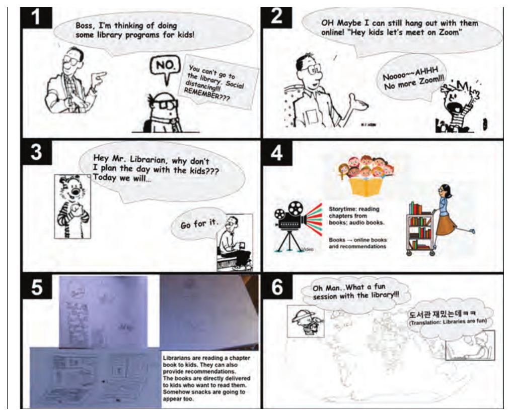{width="70%"}

## Collaboration
- Design is almost always teamwork---an IT team of 10--20, of which 2--3 focus on user-centered design
- *Multidisciplinarity* is central; the line between "pure" and "applied" work has blurred
- Members must *empathize* with different viewpoints, build a shared *language*, and take on *roles* flexibly
- Danger: pressure to deliver drives designers to *forgo healthy criticism*---evaluators confirm what they already know rather than challenge it

## Communities of practice
- Groups who share an interest and interact regularly to get better at it
- **Design forums**: online discussion boards
- **Design systems**: coherent, organizationally-developed systems with values, rules, samples, and reusable software
- **Design patterns**: prescribe a structure for successful solutions (context, problem, solution)---e.g. Borchers's "Flat and Narrow Tree" for kiosks: no more than 5 levels deep, no more than 7 branches per node
- **Design portfolios** and *annotated portfolios*: collections that communicate a designer's thinking

##

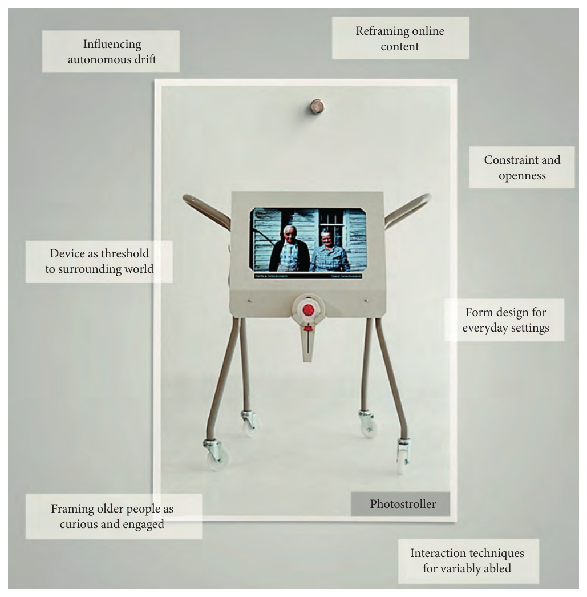{width="48%"}

## Growing as a designer
- Nobody is an expert designer straight out of school
- Beyond "learn by doing," the key is to develop a *practice* that fits your unique contexts and resources
- Being articulate and reflective about your practice---and scrutinizing it with others---is how it evolves
- Questions to ask: what is "sacred" to you? which methods and tools fit you? what do you bring to a team? whose work do you learn from?

## Summary of Ch 32
- The study of design practice looks at what designers *actually* do, not what they are supposed to do
- Designers not only solve problems but *make sense* of materials and reflect on their practices
- They experiment through sketches and prototypes at different fidelity levels
- Design fiction helps them take distance from the present to develop possible futures

# Design processes (Ch 33)
- A *design process* defines a structure and practices for carrying out design projects in an organization
- It lays out activities, methods, and conditions for progressing from one to the next
- Purpose: ensure a certain level of *quality* in execution and outcomes---while regulating, directing, educating, and building a shared identity

## The waterfall and its discontents
- The classical model is the *waterfall*: complete one stage, meet a set of requirements ("a door"), then advance
- It flows from user research to requirements to design, evaluation, and release
- Criticized as parochial and even damaging
  - it copes poorly with mid-project discoveries
  - it has high *sunk costs*---early decisions are hard to change
  - evaluation comes *too late* to inform design

## What HCI process models share
- A core insight: a design process need not be *antithetical* to creativity---creativity can be managed like development
- Three shared aspects
  - **User focus**: goals defined in terms of the user, not just economics
  - **Iteration**: perfect solutions in one shot are impossible
  - **Evaluation with users**: goodness is shown by reference to empirical evaluation
- Four core phases: user research → design goals (requirements) → design ideas → evaluation

## Normative versus suggestive processes
- **Normative**: an agreed-on procedure that *must* be followed (ISO 9241)---compliance signals reliability
- **Suggestive**: an idealized procedure, with execution left case-by-case (agile, at the extreme)
- Most processes fall in between
- All process models are *idealizations*---real projects go back and forth and skip stages, because design is hard. Even mathematicians reach proofs iteratively, not in one giant step

## Usability engineering
- The *usability engineering lifecycle*---Nielsen, early 1990s---is perhaps the most successful user-centric process model in software
- It arose because heuristics and guidelines were *insufficient*: often based on intuition, no help with trade-offs
- Conceived as a *lifecycle* model: track how skills from earlier versions shape future ones

## The ten phases (1 of 2)
1. **Know thy user**: chart characteristics, tasks, and needs
2. **Competitive analysis**: study existing products for guidelines and thresholds
3. **Setting usability goals**: concrete, measurable goals---*this is what distinguishes usability engineering*
4. **Design stage**: produce a testable, deployable implementation
5. **Coordinated design**: ensure consistency across products and versions

## The ten phases (2 of 2)
6. **Guidelines and heuristics**: general, category-specific, and product-specific
7. **Prototyping**: primitive prototypes first, even paper mock-ups
8. **Empirical user testing**: test against the usability goals
9. **Iterative design**: refine, and document *why* via design rationale
10. **Collecting feedback from the field**: usability engineering does not end at release

## Criticisms of usability engineering
- Two serious criticisms
  - it offers *limited support for design as a creative activity*---little help on *how* to produce ideas
  - it can be viewed as *glorified trial and error*, embracing no theoretical knowledge
- Its *theoryless* stance was motivated by the limited theories of the early 1990s
- But it risks creating a form of user-centered design *detached* from HCI research

## A standard for human-centered design
- The ISO 9241-220:2019 standard defines a process model for human-centered design
- Usability, accessibility, user experience, and *avoiding harm* are stated goals
- Key message: usability is an *outcome of interaction*, not a property you insert into a product
- Almost 100 pages of definitions, checklists, and guidance---and it requires the *whole organization*, including management, to commit
- Divided into four HCPs: enterprise-level focus, human-centered design across projects, execution within a project, and introducing/operating/ending a system

::: {.notes}
Example requirements for airport immigration are impressively concrete: "The average time to pass through immigration shall be no more than half the current average" or "80% of potential users shall prefer the ticket machine to the counter."
:::

## A standard for ethical system design
- The IEEE Standard 7000 addresses ethical concerns and minimizes potential harm, building on *value-sensitive design*
- It does not *guarantee* ethicality---it ensures concerns are *systematically considered*
- Four main steps
  - Concept of operations and context exploration
  - Value elicitation and prioritization
  - Ethical requirements definition (EVRs)
  - Ethical risk-based design
- ...followed by *transparency management* throughout

##

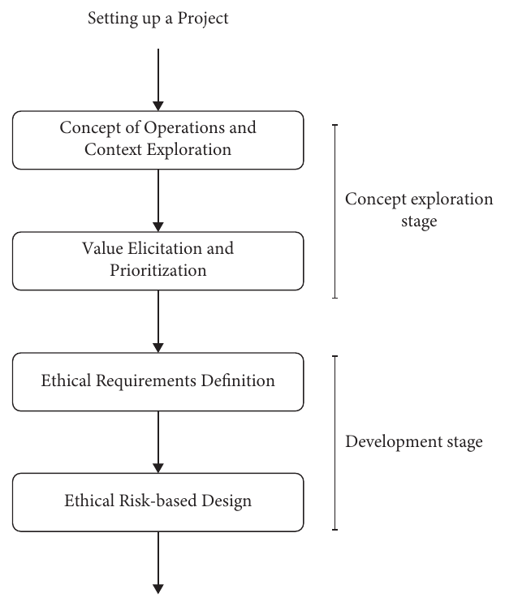{width="40%"}

##

::: {.callout-note title="Aside: the ethics of a body scanner"}
- IEEE 7000 was applied to an airport full-body scanner
- People complained a previous X-ray technology exposed high-quality images of naked bodies to officers
- The core value for passengers: *privacy*---avoid exposing figures and genitals
- But the highest-ranked ethical value requirement was *air safety*: no dangerous articles onboard
- Efficiency ranked below both; the privacy EVR was framed both negatively (what must not be shown) and positively (what can be)
:::

## Agile development
- *Agile* arose as a response to waterfall's shortcomings, treating design as an *empirical* activity---learning from trials
- Emphasis on *design sprints* over requirements: the faster a bad idea is rejected, the better
- Tens or hundreds of sprints per project; a sprint may last a week or a single day
- **Scrum** attends to constraints, time pressures, and *learning from prior sprints* to define the next ones
- HCI methods that fit a sprint: low-fidelity prototyping, concept designs, rapid observation, heuristic evaluation

## Human factors engineering
- Sometimes called *cognitive engineering*---the design of safe, reliable systems, with heavy emphasis on *safety*
- Medical device design is the canonical example (tens of thousands of US deaths yearly from medical errors)
- FDA-recommended five-stage process
  - **Ideation** (use cases, personas)
  - **Requirements** (field studies, task analysis)
  - **Design** (sketching plus theories of cognitive load and attention)
  - **Testing** (usability tests, heuristic analyses, cognitive walkthroughs)
  - **Maintenance** (reacting to accident reports)

## Design affects psychological variables
- The defining aspect of human factors engineering: design affects *psychological variables*
- By affecting workload, trust, or perception, design can *selectively reduce* the possibility of error
- Variables may be physiological (fatigue, stress), cognitive (perception, attention, mental demand), or about human reliability (reasoning errors, motor slips)
- Heavy use of analytical methods: task analysis and performance modeling (Ch 41)
- Outside safety-critical domains these methods are often *too costly*---motivating "theory-free" methods like usability engineering

## Faking the process
- Design processes commit to the *rational designer*: always a good reason for a decision
- But we know designers struggle with fixation, bias, and ill-defined problems---so why "fake" a process that can never be attained?
- @Parnas1986 made the case for sticking to processes anyway
  - they *guide* when you face a hard challenge
  - they *harmonize* practices across teams
  - they let you *measure progress*
- "It is very hard to be a rational designer; even faking that process is quite difficult. However, the result is a product that can be understood, maintained, and reused"

## Summary of Ch 33
- Design processes define the order and manner in which methods are applied---normative accounts of how design *should* be done
- Most process models are iterative with four stages: user research, requirements, design generation, and evaluation
- Agile emphasizes fast iteration; usability engineering ensures high usability but has been criticized as glorified trial and error
- Even though processes are idealizations, following one offers many advantages over ad hoc practice



