# [Week NINE]{.r-fit-text}

Part VII (a) of @Hornbaek2025

# Intro
Design (Part VI) asked *what* to build. Engineering asks *how* to actually build it---so that the thing works, is safe, can be manufactured, and holds up after launch. A plan or a prototype is not enough; the system must run in the real world.

## Why engineering matters
- Building interactive systems is hard: many technical functions must be realized while satisfying a broad set of human requirements
- Engineering methods tackle this *systematically*, so a system can be used efficiently and safely, made at low cost and high quality, supported after release---and eventually disposed of
- An engineer is also a designer: engineers explore, evaluate, and choose among options
- This book does not draw a hard line between design and engineering---it simply shifts focus to what it takes to *build* a working system

::: {.notes}
Colloquially, interaction design is about knowing *what* to design, while engineering is about knowing *how*. Part VII flips the design part on its head. Two representative research examples: Gesture Spotter, a rapid-prototyping tool that reliably spots key gestures in a stream of hand movements for AR glasses; and Campos et al.'s study of three formal-methods tools, asking how each fits into a user-centered design process (they turned out to be largely complementary).
:::

## Part VII at a glance
This part covers six chapters, split across two slideshows

- Introduction to engineering (Ch 34): what engineering *brings* to HCI
- Systems (Ch 35): reasoning about and *mapping* systems
- Design engineering (Ch 36): a process for *realizing* a system
- ...then Safety and risk (Ch 37), Software (Ch 38), and Computational methods (Ch 39) in the next deck

This slideshow covers chapters 34--36.

# Introduction to engineering (Ch 34)
- In HCI, *engineering* is the application of engineering principles and methods to build interactive systems
- We need it because a system cannot be "just built"---its construction must be designed
- The system must actually *work*: be effective, efficient, safe, and fulfill users' needs and wants
- To realize this we design the technology itself---identify a functional structure, turn functions into "function carriers," and check the requirements are correct and met

## Engineering is interwoven with design
- Problem-solving and exploring options are as central to engineering as to design
- The shift is one of *emphasis*: engineering focuses on the properties a built system must have
- The design of interactive systems is fundamentally a *systems* problem---understanding the system you are building and its relation to other systems
- Systems are pervasive: your laptop relies on a display, a processor, memory, and the electrical grid; you live inside ecosystems, economies, and organizations

## Building the right thing
- The first job is *task clarification*: understanding what to do and how to do it
- A critical mistake is solving the wrong problem---or building a "solution in search of a problem"
- Arriving at a *valid problem statement* demands deep knowledge of the problem context, users' needs, and the system the design will be embedded within

## The engineer's disease
- *Design fixation*: settling immediately on the first obvious solution (Ch 31)
- It artificially constrains the design space and yields less creative, less optimal solutions
- The cost is real---failing to be creative about how to *test* a product may hide a flaw that later forces an expensive recall
- Two engineering remedies: solution-neutral problem statements, and designing at the functional level first

## Solution-neutral problem statements
- A *solution-neutral problem statement* describes the problem at a suitable level of abstraction, with no reference to solutions
- "Build a physical QWERTY thumb keyboard for a mobile device"...
- ...becomes "Devise a method that allows a user to enter text on a mobile device"...
- ...or, more abstract still, "Devise a method that allows a user to transmit information in a mobile setting"
- Raising the abstraction level *widens* the search space

## Functions and function carriers
- Design first at the *functional level*, considering only relationships between functions
- A keyboard's function `Enter Text` decomposes into `Type Key`, `Provide Word Prediction`, and so on
- None of these names a solution
- `Type Key` can be realized with hard keys, chiclet keys, membrane keys, or touchscreen keys---these are *function carriers*
- Systematically combining carriers is *concept generation and evaluation*

## Building the thing right
- Having understood *what* to build, we must build it *correctly*---which means understanding the *requirements*
- *Requirements engineering*: eliciting and managing user, business, and technical requirements throughout the process
- A product that meets its requirements specification will pass *verification*---so requirements and verification are tightly interwoven
- Requirements carry risk: undetected bias (e.g., a survey only daytime-free people answer) can distort them

## Change management
- Requirements *change*---and the later a change arrives, the more expensive and difficult it is to make
- Managing these changes is *change management*, a key part of project management
- Once requirements are set, software engineering principles guide implementation
- Software architecture manages complexity through *abstraction*---hiding low-level detail so designers can focus on the essential

## Verification and validation
- *Verification*: systematically checking the system meets every requirement in its specification---"did we build the thing right?"
- *Validation*: ensuring the deployed system actually fulfills its purpose for users---"did we build the right thing?"
- Only *testable* requirements can be verified, so verification needs a clear procedure, environment, and success criteria
- Passing verification is *not* enough: the requirements themselves may be wrong, incomplete, or overtaken by events

## Systems thinking
- User interfaces are systems embedded within, and related to, *other* systems---and made of subsystems that must cohere
- Users and stakeholders are often part of the wider system too
- A pen injector interacts with a dosage app, embedded in a healthcare system with a nurse and a patient
- Engineering offers *system mapping* methods to chart how systems are composed and how information flows

::: {.callout-note title="Aside: getting the problem right"}
Bucciarelli studied practicing engineers on three projects---an airport X-ray inspection system, a photoprint machine, and a residential solar system---observing them in meetings and at their desks. The conclusion: engineering design is a *social* process involving marketing people, researchers, accountants, and customers. A critical part of every project was simply agreeing on *what was to be done*.
:::

## Understanding risk, keeping people safe
- We increasingly rely on interactive systems for critical tasks where failure is serious
- A *hazard* is undesired system behavior; its *exposure* is how far it can reach undesirable consequences; its *impact* is how serious those consequences are
- *Risk* combines exposure, likelihood, and impact
- A hazard can be deadly yet low-risk if exposure is very low
- Engineering provides methods to assess, mitigate, monitor, and manage risk

##

::: {.callout-note title="Aside: designing safer warnings"}
Egelman et al. simulated a phishing attack---97% of participants fell for at least one. *Active* warnings (which must be read and acknowledged) beat *passive* ones (a dismissible recommendation). Building on Wogalter's warning model, they proposed seven questions: do users notice the indicator, know what it means, know what to do, believe it, feel motivated, actually act, and cope with competing stimuli? The seven questions work as a walkthrough for designing better warnings.
:::

## Managing the process
- Interactive systems are complex by nature---user behavior can rarely be modeled precisely
- Complexity keeps growing as more functions are added, and as systems embed within manufacturing, healthcare, government, and smart-home systems
- Design engineering approaches help teams move systematically from conceptual to embodied to detailed design and deployment
- ...while managing requirements, risks, safety, and usability

## Systematic approaches to HCI problems
- Engineering lets us treat some HCI problems *computationally*: solve an equation, search for a solution, or simulate behavior
- *Optimization*: menu structures, key layouts, and haptic parameters can be tuned for the best user performance under stated assumptions
- Systems can *infer* or *predict* users' intentions using pattern recognition and machine learning
- This brings its own challenges---performance, noise, changing contexts, representative training data, and interpretability

## Summary of Ch 34
- Engineering uses systematic principles and methods to build systems
- Systems thinking is paramount---every interactive system relies on and is embedded within others
- We must build the right thing *and* build the thing right; design engineering turns a solution-neutral problem statement into a deployed, verifiable, validatable system
- Safety and risk are central: no system is risk-free, so risk must be assessed and managed

# Systems (Ch 35)
- Pull a door handle and you engage a system: fittings, screws, plate, and handle, all interacting with the door, the hinges, the load-bearing frame
- Your motor system plans the movement; your visual and auditory systems monitor the result
- The screws come from a design, manufacturing, and logistics system; the door is subject to building regulations
- Run this breakdown on almost *any* everyday interaction and the same lesson appears: systems are everywhere, and we depend on them

## Four insights about systems
- **Complex**: systems have many dependencies---full understanding is hard (we still don't fully grasp the human brain)
- **Multiple levels**: from a nanoscale motor protein to a star cluster; a computer spans transistors up to toolkits
- **Coupled**: they rely on one another---moving a mouse moves a pointer, mediated by software; tighter coupling makes change harder
- **Emergent**: the whole produces properties the parts cannot provide alone

## What is an interactive system?
An interactive system can

1. receive and respond to *input events* via sensors
2. perform *computations*
3. maintain and update its *state*
4. *display* its output

- It couples a user with a computer, embedded in a wider context, and relies on sensor, display, and computation subsystems

::: {.notes}
Three examples of the wider systems HCI must consider: O'Hara et al. let surgeons interact with image data by gesture in sterile settings, which required attending to the sociotechnical realities of surgery; Su and Liu moved a hospital off paper nursing forms by first understanding existing processes and information flows; Pu et al. sensed whole-home gestures from Wi-Fi Doppler shifts, benefiting the wider system (the house) by using an existing subsystem (its network).
:::

##

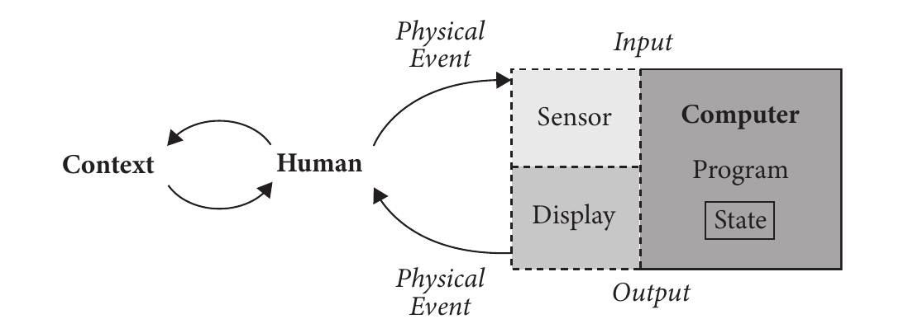{width="82%"}

## Systems thinking
- *Systems thinking* is a holistic approach for reasoning about systems---not how to *build* one, but how to consider its important aspects
- It arose in engineering as system design became a cross-disciplinary team activity spanning the whole *lifecycle*: design, integration, management, maintenance, and disposal
- A *system* is a set of parts whose combination provides *emergent* qualities absent from the parts
- Synthetic systems exist to provide *capability*---users rarely care about a system for its own sake

## Three levels of system complexity
- **Level 1**: a subsystem within one discipline and organization---a logic board, an app, a wearable monitor
- **Level 2**: two or more disciplines or organizations---a car's core functionality, a phone plus its OS, national medical-records software
- **Level 3**: many disciplines, shaped by social, economic, political, or environmental forces---power grids, air-traffic control, military command and control
- An HCI system sits at one level but usually *operates within* another (an e-voting interface is both a device and a political instrument)

## Six principles of systems thinking
- **Debate and pursue the purpose**: balance cost, performance, timescale---and *risk*; requirements evolve with the design
- **Think holistic**: systems have boundaries and sit inside other systems; consider the whole lifespan
- **Follow a systematic procedure**: identify and manage uncertainty; iterate; work with stakeholders
- **Be creative**: use both conventional and innovative thinking with stakeholders
- **Take account of people**: they build, install, use, and support systems---motivation, ethics, and trust matter
- **Manage the project and relationships**: complex systems mean complex, multi-stakeholder projects

## When systems thinking fails
- Its weakness: it prescribes an *approach* but no concrete methods or procedures
- Yet a *lack* of systems thinking is repeatedly linked to failure. An analysis of 12 failures found four recurring gaps
  - failing to consider the *environment* the system operated in
  - failing to weigh *non-technical* factors---organizational, political, economic, environmental
  - failing to address planned and unplanned *interactions* between components and environment
  - failing to see the product as part of a wider *user-experience* system it needs to thrive

##

::: {.callout-note title="Aside: heating homes by prediction"}
PreHeat senses and predicts room usage to heat homes more efficiently. It weaves together motion sensors, temperature units, and control units, interfacing with the existing boiler. A prediction algorithm estimates when each room should warm up. Deployed to five homes, it heated them more efficiently than users setting their own thermostat schedules---a small system whose value comes from fitting into a larger one.
:::

## System mapping
- To understand a system, we must *describe* it---that is what *system mapping* does
- The first step is setting the *system boundary*, which fixes the scope (crucial for risk assessment---Ch 37)
- Any technique that captures a system's structure and behavior can serve
- The book reviews six common mapping techniques

## The mapping toolbox
- **Task diagram**: a hierarchy of tasks and the conditions for carrying them out
- **Information diagram**: a hierarchy of documents and how they relate
- **Organizational diagram**: people and their roles---good for spotting stakeholders you missed
- **System diagram**: how data are stored, transformed, and sequenced through activities and states
- **Process diagram**: serial and parallel steps---the flow chart and swim-lane diagram are examples
- **Communication diagram**: the flow of information between people or entities

##

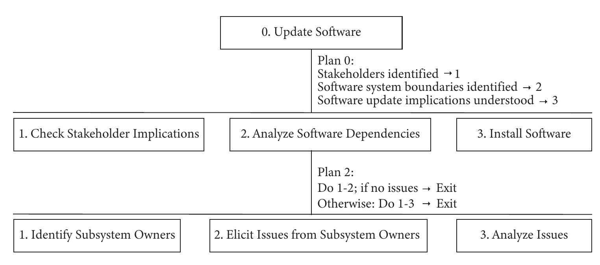{width="80%"}

##

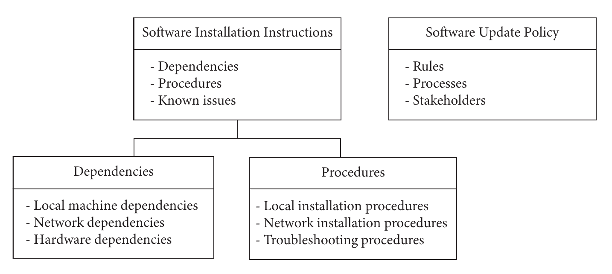{width="66%"}

##

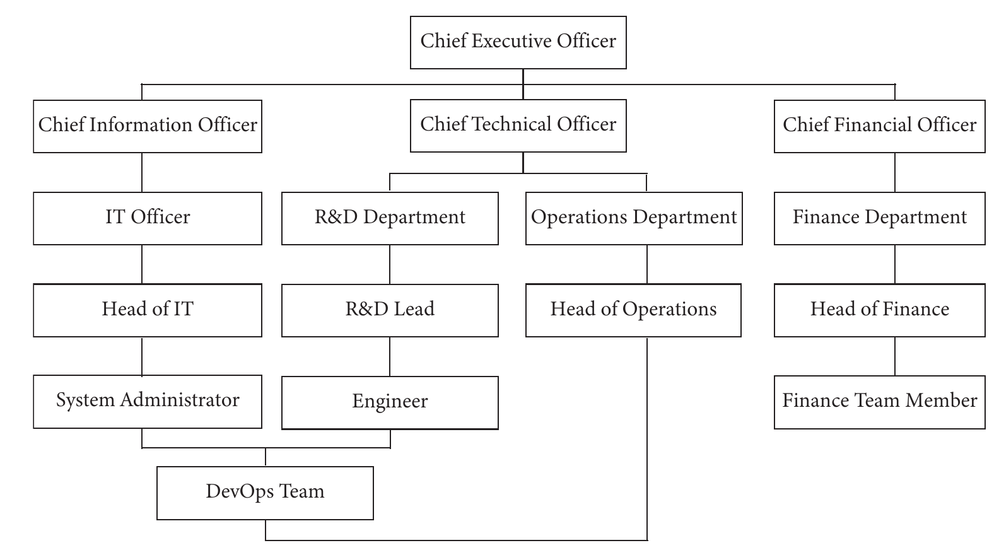{width="80%"}

##

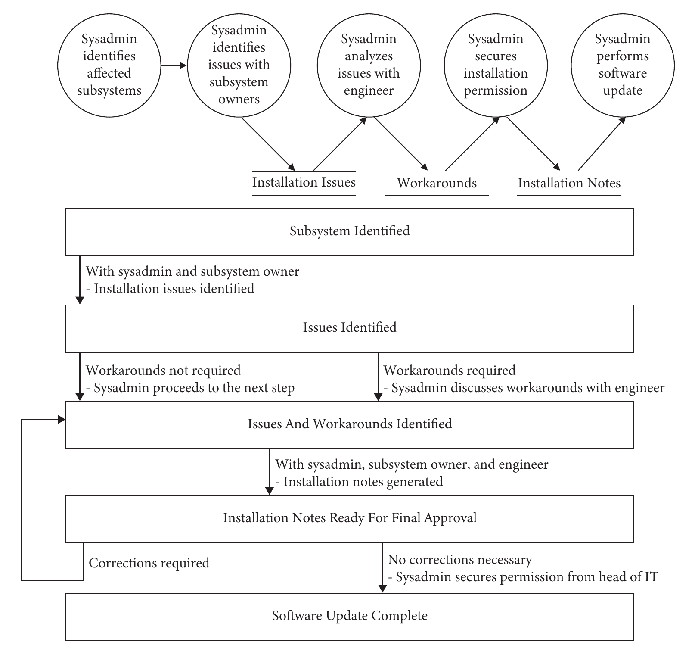{width="58%"}

##

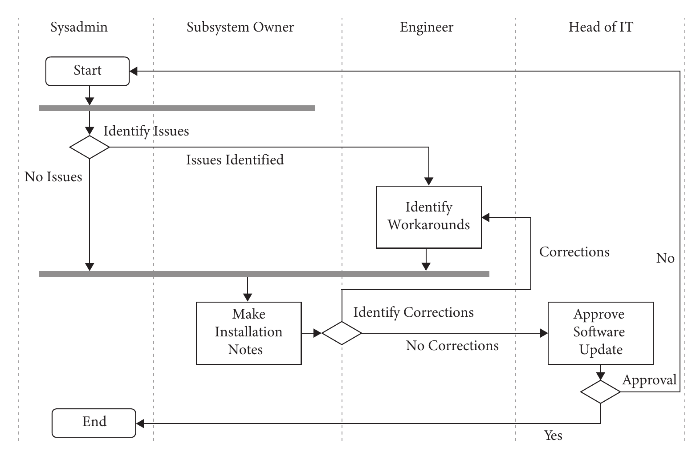{width="82%"}

##

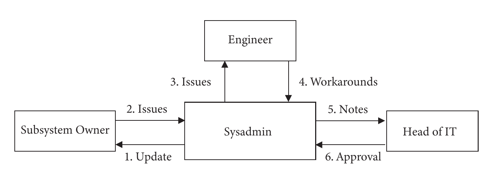{width="78%"}

## Principles for legal and ethical systems
- Systems thinking pushes us to look *beyond technology*: deployed systems must be lawful and must not cause harm
- *Legal* issues concern broken laws (medical devices and electronics are regulated); *ethical* issues concern outcomes that violate norms
- Bodies such as the ACM encode norms as codes of ethics
- AI systems are the current frontier, because they touch ever more everyday decisions

## Eight themes for governing AI (1 of 2)
Fjeld et al. distilled AI principles into eight themes

- **Privacy**: consent, control, correction, and removal of one's data
- **Accountability**: verifiable results, impact assessments, audits, appeal and remedy
- **Safety and security**: expected behavior, resilience, *security-by-design*
- **Transparency and explainability**: intelligible, oversee-able operation

## Eight themes for governing AI (2 of 2)
- **Fairness and non-discrimination**: guard against algorithmic bias; equity and inclusion
- **Human control**: review, opt out, and intervene
- **Professional responsibility**: accuracy, care, consultation, integrity
- **Promotion of human values**: access, well-being, and a sustainable society

## Is systems thinking actionable?
- The principles are high-level---"think holistic," "follow a systematic procedure"---but *which* procedure? How do I know I have set the correct boundary?
- Overemphasis invites *analysis paralysis*: decision-making stalls for fear of error or of missing a better option
- It can breed hopelessness before genuinely complex systems, or endless pursuit of a "perfect" requirements specification that never arrives
- Practice must balance rigor against time and cost---which is why formal methods see little uptake outside safety-critical interfaces

## Summary of Ch 35
- Systems are pervasive; interactive systems are typically embedded within others they interact with
- Systems thinking is an approach for reasoning about systems---how they embed, evolve over time, and how subsystems contribute to the whole
- System mapping describes systems in terms of processes, people, and information flows
- Principles help ensure HCI systems are ethical *and* legal

# Design engineering (Ch 36)
- *Design engineering* (or engineering design) is a systematic approach to creating products, systems, and services
- Where design (Part VI) generated ideas and prototypes, this chapter *transforms a problem statement into a working system*
- The aim: arrive at a system that fulfills a set of requirements and can be readily realized
- Three HCI examples: the *data glove* (senses hand and finger pose with tactile feedback), *KinectFusion* (real-time 3D reconstruction from a moving depth camera), and *Dexmo* (a force-feedback exoskeleton glove)

## Challenges it addresses
This chapter focuses on task clarification, conceptual design, and verification---and the challenges they meet

- **Design fixation**: committing to one idea too early (Ch 31)
- **Trade-offs**: no design is optimal in every aspect---security often fights usability---and implicit trade-offs surface too late
- **Communication**: distributed teams need documented, scrutinizable decisions
- **Integration**: software, electronics, mechanics, AI, and humans-in-the-loop must cohere
- **Risk**: assessment needs a clear system boundary (covered in Ch 37)

::: {.notes}
Paper example: VuMan, an early-1990s wearable computer for navigation, built across three versions in a multidisciplinary project. The central challenge was integrated system engineering---building for real-world temperatures, dirt, water, and shocks. Over many iterations the design became lighter, smaller, more robust, more energy-efficient, faster to use, and cheaper to make.
:::

## The design process
Six intertwined activities

1. Identify the *purpose* of the HCI system
2. Create a *requirements specification*
3. Arrive at a *conceptual design*
4. Translate it into an *embodiment design*
5. Implement the *detailed design*---ready to manufacture or deploy
6. *Verify* the system meets requirements and *validate* it is usable for its purpose

- It looks linear; in practice it rarely is. Risk management runs alongside throughout.

## Identifying the purpose
- Agreeing on a system's *overall purpose* is surprisingly hard across a team and its stakeholders
- Writing a technical description of the purpose gives everyone a common objective
- The tool: a *solution-neutral problem statement*, which avoids solution-dependent framing and premature constraints
- Two steps to raise abstraction
  - remove requirements and constraints irrelevant to the problem
  - turn *quantitative* statements into *qualitative* ones

## Abstraction is a continuum
From an over-specified brief...

- "Design an updated form-filling warehouse inventory interface based on last year's mobile app, five forms on five pages, each with Submit and Cancel"
- ↓ Design a form-filling inventory interface for a mobile device
- ↓ Devise a means for inputting structured information for warehouse inventory management
- ↓ Devise a means for managing warehouse inventory
- ↓ Devise a means for managing information

- Go too abstract and the statement offers no guidance---judgment sets the right level

::: {.notes}
Running example used throughout the chapter: a wearable device that couples affection across distance---two connected rings that glow when one user rubs or turns theirs. Overall function: "Couple Affection." Solution-neutral statement: "Design a wearable device that couples affection between two individuals that may be present in separate locations."
:::

## Specifying requirements
- A *requirements specification* states the system's characteristics---ideally perfect at first, but realistically a *live document*
- It must be *correct*, and correctness gets harder as complexity grows
- Four categories
  - **Technical**: functional and performance characteristics (latency, accuracy)
  - **Business**: cost, scheduling, management
  - **Regulatory**: laws, standards, product regulations
  - **User-elicited**: users' needs and wants

## A useful requirement is...
- **Solution-independent**: says *what*, not *how*
- **Clear**: unambiguous to everyone who needs it
- **Concise**: succinctly worded
- **Testable**: verifiable later, often via target values, tolerances, or acceptance criteria
- **Traceable**: linked back to its source, so you know *why* it exists

- The specification as a whole should be *complete*---covering support, reuse, and disposal---which is why it is often written alongside the function structure

## Conceptual design
- Two tasks: elaborate the *functions* the system must carry, then decide how to carry them
- *Functional modeling* lets the team reason about functionality without prematurely committing to solutions
- Think of it as separating the *what* (functional description) from the *how* (detailed description)
- A common mistake: jumping to the *how* before understanding the *what*
- Two modeling tools: **function structures** and **FAST diagrams**

##

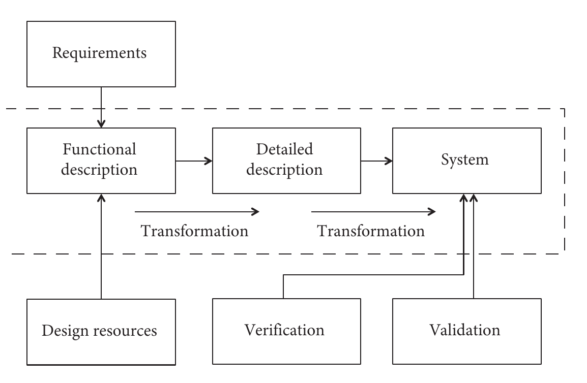{width="72%"}

## Function structures
- Describe each function as an active verb plus a noun---"push button," "select shape"
- Start from the *overall function*, modeling its interaction with the environment as flows of *energy, materials, and signals*
- A rounded rectangle marks the *technical boundary*; anything outside is unmodeled except its in-flows and out-flows
- Sometimes the *user* sits inside the boundary, performing functions the whole depends on
- Structures *nest*: `Couple Affection` breaks into supplying energy, sensing, modulating, sending, receiving, and displaying affection

##

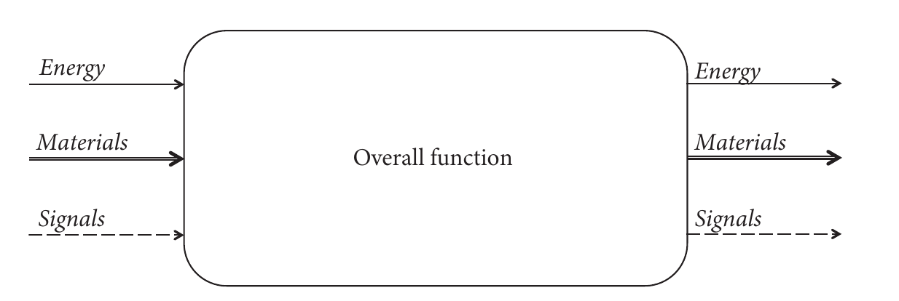{width="72%"}

##

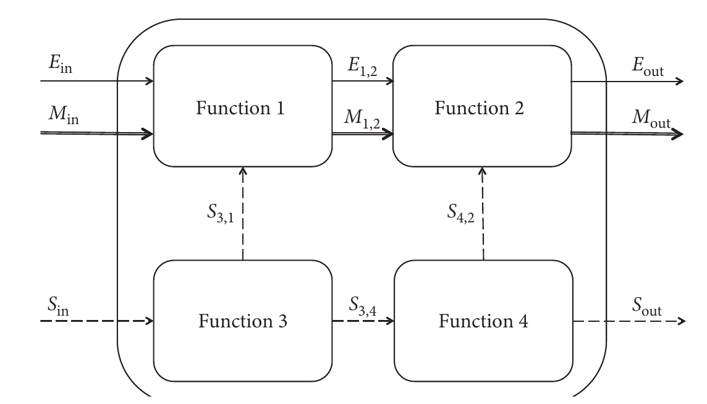{width="60%"}

##

{width="80%"}

## FAST diagrams
- *FAST* = function analysis system technique
- The horizontal axis is *abstraction*: functions to the left are more abstract, to the right more concrete
- The vertical axis is *time*: the ordering of functions
- Read left-to-right it answers "*how* do you carry out this function?"; right-to-left, "*why*?"
- `Couple Affection` → `Communicate Affection` and `Perceive Affection` → `Sense User Action`, `Modulate Signal`, `Transmit Signal`...

##

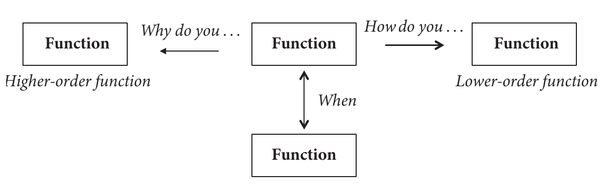{width="70%"}

##

{width="70%"}

##

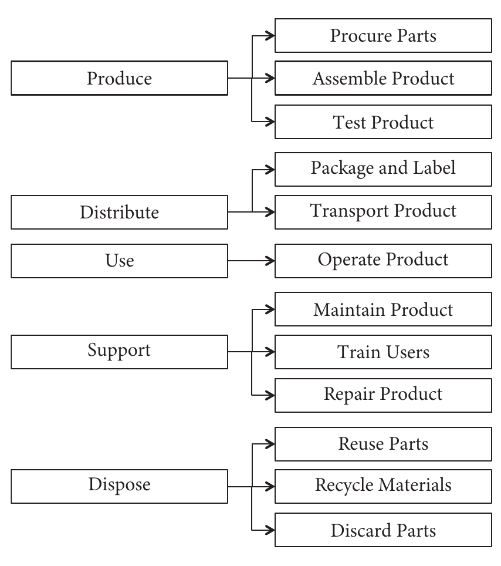{width="42%"}

## Controllable and uncontrollable parameters
- Functions can be tagged with *parameters*, driving another pass at the requirements
- **Controllable**: the designer can set them---touch duration, display resolution, choice of light, sound, or vibration
- **Uncontrollable**: outside the designer's control---whether the user *intended* to communicate affection, the room's lighting, the context of use
- Uncontrollable parameters can't be set, but their *effect* can still be analyzed (e.g., test LED visibility under different lighting)
- FAST diagrams are also used for *lifecycle analysis*---from procuring parts through use, support, and disposal

## Translating functions into function carriers
- With functions identified, decide how best to implement each one
- Build a *morphological chart*: each row maps a function to candidate *function carriers* (solutions)
- `Supply Energy` → human energy, battery, or solar; `Sense User Affection` → touch, rub, or rotate; `Display Remote Affection` → LCD, LEDs, or vibration
- Generate *combinations* by picking one carrier per function
- With $n$ functions each mapping to $k$ solutions there are $k^n$ combinations---too many to enumerate, so judgment selects a promising subset

##

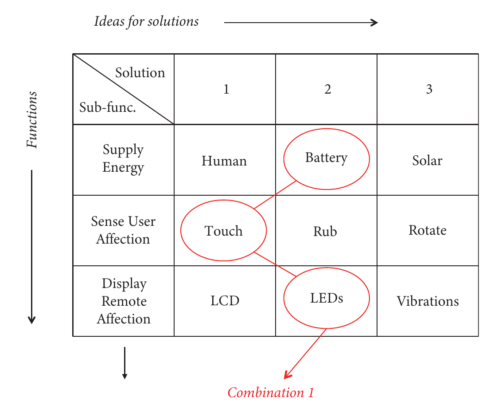{width="56%"}

## Concept selection
- Score each concept against weighted *criteria*
- Each criterion gets a weighting (1--5); each concept is scored (1--5) per criterion; multiply and sum
- Final score is a linear combination $c_1 v_1 + c_2 v_2 + \cdots + c_n v_n$
- Calibrate against an *ideal* concept (perfect on every criterion) or a *datum* (an existing or competitor product)
- Converting a raw quantity (battery life, weight) into a value uses a mapping function---linear, reversed, nonlinear, or discrete

##

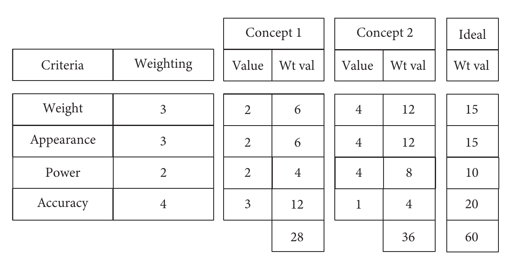{width="72%"}

##

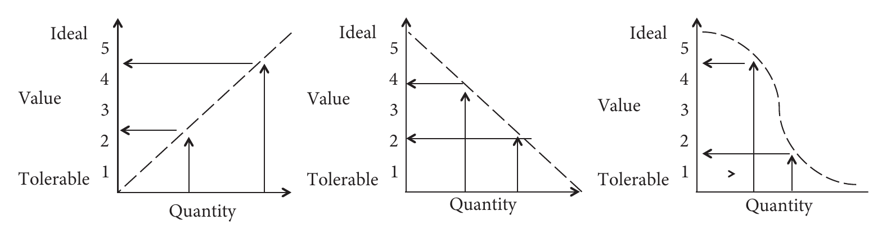{width="86%"}

## Use scores with caution
- Scoring is simple and ties the design directly to the requirements---but it is *error-prone*
- It assumes all criteria are represented, that weightings and values are exact, and that criteria combine linearly
- The higher aggregate score can mislead: a concept may win overall yet score worst on the *most heavily weighted* criterion (accuracy)
- Pair any selection with a *written narrative* justifying the choice; use scoring to *drive further exploration*, not to crown a winner

## Product architecture
- *Product architecture* runs on a continuum from *integral* to *modular*
- **Integral**: functions share modules; tightly coupled; enables optimization at the cost of flexibility
- **Modular**: decoupled interfaces; modules can be designed, reused, and changed independently (much like encapsulation in object-oriented programming)
- Three archetypal modular styles
  - **Slot**: several standard interfaces (a TV's HDMI and antenna connectors)
  - **Bus**: one standard interface (USB)
  - **Sectional**: no standard interface and no main module (pipework)

## Architecture matters across the lifecycle
- Build modules by clustering functions in a schematic---e.g. a peripheral into a user-interface board, a logic board, a power cord and transformer, and a software driver
- Architecture shapes the whole lifecycle
  - **Design**: how to split tasks and reuse existing work
  - **Manufacture and production**: assembly, tooling, unit cost, late customization, variety
  - **Use**: performance vs generalizability vs flexibility
  - **Post-production**: service, part replacement, and software upgrades
- Function structure models make this early modularization easy

##

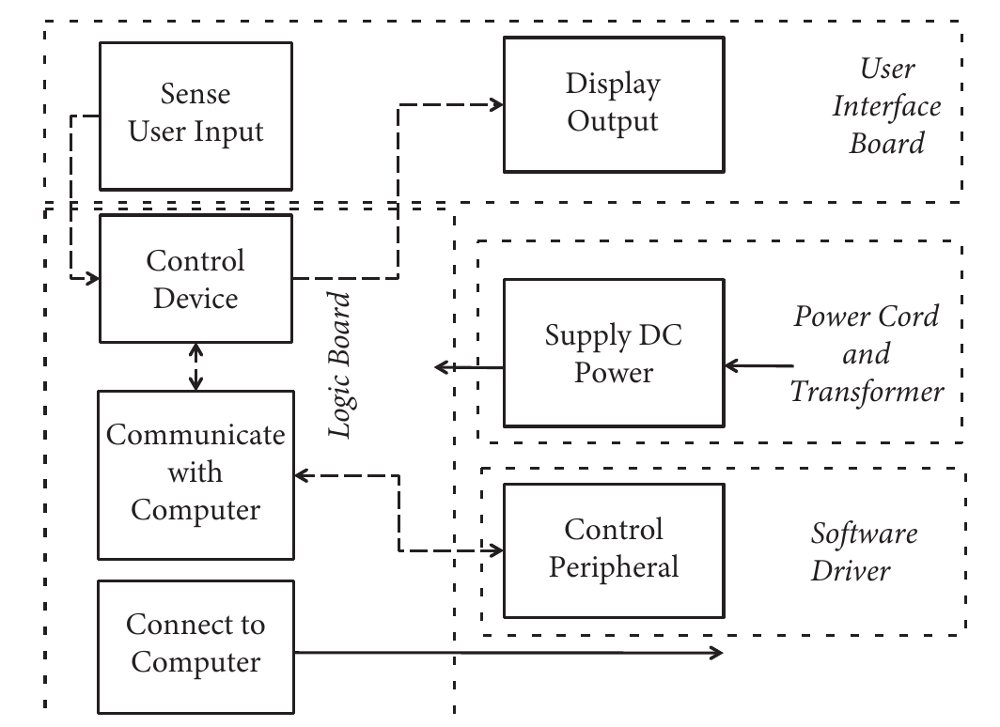{width="62%"}

## Embodiment and detailed design
- **Embodiment design** follows the chosen concept: design sketches, prototypes, component layouts, and the identification of critical software modules and electronics
- **Detailed design** readies the system for release---software to be distributed, or manufacturing instructions to be sent out
- For a software-only system, detailed design covers the software architecture, class descriptions, and so on

## Verification and validation
- *Verification*: systematically check every requirement is met---built correctly to specification
- *Validation*: ensure the system fulfills its intended purpose for users
- The two are independent: you can pass one and fail the other
- The dangerous case is passing verification but failing validation---the requirements were misaligned with what real use demands

## The verification cross-reference matrix (1 of 2)
A *VCRM* specifies, row by row, how each requirement is verified

- **Requirement ID** and **requirement**
- **Verification method**, drawn from four approaches
  - **Inspection**: use the senses non-destructively (check the door is blue)
  - **Demonstration**: intended use yields expected outcomes (a registered finger unlocks the lock)
  - **Test**: predefined inputs yield expected outputs
  - **Analysis**: calculations, models, or equipment predict characteristics

## The verification cross-reference matrix (2 of 2)
- **Allocation** (affected parts) and **success criteria**

- Developing the VCRM alongside the requirements forces early thought about *how* each will be checked

::: {.callout-note title="Aside: analysis before building"}
SenseCam is a wearable, neck-worn camera that captures photos on a timer or on sensed events---a retrospective memory aid. Its process began with a requirements specification (form factor, battery life, storage, ease of use), then a hardware--software design. A key parameter was battery life: analysis showed image capture dominated power draw, and a 30-second capture period gave ~24 hours of operation. Validated over 12 months with one user with amnesia, who recalled 76% of events with SenseCam's help---exceptional for that condition.
:::

## Design engineering meets user-centered design
Three aspects that especially help HCI designers

- **Separate the what from the how**: function models relate functions before any concrete solution is chosen
- **Systematically explore the mapping** of functions to carriers, e.g. via morphological charts and scored suitability
- **Parameterize** function models and concepts: tune *controllable* parameters and analyze the effect of *uncontrollable* ones---*before* building or running in-depth user studies

- Because late requirement changes are costly, taking function models and conceptual design seriously surfaces mistakes and unknowns early (as with SenseCam's battery analysis)

## Summary of Ch 36
- Systematic design processes reduce risk and improve the quality of a system's design
- Design engineering spans solution-neutral problem statement, requirements, conceptual design, embodiment, detailed design, verification, and validation
- Function models specify how functions interrelate *without* deciding how they are carried out---encouraging exploration
- The result is a system that can be built, verified, and validated---and understood, maintained, and reused

# Activities

## Activity 1: Raise the abstraction (~35 min)

**Task:** In groups of 3 to 4, take one group member's project problem statement and climb the abstraction ladder. Write it at three levels: as stated (probably naming a solution), solution-neutral, and one level more abstract still. At each level, list two solutions that become available which were invisible one level down. Then decompose the middle level into a small function structure or FAST diagram — two levels deep, read left to right as *how* and right to left as *why* — and name at least three function carriers for one function.

**Produce:** The three-rung ladder with its solutions, the diagram, and the carriers. Mark the rung you would actually design at, and say what you gave up by not going higher.

**Time:** 25 min group work · 10 min share-out

**Debrief:** At which rung did the problem stop being yours and start being someone else's? That boundary is a real engineering judgment, not a mistake.

## Activity 2: Map the system around the interface (~40 min)

**Task:** In groups of 3 to 4, pick a deployed system that makes consequential decisions about people with AI in the loop (résumé screening, content moderation, fraud flagging, clinical triage, proctoring). Each member draws a different diagram from the mapping toolbox — organizational, process, communication, and system — for the same system. Then combine them.

**Produce:** The combined map, a list of stakeholders the interface does not represent at all, and an audit against the eight governance themes naming the two that this system most clearly fails. For each failure, say whether it is a property of the interface, the organization around it, or the boundary you drew.

**Time:** 28 min group work · 12 min share-out

**Debrief:** Name one harm that is visible on your map and would be invisible in a usability test of the same system. Then name the point where your group's analysis started to stall — systems thinking invites analysis paralysis, and knowing where to stop is part of the skill.

## Activity 3: Score the concepts, then break the score (~40 min)

**Task:** In groups of 3 to 4, take three or four candidate designs for one member's project. Agree on five criteria, weight each 1 to 5, score each concept 1 to 5 per criterion, and compute the weighted totals against an ideal. Then attack your own result: find a defensible re-weighting that makes a different concept win, and check whether your winner scores badly on your highest-weighted criterion.

**Produce:** The scoring table, the re-weighting that flips it, and a written narrative of one paragraph justifying which concept you would actually pursue — the narrative, not the arithmetic, is the deliverable. Then write one requirement for the winner in the five-property form (solution-independent, clear, concise, testable, traceable) and name which of the four verification methods would check it: inspection, demonstration, test, or analysis.

**Time:** 28 min group work · 12 min share-out

**Debrief:** How hard was it to find a re-weighting that flipped the winner? If it was easy, what does that say about the scores you just computed?



