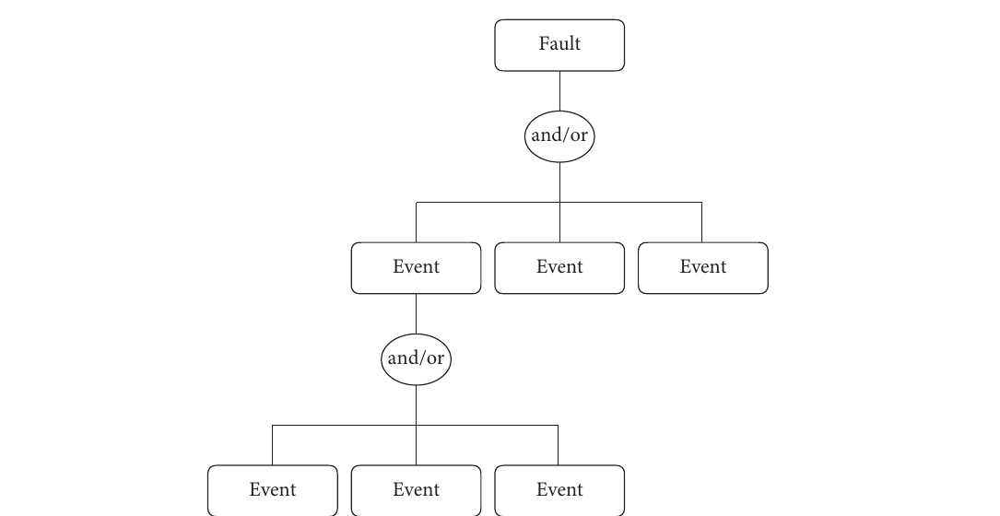
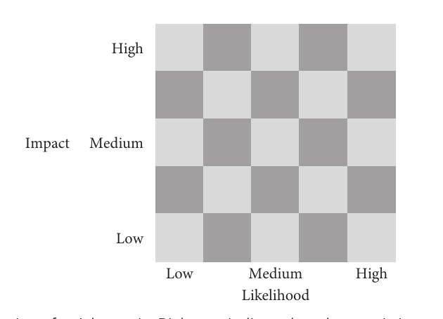
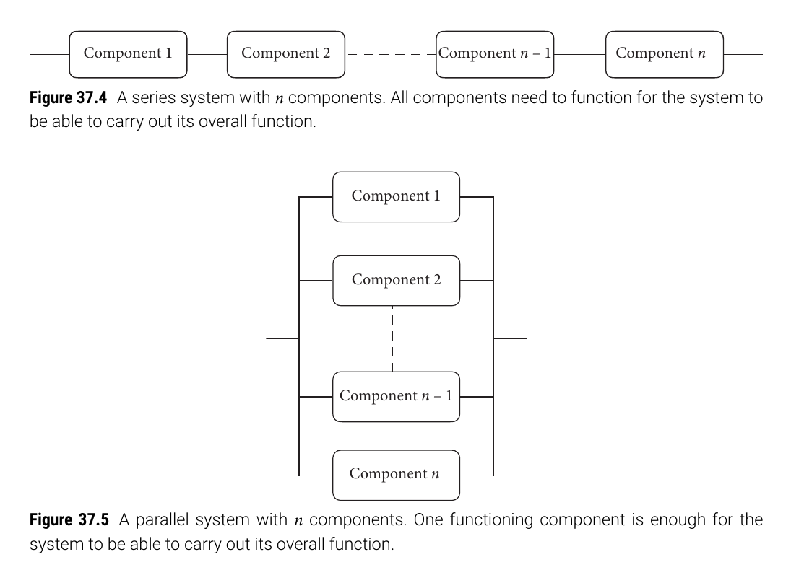
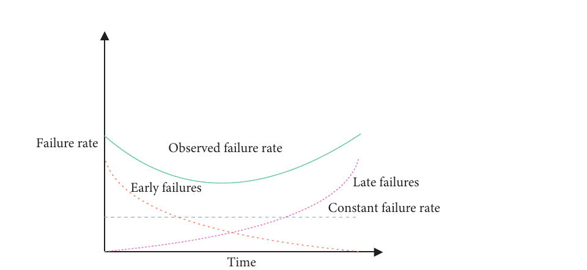
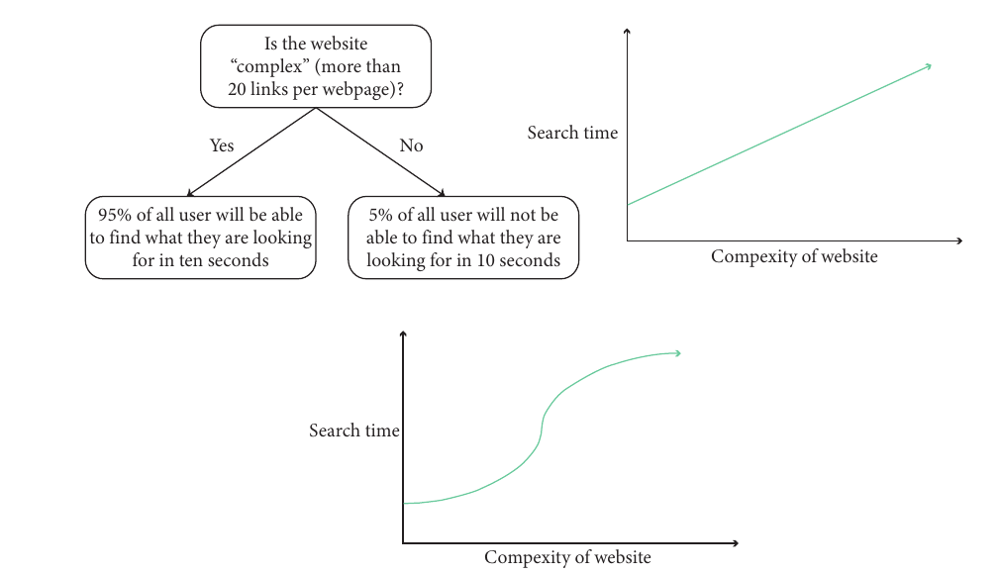
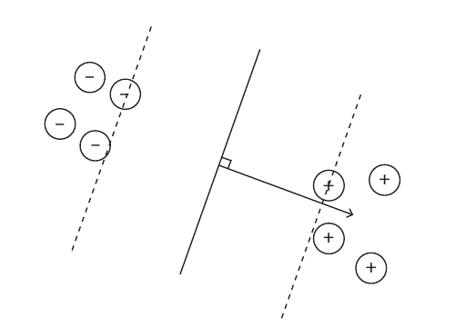

# [Week TEN]{.r-fit-text}

Part VII (b) of @Hornbaek2025

# Intro
The first deck asked whether we were building the *right thing* and building the thing *right*. This deck takes the built system further: keeping it *safe*, realizing it in *software*, and *computing* good solutions to well-defined interaction problems.

## Where the last deck left off
- Part VII (a) covered engineering (Ch 34), systems (Ch 35), and design engineering (Ch 36)
- We turned solution-neutral problem statements into function structures, concepts, and verifiable, validatable systems
- What remains is what it takes for that system to survive contact with the real world

## This slideshow covers chapters 37--39
- **Safety and risk (Ch 37)**: no system is risk-free, so risk must be assessed, mitigated, monitored, and managed
- **Software (Ch 38)**: how a design becomes a running interactive system---and how we know it behaves correctly
- **Computational methods (Ch 39)**: representing interaction as a model so we can predict, analyze, optimize, and infer

# Safety and risk (Ch 37)
- An interactive system should be *safe*: it should not harm its users or those who depend on them
- What "safety" means depends on the domain
  - **Safety from death**: e.g. a medical device that mis-administers medicine---medical error is a leading cause of death, often tied to the interface
  - **Safety from physical harm**: e.g. factory machinery misused under fatigue or multitasking
  - **Safety from economic or social harm**: e.g. personal data leaking to outsiders

## Safety is a systems problem
- Rare, harmful events can only be understood by understanding users, tasks, workflows, the operating environment, and the system itself (Ch 35)
- No system can be *proven* completely safe---so we must first agree on an *acceptable* level of safety
- That level depends on the *frequency* and *severity* of incidents: from improbable to daily, from minor injury to death
- For some systems it is impossible to eliminate harm, or even death, at some probable rate of occurrence

## How complex systems fail
@Cook1998, in *How Complex Systems Fail*, distilled the human factor in safety

- All interesting systems are *complex*---they handle contingencies around things people value
- Complex systems are *heavily defended*; an accident needs *multiple* failures at once
- *Humans build the defenses*: they adopt procedures, train, and are never passive
- Practitioners' actions are *gambles*---taken under uncertainty (turning on lane-keeping is a bet)
- So attributing a single *cause* is hard: human error is one thread in a wide network

## Safety becomes risk management
- Taken seriously, safety asks deeply ethical questions---when designing inherently dangerous systems, how often are people "allowed" to be harmed?
- Four high-level strategies for a risk: *transfer* it, *avoid* it, *reduce* its effect, or *accept* some or all of it
- The ethical core: what harm is acceptable, to whom, and how much are we willing to invest to prevent it?
- The methods in this chapter don't answer that question---they give us the information to answer it

## The system boundary
- The *system boundary* defines what is considered; in HCI it almost always extends past the device
- At minimum it includes the *user*; often the environment, training, and other people too
- It makes risk assessment both *tractable* and *inclusive*---anything outside the boundary is not assessed
- An infusion pump's boundary can reach the nurse's dosage-calculator app, the phone, the patient, and the distracting hospital context

##

::: {.callout-note title="Aside: usability-related risks in e-voting"}
@Bederson2003 found a range of usability problems in touchscreen electronic voting systems, comparing several including the machine used in the contested 2000 US presidential election. Two lessons: first, the *system boundary* must include the voter, the intimidating environment, and the integrity process---not just the machine; second, such systems are inherently *complex*, so usability problems are unsurprising. Given the stakes, voting technology should be *systematically risk assessed* to minimize the chance a voter cannot vote for their preferred choice.
:::

## Hazard, exposure, and risk
- A *hazard* is the possibility of an object, situation, information, or energy source causing an adverse effect (a sharp edge, a confusingly labeled Delete button)
- *Exposure* is the extent to which an affected agent can be reached by the hazard (a rubber coating may remove exposure entirely)
- For a *risk* to exist there must be both a hazard *and* exposure---a hazard with no exposed users is not a risk

## Risk as expected loss
- We view risk through *expected system behavior*: a system has a purpose, and the possibility it misbehaves gives rise to undesired behavior
- The risk of an incident is the expected value of that undesired behavior
$$\text{risk} = \text{likelihood} \cdot \text{impact}$$
- *Likelihood* is the probability of the incident; *impact* is the expected loss---here incidents are treated as binary
- The *precautionary principle*: there is a social responsibility to protect users from significant harm when a risk of it exists (e.g. filter bubbles reinforcing radicalization)

## Human error
- @Norman1980 traced many errors to the limits of *short-term memory*: small capacity (5--10 items), slow search (~100 ms/item), few encodings (verbal, motor, pictorial, spatial), and fragile rehearsal
- Human error is *neither necessary nor sufficient* for accidents---accidents happen without error, and most errors cause no accident
- Two kinds of human error
  - **Mistakes**: errors in *forming* an intention (the plan itself is wrong)
  - **Slips**: errors in *executing* a correct intention

## Skills, rules, and knowledge
@Rasmussen1983 gave an influential model with three levels of control in operating complex systems

- **Skill-based**: highly automatic, little conscious control; frees cognitive resources
- **Rule-based**: stored "if X then Y" procedures, learned or acquired by experience
- **Knowledge-based**: needed in *unfamiliar* situations with no applicable rules---the user forms a goal and plans, often by trial and error

##

![Skill-, rule-, and knowledge-based control in the operation of complex systems---the model explains how operators succeed and why they fail [@Rasmussen1983].](fiSRK.png){width="78%"}

## Signals, signs, and symbols
- **Signals**: low-level continuous control input with no intrinsic meaning---they drive skill-based behavior
- **Signs**: perceived information that activates or modifies *rules*; they guide but carry no functional meaning, so they cannot generate new rules
- **Symbols**: relate concepts to *functional properties*, enabling reasoning and planning
- Signs live in the external world; symbols are representations *inside* the user's head

## A taxonomy of error
@Reason1990 classified error to match Rasmussen's three levels

- **Skill-based slips** and **lapses**: failures to *execute* a plan (hitting a neighboring key; omitting a step)
- **Rule-** and **knowledge-based mistakes**: the *plan* is inadequate for the goal
- Errors can be intentional or unintentional; a mistake is *correctly* carrying out an *incorrect* action (believing Escape will exit)
- Root cause analysis works in four steps: describe the problem, sequence the contributing events, separate root from causal and non-causal factors, and draw a path diagram linking cause to problem

##

::: {.callout-note title="Aside: safe infusion-pump interfaces"}
@Masci2013 linked the *safety requirements* of a patient-controlled analgesia infusion pump to *verification* using a formal model. They first formalized the US FDA requirements---revealing ambiguities in the requirements themselves---then reverse-engineered a formal model of the pump's user interface and checked the interface against the formalized safety requirements. Formalizing what "safe" means is itself part of making a device safe.
:::

## Risk management in five steps
1. **Hazard identification**: find unintended behavior that can cause unwanted outcomes
2. **Risk estimation**: quantify likelihood and severity of each hazard
3. **Risk evaluation**: decide whether risks are acceptable
4. **Risk control**: reduce unacceptable risks to acceptable levels
5. **Risk monitoring**: keep risk acceptable throughout the system's life

- *Risk analysis* (1--2) plus *risk evaluation* (3) together form **risk assessment**; system mapping (Ch 35) and a well-set boundary make it possible

## Risk assessment methods
Methods vary by *depth* (resources needed) and *focus* (identifying, communicating, or assessing risk)

- **SWIFT** (structured what-if technique): a facilitator prompts the team with "what-if" questions from a vocabulary of deviations ("failure to detect," "wrong message," "wrong time")
- Lightweight and solution-focused, but qualitative, hard to audit, and only as good as the team

## Failure mode and effects analysis
- **FMEA** is a team method that analyzes each *component's* failure modes---at the individual and team level
- For each: the failure mode, its causes, probability, severity, resulting risk ($\text{likelihood}\cdot\text{impact}$), recovery, and actions
- Probability may be a rating (1 = extremely unlikely, 5 = almost inevitable) or an actual rate if failure data exist
- Heavier than SWIFT; its output is a list of design changes to mitigate risk

## Fault trees and risk matrices
- A **fault tree** starts from the fault as the top event and decomposes it into contributing events joined by logical *and* / *or*---good for showing how components and users interrelate
- A **risk matrix** plots risks on two axes, *impact* and *likelihood*
  - Top-right = most severe; progress means watching risks migrate toward the bottom-left
  - Usually paired with another method to rank and prioritize

##

{width="72%"}

##

{width="42%"}

## Reliability
- *Reliability* is the quality of a system *not* to fail; reliability engineering estimates it for components and systems
- Any component fails eventually, so we estimate the probability of failure as a *function of time*
- This means finding the *reliability function*---the probability of no failure up to time $t$
- To reason about a system we must first understand its *topology*: how components depend on one another

## Series and parallel systems
- A **series system** works only if *all* components work (decorative lights wired in series; a purely sequential install wizard)
$$R_\text{series} = R_1 R_2 \cdots R_n$$
- A **parallel system** works if *any one* component works (two paper sensors; drag-to-trash *or* right-click Delete)
$$R_\text{parallel} = 1 - (1-R_1)(1-R_2)\cdots(1-R_n)$$

##

{width="60%"}

## Redundancy pays---at a cost
- With two components each 10% likely to fail: series reliability is $0.9 \cdot 0.9 = 0.81$; parallel is $1 - 0.1 \cdot 0.1 = 0.99$
- With five such components: series drops to ~59%, parallel rises to ~99.999%
- The gap widens as components multiply---but redundancy adds *complexity and cost*, which is why parallel systems are rarer than they should be
- In between sits the **k-out-of-n** system (a two-out-of-three sensor array); series is $k=n$, parallel is $k=1$

##

::: {.callout-note title="Aside: the Boeing 737 MAX disaster"}
@Travis2019 conducts an analysis of the 737 MAX failings that shows the danger of fully automating a function while leaving the user out of the loop---and the value of *parallel redundancy* in the form of a human working alongside a machine. Larger engines shifted the plane's centerline and made it prone to pitch up and stall; rather than redesign the engines, Boeing added software (MCAS) so it could be sold as "just another 737." When MCAS sensed a stall it pushed the nose down and the pilot *could not override it*. On a faulty sensor reading, the result was catastrophic. Failures are normal in complex systems, so there must be a path to recovery.
:::

## Failure rate and the bathtub curve
- Fit a probability density $f(t)$ to failures over time; integrate for the cumulative $F(t) = \Pr\{T < t\}$; then the reliability function is $R(t) = 1 - F(t)$
- The *failure rate* $\lambda$ is failures per unit time, often modeled as constant
- The **bathtub curve** explains why: *early* failures (manufacturing, install, inexperience), a long flat span of *random* failures, then rising *late* failures (fatigue, obsolescence)
- It describes a *population*, not one device; with constant $\lambda$, the *mean time between failures* is $\text{MTBF} = 1/\lambda$

##

{width="70%"}

## The hazard function
- The *hazard function* $h(t)$ is the failure rate in the next instant *given* survival to time $t$---a conditional density
$$h(t) = f(t)/R(t)$$
- When time-to-failure is *exponentially distributed*, $f(t) = \lambda e^{-\lambda t}$ and $R(t) = e^{-\lambda t}$, so $h(t) = \lambda$
- The rate is *constant*---a consequence of the exponential's *memoryless* property (remaining life doesn't depend on age)
- Convenient and often adequate for random failures, but real complex systems have interdependencies that make $h(t)$ non-constant

## Security
- *Security* is about making systems resilient to harm *from people*---an aspect of risk management (antivirus, cryptography, passwords, spam and phishing filters, restricted access)
- *Usable security* sits between HCI and security: a security system is only as strong as its users
- @Whitten1999 give a definition---software is usable-secure if users
  1. are reliably *aware* of the security tasks they must perform
  2. can *figure out* how to perform them
  3. don't make *dangerous errors*
  4. are *comfortable* enough to keep using it

##

::: {.callout-note title="Aside: why Johnny can't encrypt"}
In their classic 1999 study, @Whitten1999 asked why end-users could not use PGP 5.0's interface. Security has five intrinsic properties that breed usability problems: *unmotivated users* (security is never the real goal), *abstraction* (policies are abstract rules), *lack of feedback* (correct configuration is hard to confirm), *irreversibility* (an exposed secret cannot be un-exposed), and the *weakest link* (no safe trial and error). In their study of 12 educated, email-experienced users, only a third correctly signed and encrypted an email, and a quarter *exposed their secret key*. Following basic UI design principles is *not enough* for usable security.
:::

## Threat models and risk-free systems
- A *threat model* is a systematic analysis of a security threat: who might attack, how data flow, which parts are attackable, the likelihood and impact of an attack, and how to safeguard against it
- Is any system *risk-free*? No. Any meaningful system entails risk, so designers must set an *acceptable* level
- Drawing on @Perrow1999, specifically the notion of *Normal Accidents*, accidents in tightly coupled, complex systems are *normal*---inevitable, though infrequent
- Better to design *proactively* to prevent them than to react after the fact

## Summary of Ch 37
- Protecting people from harm is a core value of HCI; no system's risk can be eliminated, only made *acceptable*
- Human error is usually just *one* factor among many in an accident
- Risk management is *continuous*---assess, control, and *monitor* across the whole lifespan
- Reliability is statistical, depending on *topology* and component failure probabilities
- Security must be *usable* to be effective

# Software (Ch 38)
- Interactive systems run on *software*---it is what turns a design into an implementation
- Getting software both *correct* and richly *interactive* is hard: events, external connections, and constant responsiveness all at once
- @Brooks1995, in *The Mythical Man-Month*, famously warned that adding developers to a late project can *delay* it further
- The remedy, as in systems thinking (Ch 35), is *abstraction*---work at high levels rather than pixels and raw signals

## Standing on abstractions
- Developers rely on established *programming paradigms* (event-driven programming) and *design patterns* (model-view-controller)
- *Libraries and toolkits* supply ready-made interface elements (scrollpanes) and advanced behavior (gesture recognition)
- Three HCI landmarks in this space
  - **Amulet** [@Myers1997]: an early cross-platform UI environment---graphical objects, interactors, commands, constraints, gestures, animation
  - **KidSim** [@Smith1994]: end-user programming that lets children give rules to graphical agents
  - **Undo** [@Abowd1992]: formally investigated, yielding the *principle of intent*---undo reflects the user's intention, not just a system function

## Software design and architecture
- *Software design* is the whole development effort---modularization, abstraction, and all software concerns
- *Software architecture* is the *structure* of the software: one component of design
- UIs evolved from command lines to graphical interfaces full of windows, panels, menus, buttons, tables, and plots
- A *GUI toolkit* is a set of routines for building and managing these elements so a GUI behaves as expected

## Representing interface elements
- A key idea is *representation*: how a UI element is modeled for the programmer
- The usual answer is an *object*, which bundles *state* (data) and *behavior* (code)
- A button's state: size, location, outline, fill, text, font, size
- A button's behavior: detecting a press, changing appearance, notifying the rest of the program
- This object model is what makes toolkits and design patterns possible

## Layout
- *Layout* is the set of rules deciding where components sit relative to one another
- The simplest rule is *none*---absolute pixel coordinates for every element
- Absolute positioning gives precise control but *breaks on resize*: components stay fixed, so they clip or leave dead space
- Layout rules fix this---e.g. a *border layout* splitting a panel into north, south, west, east, and center regions

## Event handling
- Most of the time a UI is simply *waiting* for the user
- This leads to *event-driven programming*: program flow is driven by *events*, and logic does nothing until one fires
- Events include a button press, a menu selection, or a timer expiring
- A *listener* watches a control (a Go button), captures the event, and calls the program logic that responds

##

{width="62%"}

## Model-view-controller
- *Design patterns* are reusable solutions to recurring programming problems
- The best-known UI pattern, MVC [@Krasner1988], *decouples three concerns*
  - **Model**: the data the user manipulates
  - **View**: how the data are presented---there can be *several* views of one model
  - **Controller**: accepts user input to change the model and drives the views
- Decoupling keeps complex UI code scalable and correct

## Toolkits
- A *toolkit* is a software library of common widgets---menus, buttons, scrollbars---at a high level of abstraction [@Myers1996]
- Advantages: *consistency* (a shared look and feel) and *no need to rewrite* standard widgets
- Drawback: toolkits are often *hard to extend*
- When a needed variation isn't supported, the developer must modify the toolkit, build custom functionality, or bend the design to fit

## End-user development
- Software agents could help users reach their goals---but goals are *individual*
- The *end-user programming problem*: how can non-programmers tell a computer what to do?
- Approaches build from simple recording toward inferred, generalizing programs
  - **Macros**
  - **Programming by example** (also called programming by demonstration)
  - **Visual programming languages**

## Macros
- A *macro* records a sequence of user actions into a rerunnable program
- Easy to understand: trigger recording, act, then replay---and often editable step by step
- But macros only capture *low-level* events (key presses, pixel-precise clicks)
- And they *don't generalize*: move the icon and the macro fails; it can't select "the words after *Dear*" across different names
- These limits motivated systems that *infer* the intended program from examples

## Programming by example
- **Pygmalion** [@Smith1975]: the programmer *sketches* a program with icons for variables, structures, and flow; the system records actions and halts to ask when information is missing---it does not *infer*
- **Tinker** [@Lieberman1986]: novices teach an agent by giving illustrative examples; the system generalizes and asks for a distinguishing test when examples conflict
- Both were aimed at *programmers*---the next step was reaching *end-users*

## Metamouse and Eager
- **Metamouse** [@Maulsby1989]: an agent named *Basil* watches a user in a drawing program, occasionally asks for clarification, and takes over the repetitive task---an "eager apprentice" that alternates executing and building the induced program to absorb user variation
- **Eager** [@Cypher1991]: silently watches a GUI for iteration, then *highlights* its predicted next action; once confident, the user clicks a button and Eager automates the rest
- Eager never demands confirmation---a *mixed-initiative* interface where the user acts and the agent proposes

## Visual programming languages
- Change the *medium*: from a textual list of instructions to a *graphical* one users manipulate directly
- Examples span flow-chart editors and *spreadsheets* (formulas and data flows via a metaphor)
- The idea is old---@Smith1975 performed a review that included a circuit-metaphor language drawn with a light pen
- **KidSim** [@Smith1994] combines visual programming with programming by demonstration, using *graphical rewrite rules* (before-and-after rules)

##

::: {.callout-note title="Aside: Nassi--Shneiderman diagrams"}
A Nassi--Shneiderman diagram [@Nassi1973] is a *structured* graphical representation of a program's high-level decomposition. A branching block, for instance, shows that unlocking a phone versus denying access depends on a precondition---the user's fingerprint being detected. The notation covers multi-way branches, loops, and parallel processes. Though rarely used in visual programming languages themselves, such diagrams still serve to visualize algorithms and processes for teaching.
:::

## Formal methods
- Interactive software is inherently complex---so *how do we know it behaves correctly*?
- *Formal methods* use rigorous mathematical models to *specify, develop, and verify* a system
- **Finite-state machines** give a design vocabulary for input devices [@Buxton1990]
  - A *mouse*: Tracking $\leftrightarrow$ Dragging (button down/up)
  - A *touchscreen*: Out-of-Range $\leftrightarrow$ Tracking (no dragging state)
  - A *stylus + tablet*: all three states, showing richer interaction potential
- The vocabulary lets us *compare* devices and ask whether a state can be added

##

![Three state diagrams modeling input: (a) a mouse, (b) a touchscreen, and (c) a stylus and tablet---the stylus alone supports all three states [@Buxton1990].](fiInputStates.png){width="72%"}

##

::: {.callout-note title="Aside: designing safe number entry"}
Number entry is pervasive in healthcare, aviation, and finance---and @Thimbleby2014 ran an analysis that found number-entry interfaces riddled with defects. A bare keypad doesn't even settle basic questions: does *C* correct or cancel? He identified 16 common design defects, from unclear requirements and record-keeping to negative numbers and timeouts. His argument: *user testing is insufficient*---it can't guarantee all defects are found---so critical interfaces need *formal* rules (he used Hoare logic). Years of user-centered research had missed easily fixed defects.
:::

## Formally modeling undo
- Undo reverts the system to a previous state; its implementations vary
  - **Flip undo**: a single level of undo/redo---only the last command
  - **Backtrack undo**: a record of every command; each undo removes the last
  - **Stack-based undo/redo**: a separate list of undone commands lets the user move back *and forth* through history [@Dix1997]
- A straightforward definition: a command $c$ followed by undo should equal doing *nothing*

## Undo cannot be an ordinary command
- The *strong-cu* property: a command then undo equals null ($c \frown \text{undo} \sim \text{null}$)
- The *strong-uu* property: an undo then undo equals null ($\text{undo} \frown \text{undo} \sim \text{null}$)
- Appealing together---but *provably inconsistent* for any system with more than two states
- Reasoning: if commands $a$ and $b$ both return to $s_0$, a second undo would force $s_a = s_b$ for *arbitrary* commands---absurd
- So undo must be a *meta-command* with special properties, not an ordinary one

## Do our systems actually help?
- HCI offers many systems, toolkits, visual languages, and formal approaches---but they are notoriously *hard to evaluate*
- @Lau2010 argues a systems contribution should
  - clearly describe the *problem* it solves and its *impact*
  - be *replicable*---described in enough detail to recreate
  - discuss *alternatives* and the design decisions taken
  - show *value* with evidence it is effective and efficient
  - name the *barriers* it overcomes and its *limitations*
- Meaningful evaluation is a fundamental open challenge for the field

## Summary of Ch 38
- Software design and architecture make UIs efficient to build; MVC is a prominent pattern
- End-user development lets non-programmers build programs---macros, programming by example, and visual languages
- Formal methods specify, develop, and verify UIs---state machines, safe number entry, and the surprising subtlety of undo
- Evaluating systems contributions on their merits remains genuinely hard

# Computational methods (Ch 39)
- So far, data shaped designs *through the designer*, who interprets and decides
- This chapter adds a *complementary* perspective: represent interaction *computationally*, build a *model*, and *compute* with it
- Computational methods can *optimize* interfaces, *adapt* them, *infer* about users, and *learn* from interaction
- Examples: predicting communication rates for AAC devices, optimizing AR display saliency, and generating GUI design ideas

## What a model lets us do
- A *model* is a simplified representation capturing essential aspects of an interactive system in some formalism
- **Predict** performance *before* empirical user testing (display quality from visual-discrimination models)
- **Simulate** outcomes to learn about behavior and detect risks (simulating typing with errors to test autocorrect)
- **Chart operating envelopes**---upper and lower performance bounds under extreme but realistic assumptions
- **Optimize** designs algorithmically, and **infer** user intent inside interactive systems (speech recognition)

## Representations and models
- A model is only as good as its *representation*---the way relevant elements of interaction are described
- A *representation* identifies the most important *features* of interaction; a *model* describes how those features produce outcomes
- Much of research is figuring out *how to represent* things---interaction is no different
- Take Fitts' law as a worked example (Ch 4)

## Fitts' law as a model
- Fitts' law predicts average movement time from the distance $D$ to a target and its width $W$
$$MT = a + b\log_2\!\left(\frac{2D}{W}\right)$$
- Its *representation* uses three constructs: movement time, distance, and width---*not*, say, target color
- Its *model* has two parts: an *index of difficulty* $\text{ID} = \log_2(2D/W)$ (in bits), and a linear link $MT = \alpha + \beta\,\text{ID}$
- $\alpha$ and $\beta$ are task- and device-dependent, so we optimize by *shrinking $D$* and *enlarging $W$*---a building tool for design

## Feature engineering
- The first step to a model is a *representation*; features are the qualities of interest
- Choosing them is *feature selection* (or feature engineering)---central to machine learning and pattern recognition
- **Rubine recognizer** [@Rubine1991]: a linear classifier that represents a single-stroke gesture as an *11-dimensional feature vector* (initial angle, length, and so on)
- Trained on example gestures per class, it weights the features, then classifies a new gesture by nearest class

## What makes a good feature?
- **Observable**: measurable directly (a touchpoint) or through a proxy (an emotive state)
- **Informative**: it tells us something useful about the interaction
- **Distinct**: complementary, not redundant (press force correlates with fingertip area)
- **Computable**: obtainable by a systematic procedure---and *practically* so, not too slow or unreliable
- **Comprehensive**: collectively as complete as possible (pointing needs *both* distance and width)

## From variables to models
- The simplest models relate two variables---identity $y = x$, or a constant $y = c$ (invariant of $x$)
- Usually a model posits $y$ *varies* with $x$: linearly, $y = \alpha + \beta x$
- With implied *causality*: we can't set $y$ directly, but we can change $x$
- $\alpha$ is the *intercept* (an offset or baseline); $\beta$ is the *slope* (a rate---how much $y$ changes with $x$)
- More generally, models are *functions*---equations or programs---built from *parameters* and *mechanisms* that link them (regression, neural nets, decision trees, simulations)

## Three models, one task
For a toy task---predicting *search time* from a site's *complexity* (number of links)

- A **decision tree**: simple, but binary and threshold-bound---low resolution
- A **linear model**: predicts a *range* of values, with a slope and a fixed-cost intercept
- A **nonlinear model**: richer still---e.g. search time that *rapidly* rises in a certain complexity range
- All three are simplistic; a useful model captures *many* parameters and the *user's strategy*
- Running a model over time is *simulation*---safe even for extreme conditions (a vehicle handover)

##

{width="78%"}

## Envelope analysis
- *Envelope analysis*: extract design parameters from the system's functional description and *simulate* performance across a range of choices
- Example: correcting speech-recognition errors by *touch* rather than voice [@Vertanen2009]
- The recognizer's lattice becomes a *word confusion network*---time-ordered clusters of candidate words with probabilities
- Users substitute, edit, delete, and insert words by touch

##

![A touchscreen speech interface: the user corrects recognized utterances via the *word confusion network* or a keyboard with word prediction and morphological variants [@Vertanen2009].](fiSpeechInterface.png){width="42%"}

## Reading the envelope
- Simulated with an *oracle* (an assumed optimal expert user) by replaying recorded audio
- Word error rate *drops* as the cluster size grows---but most gain comes from the first *3--4* suggestions, informing the button-size trade-off
- Acoustic and language-model predictions cut error most, yet are *hard for users to understand* ("aback" vs "attack")
- The designers chose *morphological* variants---not the biggest reduction, but the most *understandable*---showing analysis gives *guidance*, not directives

##

![Envelope analysis of the speech interface: oracle word error rate against cluster size (left) and word predictions offered (right), for several interaction methods [@Vertanen2009].](fiEnvelope.png){width="80%"}

## Controllable and uncontrollable parameters
- **Controllable** parameters are set by the designer---prime targets for *optimization*
- **Uncontrollable** parameters cannot be set; *sensitivity analysis* studies how outcomes respond to varying them
- Three common ways to run envelope analysis
  - **Keystroke-level modeling**: error-free expert behavior with fixed-time operators (Ch 41)
  - **Wizard of Oz**: a human secretly simulates a complex (usually AI) system
  - **Computational experiments**: generate outcomes through a model, often with an oracle (or a *stochastic* oracle for imperfect users)

##

::: {.callout-note title="Aside: why word prediction may not help"}
Large-scale studies suggest word predictions on touchscreen keyboards may not be that useful---but *why*? Envelope analysis models the word-prediction function with parameters like $T_\text{key}$ (time to hit a key) and $T_\text{react}$ (time to react to a suggestion), governed by *strategy* parameters such as $L_\text{min}$ (only predict words above a minimum length) and $k_\text{look}$ (type $k$ keys, then look). Simulated over strategies, net entry rate ranges from $-8.8$ to $+2.9$ words per minute---*purely* from strategy. Any strategy that checks predictions before typing a letter *slows the user down*; gains need at least the first two letters. For the average user, prediction is unlikely to help and may hurt.
:::

## Optimization
- *Optimization* is the algorithmic *search* for solutions best meeting stated objectives---keyboards, menus, displays, visualizations, and adaptive UIs
- It is *constructive*: it not only evaluates solutions but *generates* them
- Its power is strong search algorithms (*solvers*); its cost is that the task must be *precisely defined*
- An *objective function* scores each candidate---performance (via Fitts' law), ergonomics, learnability, aesthetics---drawn from literature, data, standards, or heuristics

## A design task *is* an optimization task
Three elements

- **Design space**: the set of candidate designs, fixed by *decision variables* with limited ranges (a button's $x$, $y$)
- **Objective function**: maps a candidate to a score of its "goodness"
- **Task instance**: task-specific variables (which commands a menu must include)
- Formally: find the design vector $x \in X$ that *maximizes* $f_\theta(x)$

## When is a design "optimal"?
- Design spaces get *huge*: $n$ functions give $2^n - 1$ combinations---50 functions exceed $10^{15}$ possibilities
- A *global optimum* is the highest possible score in the whole space---guaranteed only by exhaustive or *exact* methods (integer programming)
- Otherwise we settle for *approximately optimum*---within a margin of the best
- To call a design optimal, answer three questions
  - *Best out of which options?* (design space)
  - *Best for what?* (objectives and task instance)
  - *Best with what guarantees?* (search method)

## The assignment problem
- The most-studied optimization class in HCI: match $n$ items to $n$ locations at minimum cost (letters to key slots)
- The *linear* variant minimizes $\sum_{i,k} c_{ik}\, x_{ik}$, where $x_{ik}$ assigns letter $i$ to slot $k$
- Real UIs need *interactions* between items, adding a *quadratic* term $\sum_{i,j,k,\ell} c_{ijk\ell}\, x_{ik}\, x_{j\ell}$ (e.g. finger-travel cost weighted by bigram probability)
- @Feit2021 used this quadratic form to help design the new *AZERTY* French keyboard standard against four objectives---performance, intuitiveness, learnability, and ergonomics

##

![The new *AZERTY* standard, designed with multi-objective optimization over performance, intuitiveness, learnability, and ergonomics [@Feit2021].](fiAzerty.png){width="82%"}

##

::: {.callout-note title="Aside: placing mixed-reality displays by optimization"}
In mixed reality, information displays must be reachable and visible without obscuring objects of interest---how, without a handcrafted rule set? @Belo2022 defined an optimization task whose objective function is a *weighted sum* of terms for reachability, visibility, and occlusion, with weights set by end-users and developers. The *task instance* is the current positions of the display and user; *simulated annealing* solved it in real time to adapt display placement on the fly.
:::

## Machine learning and pattern recognition
- Machine learning is about programs that *learn from data* rather than being fully pre-specified
- Extract *features* from domain objects, feed them to a *model* trained by a *learning algorithm*, and read the output
- Three tasks
  - **Classification**: assign a label to unseen feature vectors (a special case is *binary*)
  - **Regression**: learn a real-valued function
  - **Clustering**: group data with no prior knowledge of the groups

## Learning and validating
- *Supervised* learning uses labeled data; *unsupervised* learning uses unlabeled data---harder, but useful when labels are scarce
- ML problems rarely have a "correct" answer, and data are *noisy*---so perfectly fitting the training data means *overfitting*
- Evaluate by *performance*, e.g. *accuracy* = correct predictions / total predictions
- *Cross-validation*: split into $k$ folds, train on $k-1$, test on the rest, repeat $k$ times, and average---a more robust estimate

## Linear machines and SVMs
- A *linear classifier* separates two classes with a boundary $w \cdot x = t$, where $w$ points from the negative toward the positive examples
- Simple and optimal *under specific assumptions*---and poor when they don't hold (as in gesture classification, per the Rubine recognizer)
- A *support vector machine* prefers the boundary with the *largest margin*---the distance to the closest instance---making it robust to noise
- A *soft margin* (parameter $C$) tolerates some misclassification; changing the *kernel* finds nonlinear boundaries

##

{width="46%"}

##

::: {.callout-note title="Aside: interactive machine learning"}
Interactive machine learning lets a *designer* rapidly supply training data to correct a learner's mistakes---keeping a human in the loop. @Fails2003 gives an example that lets designers build a pixel-based image classifier by importing images and classifying them by hand; the system trains on those labels and shows its accuracy. The designer refines by adding more manual classifications, and the system's ability to detect the target---say, a hand in an image---visibly improves with each round.
:::

## Limits of a model
- A computational method rests on the *information in its model*---and models can fail to represent the world
- **Aleatoric uncertainty**: too much *stochastic* variation for the algorithm to find the trend
- **Epistemic uncertainty**: the model *lacks knowledge* of a relevant factor (limits of visual attention; a small mobile display)
- **Bias**: *statistical* bias misrepresents a distribution (favoring line charts with no basis); *ethical* bias is questionable use of results (offensive labels or colors)
- HCI research plays a critical, underappreciated role in exposing these gaps---ensuring the representation represents what it should

## Summary of Ch 39
- Computational methods rely on *models* that represent aspects of interaction so we can compute with them
- A good model needs a good *representation*---informative, distinct, computable, comprehensive features
- *Envelope analysis* charts an interface's range of behavior across conditions
- *Optimization* searches a defined design space for the best design under stated objectives and guarantees
- *Machine learning* infers and adapts from data---powerful, but bounded by uncertainty and bias



