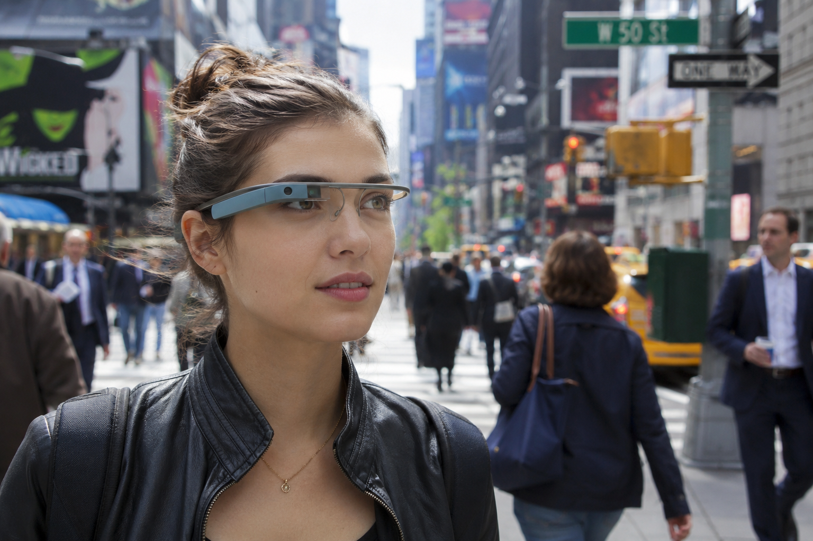
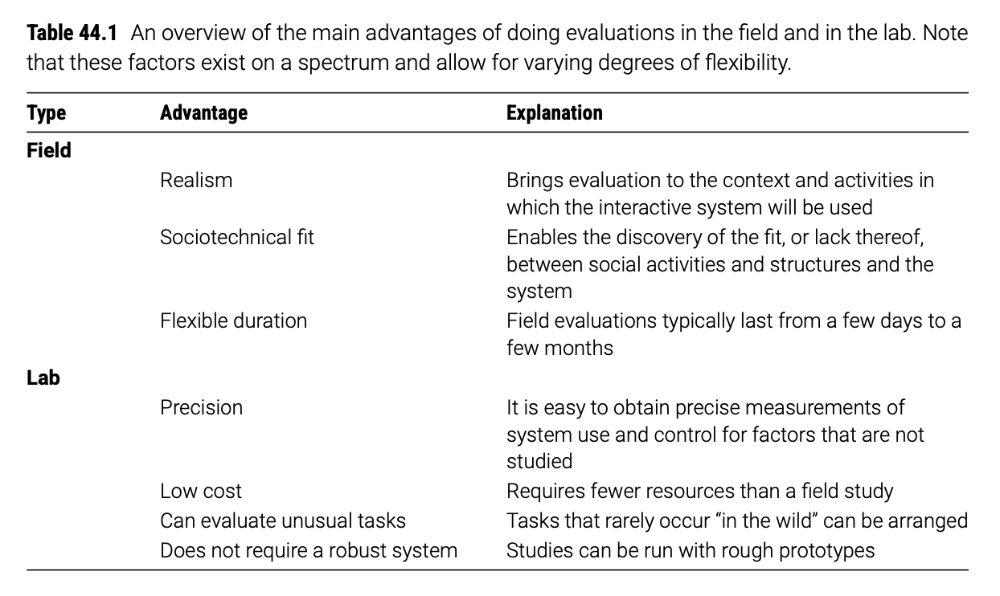

# [Week THIRTEEN]{.r-fit-text}

Part VIII of @Hornbaek2025

# Intro

Last week we lived inside the lab: think-aloud studies and controlled experiments, where we bought precision by stripping the world away. But a keyboard that wins in a tapping task can still lose on a real phone, in a real pocket, or on a real commute.

Three stops on one spectrum of system completeness: **field evaluation of a prototype**, then a **pilot study** of a partial-but-real system, then a **deployment study** of the fully shipped thing. 

This week's question: *what do we learn when we drag evaluation back into the messy real world, and what does it cost us?*

# Case Study: Google Glass

# Why did Google Glass "fail"?

A device that dazzled in demos and delighted its own testers, then collapsed on contact with real streets, bars, and strangers.

- Google shipped it to self-selected **Explorers**: enthusiasts who paid $1,500 to opt in, so the early signal was glowing
- The failure was social, not technical: bystanders could not tell when a camera was pointed at them, and *Glasshole* became a slur
- Real contexts rejected it: bars, cinemas, and locker rooms banned the device the lab had never simulated
- The model clash: engineers evaluated *a wearable display's features*; the world evaluated *what it feels like to stand next to someone wearing a camera*

# Field Evaluations

Realism, and what it costs: ecological validity, degrees of the field, and experiments that leave the lab.

## Ecological validity

- **Ecological validity:** the degree to which the conditions of a study resemble the real conditions in which the system will actually be used
- **Also called external validity:** how far results generalize beyond the exact setting where they were collected
- **The trade it buys:** realism, at the direct expense of precision and control
- **The trade it pays:** you can no longer isolate one variable cleanly, because the world moves everything at once

##

::: {.callout-note}
An evaluation has high ecological validity when its people, tasks, context, and technology closely match real use, so that observed behavior reflects what users would actually do outside the study.
:::

## Buying realism with control

- Lab evaluation controls the tasks, the instructions, and keeps observations independent: clean causal reads, low realism
- Field evaluation accepts contamination to gain truth: real motivations, real interruptions, real stakes
- **Kjeldskov** studied a mobile medical system in both settings and found comparable numbers of usability problems, and even context problems, in the lab
- So "field is always richer" is not a law: it is a bet you make when the phenomenon you care about only shows up in the wild

##

::: {.callout-warning title="Is the field always worth the hassle?"}
- **Kjeldskov** on a mobile clinical system: the lab surfaced comparable usability problems, so the costly field study "was not worth the hassle"
- **Hornbæk and colleagues** counter: field studies expose sociotechnical phenomena, like the nurses' collective reading, that a lab cannot stage
- Current consensus: neither setting is inherently good; they trade realism against precision and cost
- Design takeaway: do not default to the field to look rigorous; go to the field only when realism is the specific thing at risk
:::

## Degrees of the field

- **Realism is a matter of degree (McGrath):** an evaluation can have more or fewer features of the real world, rather than being purely lab or purely field
- **Four dimensions to turn up or down:** people, activities, context, and technology can each be made more or less realistic
- **Rico and Brewster** tested phone gestures on a real sidewalk by a bus stop, so social context did the work a lab never could
- **Mundane realism is overrated:** a lab dressed up like a living room matters less than tasks that feel meaningful and real

## Turning the dials on purpose

- You rarely need full realism: you need realism on the dimension your question depends on
- Studying social acceptability? Turn up *context*. Studying learnability? Turn up *tasks* and let users bring their own
- **Rico and Brewster** still handed participants the tasks: field setting, controlled activity, a deliberate mix
- The move: name the one dimension your result hinges on, crank that dial, and economize on the rest

## The field is not a method

- **Field evaluation is a setting, not a technique:** any empirical method can be run there
- **Bring your whole toolbox:** think-aloud, interviews, observation, and unobtrusive data collection all work in the field
- **The same method, a different job:** an interview in *user research* aims to understand users; an interview in *evaluation* judges a system against a standard
- So do not ask "which method is the field method"; ask "which method answers my evaluation question, and how real do I need the setting to be"

## The textbook says: Evaluation is not user research

- **User research (Part III):** open-ended, aimed at understanding people, needs, and context before you commit to a design
- **Evaluation (Part VIII):** aimed at judging a built system against a goal or standard
- Same interview transcript, two different questions: *what do these people need* versus *does this system meet the bar*

## Valle's take

- The lines blur, because there's a lot you can learn about your users during evaluation that you couldn't learn without something to evaluate. 
- In industry, this isn't a strong distinction made. 

## Experiments in the field

- **Field experiment:** an experimental manipulation run in a real context of use rather than a lab
- **Back to the keyboard:** one field study compared an autocorrect keyboard against a gesture keyboard, measuring text entry in the lab versus on users' own phones in everyday life, and the deployment context shifted the results
- **Three broken assumptions:** random assignment, control, and independence of observations all come under threat
- **Quasi-experiment:** the label for field experiments that violate these assumptions, so classic statistics do not straightforwardly apply
- **Natural experiment:** a world event acts as the manipulation, like COVID-19 reshaping communication, or **Griggio** using a WhatsApp policy change as a switch

## When you cannot randomize

- You work with whoever already uses the interface: assignment is inherited, not assigned
- A crisis at work, a new colleague, a changed workflow can swamp your manipulation mid-study
- Observations leak: **a school class will talk to each other about the study**, so their responses are no longer independent
- The takeaway: report field results as quasi-experimental, with caution about causal claims, not as clean lab-grade proof

## [Concept check]{.r-fit-text}

::: {.callout-note title="Pause and think"}
A team deploys a new feed to whoever opts into the beta, then compares them against everyone else. They find the beta group is more engaged. Name the threatened assumption, and give one reason the difference might have nothing to do with the feed.
:::

# Pilot Studies

Putting an unfinished but real system into real use: pilot implementations, technology probes, and the minimum viable product.

## Pilot implementations

- **Pilot implementation:** a field test of a properly engineered, yet unfinished system, in its intended environment, using real data
- **Not a prototype:** it always runs in the field, for a limited period, with real data and special precautions against breakdowns
- **Scope:** it tests the whole sociotechnical system, not just one screen, over weeks to months
- **Purpose:** explore the system's value, improve or assess its design, and reduce implementation risk before full commitment

##

::: {.callout-note}
A pilot implementation is a limited-time deployment of a real but unfinished system into its actual context of use, run with real data and safeguards, in order to learn about and reduce the risk of the eventual full implementation.
:::

## What the pilot reveals that a demo cannot

- **Hertzum** piloted an electronic patient record that replaced all paper for five days, with a staffed back office for breakdowns
- The surprise was social: nurses began projecting the record on the wall and reading it *collectively* at handovers
- That collective reading was a genuine change in work practice, invisible in any single-user usability test
- The lesson: a pilot surfaces how the system reshapes the organization around it, not just whether a button is findable

## Probes and minimum viable products

- **Technology probe:** a simple, adaptable system deployed to understand needs, spark new ideas, and field-test, all at once
- **Minimum viable product:** a deliberately partial release built to collect the most user learning for the least effort
- Both trade completeness for early, real-world signal: you ship less to learn sooner
- The risk they share: a partial system can teach you the wrong lesson if users read its gaps as the finished intent

## When "minimum" undercuts the learning

- An MVP shipped too rough gets judged on its roughness, not its idea
- A probe so open-ended that everyone uses it differently gives you stories, not comparisons
- The design move: decide in advance which one question the partial system must answer, and instrument exactly that
- Everything the pilot or probe does not answer, name it out loud, so the team does not over-read the signal

## [Concept check]{.r-fit-text}

::: {.callout-note title="Pause and think"}
Your team wants to test a new hospital scheduling system, but it is only 60% built. Would you run a lab usability test, a pilot implementation, or an MVP release, and what is the one thing each would tell you that the others would not?
:::

# Deployment Studies (aka in the wild studies)

Evaluating the fully shipped system, and deciding when realism is worth the hassle.

## Deployment studies

- **Deployment study:** evaluating a fully built, released system by collecting data as real users use it for real
- **Why bother after launch:** cut support costs, confirm the intended effects landed, and improve the system through use
- **The evidence is already there:** support calls, app reviews, forum threads, and log files are unsolicited evaluation data
- **Chilana** found only about half of HCI professionals do any usability work after deployment, so this stage is chronically neglected

##

::: {.callout-note}
A deployment study evaluates an interactive system after it has been fully released, gathering data from real use, such as feedback, logs, and behavior, to judge whether the system is achieving its purpose and how to improve it.
:::

## Reading the exhaust of real use

- **User feedback:** **Zhai** analyzed app-store reviews of a deployed keyboard to evaluate it from the wild
- **Log file analysis:** website analytics and logs show what users actually do, not what they say
- **App-store deployment:** costly to build cross-platform, but it reaches huge, diverse samples, as with the **Fontana** AAC app that recruited real professionals
- **Longitudinal studies:** **Vitale** followed users through an OS upgrade for four weeks by diary, catching frustration that a one-hour test would miss

## The self-selection tax, revisited

- Every one of these channels is filtered: reviewers, opt-in beta users, and forum posters are not your average user
- Long studies add drift: over months, users change jobs, have kids, and stop being the person you first recruited
- The takeaway: deployment data is rich and cheap, but never mistake the vocal, self-selected slice for the population

## Is it worth the hassle?

## [Concept check]{.r-fit-text}

::: {.callout-note title="Pause and think"}
A banking app team wants to know how people navigate their newly launched site. They have logs from millions of sessions and a stack of one-star reviews. You already know to triangulate; now name the population each source structurally cannot see, and which one your specific question depends on.
:::

# Discussions

## When is realism worth losing control?

Field studies buy you the truth of real use and hand back your ability to say what caused what.

*Kjeldskov found the lab caught the same problems for a fraction of the cost, yet the nurses' collective reading only ever appeared in the field. Where is the line? For a given evaluation goal, students should be able to argue when the extra realism earns its price and when it is expensive theater.*

## Is self-selection a fatal flaw, or an honest signal?

The users who opt into your beta are not a random sample, and that is exactly why the result may not generalize.

*The Wikipedia Adventure died on self-selection: opted-in newcomers were simply different. But one could argue that the people who choose your product are the people who matter. Is filtering by motivation a bias to correct, or the real-world condition you should be studying?*

## Whose consent covers a deployment study?

Every shipped feature is a live experiment on people who never agreed to be studied.

*Log analysis, A/B tests, and feed tweaks run on real users continuously, often without meaningful notice. When does routine product measurement cross into unconsented human-subjects research, and what would honest field-evaluation ethics actually require of a company?*

## How do you run a field evaluation of an AI that acts for the user?

When an AI agent personalizes itself per user and acts on their behalf, no two people see the same system, and "the task" is negotiated in real time.

*If an AI assistant books, buys, and writes differently for every user, there is no fixed interface to evaluate and no shared task to standardize. What does ecological validity even mean here, who counts as "the user" when the agent acts, and can a controlled field experiment survive a system that rewrites itself for each person?*

# Activities

## Activity 1: From lab test to field study (~35 min)

**Task:** In groups of 3 to 4, take a simple lab usability test (for example, a food-delivery app checkout) and redesign it as a field evaluation, deciding where to sit on each of McGrath's four dials: people, activities, context, technology.

**Produce:** A single dial diagram — draw McGrath's four dials (people, activities, context, technology) as sliders, mark where the lab sits and where your field version moves each, and write one sentence on the dial you deliberately left at "lab."

**Time:** 25 min group work · 10 min share-out

**Debrief:** Which single dial, turned to field, would most change your findings, and why?

## Activity 2: Design a pilot for a half-built system (~35 min) 

**Task:** In groups of 3–4, take a partially built system (a 60%-complete hospital scheduler, a new internal tool, a campus app). Design a pilot implementation, not a lab test: real but unfinished system, real context, limited time, real data, safeguards against breakdown. 

**Produce:** A one-page pilot plan stating the one question the pilot must answer, what you'll instrument to answer it, the safeguards you'll run, and — explicitly — the list of things this pilot cannot tell you (so nobody over-reads the signal). Name one sociotechnical effect (à la Hertzum's nurses reading the record aloud together) that a solo usability test would miss and your pilot might catch. 

**Time:** 25 min group · 10 min share-out 

**Debrief:** What's your "shadow spreadsheet" — the workaround that, if it appears during the pilot, tells you exactly where the design misses reality?


