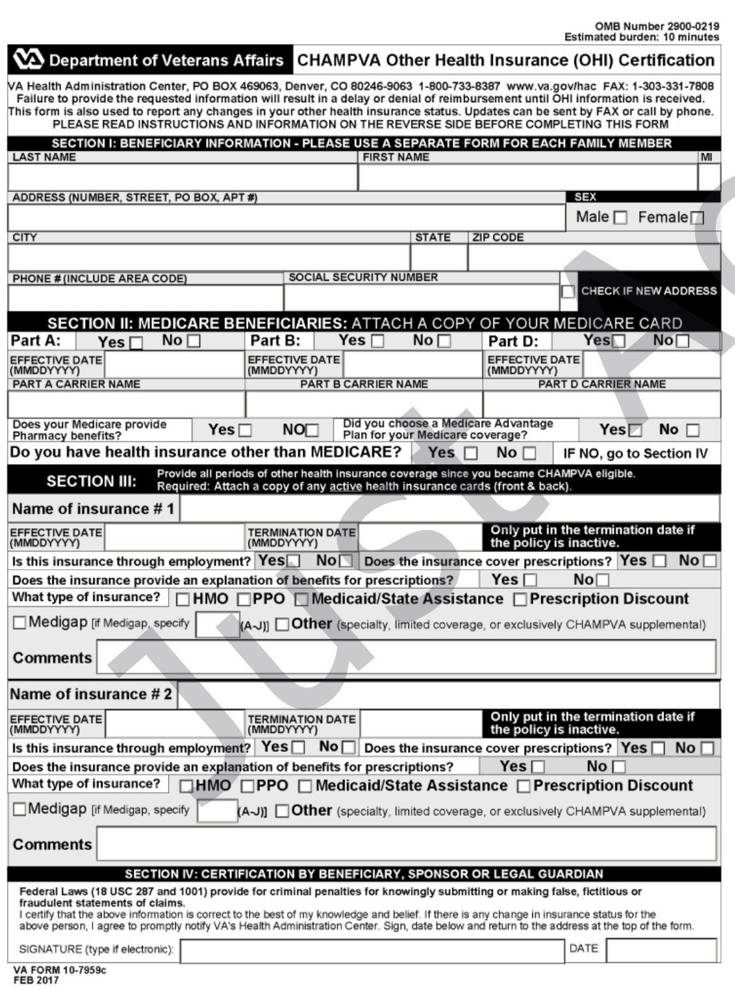
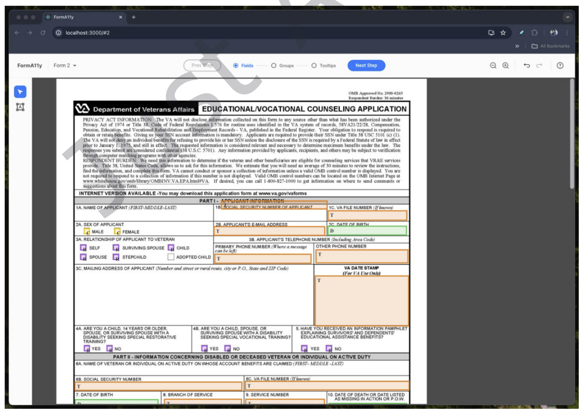

::: {style="position: fixed; font-size: 4em; color: gray;"}
Example Article Presentation
:::

# Article: *FormA11y - a tool for remediating PDF forms for accessibility*

## Goal
This paper focuses on one aspect of PDF remediation: interactive forms, which are hard to fill out.

## Authors
The authors of @Paliwal2024 include three people from Adobe Research (almost all remediation today is accomplished using Adobe Acrobat)

The authors also include one of the most prominent scholars in digital accessibility who is also the author of a leading HCI research methods textbook.

The remaining authors are at the University of Maryland, HCIL, a leading HCI college department and MIDA, a leading center for digital accessibility

## Background
- A11y is common shorthand for Accessibility, which has 11 letters
- PDFs are generally not accessible to blind and low vision (BLV) audiences
- Interactive forms are generally not accessible to people with mobility issues
- Screen readers are the main tool used by BLV people
- Screen readers don't work on most PDFs
- Most of the work on PDF accessibility is for PDFs to be read not interactive forms
- Remediation is the act of tagging a PDF so screen readers can follow it
- Remediation is usually accomplished with the woefully inadequate Adobe Acrobat

## Skimming the paper
- I first skimmed the paper, reading the abstract and looking at the figures and tables
- This is how I learned that the paper is about interactive forms
- I also learned that the tool is being compared to Acrobat, a low bar
- There is an expensive plugin for Acrobat, called CommonLook Pdf, from a company called A11yant, that is a much better tool than Acrobat
- For example, Acrobat only recently added an undo feature to its remediation tool!
- The paper is long and looks like a deep, years-long effort
- I expect the paper to be cited extensively in future

## Lit review
- The lit review mainly covers remediation of research papers
- They explore several efforts by conferences to encourage / enforce remediation
- They explore campus initiatives to limit the use of PDFs
- They don't mention the problems with the main alternative, html
- The lit review provides some very outdated information, as far as I know, about Microsoft Word
- They explore two main tools, PAVE and Acrobat, noting that both are hard to use and Acrobat is expensive (PAVE is free)
- They also cover legal issues, which are important but poorly understood by PDF authors

## Remediation challenges
- There is no intuitive process currently
- The process is highly repetitive
- Forms have high information density

## A typical challenging form

## Building the tool
- FormA11y is an extension of an earlier effort, A11y, which was a PDF remediation tool that did not cover interactive forms
- Practical use would require blending A11y and FormA11y for an end-to-end solution
- Used twenty pilot tests over several iterations
- Started with Figma prototypes
- Figma didn't work well for interaction, so switched to Web app using ReactJS
- Designed the tool to match the process step-by-step

## FormA11y Web App

## Further building
- Assumes an algorithm already run predicts tags and that may make mistakes
- User step one is to check size and position and type of fields
- User step two only concerns checkbox and radiobox fields, and allows editing of group status, e.g., male / female
- User step three adds tooltips
- User step four seems to be review

## Features of the tool
- Color coding
- Showing only necessary elements
- misspelled et al. as et. al. (don't do that!)

## Evaluation
- *Extremely* detailed evaluation section
- 20 participants, 4 expert 16 novice
- Used two forms, each two pages
- Included errors made by Acrobat
- All users used FormA11y and Acrobat
- Used counterbalancing
- Studied time and task performance and user experience
- Used precision and recall to measure performance
- Used SUS for user experience

## Results
- FormA11y took mean 12 min to do what took Acrobat 31 min!
- Significantly fewer errors with FormA11y using Wilcoxon Signed-Rank Test
- Also reported better RMSE and MAE along with precision and recall
- Separately checked field errors, group errors, and tooltip errors with consistent results across all three
- SUS score was subpar for Acrobat (45.6, where anything below 70 is subpar) and 83.4 for FormA11y
- Much smaller standard deviation for FormA11y (7.7 vs 19.5)

## Limitations
- Interviewed only two experts
- Found shortcomings in FormA11y (confusion in grouping)
- Form design makes some work harder

## Future Work
- End-to-end tool needed
- Extend FormA11y to handle more form types
- Extend FormA11y to learn from first few pages

## Coda
- Funding provided by HHS and Adobe Research
- Trump yesterday "paused" all HHS funding
- Maybe Adobe Research will pick up the slack
- Paper is exemplary in method
- Paper highlights difficulty of doing practical work
- Paper provides a good intro into PDF remediation

---

::: {style="text-align: right; font-size: 300px; font-weight: bold;"}
END
:::

# References

::: {#refs}
:::

# Colophon

This slideshow was produced using `quarto`

Fonts are *Roboto Light*, *Roboto Bold*, and *JetBrains Mono Nerd Font*

