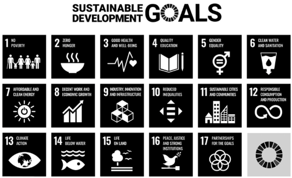
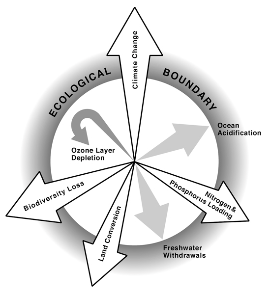
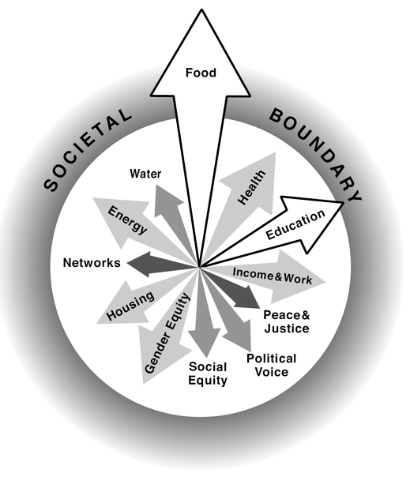
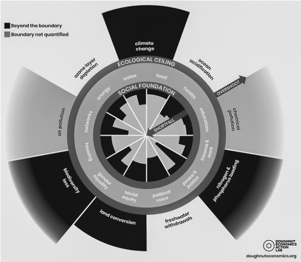

# [Design for a Better World]{.r-fit-text}

@Norman2023

# Sections

- @Norman2023, I: Artificial
- @Norman2023, II: Meaningful
- @Norman2023, III: Sustainable
- @Norman2023, IV: Humanity Centered
- @Norman2023, V: Human Behavior

# Don Norman's book
I'm deeply moved by a recent book called *Design for a Better World*, so I'd like to take some time to discuss it.

##

[Artificial]{.r-fit-text}

## Artificial
Don Norman tells us that most of what we experience is artificial. Do you believe that? Stop to consider the things you think of as natural versus the things you think of as artificial.

## Artificial things

- manicured lawns---they make life easier for some organisms and harder for others
- organization of work---originated with the construction of the pyramids and often mistaken for natural
- profit motive---generally considered the natural point of business, regardless of its harm to people and the Earth

## Norman frames choice as design
Norman puts design at the center of human activity, saying that when we make choices, we are designing things. Do you believe that? Are other perspectives equally valid? In the film, *The Graduate* (1967), a man tells the eponymous character that he need remember only one word, *plastics*. I've heard similar advice about the word *sales*, and *the web*, and *AI* $\ldots$

## Designers have a special responsibility
We design things that fill landfills because they are hard to repair or reuse or because they are meant to become obsolete, because of the values we champion through our designs.

## History doesn't repeat but must be learned from
Do you believe that? What is your view of history? Mostly WEIRD (Western, Educated, Industrial, Rich, Democratic)? What were you taught? Western enslavement of others to build a dominant position in the material world?

## Modernity
The Chicago World's Fair of 1933 spelled out modernity's principles as the themes: "Science discovers, genius invents, industry applies, and man adapts ..."

Humanity has become a second-class citizen to technology through the philosophy of modernity.

## Design for real people in real situations
"There are professions more harmful than design, but only a very few of them" says Norman, paraphrasing Victor Papanek in *Design for the Real World*. He blames the designer for gaudy, expensive, resource-wasteful stuff. Do you believe that? What do you expect to design? For whom will you design?

## The philosophy of modernity emphasizes the new
The old is inferior. Do you believe that?

The philosophy of modernity emphasizes science, technology, rational thought, with a less emphasis on people, humanity, and nature.

::: {.notes}
The concept of modernity became popular during the Great Depression (roughly 1929 to 1939). It was a time of terrible poverty and rethinking of values. It led to decades of optimism about technology and technology's ability to make our lives better. If you have known anyone who grew up during that time, e.g., my parents, you can easily see how it shaped their values.
:::

## Why do I resonate with Norman's ideas?
I lived through the *Reagan Revolution*, a time when the president convinced the people that, if we empower the rich, they will take care of everyone else through *trickle-down*. Is that what happened?

::: {.notes}
Most economists agree that it did not. In fact, we are at the end of the era when people thought that way. If you believe in *trickle-down* you are part of a very small minority. Yet, in the USA, we've just elected a president who preaches it! Seventy-seven million people voted for him (and seventy-five million for his opponent) yet surveys show that people overwhelmingly disbelieve *trickle-down* economics.
:::

## Artificial perception of time
Norman poses two questions:

1. Why look at the calendar to determine the change of seasons instead of looking at the weather?
2. Why look at the clock to decide when to eat instead of relying on our stomach's feelings?

::: {.notes}
There is nothing natural about four seasons. This is an idea imposed by the WEIRD on everyone else, who defined anywhere from two to six seasons, sometimes, as in the case of Australian Aborigines, differing from village to village. Uniformity was a goal of modernity.

The demands of industry lead to the regulation of life by clocks.
:::

## Capitalism went wrong
If I say that, am I automatically a communist? Do I need Karl Marx to know that industry avoids the true cost of manufacturing? Industry releases poison into the air and water. People pay through illness and poor living conditions. Industry does not pay for wearing out roads with heavy trucks. Industry does not pay for infrastructure it needs, except through taxes borne by everyone.

You have lived through the economic collapse of 2008 and the government bailout, and have lived with the consequences ever since. Is it wrong to say capitalism has failed and needs to be repaired? Or is the only repair to rebel and adopt the discredited model of the Soviets?

::: {.notes}
The novel *The Godfather* has the space to explore many things too detailed for the movie of the same name. One is the Godfather's trucking company, which exceeds the weight limits of the roads it traverses by bribing officials. The Godfather's road construction company then also bribes officials to get the contracts to repair the roads damaged by its own trucks.
:::

## An aside: is it anti-American to try to repair America?

- We have the industrial world's shortest life expectancy---we used to have the longest
- We have the industrial world's highest child poverty rate---we used to have the lowest
- We have the industrial world's lowest literacy rate---we used to have the highest

::: {.notes}
I've recently checked the first two and verified that they are still true. I have not checked the third.
:::

## Discussion of the Artificial section
Questions and comments raised by students on this material.

## Bringing it together
How does this material tie holistically into HCI and Design (Thinking)

## Natural vs Artificial; Old vs New
This leads me to ask? Is the question of natural vs artificial in the same category as the prompt - "Is old
considered inferior?" A lot of times people attribute natural to being superior and artificial to inferior. Although one
can argue that 'old is superior' in some situations but for some reason and maybe psychologically, we tend to
resist new technology and designs. We always lean towards the old way of doing things.

::: {.notes}
resistance to change

superiority of natural

labeling things as natural
:::

## Materialism
Is it possible to survive in today's world without contributing to materialism in ANY way?

::: {.notes}
How do you define materialism? Is it growth and planned obsolescence? Is it lack of spiritualism? Is it emphasis on products?

Can't have a career if you're too far outside the mainstream. In my high school, exactly one student had parents who forbade all television (similar to banning social media today but much more rare). She dressed strangely and somehow looked different, and at our twenty year reunion she had no career or even job.
:::

## Combating society's ills
What can we do in society to combat the issues brought up today?
In order to fix America, we need change. However, any change that is suggested is labeled as socialism.
Examples include improving education, improving healthcare, more regulation to ensure a cleaner environment.
How much does societal and cultural perspectives shape our understanding of what is considered "modern"?

::: {.notes}
"What can designers do?" is the question Norman will try to answer in later chapters.
:::

## Questions lead to design?
I am wondering where some of the questions lead to (eg. artificial vs natural), and how they are gonna effect
design.

::: {.notes}
Is this practical or will it just be food for thought? Norman will try, in ensuing chapters, to make it practical for designers but, to set the stage, he believes he has to show that design is a bigger picture idea than what the average designer may think.
:::

## Regulatory environment
If we start focusing on Humanity Center Design, does this mean we need to start building out regulations that are
ethical for design? How do you know what is ethically correct, when there are 8+ different ethical standards out
there?

::: {.notes}
Norman has long championed the idea that designers need to be more like engineers, with standards that qualify them. There are increasing numbers of certifications for designers, but Norman thinks we could go further.

Certainly, the notion of ethics is controversial and people may try to manipulate ethical standards for their own gain. For example, major corporations resist ethics regulations and often spend more money on publicity campaigns to promote an ethical image than on the actual struggle to maintain ethical standards. This is because, in the USA today, profit trumps all other considerations. Can anything stand in the way of profit as our main consideration in life?
:::

## Difference between humanity and human
I am curious how humanity-centered design differs from human-centered design. I expect I will learn more reading
Norman, 2023.

::: {.notes}
How is the collective different from the individual? Many billionaires are buying up properties that will soon be physically under water due to climate change. They see these things as disposable luxuries and seem to believe they can buy their way out of climate change. Can they?
:::

## Previewing the remainder of Norman's book
- Meaningful---many governing metrics are unintelligible to the *average* person
- Sustainable---many artifacts we design are unsustainable, not renewable, not reusable
- Humanity Centered---designers must collaborate with people meet their needs

These themes are tackled in order in the following sections.

::: {.notes}
These themes reflect what design should be and is currently not. If you believe what Norman says, these could become your mantras!
:::

##
[Meaningful]{.r-fit-text}

## Meaning is elusive
- Specialized terminology is legalistic, technical, governmental.
- Unintentional lack of clarity (experts addressing public)
- Intentional (software licenses, web-based accounts)
- Methods: tiny windows, use of all uppercase text

## Scientists explaining climate change
- Scientists dwell on facts that don't grab attention
- Others make dramatic demonstrations, e.g., Manhattan's painted boundary
- Norman advocates simplifying language to explain complexity
- Designers should use rough sketches before making detailed designs

## Measurement
- In physical science, measurement is an essential first step
- People try to measure productivity because it's easy to measure
- Productivity measures don't include quality
- *Not everything that can be counted counts, and not everything that counts can be counted*
- Difficulty, expense prohibit many measurements
- We measure what's easy and cheap to measure and what matters to the ruling class

## Measuring what matters to people
- Hard to do in a lab if including context
- Hard to replicate if context is included
- Scientists often measure young (WEIRD) university students
- Economists use wrong underlying assumptions, e.g., rational behavior
- Economic measures often ignore disease, natural disasters, wars, and trade barriers

## Economic measures
- GDP hides progress in health, education, and happiness indices
- Assumption: people maximize utility! Do you believe that?
- Satisficing (Nobel prize winning concept) violates utility maximization
- Manipulation is everywhere, e.g., three item choices
- Marketing is manipulation

## Cost-benefit analysis and risk management
- Use money as standard for comparison
- Yet one cost is loss of human life
- Hard to evaluate as money, yet people do in effect
- Norman says to stop using money as the standard

## Values of Humanity vs Artificial Measures
- Cost Benefit Analysis and Risk Management tend to favor more expensive buildings, businesses, and homes
- Wealthy always win cost benefit analyses and risk mgt analyses
- If low-income people lose their homes, they may lose their jobs as a result
- Are people equal in the eyes of cost benefit / risk mgt? No, says Norman

## GDP
- Alternatives require subjective measures
- Objective is "better" than subjective even though the things you most care about in the world are probably measured subjectively
- One article said GDP was up, another said people were down ... Why the discrepancy?
- Norman says it's because GDP has nothing to do with our lives

## Criticisms of GDP (top three)
- Emphasizes material output without considering overall well-being
- Counts cost and waste as economic benefits
- Summarizes economic status of a nation as a single number, hiding complexity: opaque, invisible, mysterious, secretive, confusing
- Spending measured by GDP includes causing pollution and cleaning up pollution, as well as large police forces and repairing broken windows

## Replacing GDP
World Economic forum offers five measures

- Good jobs
- Well-being
- Environment (including sustainability)
- Fairness (and equity)
- Health

## Norman's list
- Inclusiveness
- Resilience
- Education
- Societal values
- Quality of governance
- Happiness
- Freedom from hunger

## Other measures
- Gini Index
- GPI (Genuine Progress Indicator)
- HDI (Human Development Index)
- Unfortunately, all use money as the basis

---

::: {.notes}
The UN has a website devoted to these seventeen goals and goes into much detail about how to measure them.
:::

## Measurement scales
- Ratio (e.g., height, weight, Kelvin temperature)
- Interval (e.g., Celsius temperature, Fahrenheit temperature)
- Ordinal (e.g., apples ordered by redness, Mohs hardness scale)

## OECD measure of a better life
- Organization for Economic Cooperation and Development
- Eleven categories of items
- Website lets you manipulate importance of each category

## Information Dashboards
- Often work well at a glance
- Automobile dashboards have changed over time
- Helpful when you need to measure numerous items at the same time

---

---

---

---

## Behavioral Economics
- Formerly disavowed by *utility theory* economists
- Proponents won Nobel Prizes: Herbert Simon, Daniel Kahneman, Richard Thaler
- Now more mainstream

## Stories are better than numbers
- Measurements give facts
- Stories provide meaning
- Meaningful stories are easy to remember

---

“It doesn't matter how complex something is. If people find it meaningful and understandable, they will judge it to be “simple.” “Complexity is a fact of the world, whereas simplicity is in the mind.”

Excerpt From
*Design for a Better World*
Don Norman

##
[Sustainable]{.r-fit-text}

## The age of waste
- The twentieth century was the age of waste
- What can designers do to help?
- Few designers have power to change the system
- No single discipline can solve the problem
- Long-term damage is being done but short-term harm can come if we act precipitously

## How did we get here?
- Ease of manufacturing and ubiquity of plastics in the twentieth century
- Design of short-lived products
- Planned obsolescence of appliances and automobiles
- Ikea!
- The world's data centers used 200 terawatt hours in 2023 (tera is trillion)
- (More than many nations)
- Design for obsolecence uses three techniques: breakdown, progress, and fashion
- Many ingredients (plastics) are useless to recycle

## Sustainability's multiple components and implications, 1 of 2
- Over 1m plant and animal species are threatened with extinction
- STEM is not the answer, local expertise is never enough
- We need STEAM, humanities, social sciences, economics, politics, law ...
- SEM are focused on narrow technical problems, T on economics and business
- No one can predict all impacts long term, e.g., horses vs cars
- T enables a surveillance society; empowers extremists

## Sustainability's multiple components and implications, 2 of 2
- Universities produce narrow specialists (does the iSchool?)
- Shouldn't education be lifelong and in small blocks?
- To be tolerant, we must be intolerant of the intolerant

## Design, Products, Sustainability, and the Circular Economy
Take $\rightarrow$ Make $\rightarrow$ Waste

How about Repair $\rightarrow$ Reuse $\rightarrow$ Regenerate?

## Circular Economy requires Circular Design
1. Minimize waste and pollution
2. Keep products in use as long as possible
3. Regenerate natural systems

## Design implications of above principles
1. Consider waste and pollution as design flaws rather than inevitable
2. Design for reuse, repair, and manufacturing (even of packaging!)
3. Avoid landfills

## Practical Difficulties of Implementing Circular Design
- Designers aren't trained in materials
- Companies will resist
- Recycling is hard for people to understand
- Recycling often degrades the molecular structure of materials
- Deemphasize but improve recycling and emphasize reuse instead
- Make companies pay for waste (!?) instead of public or gov't
- Talk to companies (Norman gives examples of how)

## Sustainable, Robust, and Resilient Systems
- All three ingredients are important
- Resilience is a system's ability to maintain its operation through adverse conditions
- Redundancy develops resilience, e.g., in commercial aircraft controls
- Tightly coupled systems are controllable and efficient, but not in emergencies
- JIT has little resilience, little redundancy, and COVID, the Ukraine war, and critical fires and earthquakes brought down the world's supply chains
- Loosely coupled systems are more resilient, but harder to control, e.g., universities, the Internet, governments

## How people understand systems
- People view the world in a highly oversimplified cause and effect manner
- Okay for hunter-gatherers, where false positives have little consequence
- Sakichi Toyoda, father of Toyota, coined the "Five Whys" technique for getting at linear cause-and-effect relationships
- Five Whys is a linear model and won't work for complex systems
- Norman prefers the NTSB (National Transportation Safety Board) method
- The NTSB method reveals multiple causal factors and poor management is the most common factor

## Myth of the Infinite Earth
- Formerly common to believe that the Earth was infinite and that there was no need to conserve resources
- When there a only a few people on Earth, you could get away with this belief
- Not when there eight billion people on Earth!
- Example: air conditioners heat the atmosphere more than they cool the house
- Prime minister of Barbados said in 2021 that 2° C temperature increase would be a death sentence for nine nations

## Working with Complex Sociotechnical Systems
- People understand simple linear systems, but not when there are delayed effects, and multiple feedback and feedforward loops and non-linearities
- Norman reviews cybernetics, the science of feedback (among other things)
- Norman doesn't talk about emergent properties of complex systems for some reason
- Example: rethinking the design of homes and buildings

## It's not too late
- Okay, actually it is too late to stop some major damage, but not too late to stop the trend and reverse it
- Necessary ideas are already known (since Alexander von Humboldt in 1800 and 1831)
- Current efforts are too small and too slow and need to be amplified worldwide

##
[Humanity Centered]{.r-fit-text}

## Human-Centered Design Principles
1. Solve the core, root issues, not just the problem as presented (which is often the symptom, not the cause).
2. Focus on the people.
3. Take a systems point of view, realizing that most complications result from the interdependencies of the multiple parts.
4. Continually test and refine the proposed designs to ensure they truly meet the concerns of the people for whom they are intended.

## Humanity-Centered Design Principles, 1 of 2
1. Solve the core, root issues, not just the problem as presented (which is often the symptom, not the cause).
2. Focus on the entire ecosystem of people, all living things, and the physical environment.
3. Take a long-term, systems point of view, realizing that most complications result from the interdependencies of the multiple parts and that many of the most damaging impacts on society and the ecosystem reveal themselves only years or even decades later.

## Humanity-Centered Design Principles, 2 of 2
4. Continually test and refine the proposed designs to ensure they truly meet the concerns of the people and ecosystem for whom they are intended.
5. Design with the community and as much as possible support designs by the community. Professional designers should serve as enablers, facilitators, and resources, aiding community members to meet their concerns.

## Community-Driven Design
- Designing *with* the community
- Designing *for* the community
- Planners vs Searchers
- Democratizing design (makers / diy)
- Muddling through (incrementalism)

##
[Human Behavior]{.r-fit-text}

## Why change is difficult
- Changing beliefs takes time: Women's suffrage took from 1848 to 1920
- Emotion is as powerful as reason
- People respond to disasters but don't prevent them
- Climate change and pandemics exemplify slowness of response
- Successful actions often show no visible result

## People will mobilize for a common goal
- People mobilize for war, why not against climate change or pandemics?
- 44m people believe the US gov't is secretly controlled by Satanist pedophiles
- Many people disbelieve scientists and rely on con men
- These are barriers to change

## What must change?
- Balance between work and family, rooted in the origins of the industrial revolution
- Changing from a job to an occupation
- Education: becoming flexible (Don't Look Up, 2021)
- Grades for students (switch to pass / fail)
- Politics (book was written in 2023)
- Reward structures (industry and academia have bad ones)

## Dominance of technology
- Treating people as servants of machines
- Tech-centered approach treats human virtues as deficits
- Focus, curiosity, mind wandering, mental addiction

## Future of technology
- It's hard to predict things, especially the future (Yogi Berra)
- Miniaturization
- Energy
- Biotech
- Money
- Intelligence Amplification


