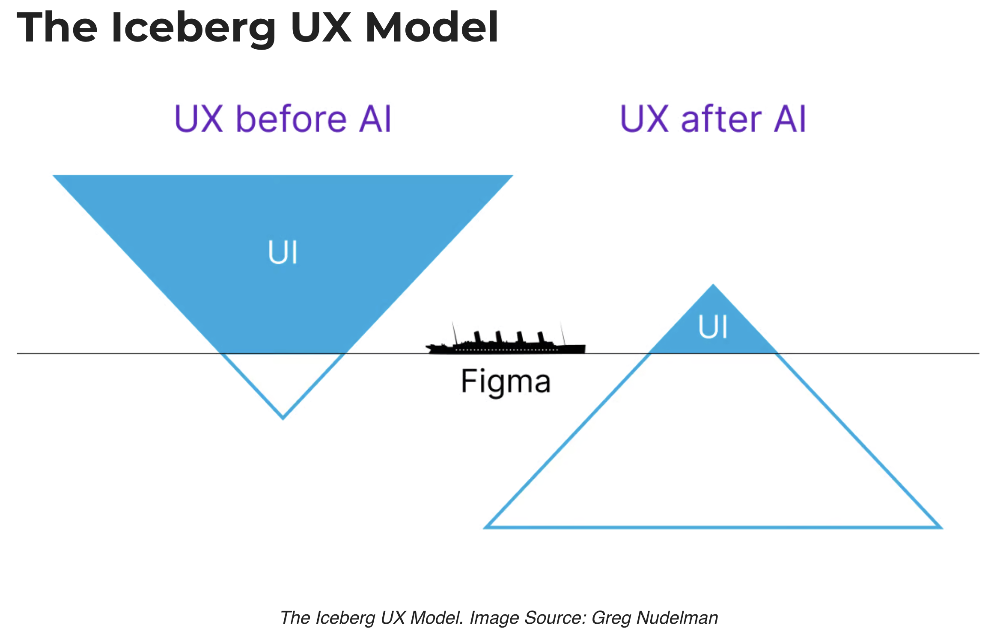

::: {style="position: fixed; font-size: 4em; color: gray;"}
Article Presentation
:::

# Article: *HCI for AGI*

## But first ...

## A contemporary scare tactic

## Goal
@Morris2025, a non-peer-reviewed paper in a prominent HCI practitioner publication, speculates about the future of human computer interaction in the coming age of artificial general intelligence (AGI)

## Author
Merry Morris is a researcher at Google DeepMind, a subsidiary of Alphabet, the parent company of Google

Last week, DeepMind released what they claim is the world's top reasoning genAI, Gemini 2.5 Pro (see, for instance [https://lmarena.ai/?leaderboard](https://lmarena.ai/?leaderboard))

## Background
Predictions for the advent of AGI range from yesterday to ten or more years from now. Current thinking seems to be that it will resemble the generative AI systems of today.

## Skimming the paper
Morris divides the paper into the following sections:

- interaction techniques
- interface designs
- physical form factors
- design methods
- evaluation methods
- benchmarking approaches
- data collection techniques

## Interaction techniques
- Morris sees prompt engineering as a current area of expertise
- prompt marketplaces are a major platform
- brain computer interfaces (BCIs) may soon be feasible
- Wizard of Oz studies will prepare the way for BCIs
- implicit interactions will result from AI having access to a wide range of data sources
- AI will have access to preference and interaction histories
- personalization will be easier to achieve (but at what cost?)

## Interface designs
- Morris mentions the execution and evaluation gulfs of @Norman2013
- She adds a third gulf, the *process* gulf, because AI executes tasks in a different way than humans and in a way that is not easily interpretable by humans
- E.g., Stable Diffusion refines noise to generate images (possibly not the way forward, though, for image generation)
- the gulf of evaluation is problematic because AI may be able to complete tasks for the user that are beyond the user's capabilities, making the outcomes difficult to evaluate
- the gulf of execution is problematic because of the myriad non-obvious ways in which the user can communicate intent---this is already a struggle in prompt engineering

::: {.notes}
The gulf of execution, according to @Norman2013, refers to the challenge of conveying intent to a computer to execute, while the gulf of evaluation refers to the challenge of evaluating the extent to which the computer carried out that intent.
:::

## Anthropomorphism
- People tend to anthropomorphize all new technologies
- This is especially problematic for AI, because it does not operate like a human
- People may overly trust an anthropomorphized AI
- People may form unhealthy parasocial relationships with AI
- Addictiveness, inappropriate attachment formation, and other mental health issues may take a long time to surface, so longitudinal studies will be needed
- Some groups, such as children, neurodivergent individuals, and people facing mental health challenges, may be especially vulnerable to these problems
- Generative ghosts may be more of an issue for the recently bereaved

## Physical form factors
- The Humane AI pin was an early, failed attempt at a physical form factor for an AI assistant---why did it fail?
- How can we design a physical form factor without negative social contingencies?
- E.g., smartphones reduce eye contact and shared points of reference for groups of people
- The many possibilities include audio and haptic feedback, augmented reality, and tangible computing devices
- Note from Mick: watch blind users interact with screen readers and you will see that much more sophisticated audio and haptic feedback is possible

## Design methods
- Morris suggests *green teaming*, based on the idea of red teaming but in reverse
- Instead of generating adversarial examples, the green team would generate positive examples
- Will AI introduce new design methods of its own that obsolete our current methods? Morris suggests that we should revisit examples of previous advances in HCI, such as GUI toolkits and the practices they made obsolete
- Note from Mick: Don't humans still need to communicate their preferences to AI assistants? Whether we do that through Figma or other methods, we need a fine degree of control over the results---vague specifications are not enough

## Evaluation methods
- Morris notes controversy about the use of AI evaluators (usually called synthetic evaluation methods), some saying it may improve quality of evaluations and others saying it may undermine our values as a human-centered profession
- Note from Mick: Human preference and the alignment with it is the current gold standard in evaluation; it's easy to imagine a thought experiment where you ask AI to determine a solution to climate change, but the AI assistant suggests killing all humans
- Note from Mick: A gen AI tool (I think it was Grok) recently suggested executing Donald Trump and Elon Musk, provoking some controversy
- Morris seems optimistic about synthetic evaluation methods, hoping that they will better serve underrepresented groups, but notes that WEIRD constituencies are probably better represented in training data

## Benchmarking approaches
- Can we develop a benchmark from classic user studies? (Morris thinks it could accelerate synthetic evaluation)
- Almost all current benchmarks of AI are quantitative and easy to automate, e.g., Big-bench and MMLU
- Current benchmarks don't measure safety and usefulness
- Morris suggests that HCI practitioners should use their expertise to develop benchmarks with *ecological validity*, using qualitative data

## Data collection techniques
- The machine learning community has designed crowd-powered interfaces, such as reinforcement learning from human feedback (RLHF)
- *Model collapse* occurs when a model is trained on too much synthetic data, so there's still a need to gather high quality data and to develop the required interfaces
- Morris suggests collecting data from users of low-resource languages (Note from Mick: but not everyone agrees!)
- Morris acknowledges the concept of *data dignity* and admits that it's possible to unintentionally exploit stakeholders in underrepresented groups
- All kinds of biases are possible in data and Morris doesn't yet have answers for this (Note from Mick: no one else does either as far as I can tell)

## Limitations
- Morris does not question the economics of AI
- If you train an AI assistant, who captures the benefit of it, you or your employer?
- Should you have your own AI assistant that follows you from job to job, or should your employer have an AI assistant that works with whomever is in your current job?

## Coda
Check out [https://news.ycombinator.com/item?id=43484944](https://news.ycombinator.com/item?id=43484944) for examples of current interfaces to gen AI and some critiques thereof

---

::: {style="text-align: right; font-size: 300px; font-weight: bold;"}
END
:::

# References

::: {#refs}
:::

# Colophon

This slideshow was produced using `quarto`

Fonts are *Roboto Light*, *Roboto Bold*, and *JetBrains Mono Nerd Font*

