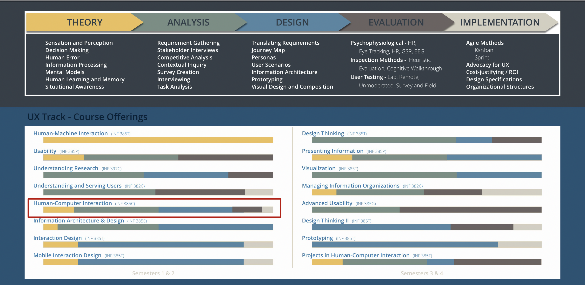

::: {.r-fit-text}
Week ONE
:::

---

::: {.r-fit-text}
*hello*
:::

# Who am I?
Call me Mick. I am in my second year at UT-Austin, but have been a professor elsewhere since 2004. I do research, mainly in accessibility, and teach in HCI and data science. In my spare time I play the Irish Uilleann pipes, flute, and do woodworking. I have a wonderful family including two adorable teenagers.

# Who are you?
Let's go around the room and have you introduce yourselves and say a bit about yourselves.
Try to tell at least one interesting thing about yourself and tell what you'll be doing for a living in five years.

# What are we doing?
We're following the syllabus. If you look under week one, it says *In class introductions*. There is an *In class* item (or items) every week. There are also topic items, reading items, and assignment items.

## Altogether it looks like this

[Week 1 (16 Jan)]{.weekn}
Introduction ---
What is HCI / UX? ---
UX lifecycle ---
Read @Hartson2019: Ch 1, 2, 4 ---
Read @Norman2013: Ch 1 ---
In class: introductions,
discuss @Norman2023, Section 1, artificiality ---
Assignment: HCI background questions (not graded)

## So you can see ...
... that our schedule is packed!

There's a lot of reading in this class, some writing, some presentation, and some use of typical UX tools.

# What do we have to work with?
- Syllabus
- Canvas site
- My personal website

So let's look at each of those in turn ...

$\langle$ pause slideshow to look at three things $\rangle$

# Next, what is HCI / UX?
::: {.incremental}
- HCI has been a field of study since the early 1980s
- UX is a term that is replacing HCI in the minds of many people who want to emphasize the *context* of the human computer interaction
- Early HCI was promulgated mostly by cognitive psychologists, so we have to study a bit of cognitive psychology to understand where they were coming from
- HCI is one of three similar disciplines in universities, the other two being Human Factors in engineering schools and MIS in business schools
:::

## More on what HCI is
- Early HCI researchers were focused on the interface between a single idealized user and a desktop computer
- Gradually, the words *interface*, *single*, *idealized*, and *desktop* got dropped as researchers began to consider workgroups of people, casual users, communities of users, computers with different form factors, and "invisible" computers that operate appliance, automobiles, and many of the machines we use. This transition was driven mostly by the plummeting costs of computers

# UX lifecycle

::: {.notes}
This slide introduces a notion that I disagree with! Why would I present that to you? There are two sections of this course, the other one being taught in the Fall semester by Jacek Gwizdka. I have tried to keep my class somewhat in sync with his so that students get the same education no matter from whom they take the class. So I will present some ideas with which I disagree and you should be glad of getting a critical look at these ideas. Here, for instance, we see a waterfall model, that is a sequential model of UX. I subscribe to the iterative model, although the sequential model is often used for large, expensive software projects. Typically, it's used where multiple vendors are involved and there must be a signoff at each stage, agreeing that the stage has been completed.
:::

# Readings
Readings this week include  @Hartson2019: Ch 1, 2, 4 and
@Norman2013: Ch 1. These are pretty serious readings and you need to carve out time to devote to them. In addition, the readings in future weeks have to be done before class, not after. We're only saving these readings for after class because it's the first week.

# Assignment
The only assignment this week is to do the HCI questionnaire. Please do it now.

$\langle$ pause to allow time to do the questionnaire $\rangle$

# Don Norman's new book
I want to depart a bit from past practice, where I used to always try to teach the same material as the other instructor for this course. I'm deeply moved by a recent book called *Design for a Better World*, so I'd like to take some time each week to discuss it.

## Artificial
Don Norman tells us that most of what we experience is artificial. Do you believe that? Stop to consider the things you think of as natural versus the things you think of as artificial.

## Artificial things

::: {.incremental}
- manicured lawns---they make life easier for some organisms and harder for others
- organization of work---originated with the construction of the pyramids and often mistaken for natural
- profit motive---generally considered the natural point of business, regardless of its harm to people and the Earth
:::

## Norman frames choice as design
Norman puts design at the center of human activity, saying that when we make choices, we are designing things. Do you believe that? Are other perspectives equally valid? In the film, *The Graduate* (1967), a man tells the eponymous character that he need remember only one word, *plastics*. I've heard similar advice about the word *sales*, and *the web*, and *AI* $\ldots$

## Designers have a special responsibility
We design things that fill landfills because they are hard to repair or reuse or because they are meant to become obsolete, because of the values we champion through our designs.

## History doesn't repeat but must be learned from
Do you believe that? What is your view of history? Mostly WEIRD (Western, Educated, Industrial, Rich, Democratic)? What were you taught? Western enslavement of others to build a dominant position in the material world?

## Modernity
The Chicago World's Fair of 1933 spelled out modernity's principles as the themes: "Science discovers, genius invents, industry applies, and man adapts ..."

Humanity has become a second-class citizen to technology through the philosophy of modernity.

## Design for real people in real situations
"There are professions more harmful than design, but only a very few of them" says Norman, paraphrasing Victor Papanek in *Design for the Real World*. He blames the designer for gaudy, expensive, resource-wasteful stuff. Do you believe that? What do you expect to design? For whom will you design?

## The philosophy of modernity emphasizes the new
The old is inferior. Do you believe that?

The philosophy of modernity emphasizes science, technology, rational thought, with a less emphasis on people, humanity, and nature.

::: {.notes}
The concept of modernity became popular during the Great Depression (roughly 1929 to 1939). It was a time of terrible poverty and rethinking of values. It led to decades of optimism about technology and technology's ability to make our lives better. If you have known anyone who grew up during that time, e.g., my parents, you can easily see how it shaped their values.
:::

## Why do I resonate with Norman's ideas?
I lived through the *Reagan Revolution*, a time when the president convinced the people that, if we empower the rich, they will take care of everyone else through *trickle-down*. Is that what happened?

::: {.notes}
Most economists agree that it did not. In fact, we are at the end of the era when people thought that way. If you believe in *trickle-down* you are part of a very small minority. Yet, in the USA, we've just elected a president who preaches it! Seventy-seven million people voted for him (and seventy-five million for his opponent) yet surveys show that people overwhelmingly disbelieve *trickle-down* economics.
:::

## Artificial perception of time
Norman poses two questions:

1. Why look at the calendar to determine the change of seasons instead of looking at the weather?
2. Why look at the clock to decide when to eat instead of relying on our stomach's feelings?

::: {.notes}
There is nothing natural about four seasons. This is an idea imposed by the WEIRD on everyone else, who defined anywhere from two to six seasons, sometimes, as in the case of Australian Aborigines, differing from village to village. Uniformity was a goal of modernity.

The demands of industry lead to the regulation of life by clocks.
:::

## Capitalism went wrong
If I say that, am I automatically a communist? Do I need Karl Marx to know that industry avoids the true cost of manufacturing? Industry releases poison into the air and water. People pay through illness and poor living conditions. Industry does not pay for wearing out roads with heavy trucks. Industry does not pay for infrastructure it needs, except through taxes borne by everyone.

You have lived through the economic collapse of 2008 and the government bailout, and have lived with the consequences ever since. Is it wrong to say capitalism has failed and needs to be repaired? Or is the only repair to rebel and adopt the discredited model of the Soviets?

::: {.notes}
The novel *The Godfather* has the space to explore many things too detailed for the movie of the same name. One is the Godfather's trucking company, which exceeds the weight limits of the roads it traverses by bribing officials. The Godfather's road construction company then also bribes officials to get the contracts to repair the roads damaged by its own trucks.
:::

## An aside: is it anti-American to try to repair America?

::: {.incremental}
- We have the industrial world's shortest life expectancy---we used to have the longest
- We have the industrial world's highest child poverty rate---we used to have the lowest
- We have the industrial world's lowest literacy rate---we used to have the highest
:::

::: {.notes}
I've recently checked the first two and verified that they are still true. I have not checked the third.
:::

## Previewing Norman's book
::: {.incremental}
- Meaningful---many governing metrics are unintelligible to the *average* person
- Sustainable---many artifacts we design are unsustainable, not renewable, not reusable
- Humanity Centered---designers must collaborate with people meet their needs
:::

These themes are tackled in order in the following sections (and in our following weeks).

::: {.notes}
These themes reflect what design should be and is currently not. If you believe what Norman says, these could become your mantras!
:::

# Conclusion
I don't plan to go over the syllabus in detail in future lectures. I expect you to use it daily or weekly to stay up to date with the readings and assignments. If you're not opening the syllabus every week, you're in trouble.

# References

::: {#refs}
:::

---

::: {.r-fit-text}
END
:::

# Colophon

This slideshow was produced using `quarto`

Fonts are *League Gothic* and *Lato*

