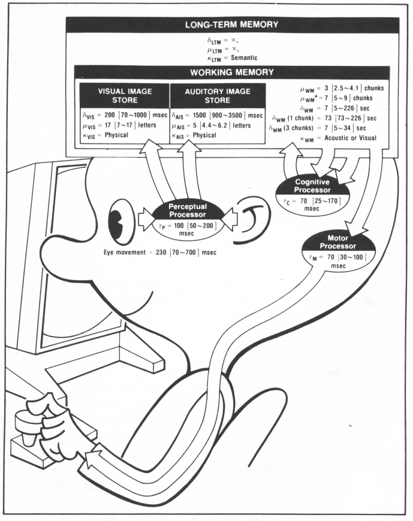
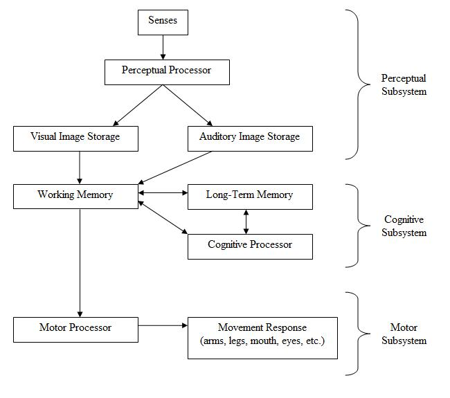

::: {.r-fit-text}
Week THREE
:::

# Today

- Q and A from last time
- Design Critique (Ishwari)
- Article Presentation (Maggie)
- Cognition (Mick)
- Discussion leading (Mick)
- @Norman2023 (Mick)

# Q and A from last time

## Measurement
Since Norman mentioned measure and measurement in his new book, is there any other measurement he mentioned about as a non-ideal measurement of the world instead of GDP?

## Positive decisions
Norman puts design at the center of human activity, saying that when we make choices, we are designing things. How do we know that the decisions we make are positive designs and can find inspiration to promote society?

## Career paths
Do certain career paths point us towards opportunities to design for humanity rather than Individual humans?

## Group work
The group work is still a bit hazy in terms of what the deliverable will

## Information dashboards
In regards to information dashboards, Nielson [sic] mentions that automobile dashboards have changed over time. However, have they become simpler or complex?

## Cognitive illusions
I really want to understand more about how our brain was functioning that we could not really notice when the gorilla walked passed in the video. I went ahead and saw that video later and it was surprising how the human mind works. While focusing on the task, many people completely miss a person in a gorilla suit walking through the scene, beating their chest. It’s such a brilliant way to show how we can overlook the obvious when our attention is elsewhere. How does selective attention impact our ability to process unexpected or irrelevant stimuli, and what does this reveal about the limitations of human perception?

## Advocacy
How can we advocate for change or ethical design, especially when it might not be the most profitable?

## Replication
Have other researchers who have not been able to replicate Kahneman's experiment been able to provide a reasoning for why it cannot/has not been replicated? Was his experiment flawed in some type of way?

## Wikipedia take on Replication
Part of the book has been swept up in the replication crisis facing psychology and the social sciences. It was discovered many prominent research findings were difficult or impossible for others to replicate, and thus the original findings were called into question. An analysis[50] of the studies cited in chapter 4, "The Associative Machine", found that their replicability index (R-index)[51] is 14, indicating essentially low to no reliability. Kahneman himself responded to the study in blog comments and acknowledged the chapter's shortcomings: "I placed too much faith in underpowered studies."[52] Others have noted the irony in the fact that Kahneman made a mistake in judgment similar to the ones he studied.[53]

## More from Wikipedia
A later analysis[54] made a bolder claim that, despite Kahneman's previous contributions to the field of decision making, most of the book's ideas are based on 'scientific literature with shaky foundations'. A general lack of replication in the empirical studies cited in the book was given as a justification.

## Wikipedia cites the following article
[https://replicationindex.com/2020/12/30/a-meta-scientific-perspective-on-thinking-fast-and-slow/](https://replicationindex.com/2020/12/30/a-meta-scientific-perspective-on-thinking-fast-and-slow/)

# Design Critique (Ishwari)

# Article Presentation (Maggie)

# Cognition
We talked a bit about cognitive psychology last week, particularly about Tversky and Kahneman's work. This week we continue with some historical information.

## Human cognition and emotion, from Norman (2013) pp 49--55

## Levels of emotional design

```{r, engine='tikz'}
\usetikzlibrary{shapes.geometric}
\usetikzlibrary{arrows.meta}
\usetikzlibrary{arrows}
%\definecolor{slidebkgrnd}{rgb}{0.01,0.170,0.210}
%\pagecolor{slidebkgrnd}
\pagecolor[rgb]{0.01,0.17,0.21}
% note: above gets "approximated" to 0.01,0.15,0.20
\begin{tikzpicture}[scale=2,font=\sffamily]
  \node (A) at (0,0)
     [ellipse,fill=red,draw=none,text=white]
     {visceral};
  \node (B) at (1,1)
     [ellipse,fill=red,draw=none,text=white]
     {behavioral};
  \node (C) at (2,2)
     [ellipse,fill=red,draw=none,text=white]
     {reflective};
  \draw [->,>=stealth',shorten >=1pt,semithick,draw=white] (A) -- (B);
  \draw [->,>=stealth',shorten >=1pt,semithick,draw=white] (B) -- (C);
\end{tikzpicture}
```

## Visceral level
basic, similar in all people, recoil from hot stove;
input is immediate present, output is an affective state;
not emotions but precursors to emotions;
dismissed by people who don't believe they are influenced by it;

## Behavioral level
learned skills, subconscious response to patterns;
overall awareness but no conscious awareness of details, e.g., speaking, sports;
conscious of goals while behavioral level handles details;
actions are associated with expectations as well as outcomes and lead to affect, both before and after;

## Reflective level
conscious cognition, deep understanding, reasoning, slow, guilt, pride, blame, admiration;
design takes place at all three levels: high-level cognition can trigger low-level emotion just as low-level emotion can trigger high-level cognition;

## Levels of human processing

```{r, engine='tikz'}
\usetikzlibrary{shapes.geometric}
\usetikzlibrary{arrows.meta}
\usetikzlibrary{arrows}
\definecolor{slidebkgrnd}{rgb}{0.01,0.170,0.210}
\pagecolor{slidebkgrnd}
\begin{tikzpicture}[scale=2,font=\sffamily]
  \node (A) at (0,0)
     [ellipse,fill=red,draw=none,text=white]
     {hardwired};
  \node (B) at (1,1)
     [ellipse,fill=red,draw=none,text=white]
     {short-term};
  \node (C) at (2,2)
     [ellipse,fill=red,draw=none,text=white]
     {abstract};
  \draw [->,>=stealth',shorten >=1pt,semithick,draw=white] (A) -- (B);
  \draw [->,>=stealth',shorten >=1pt,semithick,draw=white] (B) -- (C);
\end{tikzpicture}
```

## More on levels of human processing
Another way to think of these levels is illustrated in the previous frame: hardwired or prewired, short-term, and abstract or contemplative. All three levels play a role in our reactions to our environment, including designed artifacts.

## Model human processor



Baby bubblehead, aka model human processor

::: {.notes}
Treat the user like a computer and the user's work like a program. Break both into cognitive and motor processing components and assess performance time until completion under ideal conditions. That was one of the early approaches to human computer interaction, illustrated in this frame.
:::

## A model human processor schema from wikipedia



::: {.notes}
This frame shows a typical schema used in this early model of human processing, dividing everything into three subsystems. Notice that these three subsystems are a bit less sophisticated than the three levels of emotional design explored in @Norman2005.
:::

## Keystroke level model

Keystroke level model includes

- *operators*, such as key presses, mouse pointing, choosing
- *encoding*, lists of operators and operands for calculating time
- *heuristics*, rules to apply to cognitive operators (e.g., choosing)

::: {.notes}
The model human processor isn't granular enough, so the same people thought of another model, consisting of operators, encoding methods, and heuristics, illustrated in this frame.

Operators include key presses, mouse pointing, waiting, mentally preparing to operate, and a very few others; extended version includes saccades, retrieve from memory, choose among methods, and a few others.

Encoding includes using the operators with operands to record actions and calculate the length of time it takes to perform those actions.

Heuristics include rules that apply to the cognitive operators, such as "mentally prepare".
:::

## Keystroke model limitations

- error
- learning
- functionality
- recall
- concentration
- fatigue
- acceptability

## GOMS

GOMS stands for

- Goals
- Operators (elementary actions)
- Methods (groups of operators)
- Selection rules (to choose methods)

::: {.notes}
Another major theory discussed in textbooks is the Goals,
Operators, Methods, and Selection Rules Model, usually
pronounced as a one-syllable word, GOMS, illustrated in this frame.

This model was
widely studied from the mide eighties to the mid nineties.  The basic
idea is that people form goals and subgoals and think in
terms of elementary actions called operators.  People
group these operators together into methods and form
selection rules to determine which methods will best
achieve goals.  Here's an example to clarify
GOMS.  Suppose I'm using a word processor and
realize I've been incorrectly citing Norman's *Emotional
Design* book when I meant to cite *Design of Everyday
Things*, my *goal* is to correct the same mistake in
several places.  Several *methods* might work, such as
using a find and replace function, or looking through
the stack of recent changes.  I employ *selection
rules* to these *methods*, such as my comfort
level with the find and replace function, or my
awareness that every mistake is near the top of the
stack of recent changes.
Having chosen one of these
*methods* as the best, I employ the
*operators* aggregated
by the chosen *method*.  The *operators* are the specific
keystrokes, mouse movements, or menu choices my
fingers do automatically.

GOMS fits in well with the notions of bounded
rationality and satisficing that were pioneered by
Herbert Simon.  Like those ideas, it lost some favor as
researchers became more interested in studying non
expert users and less interested in the idealized human
described with GOMS and its variants.
As the attention of researchers shifted to topics like
emotion and learning, the number of studies related to
GOMS waned.
Nevertheless, GOMS and its descendants still
occupy an important place, especially in large systems
where great economies of scale can be achieved, systems
that rely on many skilled users,
and critical systems like space vehicle launching and
nuclear power plant operation.
:::

## protocol & verbal analysis

protocol analysis $\rightarrow$ *think-aloud process*

Protocol analysis was an early hci tool

::: {.notes}
The main idea in @Ericsson1984 is to elicit
information from a person *while* they accomplish
a task by asking them to think aloud about the
information they attend to while solving problems, but
not to describe or explain.
:::

## Verbal analysis differs in goals from protocol analysis

verbal analysis $\rightarrow$ *knowledge representation*

::: {.notes}
@Chi1997 contrasts protocol analysis with an
approach designed to elicit the structure of knowledge
of the problem solver, rather than the problem solving
process. This leads to a knowledge representation, as illustrated in this frame.
:::

## Both analyses lead to maps

protocol analysis $\rightarrow$ *process map*

verbal analysis $\rightarrow$ *knowledge map*

::: {.notes}
Both processes result in maps, as seen in this frame, one of a process and one of a knowledge structure.
:::

## Hick's Law

Hick’s law predicts the
time it will take for a user to make a choice, given the
number of choices.

Hick’s law can be expressed as

$$t = b \log_2 (n + 1)$$

::: {.notes}
Here, $t$ is reaction time, $b$ is a constant to be found
empirically, and $n$ is the number of choices with which the
user is confronted. The extra 1 represents the concept *none
of the above*.

This law has influenced the development of menus in computers and the number of choices that are offered in each submenu. The shape of a menu tree is a reflection of Hick's law.
:::

## Fitts's Law

Fitts's law was actually discovered by Paul Fitts in the 1950s, but has been applied to the use of mice and other pointing devices as well as screen layouts since. It is perhaps the most widely invoked theory in the world of human computer interaction, and is depicted in the next frame.

## Fitts's law formulation

$$t = a + b \log_2\left(\frac{D}{W} + 1\right)$$

::: {.notes}
where $t$ is time, $a$ is start / stop time in seconds
for a given device and $b$ is the inherent time for a
device, $D$ is distance, and $W$ is the size of a
target.  This law, one of the most robust models in
HCI, predicts how long (in seconds) it takes
an adult to point to an object with a given device.
I believe that Fitts's law is the most important theory
in HCI.

Fitts's law is the basis for the original Apple menu bar and Dock, among other influences. By expanding the target, $W$, to be the entire width of the display instead of the current window, the developers of the Dock and menu bar hoped to reduce the time it would take for people to point to them. Contrast this with the situation in Microsoft Windows, where the menu bar is particular to a given window. In this situation, a person must exhibit much finer motor control to point to the menu bar target than to point to a menu bar at the edge of the screen, where $D$ can be any amount without missing the target. In other words, you can push the mouse as hard as you want against the top of the screen: it can't go any further than the top of the screen.
:::

# Discussion

Readings last week include @Johnson2020: Ch 1--5

Readings this week include @Johnson2020: Ch 7--9, @Norman2013: Ch 2, 4

Let's look at the questions and answers from the readings

::: {.notes}
I once worked with a group of junior Naval officers who were required by their commander to be responsible for all the information in their email and military message traffic, some 5,000 items per day. The group got together and devised a strategy of dividing up the material and briefing each other on the points of importance, so that no one person had to read 5,000 items, which would have been physically impossible anyway. You could use a similar divide and conquer strategy on our reading material.
:::

# @Norman2023
::: {.r-fit-text}
Sustainable
:::

## The age of waste
- The twentieth century was the age of waste
- What can designers do to help?
- Few designers have power to change the system
- No single discipline can solve the problem
- Long-term damage is being done but short-term harm can come if we act precipitously

## How did we get here?
- Ease of manufacturing and ubiquity of plastics in the twentieth century
- Design of short-lived products
- Planned obsolescence of appliances and automobiles
- Ikea!
- The world's data centers used 200 terawatt hours in 2023 (tera is trillion)
- (More than many nations)
- Design for obsolecence uses three techniques: breakdown, progress, and fashion
- Many ingredients (plastics) are useless to recycle

## Sustainability's multiple components and implications, 1 of 2
- Over 1m plant and animal species are threatened with extinction
- STEM is not the answer, local expertise is never enough
- We need STEAM, humanities, social sciences, economics, politics, law ...
- SEM are focused on narrow technical problems, T on economics and business
- No one can predict all impacts long term, e.g., horses vs cars
- T enables a surveillance society; empowers extremists

## Sustainability's multiple components and implications, 
- Universities produce narrow specialists (does the iSchool?)
- Shouldn't education be lifelong and in small blocks?
- To be tolerant, we must be intolerant of the intolerant

## Design, Products, Sustainability, and the Circular Economy
Take $\rightarrow$ Make $\rightarrow$ Waste

How about Repair $\rightarrow$ Reuse $\rightarrow$ Regenerate?

## Circular Economy requires Circular Design
1. Minimize waste and pollution
2. Keep products in use as long as possible
3. Regenerate natural systems

## Design implications of above principles
1. Consider waste and pollution as design flaws rather than inevitable
2. Design for reuse, repair, and manufacturing (even of packaging!)
3. Avoid landfills

## Practical Difficulties of Implementing Circular Design
- Designers aren't trained in materials
- Companies will resist
- Recycling is hard for people to understand
- Recycling often degrades the molecular structure of materials
- Deemphasize but improve recycling and emphasize reuse instead
- Make companies pay for waste (!?) instead of public or gov't
- Talk to companies (Norman gives examples of how)

## Sustainable, Robust, and Resilient Systems
- All three ingredients are important
- Resilience is a system's ability to maintain its operation through adverse conditions
- Redundancy develops resilience, e.g., in commercial aircraft controls
- Tightly coupled systems are controllable and efficient, but not in emergencies
- JIT has little resilience, little redundancy, and COVID, the Ukraine war, and critical fires and earthquakes brought down the world's supply chains
- Loosely coupled systems are more resilient, but harder to control, e.g., universities, the Internet, governments

## How people understand systems
- People view the world in a highly oversimplified cause and effect manner
- Okay for hunter-gatherers, where false positives have little consequence
- Sakichi Toyoda, father of Toyota, coined the "Five Whys" technique for getting at linear cause-and-effect relationships
- Five Whys is a linear model and won't work for complex systems
- Norman prefers the NTSB (National Transportation Safety Board) method
- The NTSB method reveals multiple causal factors and poor management is the most common factor

## Myth of the Infinite Earth
- Formerly common to believe that the Earth was infinite and that there was no need to conserve resources
- When there a only a few people on Earth, you could get away with this belief
- Not when there eight billion people on Earth!
- Example: air conditioners heat the atmosphere more than they cool the house
- Prime minister of Barbados said in 2021 that 2° C temperature increase would be a death sentence for nine nations

## Working with Complex Sociotechnical Systems
- People understand simple linear systems, but not when there are delayed effects, and multiple feedback and feedforward loops and non-linearities
- Norman reviews cybernetics, the science of feedback (among other things)
- Norman doesn't talk about emergent properties of complex systems for some reason
- Example: rethinking the design of homes and buildings

## It's not too late
- Okay, actually it is too late to stop some major damage, but not too late to stop the trend and reverse it
- Necessary ideas are already known (since Alexander von Humboldt in 1800 and 1831)
- Current efforts are too small and too slow and need to be amplified worldwide

# Assignment
Milestone 0: Topic Idea

Can one person from each group report on theirs?

# References

::: {#refs}
:::

---

::: {.r-fit-text}
END
:::

# Colophon

This slideshow was produced using `quarto`

Fonts are *League Gothic*, *Lato*, and STIX2

