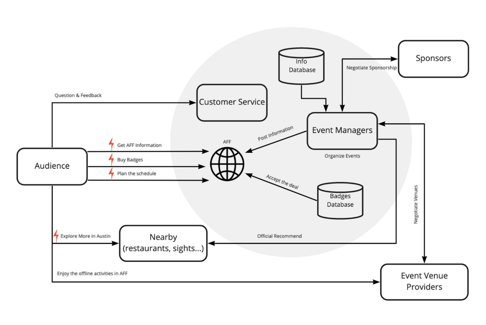
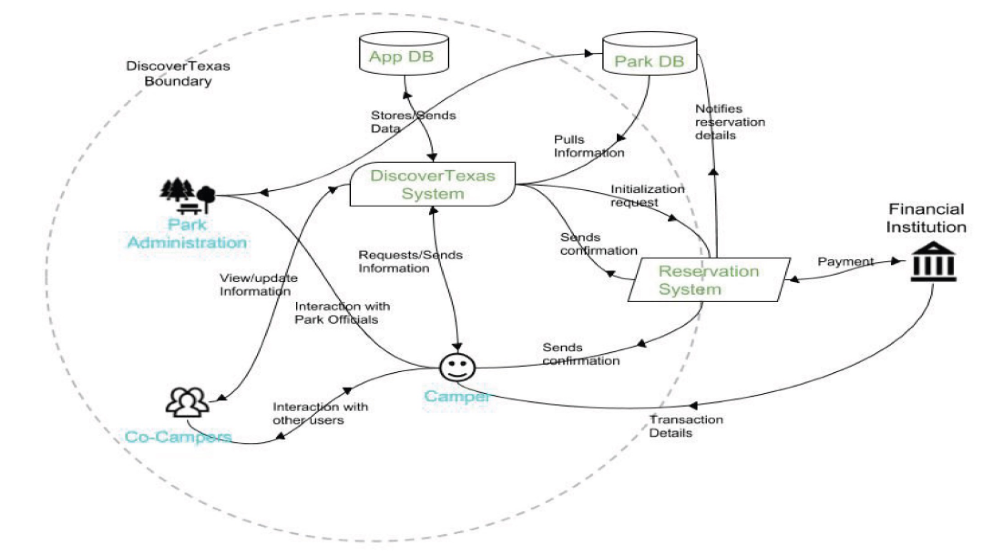
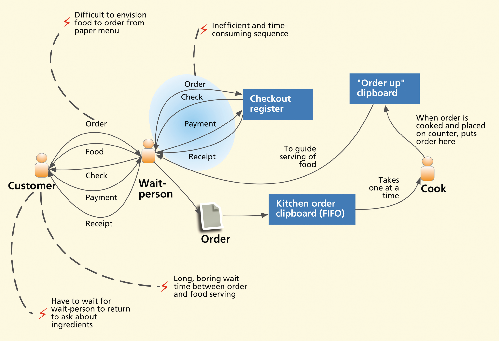
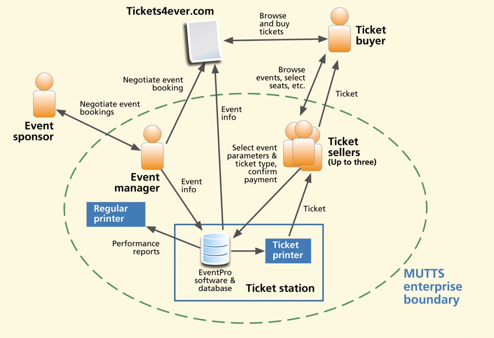
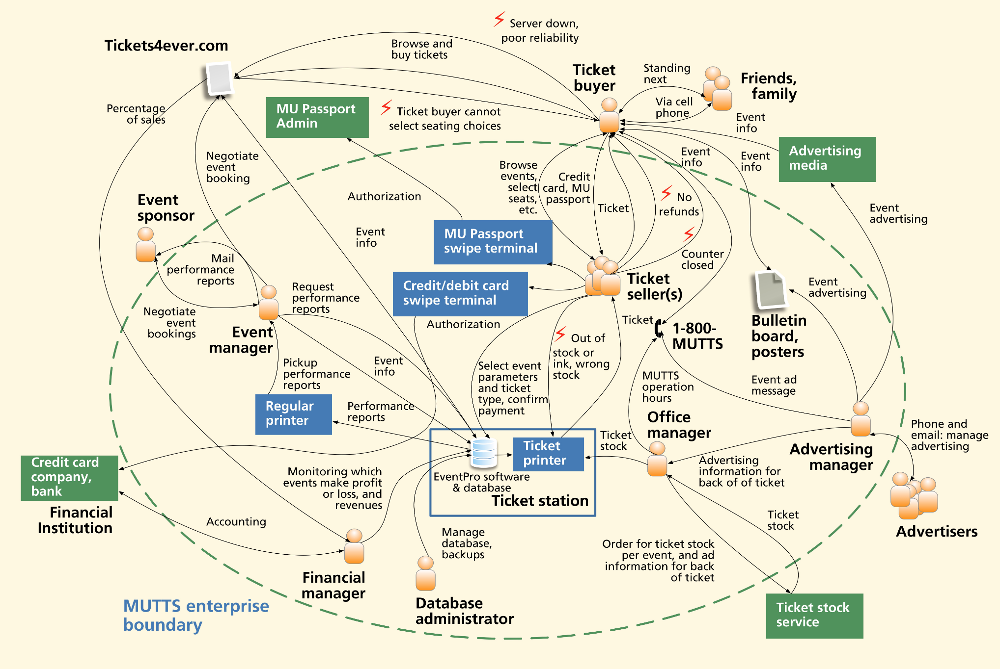
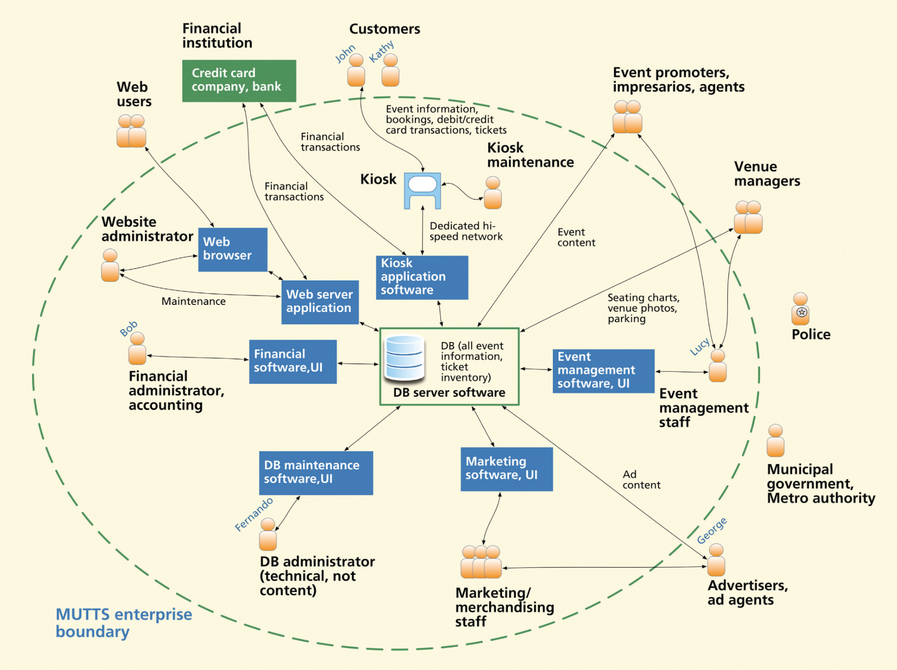
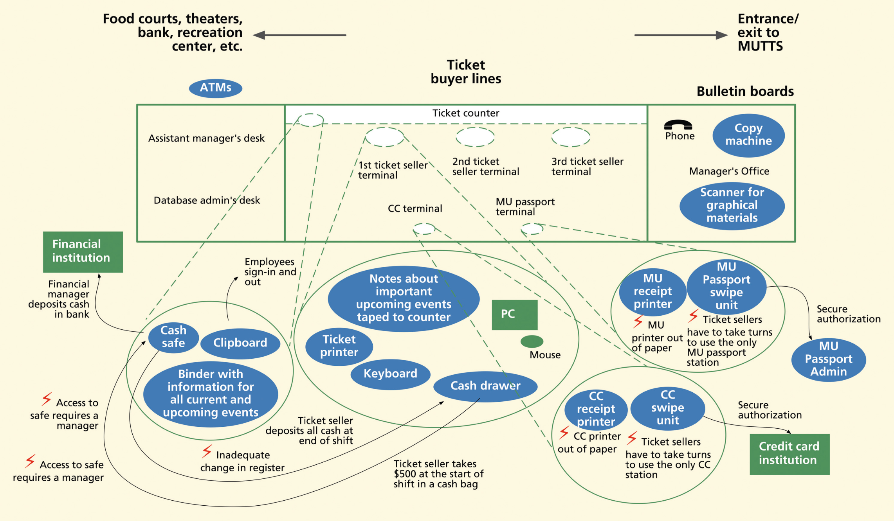
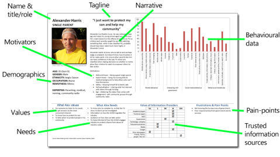
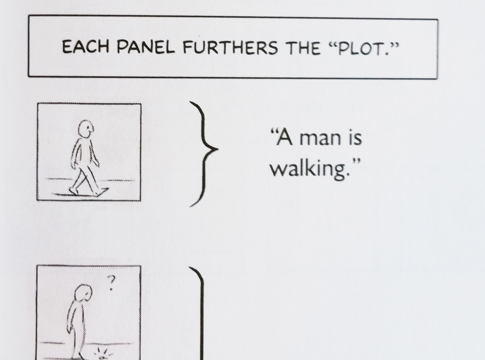

::: {.r-fit-text}
Week FIVE
:::

# Today

- Q and A from last time
- Discussion leading (Maggie)
- Design Critique (Belle)
- Article Presentation (Pin Yin)
- Break
- Modeling
- Readings

# Design for a better world, IV Humanity-Centered

$\langle$ pause for short discussion $\rangle$

## Human-Centered Design Principles
1. Solve the core, root issues, not just the problem as presented (which is often the symptom, not the cause).
2. Focus on the people.
3. Take a systems point of view, realizing that most complications result from the interdependencies of the multiple parts.
4. Continually test and refine the proposed designs to ensure they truly meet the concerns of the people for whom they are intended.

## Humanity-Centered Design Principles, 1 of 2
1. Solve the core, root issues, not just the problem as presented (which is often the symptom, not the cause).
2. Focus on the entire ecosystem of people, all living things, and the physical environment.
3. Take a long-term, systems point of view, realizing that most complications result from the interdependencies of the multiple parts and that many of the most damaging impacts on society and the ecosystem reveal themselves only years or even decades later.

## Humanity-Centered Design Principles, 2 of 2
4. Continually test and refine the proposed designs to ensure they truly meet the concerns of the people and ecosystem for whom they are intended.
5. Design with the community and as much as possible support designs by the community. Professional designers should serve as enablers, facilitators, and resources, aiding community members to meet their concerns.

## Community-Driven Design
- Designing *with* the community
- Designing *for* the community
- Planners vs Searchers
- Democratizing design (makers / diy)
- Muddling through (incrementalism)

# Discussion leading (Maggie)

# Modeling
What is a model?

::: {.incremental}
- an abstraction of reality
- an oversimplified view of reality
- omits irrelevant details
- the catch: hard to know what's irrelevant beforehand
:::

(see Jacek's slides for more detail)

## Some famous models
- UML (about nine main diagram types, each giving a
  different perspective on software development)
- WordNet (models the English language as a network with
  several kinds of relationships, including component
  relationships and inheritance relationships)

## Kinds of models of concern in HCI
- Flow models
- Task models
- User models
- Other, less prominent kinds

## Flow Models

## Austin Film Festival Flow

## Discover Texas Flow

## Flow model used as critique

## MUTTS flow model

## MUTTS flow model expanded

## MUTTS flow model final

## Physical models

## MUTTS physical model

## Problems with flow models
- Informal (except UML data flow diagrams)
- Not everyone agrees about meaning---two people could
  look at the same flow model and take away two
  different pictures
- Consequently I prefer leveled data flow diagrams for
  easily understood detail (but dfds can take too much
  time!)

## Task models

## User models

## Persona Example

::: {.notes}
Personas, from @Cooper2014. Personas are waning in popularity but I still find them valuable. The two biggest objections I've heard to personas are (1) people use too many of them and (2) they are not real people. Of course, it makes more sense to use fewer if you use too many and it may make sense to cast real people in the role of personas. It is really easy to create personas from a contextual inquiry so it is tempting to create many of them. But creating many brings you the risk of losing focus on a narrow set of objectives that will make your application suitable for one person.

If you work for a large firm with established telemetry, you may know a vast amount about your individual users. It might be possible to draw as rich a picture of a real user as you can of a fictitious persona. In that case, your practice in using personas will still serve you.

Steve Jobs is a stellar example of a user about whom a great deal was known. Some Apple apps, such as Keynote, were created specifically for Steve Jobs to use. He can be a real person you design for, but he can just as easily be interpreted as a persona.
:::

## Personas injected into scenarios

::: {.notes}
narratives illustrating an interaction, e.g., tellyhci.wordpress.com
:::

## Path from contextual inquiry through personas to scenarios
Once you create a persona, you can inject that persona into a scenario. You should have an idea of how that persona will behave in that scenario because of your contextual inquiry.

## Storyboarding is often used to represent scenarios

::: {.notes}
Storyboarding, from @Mccloud2006, is one way to illustrate a scenario.
:::

# Readings

Readings last week include @Hartson2019: Ch 7, 8

Readings this week include @Hartson2019: Ch 9, 10

# Assignments
none

# References

::: {#refs}
:::

---

::: {.r-fit-text}
END
:::

# Colophon

This slideshow was produced using `quarto`

Fonts are *League Gothic* and *Lato*

