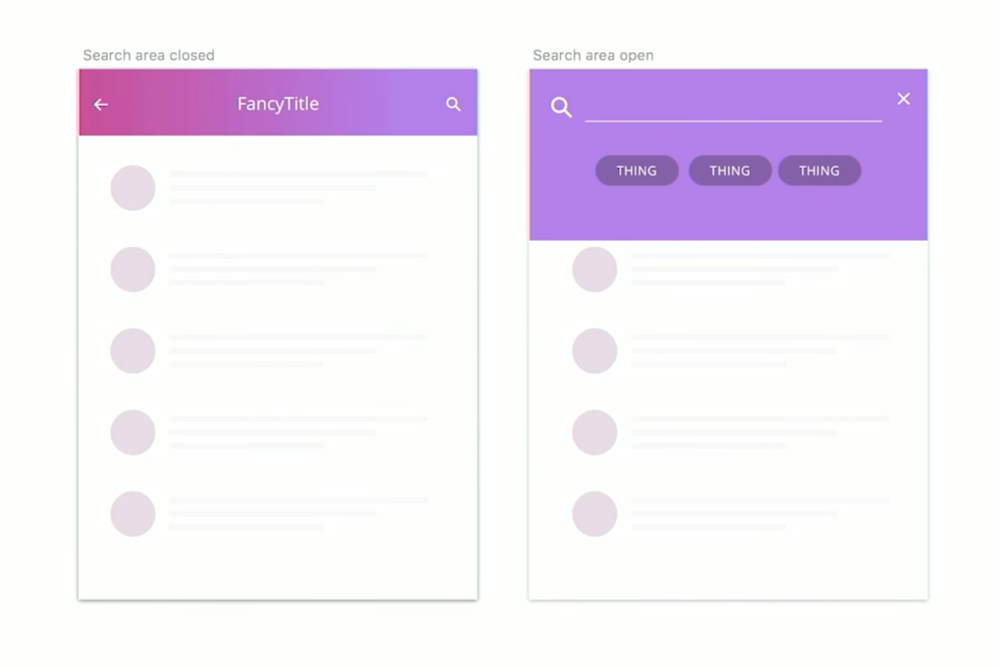
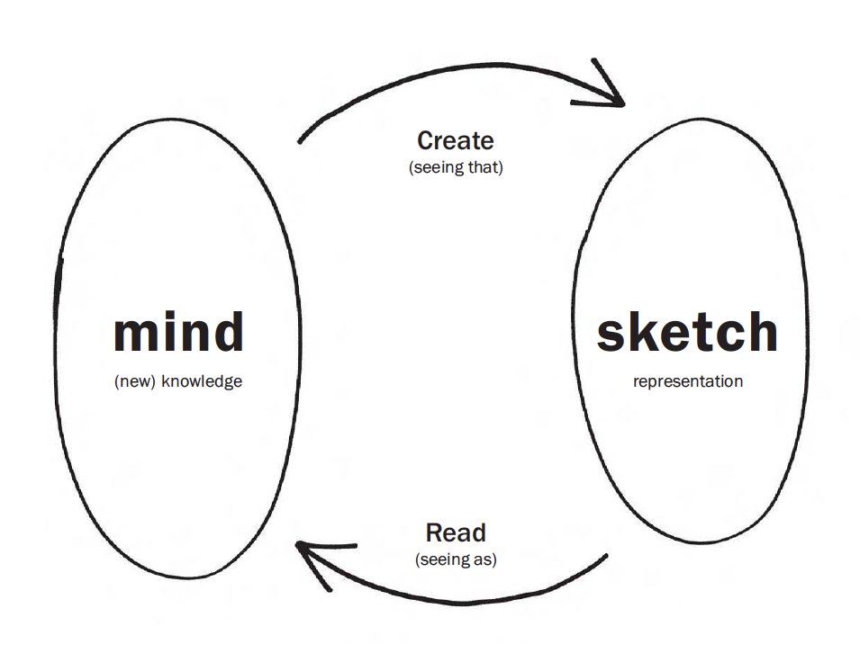
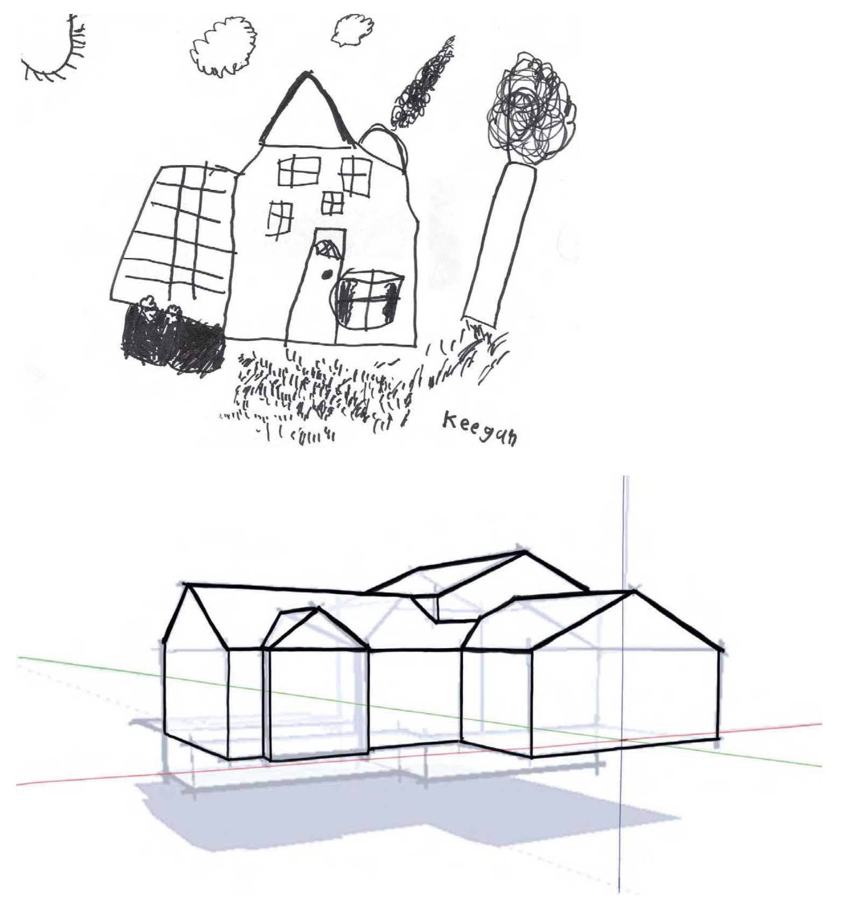
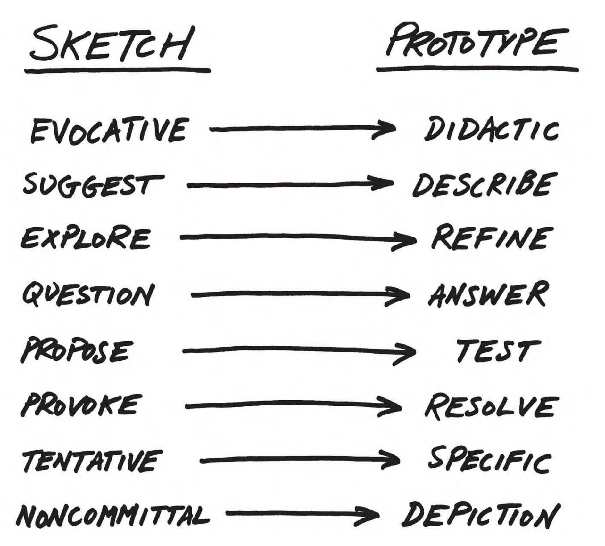

::: {.r-fit-text}
Week SIX
:::

# Today

- Microinteraction example
- Figma Tutorial (Ishwari)
- Q and A from last time
- Design Critique (Julia Lee)
- Sketching
- @Norman2023 ?

# Microinteraction example, animate it!

{fig-alt="Opening and closing a search dialog box"}

## Discussion

## Metaphors beyond visual cues
How can UX designers use metaphors beyond mere visual cues? Mental shortcuts ... enriching usability but also promoting sustainable practices ...

## What does design mean to you?
(a question we have to keep asking ourselves)

## Feedback
How can the design team effectively gather and synthesize user feedback?

## Validity
Given the subjective nature of user feedback and potential biases inherent in self-report measures, to what extent can the results obtained from such studies be considered reliable and valid?

## Top-down design
Can we also say that the initial phase of top down design is not user centered?

(Example: Apple Vision Pro)

## Continuous innovation
What are some methods or strategies you could implement to ensure continuous innovation?

## Ahead of the wave, yet riding the crest
How can designers innovate to stay ahead of current trends, while ensuring that their technology catches on and becomes mainstream?

## Values inherent in top-down and bottom-up design
Would you expect a workspace using a specific approach to hold certain values? If yes, what values do you would you expect?

## Drivers of top-down design
The article says 'Top-down design is heavily driven by domain knowledge', while I think top-down design is more driven by technology. How do you understand this question?

# Sketching

## typical user-centered design stages
1. Contextual Inquiry (also known as user research)
2. Personas (also known as modeling)
3. Scenarios (also known as storyboarding)
4. Lofi Prototypes (also known as sketches---our subject today)
5. Hifi Prototypes (I include midfi in this category)
6. Handoff to developers

::: {.notes}
Here is an example of how a design team might work. There might be frequent communications with the developers, but ultimately there is usually a handoff of a hifi design to developers. By the time we hand this design off, we've done several things. We've researched the situation of users at work (or perhaps at play). We've used the output of that research to create personas to serve with our design. We've injected these personas into scenarios where they use our design successfully. Then comes the fun part. We brainstorm or ideate several solutions that would fit into the scenarios. These usually take the form of sketches. The heart of design is choosing between these sketches for further refinement. The hifi prototype is this refinement and it may go through many iterations.
:::

##
*Design is all about constraints.*

::: {style="text-align: right"}
--- Charles Eames
:::

::: {.notes}
Eames, half of the famous husband and wife team of Charles and Ray Eames, said this in an interview. After the interviewer asked him to elaborate, he replied "Aren't constraints enough?" This speaks volumes about the difference between design and art, which is relatively unencumbered by the constraints clients place on design.
:::

## lofi from @Buxton2007

::: {.notes}
The “conversation” is between the sketch (right bubble) and the mind (left
bubble). A sketch is created from current knowledge (top arrow). Reading,
or interpreting the resulting representation (bottom arrow), creates new
knowledge. The creation results from what @Goldschmidt1991 calls “seeing
that” reasoning, and the extraction of new knowledge results from what
she calls “seeing as.”

Goldschmidt gives an example where an architect named Glenda, sketches some squares:
Glenda sees *that* the squares could be treated as basic elements.
The square configuration could be seen *as* a puzzle.
She sees *that* this metaphor leads nowhere.
She tries another metaphor: seeing the square pattern *as* a casbah.
She sees *that* in a casbah there are confined territories.

In this short passage the designer alternates her reasoning modality with every argument she makes.
:::

##

*My drawings have been described as pre-intentionalist, meaning that they were finished before the
ideas for them had occurred to me. I shall not argue the point.*

::: {style="text-align: right"}
--- James Thurber
:::

## Sketching capabilities from @Buxton2007

## lofi and hifi from @Buxton2007

##

::: {.notes}
Sketchbook pages exhibited in  @Buxton2007, pp 194--5
:::

# @Norman2023, Human Behavior

## Why change is difficult
- Changing beliefs takes time: Women's suffrage took from 1848 to 1920
- Emotion is as powerful as reason
- People respond to disasters but don't prevent them
- Climate change and pandemics exemplify slowness of response
- Successful actions often show no visible result

## People will mobilize for a common goal
- People mobilize for war, why not against climate change or pandemics?
- 44m people believe the US gov't is secretly controlled by Satanist pedophiles
- Many people disbelieve scientists and rely on con men
- These are barriers to change

## What must change?
- Balance between work and family, rooted in the origins of the industrial revolution
- Changing from a job to an occupation
- Education: becoming flexible (Don't Look Up, 2021)
- Grades for students (switch to pass / fail)
- Politics (book was written in 2023)
- Reward structures (industry and academia have bad ones)

## Dominance of technology
- Treating people as servants of machines
- Tech-centered approach treats human virtues as deficits
- Focus, curiosity, mind wandering, mental addiction

## Future of technology
- It's hard to predict things, especially the future (Yogi Berra)
- Miniaturization
- Energy
- Biotech
- Money
- Intelligence Amplification

# Readings

Readings last week include @Hartson2019: Ch 9, 10

Readings this week include @Hartson2019: Ch 12, 13, 14

# Assignments
Project 2

# References

::: {#refs}
:::

---

::: {.r-fit-text}
END
:::

# Colophon

This slideshow was produced using `quarto`

Fonts are *League Gothic* and *Lato*

