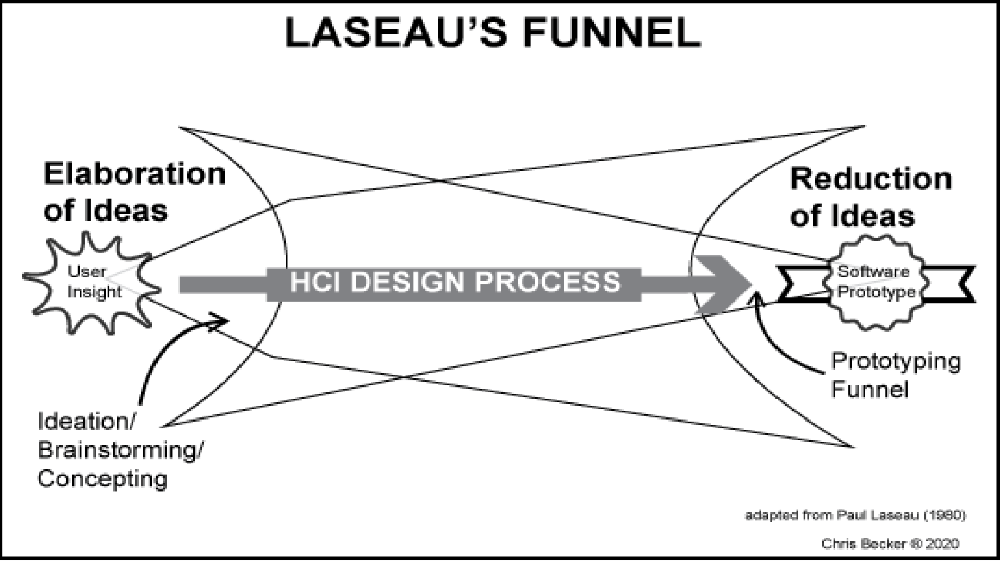
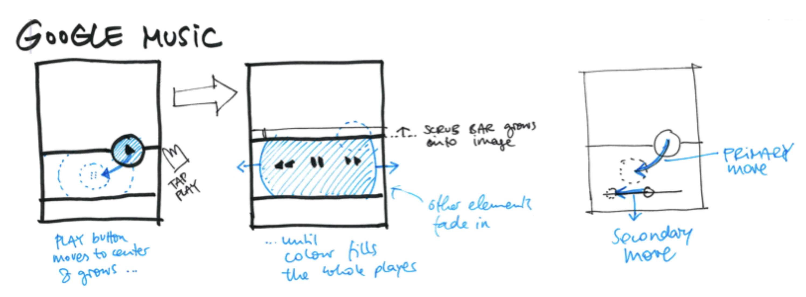

::: {.r-fit-text}
Week EIGHT
:::

# Today

- Q and A from last time
- Naheel Jawaid recap
- Nitya Nambisan recap
- Design critique (Maggie)
- Discussion (Nikki)
- Prototyping

# Q and A from last time

# Naheel Jawaid recap

## Naheel Jawaid
- Currently a UX designer at Google
- Plans to start own company soon
- Gave an engaging talk at UX Design club
- Offers free design school!

## Four things you do
- Product thinking
- Interaction design
- Visual design
- Communication

Example: AirBnB vs CraigsList

## Your portfolio
... must prove you can do these four things

## More from Naheel
- Schools set standards too low
- Show your work to industry people
- Pick one thing and go deep---keeping all doors open means you'll be last in line at each door
- If you're not getting offers, concentrate on doing good work---offers will emerge
- ARglasses example---constraints and landscape

## Recommendations
- tools: Protopie and Origami
- portfolios: thereal.kim and rauno.me/craft

# Nitya Nambisan recap

# Design critique (Maggie)

# Discussion (Nikki)

*Note: discussion questions are worth more now, two points instead of one. The subtractions this week were more of a warning than a consequence. Perfunctory items will receive less credit in future.*

## Prototyping
I teach a course on this topic and a couple of you are in that course! What do you think are the most important things to say about prototyping after seven weeks of it?

# Old (but still relevant) discussion questions

## Where do prototypes fit?

```{r}
#| engine = 'tikz',
#| echo=FALSE,
#| fig.alt='a wheel featuring the words design, prototype, and evaluate, separated by triangular arrows',
#| out.width='25%'
\usetikzlibrary{arrows,decorations.text,decorations.markings}
\begin{tikzpicture}
  \filldraw[fill=green!20!white, draw=white] (0,0) circle (1.41cm);
  \filldraw[fill=white, draw=white] (0,0) circle (0.97cm);
  \path
    [decorate,decoration={
      text along path,
      text={|\sffamily|\ DESIGN PROTOTYPE EVALUATE \ },
      text color={green!50!black},
      text align={fit to path stretching spaces},
      reverse path}
    ]
    (0,0) circle (1.1cm);
  \path
    [decorate,decoration={
      markings,
      mark=at position 0.6cm with {\arrow[green!50!black,line width=0.40mm]{triangle 90 reversed}},
      mark=at position 3.1cm with {\arrow[green!50!black,line width=0.40mm]{triangle 90 reversed}},
      mark=at position 6.0cm with {\arrow[green!50!black,line width=0.40mm]{triangle 90 reversed}}
      }
    ]
    (0,0) circle (1.19cm);
\end{tikzpicture}
```

::: {.notes}
This is a picture of design from the designer's point of view. It doesn't mention the developers or clients. It's a picture of design activities apart from communicating with stakeholders, because communicating with stakeholders may happen at any moment in the process.

Design could also be called *generate alternatives*. Prototyping could also be called *implement one alternative*. So you could say evaluate means to *evalauate one alternative*.
:::

## How many kinds of prototypes are there?
I claim there are only two: prototypes for contention and prototypes for refinement. Of course, that raises the question of where Wizard of Oz prototypes fit into that dichotomy.

How many kinds of prototypes do you believe there are?

::: {.notes}
Think about this question. I personally put Wizard of Oz in the contention category, because it's so easy to modify but what do you think?
:::

## What is the purpose of different levels of fidelity?

## Do different companies have different prototyping processes?
A VP of Oracle Medical Systems told me that his customers don't want to see lofi prototypes at all. They want their branding in everything they see.

A guest speaker from ExxonMobil told my other class that he wants to see paper and pencil sketches or whiteboard sketches.

::: {.notes}
The Oracle VP was showing prototypes to C-suite level executives, so he wanted to see things that looked polished. Maybe he needed to be convinced that his designers really needed to speak to more operational people.

The ExxonMobil guy was thinking about hiring people so he wanted to know their thought processes. He had really different needs when looking at prototypes.
:::

## Wizard of Oz
I disagree with the book that this method is rare. I saw a demo of it yesterday for a study of new VR technology that is not yet implemented. The designers are trying to decide which technology to implement, so they're doing a Wizard of Oz study of five possibilities.

::: {.notes}
By the way, the name Wizard of Oz refers to the movie of that name. In the movie, a showman pretends to be a wizard but is operating the pyrotechnics from behind a curtain. A little dog pulls back the curtain and he cries out through his sound system "Pay no attention to that man behind the curtain!"
:::

## Misinformation in affordances
A previous student (Christina Jia) pointed out that this can occur anywhere, not just doors. Can we think of some examples?

::: {.notes}
"Norman doors" have become a meme at times as people point out the misleading affordances of doors. But where else do you see this? Stoves? Car dashboards? Washers and dryers? Try to think of more and try to imagine the reasons for them. For example, landlords often put the cheapest possible stoves in apartments, so they are often governed by simplistic controls that go to maximum when they are first turned on, which can be counterintuitive.
:::

## Is affordance only relevant as an influence?
Well, is it?

## Do designers bear responsibility for privacy?
What if privacy conflicts with engagement?

::: {.notes}
This is a really difficult question because supporting privacy may cost the firm money. As a society, we may need to rise above the primacy of the bottom line in decision-making. This is not easy in our society, where profit is king.
:::

## How much information should affordances share?
Can there be too much? Too little?

::: {.notes}
I am appalled by the affordances in hospitals. They're too much in my view. There are so many signals everywhere that I shut down. Do you agree or disagree?
:::

## Do people make prototypes that require different skills?
What about physical prototypes? (I've seen plenty for a wide assortment of reasons---can you imagine some of the kinds and some of the reasons?)

::: {.notes}
Physical prototypes are on the decline in many industries and I have heard older people lament the deskilling of designers in building physical prototypes as older prototypers retire and are not replaced. On the other hand, they are quite important in some industries. I infer from a talk by Christopher Bangle (former head of design at BMW) that they use sophisticated physical prototypes in their design process. Bangle asserted that his designs were only limited by what a five-way milling machine could produce. The example he gave was the interior door handles of contemporary BMW cars. He said that they follow the contours of the extended hand only because he could prototype that.
:::

# Prototyping

## All you need is here


::: {.notes}
You learned to make prototypes in elementary school and you can make sufficient prototypes for contention from the tools you learned in elementary school.
:::

## A view from @Becker2020


::: {.notes}
Becker points out the need to converge and diverge, using Laseau's Funnel as a metaphor. I think this is a good way to think about prototyping. At some point you switch from the diverging processes of ideation, brainstorming, and concepting, to the converging processes of evaluation, refinement, and implementation.
:::

## lofi from @Buxton2007


::: {.notes}
The “conversation” is between the sketch (right bubble) and the mind (left
bubble). A sketch is created from current knowledge (top arrow). Reading,
or interpreting the resulting representation (bottom arrow), creates new
knowledge. The creation results from what @Goldschmidt1991 calls “seeing
that” reasoning, and the extraction of new knowledge results from what
she calls “seeing as.”
:::

## lofi and hifi from @Buxton2007


::: {.notes}
Buxton calls these "sketch" and "prototype" but I think they are "lofi" and "hifi". Further, there's a spectrum of lofi to hifi as we gradually latch onto ideas we want to refine and make choices we want to describe.
:::

## Sketch but Hifi


::: {.notes}
This sketch is actually very hifi in that it specifies an animation in great detail. The annotations here are something you can actually hand off to a developer.
:::

## What can you refine?
- Color
- Typography
- Layout
- Animation

::: {.notes}
These are all elements of a design system, along with icons and perhaps other features in some cases. For example, tone of voice is a design system element in GitHub's design system, specifically because tech bros are stereotypically dismissive of less technical people.
:::

## Prototyping tools
- Components
- Design Systems

::: {.notes}
You've actually learned more tools than these in Figma, such as variables and *Smart Animate* transitions. What are some other tools that transcend Figma and should be present in any software package that supports prototyping?
:::

# Readings

Readings last week include @Hartson2019: Ch 15, 16, 17, @Norman2013: Ch 3, 4

Readings this week include @Hartson2019: Ch 20

# Assignments
Milestone 3

# References

::: {#refs}
:::

---

::: {.r-fit-text}
END
:::

# Colophon

This slideshow was produced using `quarto`

Fonts are *League Gothic* and *Lato*

