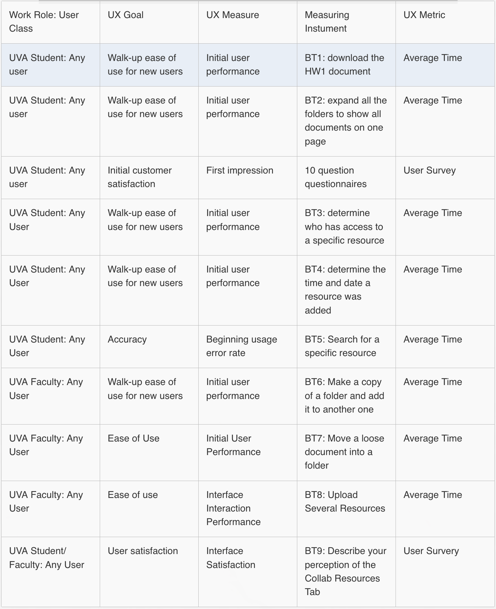

::: {.r-fit-text}
Week NINE
:::

# Today

- Q and A from last time (Nikki)
- Discussion leading (Anna)
- Empirical Evaluation

# Q and A from last time

# Discussion

# Empirical evaluation

## Spectrum of measurement
I claim that there is a gray area between objective and subjective and that it's a spectrum from objective to subjective measurements. Do you believe that?

I also claim that there is a gray area between quantitative and qualitative. What do you think?

## Scales
- Ratio: can say this is twice as much as that, e.g., money
- Interval: can say this is a certain amount more than that, e.g., temperature
- Ordinal: can rank, can say this is more than that but not how much, e.g., competitors in a dance contest
- Nominal: can say this differs from that, e.g., gender

## Formative evaluation
- conducted while in process
- conducted to refine

## Summative evaluation
- conducted after process
- conducted to determine final fitness
- usually only done in big software contracts, often after a waterfall process

## Empirical vs analytic evaluation
- real users vs experts
- observation vs automated checks

## Planning
- Decide a priori what you plan to evaluate and establish measures in advance
- Consider new users, experts, consequences of errors, sources of satisfaction

## Whitney Quesenbery posits 5 Es

- Effective: How completely and accurately the work or experience is completed or goals reached
- Efficient: How quickly this work can be completed
- Engaging: How well the interface draws the user into the interaction and how pleasant and satisfying it is to use
- Error Tolerant: How well the product prevents errors and can help the user recover from mistakes that do occur
- Easy to Learn: How well the product supports both the initial orientation and continued learning throughout the complete lifetime of use

::: {.notes}
Described in a book chapter, "Dimensions of Usability", in a book, *Content and Complexity*, Erlbaum, 2003.
:::

## Five E techniques (1 of 3)
- Effective: Watch for the results of each task, and see how often they are done accurately and completely. Look for problems like information that is skipped or mistakes that are made by several users.
- Efficient: Time users as they work to see how long each task takes to complete. Look for places where the screen layout or navigation make the work harder than it needs to be.

## Five E techniques (2 of 3)
- Engaging: Watch for signs that the screens are confusing, or difficult to read. Look for places where the interface fails to draw the users into their tasks. Ask questions after the test to see how well they liked the product and listen for things that kept them from being satisfied with the experience
- Error Tolerant: Create a test in which mistakes are likely to happen, and see how well users can recover from problems and how helpful the product is. Count the number of times users see error messages and how they could be prevented.

## Five E techniques (3 of 3)
- Easy to Learn: Control how much instruction is given to the test participants, or ask experienced users to try especially difficult, complex or rarely-used tasks. Look for places where the on-screen text or work flow helps…or confuses the

## UX target table headings
- Work role: user class
- UX goal
- UX measure (what is measured)
- Measuring instrument
- UX metric (how it is measured)
- Baseline level
- Target level
- Observed results

## UX target table example from UVA

## Steve Krug's approach
(pause for video)

[usabilityTestVideo](https://youtu.be/1UCDUOB_aS8?si=YBDX_FTzWAL7Qpl1)

# Readings

Readings last week included @Hartson2019: Ch 20

Readings this week include @Hartson2019: Ch 22--24

# Assignments
None

# References

::: {#refs}
:::

---

::: {.r-fit-text}
END
:::

# Colophon

This slideshow was produced using `quarto`

Fonts are *League Gothic* and *Lato*

