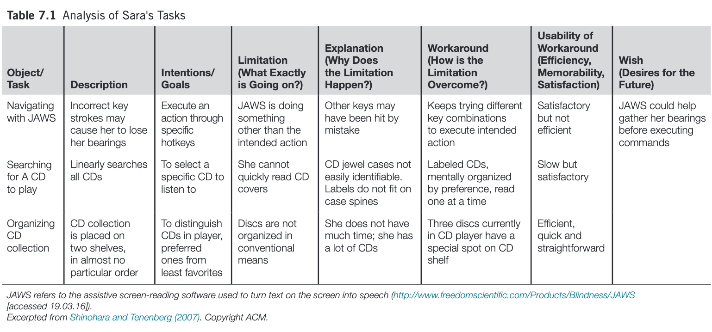

::: {.r-fit-text}
Week ELEVEN
:::

# Q and A from last time

## Learning

## Q&A

##
One proposition brought up in class was that "We should deploy AI not when its perfect, but when its better than humans" 
I want to ask, would you implement AI at your work place?

- What happens if it increases productivity?
- What happens if it leads to record profits, but a 10% workforce reduction, would you still do it?
- What happens if it's only a 5% workforce reduction?
- What happens if it's a 0.1% (1 person laid off for every 1000)?
- What happens if it's you that is laid off?

##
UPS for example had the largest layoff in 116 years, totaling 12,000 workers. One of the reason the layoffs happened, as the CEO mentioned in an earnings call, was that machine learning allows salespeople to put together proposals without having to ask pricing experts for guidance. 

# Discussion

# Design Critique

::: {.incremental}
- My choice of laptop
- I have a 16" M1 Macbook Pro, yet my daily driver is a six-year-old 12" Macbook! Why?
- It has the vilified "butterfly" keyboard
- It was denounced as underpowered on launch
- It was denounced for lack of ports on launch
:::

##
::: {.incremental}
- I've always had a tiny computer
- Used to be Windows / Linux
- Contrast between Microsoft approach and Apple approach:
  - Apple---make a product so good that you want to use it no matter what your boss says
  - Microsoft---convince your boss to force you to use their product, regardless of quality
:::

# Article Presentation
*Observing Sara*,
@Shinohara2007

## Observing Sara
Shinohara and Tenenberg used a series of semistructured interviews
to collect the observations that form the basis of the case study. In a series
of 6, 2-hour sessions in her home, Sara (not her real name) demonstrated how she
used technologies such as tactile wristwatches and screen readers; discussed early
memories of using various objects and her reactions to them; and imagined improved
designs for various objects or tasks. Notes, audio recordings, interviewer reactions,
and photographs from these sessions provided the raw data for subsequent analysis.
Insights and theories based on early observations were shared with the subject for
validation and clarification.

## Sara's CD Collection

# Affordances
Norman campaigned for years to get people to distinguish between affordances and signifiers.

# Laws

- Fitts's Law, $t=a + b \log_2(1+D/W)$
- Hick's Law, $t= b \log_2(n+1)$
- Steering Law, $t=a + b(D/W)$

# Errors
- slips: action-based, memory lapse
- mistakes: rule-based, knowledge-based, memory lapse

*The difference is in whether the goal is correct (slips) or incorrect (mistakes)*

# Readings

Readings last week include @Hartson2019: Ch 25--26
Readings this week include @Hartson2019: Ch 30, @Johnson2020: Ch 13, @Norman2013: Ch 5

# Assignments
Informal Project Presentation

# References

::: {#refs}
:::

---

::: {.r-fit-text}
END
:::

# Colophon

This slideshow was produced using `quarto`

Fonts are *League Gothic* and *Lato*

