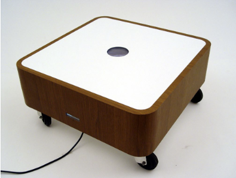
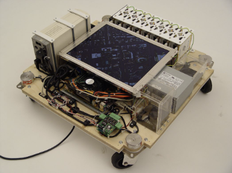
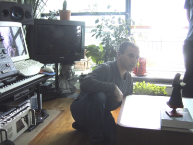
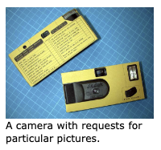
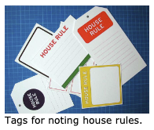
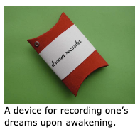
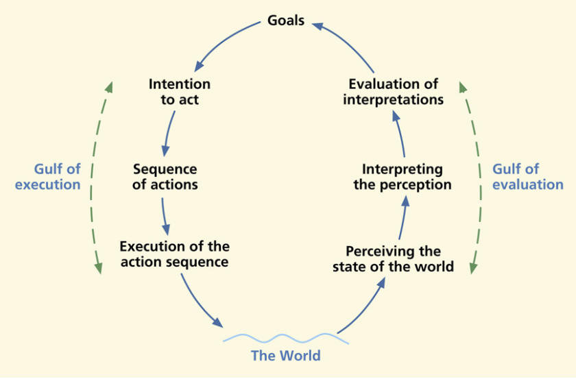
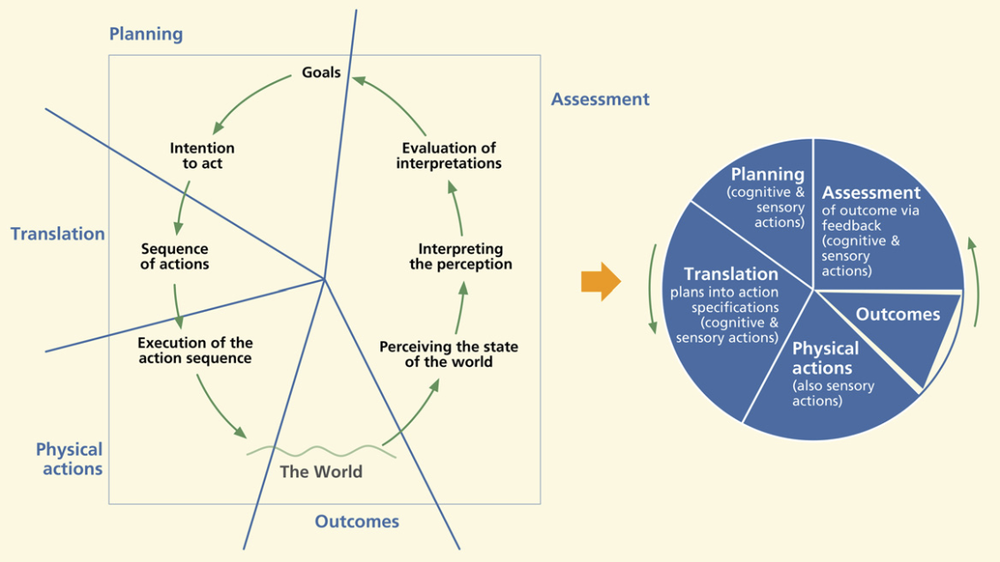
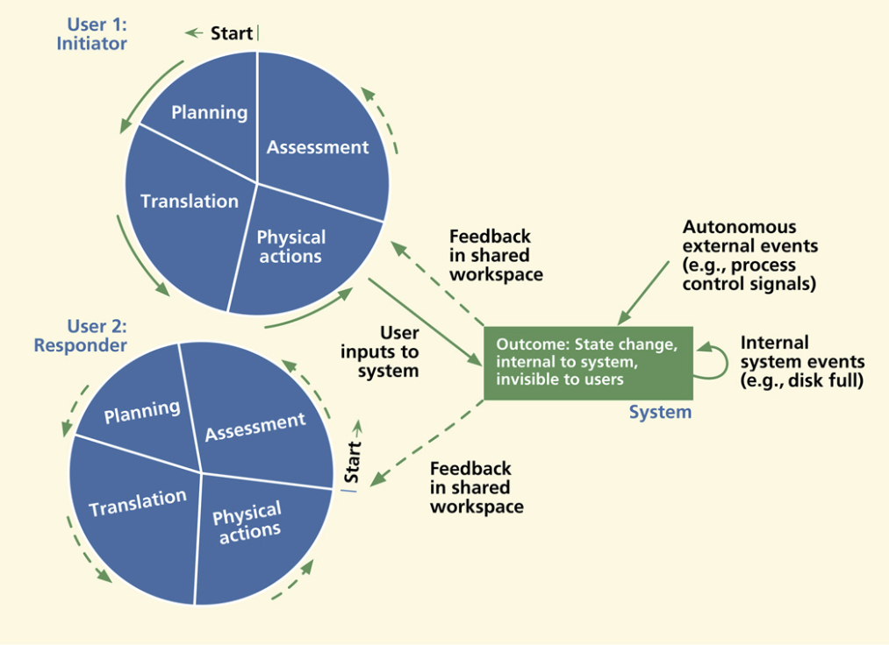
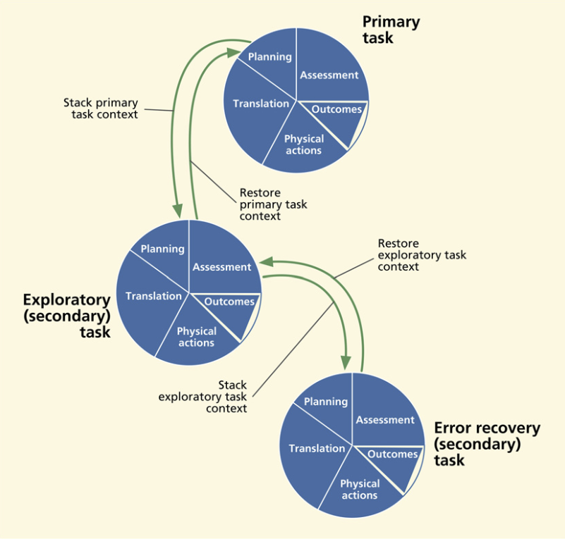

::: {.r-fit-text}
Week TWELVE
:::

# Q and A from last time
None on Canvas---can you remember any?

# Design Critique

Diya Patel

# Article Presentation
@Gaver2004 changed the course of academic HCI history. I've met several people who say that this brief paper caused the academic HCI community to veer from the founders' focus on work to a focus on play and on new modes of inquiry.

## Topic
The topic was *The Drift Table*, "an electronic coffee table that displays slowly moving aerial photography controlled by the distribution of weight on its surface. It was designed to investigate our ideas about how technologies for the home could support ludic activities---that is, activities motivated by curiosity, exploration, and reflection rather than externally-defined tasks."

## Overview
The paper is a case study, in a sense from the same genre as *Observing Sara* that I mentioned last time.

It was a multidisciplinary work, involving various artists, ethnographers, psychologists, and computer scientists.

It was part of a larger six-year collaboration between 60 researchers across eight academic institutions working in half a dozen disciplines.

They designed and developed the drift table, then deployed it in peoples' homes for a few weeks.

## Views of the Drift Table

::: {layout-ncol=3}

:::

## Probes

::: {layout-ncol=3}

:::

## Lessons about ludic activities
- Support social engagement in ludic activities
- Allow the ludic to be interleaved with everyday utilitarian activities
- Don't expect ludic designs to leave everyday activities untouched
- Don't seek to meet users' immediate desires

# Discussion

$\langle$ pause to look at discussion $\rangle$

# Interaction Cycle
Invented by Harson and Pyla; not sure if it's caught on

##

##

##

##

# Readings

Readings last week include @Hartson2019: Ch 30, @Johnson2020: Ch 13, @Norman2013: Ch 5

Readings this week include @Hartson2019: Ch 31

# Assignments
Milestone 5

# References

::: {#refs}
:::

---

::: {.r-fit-text}
END
:::

# Colophon

This slideshow was produced using `quarto`

Fonts are *League Gothic* and *Lato*

