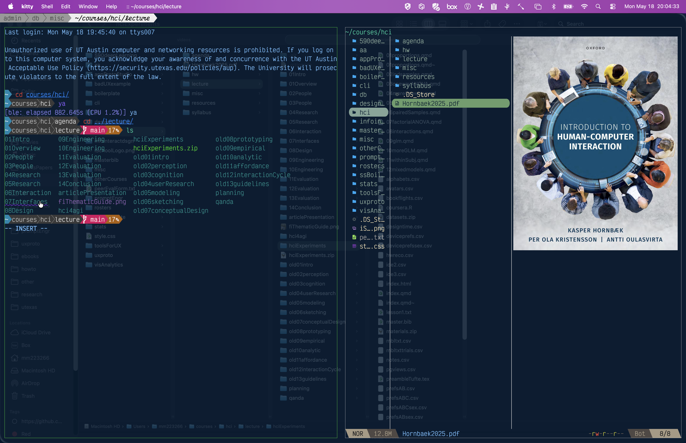

# [Week SEVEN]{.r-fit-text}

Part V of @Hornbaek2025

# Intro
User interfaces are the only part that real people interact with in real settings doing real "tasks". Therefore, the study of user interfaces has contributions from computer science, electrical engineering, design, and psychology.

## Forms
- Englebart: specified augmenting human intellect
- Shneiderman: identified direct manipulation
- Weiser: stipulated that the interface should *disappear*
- ... many others ...

## Elements
The DIRA model specifies four elements of an interface

- Devices, such as mice, keyboards, touchscreens, eye trackers
- Interaction Techniques, mapping input to solutions for interaction problems
- Representations, how things appear
- Assemblies, organizations of representations

## Interaction Styles
These are combinations of the elements specified in the DIRA model

## Command-Line
- Our textbook is a bit out-of-date on this
- It says that the command line is entering text and obtaining responses only in text, without interaction capabilities
- The next frame shows a contemporary command-line interface
- There are two "window-panes"
- The left pane shows the user highlighting response text, which is a directory that can be opened by clicking
- The right pane shows a graphical image, the cover of our textbook

## Kitty: a terminal emulator

## Forms
- Groups of widgets such as checkboxes or radio buttons for user input
- Advantages: structured, easily understood
- Disadvantages: restrictive (double-edged sword)

## Menus
- Grouped series of options
- Obeys Hick's law, that the time to choose is proportional to the log of the number of choices plus one, all multiplied by an empirically found constant
- Can be cumbersome
- Grouping often accomplished by card sort
- Part of the WIMP paradigm (Windows, Icons, Menus, and Pointers) that dominate desktop computing

## GUIs (graphical user interfaces)
- Enable direct manipulation of onscreen objects
- Example: dragging a picture of a file to a trash can
- Hallmarks are low floor and low ceiling of performance

## Reality-based interaction
- Mobile devices such as smartphones and smartwatches
- Mixed reality (used to be called augmented reality)

## Design objectives
Design objectives come from three sources

- Understanding of people
- Theories of interaction
- Attributes and structural qualities of the user interface

## Example objective: Supporting novice, intermediate, and expert performance
- For novices, the system should be easy to learn
- For intermediate users, the system should be easy to become proficient
- For expert users, the system should support optimal performance

## Aside: the performance floor and the performance ceiling
- The floor is entry level and can be high (bad) or low (good)
- The ceiling is what is attainable and can be high (good) or low (bad)
- It's difficult to have both a low floor and a high ceiling, which is the most desirable state
- The supports that give you a low floor get in the way of expert users
- Possible remedy: *training wheels* that are removed in a dynamic interface

## Example objectives: Usability and Accessibility
- Usability concerns whether users achieve goals with efficiency, effectiveness, and satisfaction, so usability can be an objective
- Accessibility achieves equivalent usability between user groups (is this a controversial definition?)

## Example objective: structure and attributes of the interface
Key attributes include

- Explorability
- Discoverability
- Consistency

## Aside: Trade-offs between objectives
Common trade-offs include

- Speed vs accuracy
- Recognition vs recall
- Familiarity vs novelty
- Those who work vs those who reap benefits

## Design space analysis
The design space is all that matters in a design---analyzing it occurs at different unit levels

- Morphological analysis considers technical variables constituting an interface
- Joint system analysis considers the parameters of the joint human-computer experience
- Questions, options, and criteria (QOC) method considers questions mapped to design options and objectives

## Summary of Ch 23
- User interfaces are what the user comes into contact with when using an interactive system.
- User interfaces comprise input devices, interaction techniques, representations, and assemblies.
- There are five main styles of interaction: command line, form, menu, GUI, and reality-based user interfaces.
- The design of user interfaces involves balancing trade-offs between relevant criteria.

# Input devices (Ch 24)
- Differ from interaction techniques (how?)
- Success of an input device depends on correctly translating what the user does into some sort of computation

::: {.notes}
Input devices sense user movements and states while interaction techniques help a user accomplish fundamental operations using input devices and displays, according to p 405. But isn't "displays" too limited here? What other signals are used by interaction techniques?
:::

## Example: Fitts's law in menu bars
- Fitts's law predicts the time it takes to point at something based on the something's size and distance, formalized as
- $$T=a+b \log_2\left(\frac{D}{W}+1\right)$$
- where $a$ and $b$ are empirically discovered constants, $D$ is distance, and $W$ is width (size)
- If a menu bar is at the top of the display, an item on it has effectively infinite size (width) because, no matter how hard you drive the input device (e.g., mouse or trackpad), it is stopped by the display edge

## Principles of sensing (Ch 24.1)
- Every input device relies on some type of sensing
- A *sensor* transforms physical energy into an electric signal
- "Input sensing" means more than just sensors---it's the whole sensing pipeline (hardware + software) that turns sensor data into a command
- Input sensing has become a major HCI research topic thanks to advances in micromachinery and microcontrollers
- There is no universally best sensing approach: an in-flight entertainment system, a crane operator's cockpit, and a GPS tracker for boats all have vastly different constraints
- Users are good at noticing poor response characteristics, such as lag or inaccuracy
- Developing good input devices requires skills in software engineering, ML, systems engineering, and electrical engineering

## Transducing (Ch 24.1.1)
- All sensing in HCI transforms one type of energy into an electric signal
- Traditional pointing devices sense motion, position, or pressure
- An isometric joystick senses pressure
- Sensing principles:
  - Mechanical (position, motion, rotation), Electrical (capacitance, contact)
  - Sonic (ultrasonic, microphone, sonar), Optical (proximity, light, image)
  - Radiation (radar, heat, temperature), Magnetic (Hall effect)
  - Gravitational (e.g., pressure-sensitive floor), Chemical (moisture, implanted)
- Analog sensors output a voltage (0-5 V) converted by an ADC; digital sensors are more robust to noise
- Capacitive touchscreens rely on capacitance/energy stored in an electric field; unlike their resistive predecessor they support multi-touch but not pen input without modification

## Sensing hardware (Ch 24.1.2)
- Every device that senses needs at least a sensor, a microcontroller, and a rig to keep them together
- The sensor is governed by a transfer function
- Design involves balancing accuracy, battery life, latency, and robustness
- The next frame shows four examples of problematic transfer functions

##

## Transfer functions (Ch 24.1.3)
- A transfer function maps a change in input energy to a change in output signal: $output = f(input)$
- For example, a push button converts contact force into displacement of the keycap, which the key switch then transduces into a step function (on/off signal)
- Key properties of a sensor's transfer function include:
  - **Resolution**---how finely the sensor can distinguish among levels of output
  - **Operating range**---the span of input energy over which the sensor works
  - **Sensitivity**---how much output changes per unit of input
  - **Noise**---unwanted variation in the output signal

## Mitigating sensor problems
- Noise can be mitigated with filtering and typical filtering categories include
- Frequency-based filters, for example a low-pass filter gets rid of low frequency signals
- Moving average filters, using
  $$\overline{X}=\frac{1}{n} \sum_{i=1}^n X_i$$
- and assuming noise has mean zero, averages the filtered value, $X$, over a few samples, $i$, from some time labeled $1$ to the $n$th sample from the current time (I think the book gives a wrong formula)
- Drawback is that sampling must be high-frequency to avoid lagginess

## Keypads and keyboards
- Keypads and keyboards allow input of letters, symbols, numbers, and commands
- Keypads are typically arranged in a matrix layout (e.g., the ISO/IEC 99958:1994 telephone keypad)
- Common in household appliances, ATMs, healthcare, and manufacturing equipment
- Early mobile phones relied heavily on physical keypads
- Computer keyboards support all letters A-Z plus ancillary characters and functions
- Most keyboards use a QWERTY layout (named after the first six keys in the top row)

## Pointing devices
- Pointing devices let users select locations on a display for purposes such as selection, manipulation, or drawing
- Divided into two classes:
  - **Directly controlled**---point directly at the display (absolute coordinates)
  - **Indirectly controlled**---manipulate the device; cursor moves as a function of that manipulation (relative movement)
- Indirect control can be modulated using a control/display ratio

## Direct control: light pen
- One of the earliest direct-control devices
- A light-sensitive rod used with CRT displays
- Works by detecting the timing of the CRT's raster scan
- Allows absolute-coordinate selection on the display

## Direct control: touchscreens
- **Resistive touchscreen**---two flexible sheets separated by an insulator; pressing them together makes contact, and horizontal/vertical traces determine location. Worked with any implement (pen, glove, fingernail). Popular on early PDAs and mobile phones.
- **Capacitive touchscreen**---relies on capacitive coupling between a fingertip and the display. Popularized by the iPhone in 2007. Supports multi-touch (pinch-to-zoom, etc.). Faster response but lower precision than resistive. Cannot sense pens without modification.

## Indirect control: mouse and touchpad
- **Mouse**---moves cursor by physical movement on a table. Early designs used wheels or a rolling ball; modern mice use optical sensors. Usually has buttons and a scroll wheel.
- **Touchpad**---controls cursor by moving a fingertip on a surface (resistive or capacitive). Commonly used on laptops as a mouse replacement. Can operate in both relative and absolute coordinates.

## Uncertain control
- Direct and indirect pointing devices deduce user intentions with high certainty. *Uncertain control* refers to input devices that must be designed to be robust in the presence of uncertainty.

## Switches
- A push button is perhaps the most ubiquitous binary (on/off) input device
- Electromechanical: pushing the switch forces two contacts together, creating a low-impedance path for current flow
- Subject to **switch bouncing**---mechanical vibration causes false multiple triggers
- Solution: switch debouncing (hardware or software)
- Some users with motor disabilities rely on switches (e.g., eyebrow switches), which are still error-prone and require careful UI design

## Accelerometers and gyroscopes
- **Accelerometer**---measures acceleration; at rest, carries an offset from Earth's gravity
  - Used for device orientation detection (portrait/landscape)
  - Used for gesture input (tilt-to-control) and activity inference (step counting via ML)
- **Gyroscope**---measures orientation and angular velocity
  - Implemented as micro-electro-mechanical systems (MEMS)
  - Used for 3D gesture control and VR headset position estimation
- Combining both data streams improves robustness of gesture recognition

## Brain-computer interfaces (BCI)
- Allow users to communicate without moving any muscles
- Translates brain electrical activity into computer signals
- **Noninvasive** (EEG)---electrodes on the scalp; practical setup but low signal-to-noise ratio; severely limited for HCI input
- **Invasive** (brain implants)---much higher SNR but serious implications; used extensively to restore vision/movement in patients with disabilities

## Electromyography (EMG)
- More reliable than BCI
- Senses electrical activity in a user's muscles
- *Surface EMG* (noninvasive, no needles) is used in HCI
- Signals are analyzed with signal processing and ML to infer activities, recognize gestures, and estimate fatigue

## Eye tracking
- Estimates the user's gaze on a display by tracking eye rotation
- Methods require calibration:
  - **Infrared projection**---projects IR light onto the eye; reflections (Purkinje images) reveal gaze. High accuracy.
  - **Optical (camera-based)**---infer gaze from regular camera images; sensitive to head movement
  - **Electrooculography (EOG)**---electrodes around the eye measure retina's resting potential; suffers from drift
  - **Contact lens sensors**---highly accurate but invasive
- Eye movements consist of **saccades** (ballistic jumps, 150-250 ms) and **fixations** (stationary periods, 200-300 ms)
- A sequence of saccades + fixations forms a *scanpath*, which can be aggregated to identify areas of user attention
- Based on the *eye-mind hypothesis*: what people look at is what they are thinking about
- Applications include market research, usability testing, and eye-typing interaction techniques

## Hand and finger tracking
- Estimates the location of hands and fingers in 3D space
- **Optical markers**---high-accuracy, low-latency; markers placed on hands/fingers tracked by high-resolution cameras. Used in research (e.g., 10-finger mid-air typing studies).
- **Depth cameras + computer vision**---infer skeletal structure from depth data. Common in modern VR/AR headsets.

## Microphone input and speech recognition
- Microphones convert acoustic waves (sound) into electrical signals
- Can form **microphone arrays** for sound localization
- Use cases beyond voice: creative sensing (e.g., the 1986 Famicom Zelda used a built-in microphone to let players defeat enemies with loud noises)
- **Speech recognition** turns utterances into hypotheses about what was said
  - Isolated-word vs. continuous speech
  - Used for voice control and dictation (alternative text entry)

## Expanding the limits of sensing
- Early input was mostly switches (high certainty). The mouse and joystick expanded into movement sensing.
- Wearable input devices---e.g., *iSkin* [878]: a skin-compatible "tattoo" overlay that is transparent, flexible, and biocompatible. Combines capacitive and resistive touch, works when bent or stretched on the skin.
- Research has explored sensing temperature, mental workload, boredom, and more
- **Why?**
  - **Adaptation**---change the UI based on sensed user state (e.g., simplify when workload is high)
  - **Non-command interfaces**---infer user intentions through precise sensing to dispense with the need for explicit commands
- The fundamental challenge: whether inferences from sensed phenomena are accurate. Robust sensing in uncontrolled settings remains hard.

## Summary of Ch 24
- Input devices sense users' movements, activities, and internal states and turn them into interactive-system information
- At a high level, input devices involve input computation, representation, and implementation
- Input devices can be roughly divided into key-based devices, direct and indirect pointing devices, and uncertain control devices
- Each type provides different opportunities and challenges for design---some are more suitable for particular interaction contexts than others
- Sensing is the foundational capability, governed by transfer functions and affected by noise, resolution, sensitivity, and operating range

## Aside: sensing the unsenseable
- The textbook discusses sensing mental workload, boredom, and even skin temperature---is this a step too far?
- Non-command interfaces that infer user intent without explicit commands are compelling in theory but face real problems with robustness in uncontrolled settings
- What are the privacy implications of interfaces that constantly sense your internal states?

# [END]{.r-fit-text}

# References

::: {#refs}
:::

# Colophon

This slideshow was produced using `quarto`

Fonts are *Roboto*, *Roboto Light*, and *Victor Mono Nerd Font*
